# TryHackMe 报道:战争地带 2

> 原文：<https://infosecwriteups.com/tryhackme-writeup-warzone-2-d74bc379e4b1?source=collection_archive---------1----------------------->

## 这篇文章解释了如何找到 Warzone 2 解决方案。

挑战名称:[战区 2](https://tryhackme.com/room/warzonetwo) 作者:[Tryhackme](https://tryhackme.com/p/tryhackme)&[ujohn](https://tryhackme.com/p/ujohn)


战争地带 2

此挑战与 IDS 或 IPS 触发的事件有关。它涉及与安全分析师 L1 角色相关的调查和活动。

> ***注:*** [Wireshark](https://www.wireshark.org/) 和 [Brim](https://www.brimdata.io/) 是解决这个挑战时使用的工具。你可以参考[这篇](https://kifarunix.com/analyze-network-traffic-using-brim-security/)文章来学习如何使用 Brim&这篇文章来学习如何使用 Wireshark

机器启动后，打开分屏视图。一旦打开，你需要打开 2 样东西。首先在 Wireshark 中打开 pcap 捕获文件(Zone2.pcap ),然后在 Brim 中打开它。你可以在 tools 文件夹下找到 Brim。

**在此挑战中，Wireshark 用于分析捕获的流量，而 Brim 用于了解触发的警报。**

所以现在让我们直接跳到问题…

> **Q1:******检测到网络木马的警报特征是什么*** *？**

*现在，当要求 it 查找警报签名时，让我们使用 Brim 来了解更多关于触发的警报的信息。一旦 Zone2.pcap 文件加载到 Brim 中，选择**sure alerts by Source&Destination**。它将显示所有触发的警报以及源和目标 IP 地址。*

*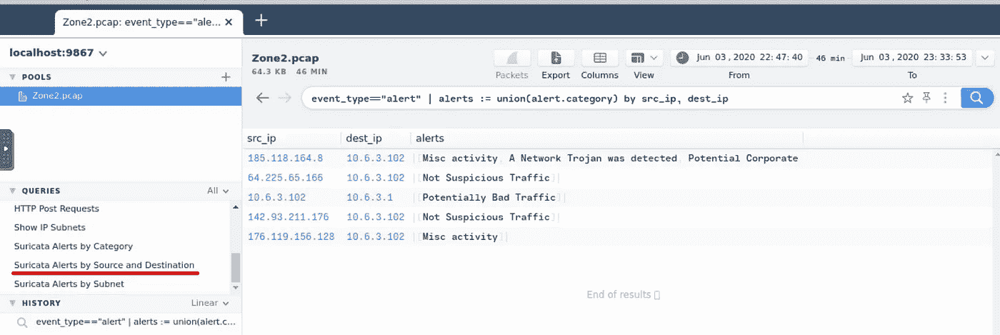*

*边缘警报*

*现在请注意检测到**网络木马的来源 IP(185.118.164.8)**警报。搜索涉及该源 IP 的所有流量。*

*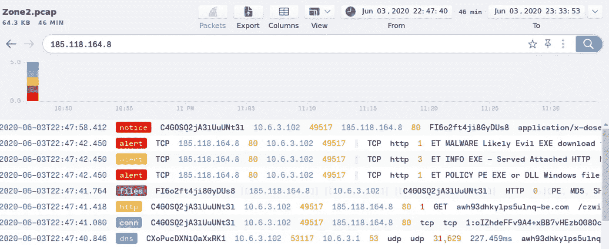*

*185.118.164.8*

*在第一个警报中，您可以看到提到下载一些恶意软件的警报。双击该警报可查看更多详细信息。*

*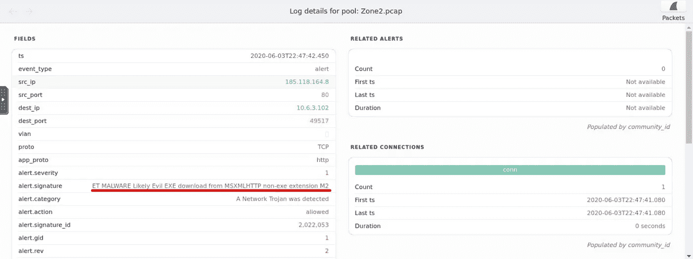*

*警报签名*

*在那里你可以找到警示签名，问题的答案。*

> ***Q2:******潜在侵犯企业隐私*** *的警示签名是什么？***

**这个问题和 Q1 一样，只是出于不同的警觉。因此，您可以用同样的方法找到此警报的警报签名。此警报的源 IP 与先前的警报相同。**

**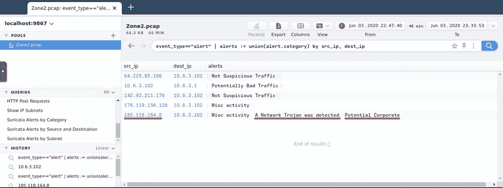**

**边缘警报**

**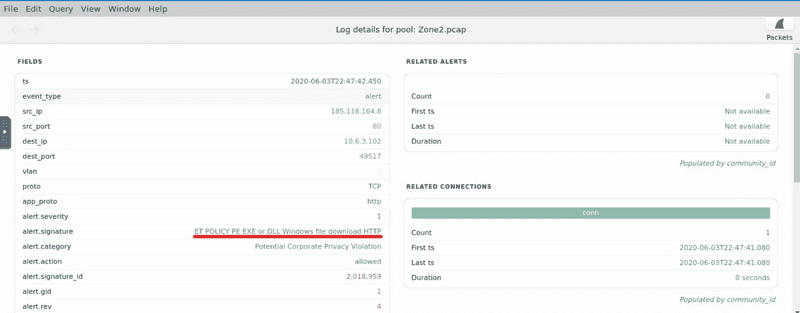**

**警报签名**

> ****Q3:** *触发警报的 IP 是什么？以***格式输入您的答案。****

**我们已经在 Q1 找到了 IP。警报是由我们找到的源 IP 触发的。只是把它放在缺省格式；8.8.8.8 是用缺省格式写成的，如 8。]8[.]8[.]8.**

> *****关于以无格式书写的注意事项:*** 作为一名 L1 安全分析师，当在处理警报时发现任何 IP 或 URL 时，最好以无格式书写在调查报告中。因此，它不会保持可点击状态，因为此类 IP 和 URL 可能是恶意的。**

> *****Q4:*** *为恶意下载的文件提供完整的 URI。在你的回答中，***URI。****

**当您在 Brim 中搜索源 IP 地址时，除了警报之外，日志中还有一个 HTTP 请求。**

**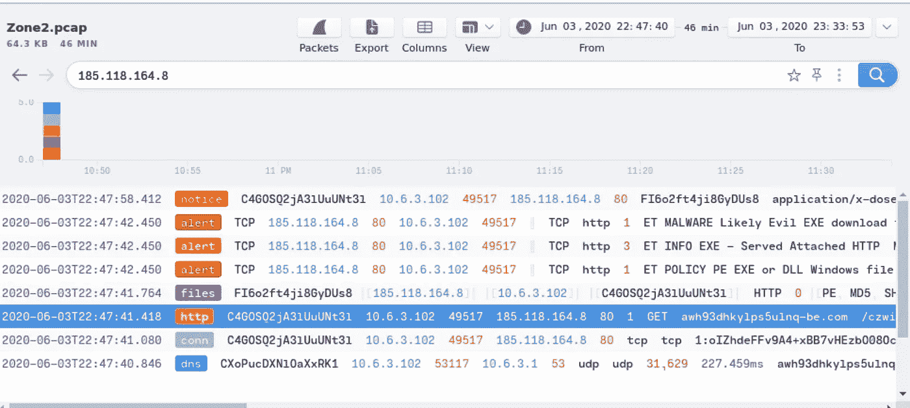**

**185.118.164.8**

**打开日志，您可以在那里找到主机和 URI，将它们组合起来，构建完整 URL。用变形的格式写它；如果网址是 google.com/redirect=xyz.com,，它的默认格式是谷歌。]com/redirect=xyz[。]com**

**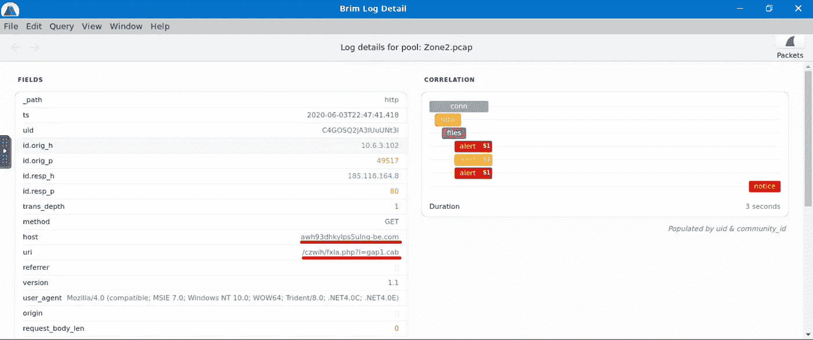**

**完整 URL**

> *****Q5:****cab 文件内的有效载荷名称是什么？***

**再次，回到源 IP 的搜索结果。在那里你可以在日志中找到通知。**

**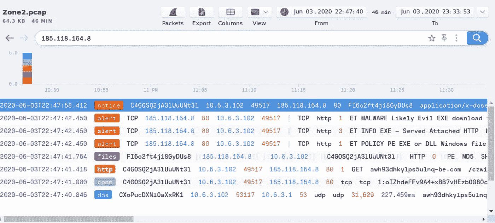**

**185.118.164.8**

**打开这些日志，在里面你可以观察到，这是用我们在上面的问题中找到的网址下载的同一个文件。这意味着这个通知日志与我们在上一个问题中找到的 URL 的文件下载相关。在日志中查看更多，我们可以找到与病毒总数相关的链接，它发出一些请求来检查病毒总数中的散列信誉。要么尝试打开该链接，要么只复制链接中的哈希(f 3 e 9 e 7 f 321 deb 1a 3408053168 a6 a 67 c 6 CD 70 e 114)并手动在病毒总数中搜索。**

**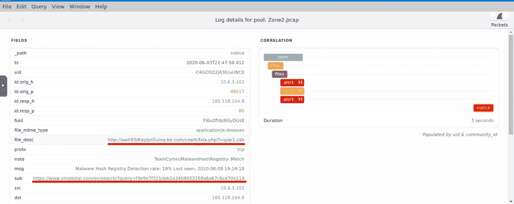**

**通知日志**

**当您在“病毒总数”中搜索该散列时，您可以在“病毒总数”结果中找到恶意文件的名称。**

**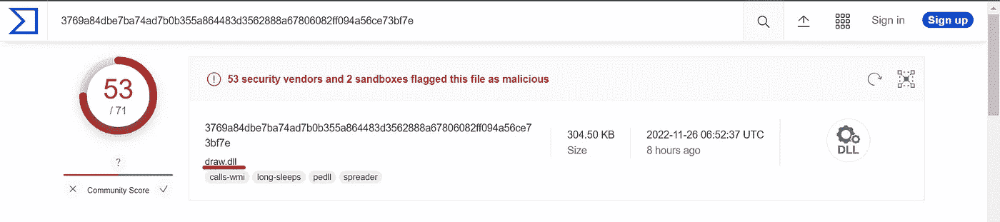**

**病毒总结果**

> *****Q6:*** *这个网络流量关联的用户代理是什么？***

**再次打开我们在第 4 季度打开的 HTTP 请求日志。在日志中，您可以找到发出 HTTP 请求时使用的用户代理。**

**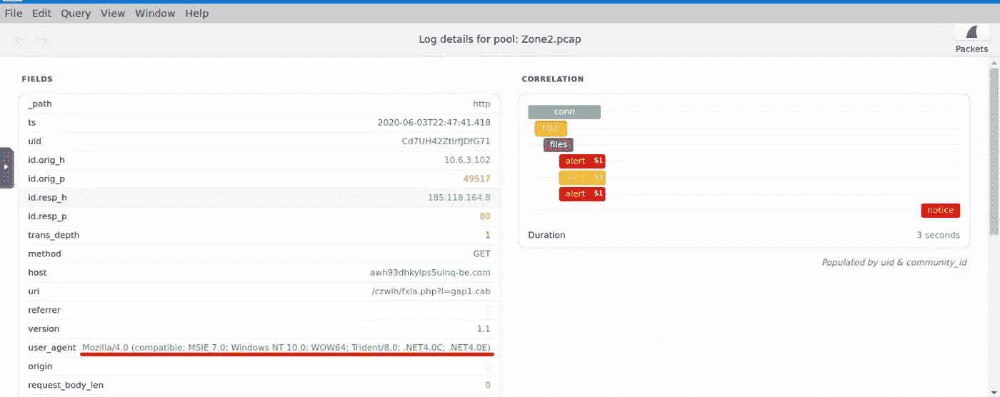**

**用户代理人**

> *****Q7:*** *您在网络流量中还看到哪些被 VirusTotal 标记为恶意的域？按字母顺序输入域名***。(* ***格式:域[。]zzz，域[。]zzz*** *)****

**现在，需要对流量进行分析，以找到设备接触到的其他恶意域。要做到这一点，请使用下面提到的查询来过滤掉 Brim 中的流量。**

```
**method=="GET" | cut ip, host, status_code**
```

**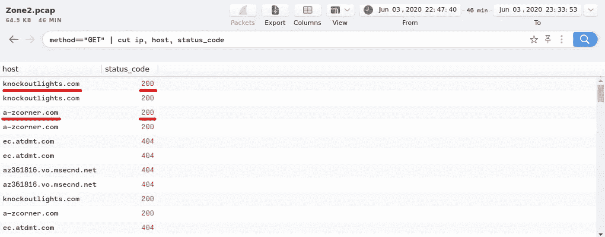**

**恶意域**

**在从上述查询获得的结果中，查找状态代码为 200 的主机，检查它们在 Virus Total 上的信誉，并以默认格式写入它们。**

> *****Q8:*** *有 IP 地址标记为* ***未可疑流量*** *。IP 地址是什么？按数字顺序输入你的答案***。(* ***格式:IPADDR，IPADDR*** *)****

**在 Brim 中，再次选择**sure alerts by Source&Destination**就像我们在 Q1 做的那样。寻找与**非可疑流量**警报相对应的源 IP。**

**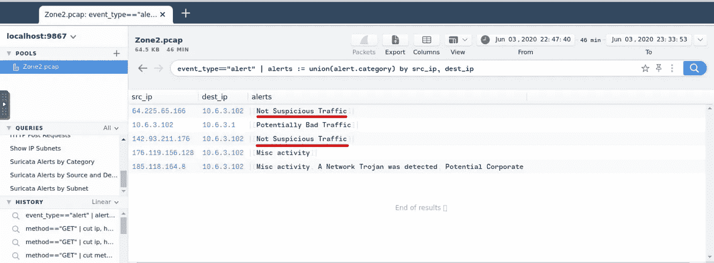**

**非可疑流量**

> *****Q9:*** *对于第一个 IP 地址标记为* ***的不可疑流量*** *。根据 VirusTotal，有几个域与这个被标记为恶意的 IP 地址相关联。您在与此 IP 地址相关的网络流量中发现了哪些域？以***格式输入您的答案。请按字母顺序输入你的答案。(* ***格式:域[。]zzz，域[。]zzz 等*** *)****

**现在，要查找与第一个 IP 相关联的域，请使用下面提到的查询。**

```
**replace_this_with_ip | cut query**
```

**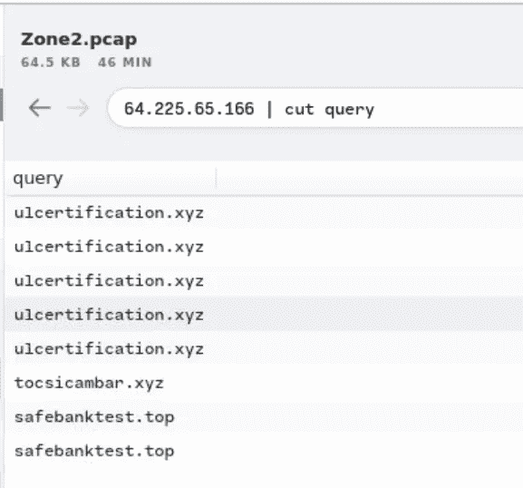**

**其他领域**

**该查询过滤出与 IP 相关的域。在 Virus Total 上检查他们的信誉，你可能会发现他们是恶意的。**

> *****Q10:*** *现在对于第二个 IP 标记为* ***不可疑流量*** *。您在与此 IP 地址相关的网络流量中发现了哪个域？以***格式输入您的答案。(* ***格式:域[。]zzz*** *)****

**对相应的 IP 使用上述问题中的相同查询来查找与该 IP 相关的域**

**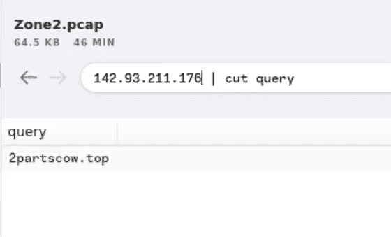**

**其他域**

**好吧…这个有点长，但我希望你能轻松找到所有的答案。当我写这篇文章的时候，我发现这个房间可以只用边缘来解决😅。不过，在解决房间问题时，我用 Wireshark 解决了几个问题。如有任何疑问，请留下您的评论。**

**感谢您的阅读。**

**知识就是力量，所以不断获取！😈**

## **来自 Infosec 的报道:Infosec 每天都有很多内容，很难跟上。[加入我们的每周简讯](https://weekly.infosecwriteups.com/)以 5 篇文章、4 条线索、3 个视频、2 个 GitHub Repos 和工具以及 1 个工作提醒的形式免费获取所有最新的 Infosec 趋势！**