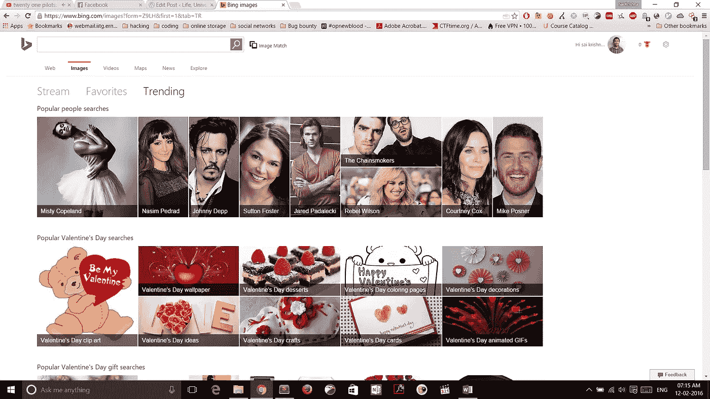
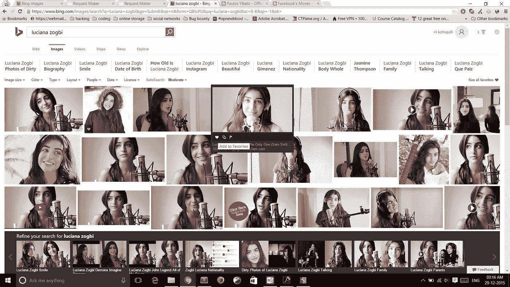
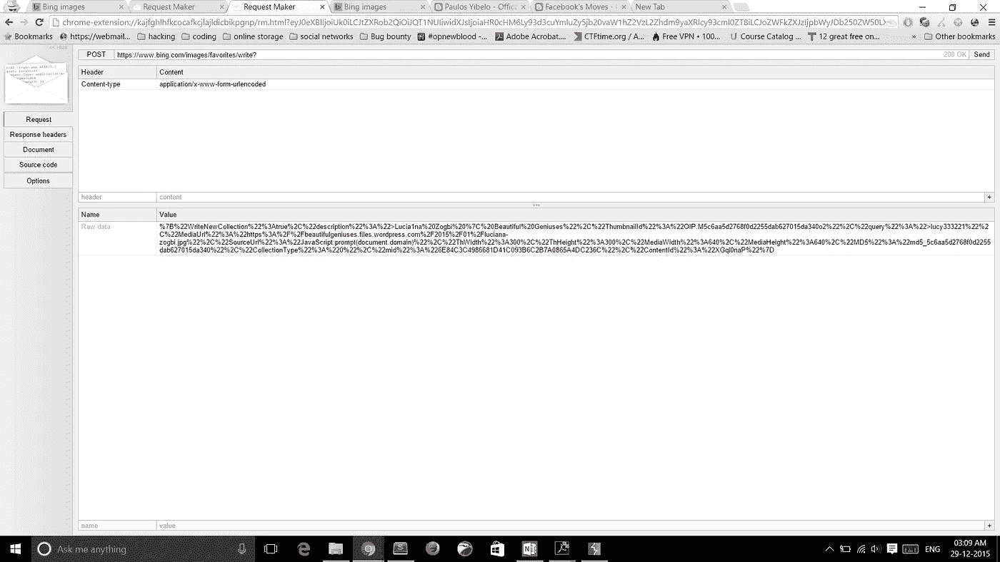
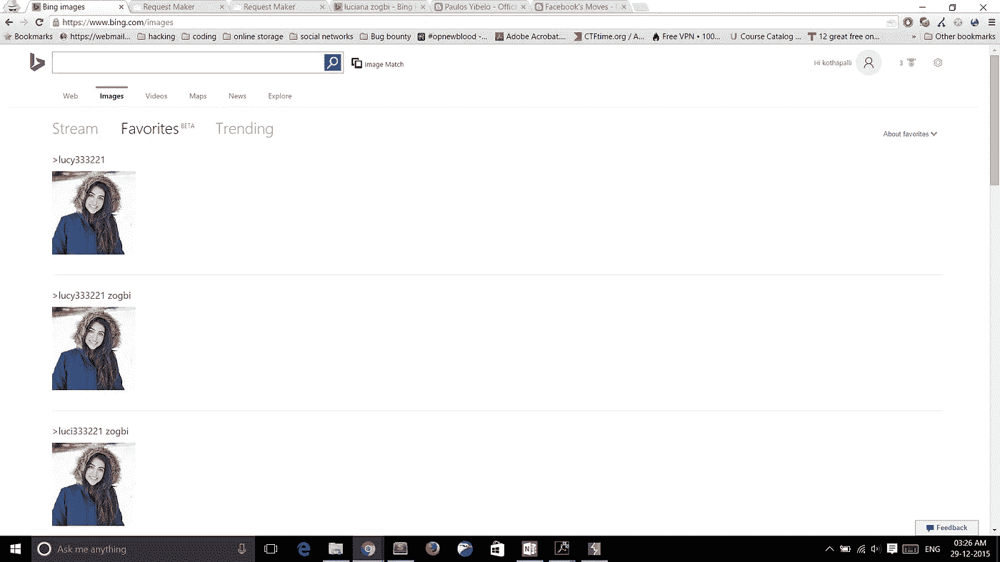
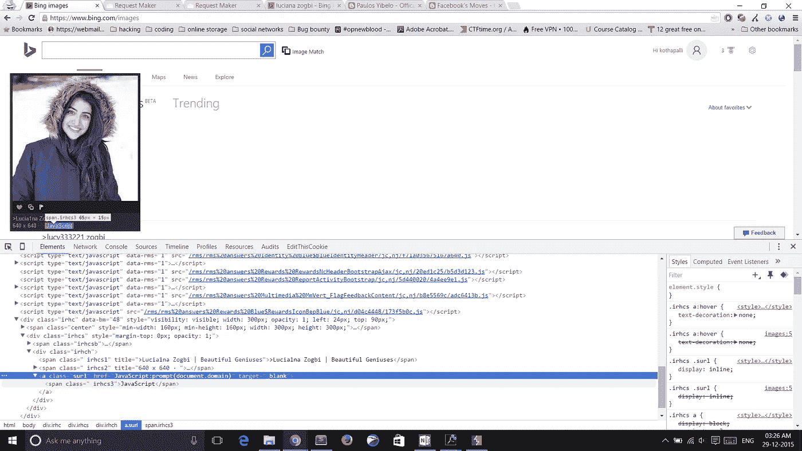
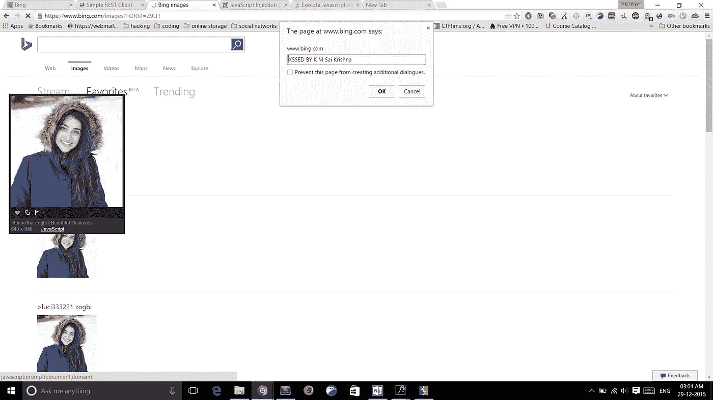

# 两个漏洞构成了一个漏洞！！(必应中的 XSS 和 CSRF)

> 原文：<https://infosecwriteups.com/two-vulnerabilities-makes-an-exploit-xss-and-csrf-in-bing-cd4269da7b69?source=collection_archive---------1----------------------->

你好！！

这篇文章是关于我提交给微软的第四和第五个有效的错误报告。如果您发现图像难以查看，请在新标签中打开它们。我是在 1080p 的屏幕下截图的。

这次我在`[Bing](https://www.bing.com/)`中发现了 **XSS** 和 **CSRF** 的漏洞。

Bing images 正在测试 3 个新功能，名为**流**、**收藏夹**、**趋势**，目前仍处于测试阶段。



必应图片

因此，我正在经历这一点，有这个选项，您可以搜索并直接添加图像到您的收藏夹。

这很酷，所以我想看看它是如何实现的。



当您在图像搜索后点击心形符号时，图像将被添加到您的收藏夹。

这个请求看起来像这样



它是 URL 编码的。一旦解码，它看起来像这样

```
*{“WriteNewCollection”:true,”query”:”lucianazogbi”,”mid”:”5689B0BFCDB0E64E595A3B6C2B7A0865A4DC236C”,”description”:”lucianazogbi”,”MediaUrl”:”https://beautifulgeniuses.files.wordpress.com/2015/01/lucianazogbi.jpg&#8221;,”SourceUrl”:”http://beautifulgeniuses.com/2015/01/14/lucianazogbi/&#8221;,”ThWidth”:300,”ThHeight”:300,”MediaWidth”:640,”MediaHeight”:640,”MD5″:”md5_5c6aa5d2768f0d2255dab627015da340″,”MediaFormat”:””,”ThumbnailId”:“OIP.M5c6aa5d2768f0d2255dab627015da340o2″,”CollectionType”:0,”ContentId”:”XGql0naP”}*
```

有意思的是没有 **CSRF 令牌**也没有`***X-Requested-With : XMLHttpRequest***` 报头。

这意味着它容易受到 CSRF 的攻击。另一件有趣的事情是网页在收藏夹标签中显示这些数据。



那么为什么不尝试在那里注入一些 JavaScript 代码呢？我试过所有的领域，但没有一个工作。当我几乎放弃希望时，我看到了这个。



这个环节容易受到 **XSS** 的攻击。它是接受链接`*javascript:code*` 中的<一个> href 标签。

所以当我点击它时。BAMN



我们最喜欢的弹出式菜单。

因此，通过将用户发送到一个恶意网站，就有可能危及他的帐户。

如果我在 CSRF 之后停下来，我就不会发现 XSS。因此，通过成功地结合两个漏洞，我们利用危害必应。

我向微软报告了这个问题，现在已经解决了。

由于该功能仍处于 beta 测试阶段，他们花了 5 个多月来修复它，以使其更加安全。

我的名字会出现在 2016 年 3 月的名人堂。

感谢您的阅读。

和平:D

随意评论，给点建议。

*原载于 2016 年 6 月 10 日*[*kmskrishna.wordpress.com*](https://kmskrishna.wordpress.com/2016/06/11/two-vulnerabilities-makes-an-exploit/)*。*