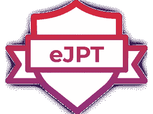
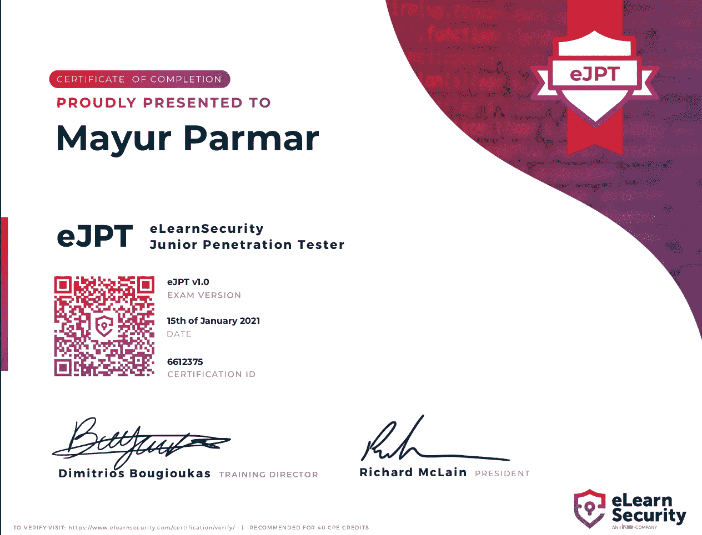

# Mayur Parmar 第一次尝试通过 eJPT 的最终指南

> 原文：<https://infosecwriteups.com/ultimate-guide-to-pass-ejpt-in-the-first-attempt-by-mayur-parmar-75effc877394?source=collection_archive---------0----------------------->

**课程:eJPT(电子安全初级渗透测试器)**

https://elearnsecurity.com/product/ejpt-certification/

费用:200 美元(考试代金券)

考试时间:72 小时(3 天)

支付选项:Paypal/信用卡

材料(实验室、视频、PDF):遵循以下步骤

步骤:在 ine.com 上注册(您将获得包含 eJPT 课程材料的入门通行证)

转到此链接:[https://my . ine . com/cyber security/learning-paths/a 223968 e-3a 74-45ed-884d-2d 16760 b 8 bbd/penetration-testing-student](https://my.ine.com/CyberSecurity/learning-paths/a223968e-3a74-45ed-884d-2d16760b8bbd/penetration-testing-student)(eJPT 课程资料)

**简介:**

eLearnSecurity 初级渗透测试员(eJPT)是渗透测试和信息安全基础知识的 100%实践认证。绕过考试，网络安全专业人员向雇主证明他们准备好了一份有回报的新职业。

**先决条件:**什么都没有(他们的材料足够了，即使是非技术人员也很容易理解)

**结果:**

*   传输控制协议
*   IP 路由
*   局域网协议和设备
*   HTTP 和 web 技术
*   基本渗透测试流程和方法
*   网络的基本脆弱性评估
*   web 应用程序的基本漏洞评估
*   利用 Metasploit
*   简单的 web 应用程序手工开发
*   基本信息收集和侦察
*   简单扫描和分析目标

考试形式:

*   >他们会给你 20 道 MCQ 题，你必须答对其中的 15 道题才能通过考试。而且所有的问题都是基于实际的。这是一个开卷考试，所以你可以检查他们的材料，也可以使用互联网。

重要主题(来自课程材料):

*   > Wireshark、Pivoting、Burpsuite、pentesting lifecycle、OSINT、Nmap、Nessus、Web 攻击(XSS、SQL 注入、目录暴力)、密码攻击、身份验证破解、空会话攻击、Metasploit。编程。

操作系统:Kali Linux 或任何基于 ubuntu 的系统(如 popOS)

工具(主要考试用):

OpenVPN、Nmap、Nessus、fping、dirt buster、burp suite、开膛手约翰、hashcat、Metasploit、hydra、Nmap 自动机([https://github.com/21y4d/nmapAutomator](https://github.com/21y4d/nmapAutomator))、Wireshark、sublist3r、Netcat、dirb、enum4linux、samrdump、 *smbclient*

命令备忘单:

> [https://githubmemory.com/repo/tejasanerao/eJPT-Cheatsheet](https://githubmemory.com/repo/tejasanerao/eJPT-Cheatsheet)

[https://kentosec.com/2019/08/04/how-to-pass-the-ejpt/](https://kentosec.com/2019/08/04/how-to-pass-the-ejpt/)

注意事项:

 [## d3m0n4l3x/eJPT

### 在 eJPT 学习期间学到的一些知识。在…上创建一个帐户，为 d3m0n4l3x/eJPT 开发做出贡献

github.com](https://github.com/d3m0n4l3x/eJPT) 

[https://github . com/tr 0 nucf/My-Tools/blob/master/eJPT % 20 notes . txt](https://github.com/tr0nucf/My-Tools/blob/master/eJPT%20Notes.txt)

 [## fdicarlo/eJPT

### 要使用这些命令，请确保:将“10.10.10.10”替换为相关的 IP 地址将“port”替换为…

github.com](https://github.com/fdicarlo/eJPT)  [## 凯撒 784/eJPT

### 这是我为 PTS(渗透测试学生)实验室组织代码和撰写文章而创建的报告。我的笔记…

github.com](https://github.com/Kaiser784/eJPT) 

eJPT 资源(外部资源):

我做了一个一个字的文档，其中包含了专门主题的所有最佳资源，可以帮助你准备 eJPT 考试。最重要的是，我已经包括了一些来自 [TryHackMe](https://medium.com/u/dc49a0a3cb16?source=post_page-----75effc877394--------------------------------) 的房间，这对 eJPT 的准备非常有帮助。所以别忘了结账。

> link:[https://docs . Google . com/document/d/18ix 32 _ 14 hfpg _ kvx iw 7 auzog 8 nzg fa 7 mu 8 tvie _ DEgM/edit？usp =分享](https://docs.google.com/document/d/18ix32_14hfPg_kvxiW7aUzog8nZgFA7mu8TVEI_DEgM/edit?usp=sharing)

几天前，我在 Linkedin 上为 eJPT V/S CEH 考试做了一个投票。大多数人投票支持 eJPT，所以决定创建这个博客。

考试小贴士:

*   >通过实验完成课程材料
*   ->理解旋转的概念(非常重要)
*   ->在考试中，通过 pentesting 阶段并连接所有的点。
*   ->做笔记以供参考，在终端中制作新标签页以完成其他任务
*   ->不要紧张，这是一个非常简单的考试。假设你正在解决 CTF 问题。

最终想法:

参加 eJPT 认证后，我可以说这是我参加过的最好的考试之一。并强烈推荐给每一个想开启网络安全之旅的初学者。

在以下社交媒体上关注我:

领英:[https://www.linkedin.com/in/th3cyb3rc0p/](https://www.linkedin.com/in/th3cyb3rc0p/)

推特:[https://twitter.com/th3cyb3rc0p](https://twitter.com/th3cyb3rc0p)

insta gram:https://www.instagram.com/th3cyb3rc0p/

如果你喜欢这篇报道，请鼓掌。

如果你需要任何帮助，请随时给我的社交媒体账号发消息。

