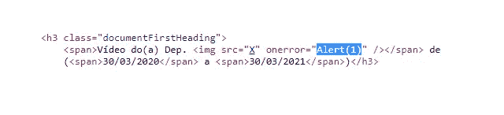
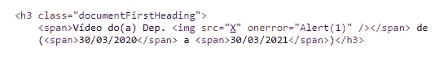
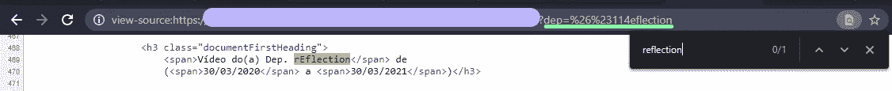
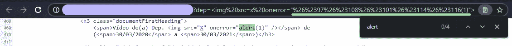

# 一个 XSS 有点奇怪

> 原文：<https://infosecwriteups.com/um-xss-um-tanto-quanto-estranho-23467aab25f?source=collection_archive---------2----------------------->

朋友们,你们还好吗?今天我来做我的第一次 writeup 告诉我如何停止在 XSS 中以一种稍微不同的方式探索,所以让我们来吧。

简要介绍一下,我的“黑客名字”是猫(因为我想证明好奇心只会增强猫的力量:D),我今年 19 岁,我热爱技术,最近刚开始在信息安全领域工作。

那就来吧!

由于这个错误尚未修复,出于道德原因,我将把网站命名为 redacted.xxx.br!

# 第一部分:寻找

这一切都始于一个简单的愿望,在某个网站上找到一个错误并赚取额外的钱,这种情况在巴西并不容易......所以我正在浏览网页,直到它落在一个网站.xxx.br,因为我知道政府网站有一个非常糟糕的安全记录,我想看看应用程序,看看我是否找到了一些东西。我开始在最简单的输入中注入恶意软件,但一切看起来都很干净,所以我决定拿一些重一点。

# 第二部分:工具

我开始使用[Sublist3r](https://github.com/aboul3la/Sublist3r)工具来枚举子域,但没什么奇怪的,所以我去了[ParamSpider](https://github.com/devanshbatham/ParamSpider)来分析找到的主机的参数。这个列表变得非常巨大,甚至更多,因为我去寻找那些喜欢 200 返回的人,以及那些有 404 的人(总是很高兴看到一些东西反映在错误构建的 404 页面上)。

因为我还没有尝试自动化这个过程,所以我打开了列表中的所有链接,看看它是否已经被反射(你可以使用 [Httpx](https://github.com/projectdiscovery/httpx)工具,使用 -match-string 和 -match-regex 参数,你可以得到你的反射),直到我找到以下页面:

正如你所看到的,尽管参数都是小写的,但它反映了这样一种方式,即第一个字母是大写的,其余部分是小写的,对专有名称的简单处理!

我试图注入一个有效负载,看看它是否会被执行,但是这个行为被应用到我的 alert(1) 中,并且该方法没有被执行。

# 第三部分:注射

由于我没有耐心,我做了每个 sript kiddie 都会做的事情,我开始在互联网上找到的每个有效负载上给出*Ctrl + C*和*Ctrl + V*。做对了吗?当然不是哈哈哈哈哈。

当我看到没有任何事情发生时,我决定让我的头脑休息一下,去喝点水,呼吸一下,然后在一般情况下思考 XSS。正是在那里,我偶然记得当我还小的时候,我正在学习下棋,老师正在组装挑战,棋子以某种方式放置在棋盘上,并且在一定数量的动作中,我不得不放弃 check mate(赢得比赛)。然后我回到电脑上,随着国际象棋挑战的思维方式,我开始以同样的方式看待 XSS,我做的每一个动作,应用程序都可以以某种方式为自己辩护,如果我的动作没有产生积极的影响,我会解开它并重新开始。

我开始研究一些执行 HTML 注入的方法,因为它起初是有效的。直到我来到 [HTML Charset](https://www.w3schools.com/html/html_charset.asp) 表中,使用字符的数值,前面是“&”和“#”,您可以将字符显示在屏幕上。

& 和 # 字符在 URL 中被编码(分别为 %26 和 %23),因此它们不会被视为 URL 构造符号。

在我点击 Enter 的时候,看到我的字符没有更改为大写,我已经打开了一个全尺寸的微笑。

完成测试后,我完成了以下有效负载:* 。其中,警报作为 HTML 编码发送。(T3 )*

我给你的提示是:

*   工具是伟大的,但它是你如何使用它们,使他们伟大!
*   要有耐心,如果需要的话,离开电脑一段时间,扔东西,然后清醒地回来!
*   保持好奇!

就是这个!希望你会喜欢!

买我一杯咖啡(Buy Me a Coffee)