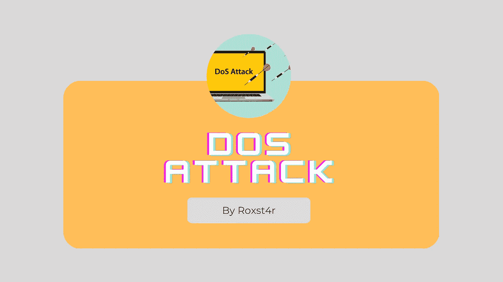
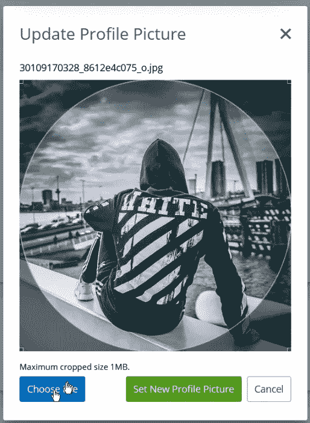

# 3 对个人资料图片的意外 DoS 攻击 3

> 原文：<https://infosecwriteups.com/un3xpected-dos-attack-on-profile-pictur3-b957979dcc7?source=collection_archive---------0----------------------->

嘿大家，希望你们都做得很好！

好的，首先，我想告诉大家，我更喜欢发表独特的、奇怪的文章，这些文章可能会帮助你寻找 Bug，而不是一些陈词滥调，所以我认为这篇文章可能不会让你厌倦常规的东西，而是在你寻找的过程中帮助你获得一些见解(所以继续阅读；] ).我不是一个拥有所有知识的完整的 bug 猎人，只是一个随机的 bug 猎人，对 bug 狩猎有不完美的想法，所以如果有技术错误，请原谅。

# -那只虫子-

*   当我试图在个人资料图片中上传像素图像时，就像每个安全的 web 应用程序一样，我得到一个错误弹出窗口，不允许我上传像素图像
*   然后我试着上传各种扩展名的文件，比如 php、. php.jpeg、.svg 和其他可能的扩展来绕过它——也失败了
*   尝试用 Burp suite 拦截，并通过改变扩展名和其他东西来做所有的测试——这可能也失败了
*   然后，我做了所有这些测试，却什么也没得到，这几乎让我吃了亏。实际上，这是我第一次尝试绕过文件上传，所以我用从各种文章、博客和视频中获得的知识尝试了几乎所有的方法。

> 直到这个时候，我一直在想，我需要做一些复杂的事情来找到这样的错误，并尝试了所有上述方法。现在，我得到的解决方案非常简单..,

# 解决方案

*   就像普通用户一样，我上传了一张有效的图片作为个人资料图片，但是我没有点击“设置新的个人资料图片”
*   相反，我尝试上传洛塔像素图像现在点击“选择文件”，然后点击“设置新的个人资料图片”
*   这导致了应用程序级 DoS，当我在其他浏览器上尝试时，页面变得没有响应
*   为了增加影响，我再次尝试使用 svg、php 和其他扩展，但这是不可能的
*   整个过程中，我都在想找到一个复杂事物的 bug，但最终，这个简单的东西让它发生了

# 复制的步骤

*   首先上传一个有效的图片，不要点击设置新的个人资料图片
*   现在，在不关闭窗口的情况下，点击“选择文件”上传这个[lottapixel.jpg](http://lottapixel.jp)文件
*   现在，当您将此设置为新的个人资料图片时，页面变得没有响应。

> 美国因为这只是一次拒绝服务攻击，而且被称为“超出范围”,所以这个程序好心地奖励了我 100 美元。

这就是关于 bug 的全部内容，很高兴分享我的知识并回馈社区——如果上面有任何错误，请纠正我，如果有任何疑问，请联系我。

推特—[https://twitter.com/mveswar98](https://twitter.com/mveswar98)

*~谢谢！*

来自 Infosec 的报道:Infosec 上每天都会出现很多难以跟上的内容。加入我们的每周简讯，以 5 篇文章、4 个线程、3 个视频、2 个 Github Repos 和工具以及 1 个工作提醒的形式免费获取所有最新的 Infosec 趋势！