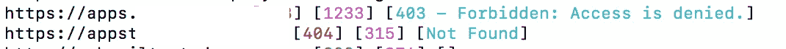
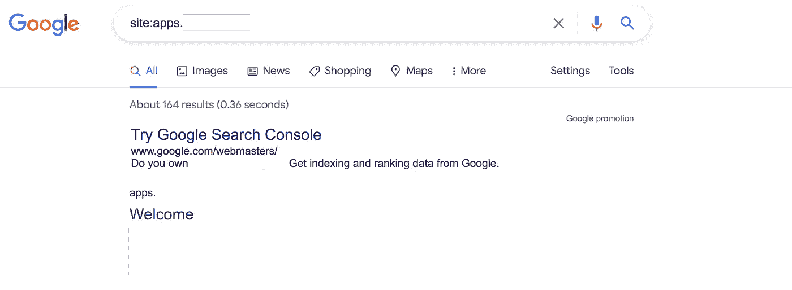
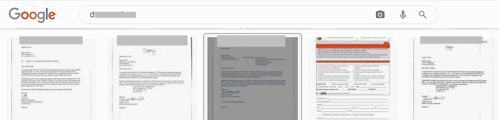
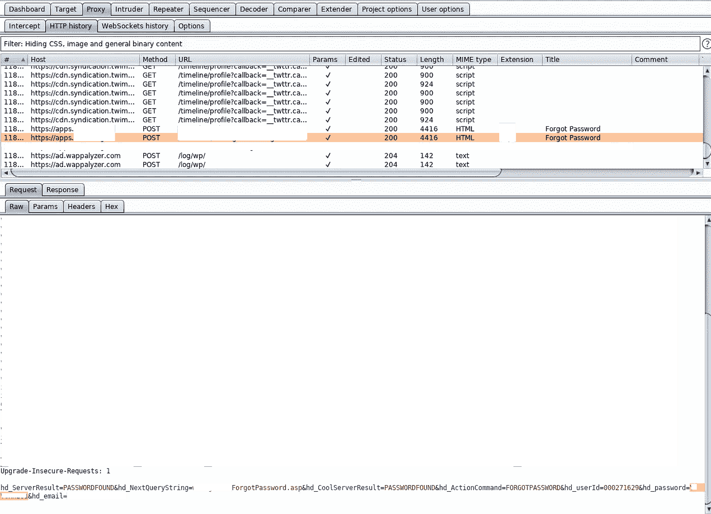

# 通过忘记密码未经验证的帐户接管

> 原文：<https://infosecwriteups.com/unauthenticated-account-takeover-through-forget-password-c120b4c1141d?source=collection_archive---------1----------------------->

我花了整整一个月的时间在一个联邦私人项目上，发现了大量的账户接管。我将分享一个发现。

目标的范围是通配符和未经验证的测试。所以我做的第一件事->侦察。

我启动了结合 httpx([https://github.com/projectdiscovery](https://github.com/projectdiscovery))的子查找器，我发现了大量的子域名，其中一个域名出现了 403 禁止错误。

所以我首先运行的不是 ffuf，而是一个简单的谷歌搜索，比如:

站点:子域此处

它得出了大量的结果

虽然有很多登录页面，但我决定寻找第一个结果，那是一个在线发票系统。这个应用程序需要一些 id 和密码来登录。

我在帮助文章中搜索了关于 D * * Ids 的内容，我了解到，这是在许可时分配给所有供应商的一个 9 位数字。

我做了谷歌搜索，但没有找到这个特别的 id。我最终查看了谷歌图片结果，希望许可可以在一张纸上完成，并可以包含这个 id。

酷，我是正确的，许可是通过一份文件完成的，我在信件的主题部分获得了几个有效的 D** ID，例如

既然我现在有了这个 ID，我做的第一件事就是强行输入密码，但最终什么也没有得到。

我开始测试忘记密码流，它首先要求 D** ID 来重置密码。我发现该应用程序使用了两个重置密码的请求，一个用于查询 D** ID 的密码，另一个在请求本身中向他们的电子邮件 ID 发送新生成的密码

所以，这不仅暴露了他们的密码，也暴露了他们的电子邮件。使用新生成的密码，我能够登录到他们的帐户。

保持好奇。