# 对 OData 实体的未授权访问+来自微软的 2000 美元奖金

> 原文：<https://infosecwriteups.com/unauthorized-access-to-odata-entities-2k-bounty-from-microsoft-e070b2ef88c2?source=collection_archive---------0----------------------->


嗨，这篇文章是关于我从微软发现的一个漏洞。

如你所知，Office365 有各种服务。一项吸引我注意力的服务是微软的表单。这是一个在线调查创建器，是 Office 365 的一部分。您可以创建表单并与其他用户共享。该服务使用 OData 与数据进行交互。但是什么是 OData 呢？

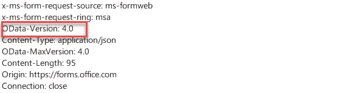

# OData 基础知识

> OData 协议是一个应用程序级协议，用于通过 RESTful 接口与数据进行交互。它支持数据模型的描述，以及根据这些模型对数据进行编辑和查询。[docs.microsoft.com]

**OData** 使用了 SQL 的思想。通过说我不介意什么类型的客户(例如。NET、Java)向我发送一个请求或者站点的数据源是什么，我从客户端接收请求，基于客户端想要的工作类型，我对数据执行 CRUD 操作，并将结果返回给客户端。

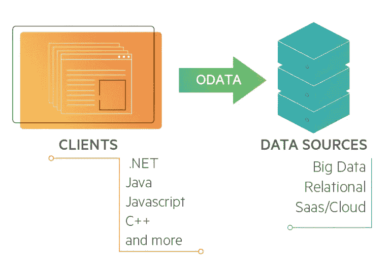

[https://www . progress . com/blogs/what-is-odata-rest-easy-with-our-quick-guide](https://www.progress.com/blogs/what-is-odata-rest-easy-with-our-quick-guide)

为了简单起见，我解释了这个协议的一些概念，并做了一些等价的说明。 **OData 元数据**是系统的一个数据模型(在关系数据库中可以认为是 **information_schema** )。对于每个元数据，我们有**实体**(类似于关系数据库中的**表**)和**属性**(类似于**列**)以及不同实体类型之间的关系。每个实体类型都有一个**实体键**，类似于关系数据库中的键。假设我们有一个名为 Customers 的实体类型，它包含三个属性。此实体类型具有以下记录:

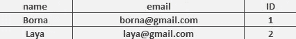

在上面的例子中， **ID** 是一个实体键。下面的请求返回给定 ID 为“2”的客户类型的单个记录:

```
customerApi/Customers(2)
```

上面的请求返回 ID=2 的客户信息。类似于 SQL，我们可以使用查询选项来查询数据。OData 支持各种**查询选项**来查询数据。我们可以使用 **$select** 查询选项为每个实体请求一组有限的属性。以下查询是一个示例，它将从 Customers 实体中获取 ID 为 2 的客户的电子邮件:

```
customerApi/Customers(2)?**$select=email**
```

在 SQL 中，上面的示例如下:

```
SELECT email FROM Customers WHERE ID=2;
```

到目前为止，我解释的概念足以理解这篇文章的后续部分。除了 **$select** 之外，还可以使用不同的查询选项。您可以使用 **$format** 选择数据的输出，无论是 JSON 还是 XML。要了解更多细节并熟悉其他查询选项，我建议您[这个](http://odata.org)链接，它是 OData 的主要参考。

# 攻击场景

> “有一件事我一直牢记在心，那就是我会先试着了解系统的概况，然后开始测试每个组件。”

在这个目标中，我首先尝试访问 OData 元数据，因为我知道目标正在使用 OData，我最好了解一下元数据的结构。通过向以下 URL 发送请求，我能够访问目标的元数据:

```
http://forms.office.com/formapi/api/$metadata
```

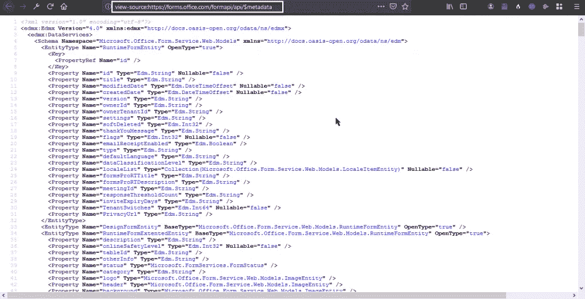

我对上面的 XML 文档不感兴趣。所以我使用了下面的网站来更好地查看不同实体类型之间的连接:

 [## XOData -在线可视化和探索 OData 服务

### 探索 OData API - OData 元数据图表/文档和 OData 查询生成器

pragmatiqa.com](http://pragmatiqa.com/xodata) 

这个网站是一个通用的 OData API/服务可视化工具和浏览器。它有一个很酷的功能，你可以给出 OData 元数据的链接，它向你展示了不同实体类型之间的联系:

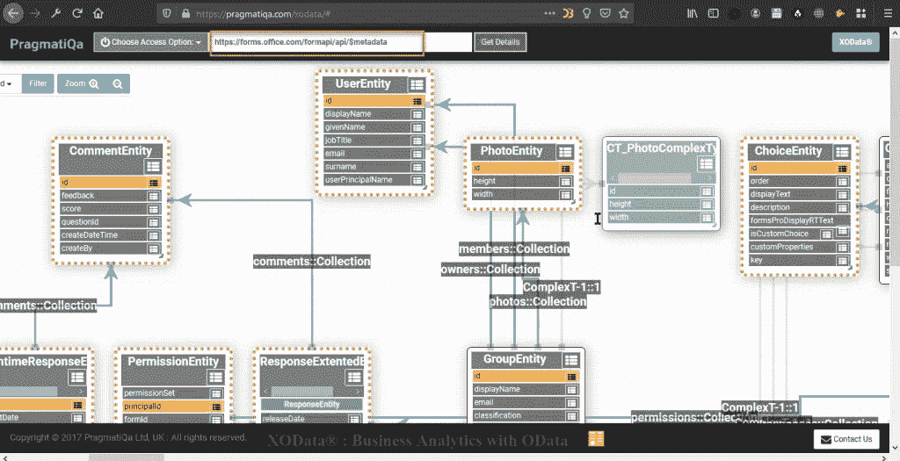

在了解了元数据的概况后，我试图寻找可能包含敏感信息的实体。我发现一个名为**的实体类型形成了**。这个实体有用户生成的表单数据以及**用户的电子邮件** : ‌

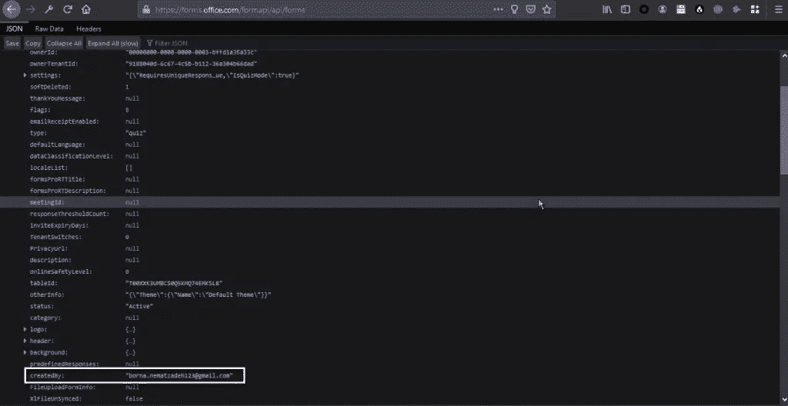

这封邮件让我思考如何访问其他用户的邮件？伊多和 CORS 在这里是不可能的。在测试了不同的攻击场景后，我发现了一种访问另一个用户电子邮件的方法。但是问题是我的攻击场景需要用户交互(受害者访问攻击者的站点等等)。用户交互减少了我的攻击场景的影响。在把我的报告送到 MSRC 后，我只得到了微软的名人堂。

# **对 OData 实体的未授权访问**

在我没有得到任何赏金后，我试着用不同的眼光看待目标。我之前的攻击场景需要用户交互，所以我必须找到一种无需任何用户交互就能访问电子邮件的方法。
在微软表单中，用户可以与其他人共享表单。我试图测试文件共享功能。如果**用户 A** 想要与**用户 B** 共享一个表格，需要以下步骤:

1.  用户 A 选择要共享的表单。服务器为用户 a 生成一个可共享链接。
2.  用户 A 将上一步生成的链接发送给用户 b。
3.  当用户 B 提交表单时，提交的数据被发送到服务器。用户 A 可以在其帐户中查看提交的数据。

在第三步中，以下请求发送:

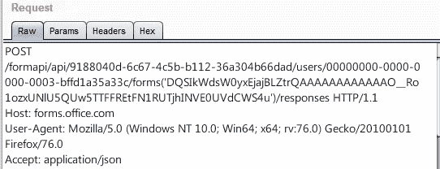

上述请求具有以下结构:

```
formapi/api/**<ownerTenantID>**/users/**<ownerID>**/forms(**<formID>**)/responses
```

所有参数 **ownerTenantID** 、 **ownerID、**和 **‌formID** 都与和我们共享表单的用户**有关**。当我们提交用户的表单时，我们可以访问所有这些参数，所以不需要找到任何参数。

我想到的情景是，我从受害者那里得到了所有必要的参数。**为什么不使用$select 查询选项并从服务器获取受害者的电子邮件呢？为此，我使用了 select 查询选项并发送了以下请求:**


我发出上面的请求后，得到了 404。服务器不允许我访问 **createdBy** 属性或用户在 **forms** 实体上的电子邮件，所以我试图找到另一种方法来访问 **createdBy** 属性的值，于是我想到了一个主意:

***"是否有另一个实体具有 createdBy 属性？并且与 forms 实体具有相同的实体键(formID)***

可能出现的问题是，为什么实体键应该与表单实体键相同？

假设我们正在寻找的实体叫做 x。

x 有 **createdBy** 属性，我们的重点是访问这个属性的值，因为这个属性的值就是用户的电子邮件。另一方面，假设 X 有一个名为 **accountID** 的实体键，它是一个随机字符串。要访问该电子邮件，我们必须发送以下请求:

```
formapi/api/<ownerTenantID>/users/<ownerID>/X(**<accountID>**)**$select=createdBy**
```

这里的问题是 **accountID** 因为我们不知道受害者的 **accountID** 是什么，但是我们之前看到我们可以使用受害者的共享表单访问 **formID** 。

我试图寻找一个具有上述条件的实体类型。在查看了不同实体类型之间的关系后，我能够找到一个名为 **runtimeForms** 的实体，它具有 **createdBy** 属性，甚至具有与 **forms** 相同的实体键！，它拥有我想要的所有条件:

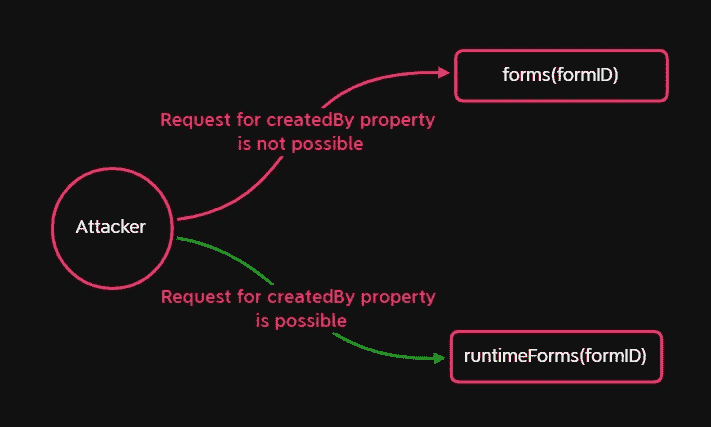

我使用了 **runtimeForms** 而不是 **forms** ，然后我使用了 **$select** 查询选项来访问电子邮件。通过发送以下请求，我终于设法进入了受害者的电子邮件:

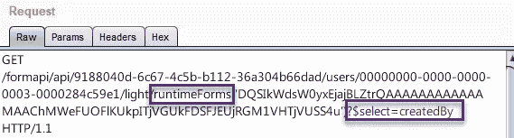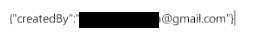

在这种攻击场景下，我可以在没有任何用户交互的情况下访问用户的电子邮件。最后，我得到了 MSRC 2000 美元的赏金；)

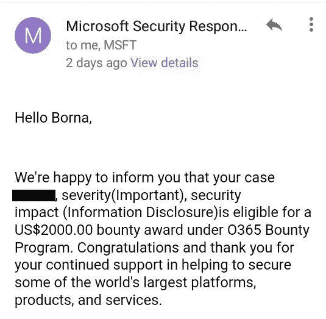

我希望你喜欢这篇文章。始终在您的目标中寻找边缘案例，以找到更多有趣的漏洞！如果你喜欢这篇文章，请在 Twitter 上关注我:

推特: [@LogicalHunter](https://twitter.com/LogicalHunter)

领英:【https://www.linkedin.com/in/borna-nematzadeh/ 