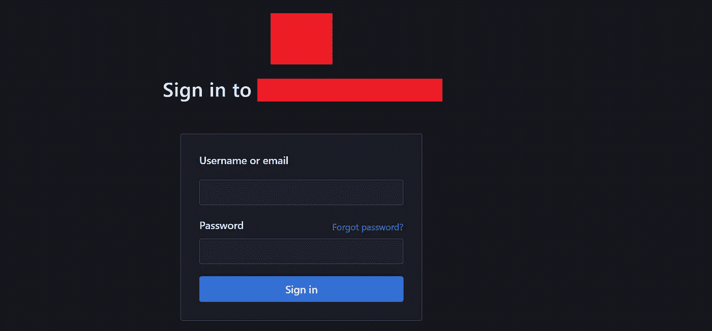
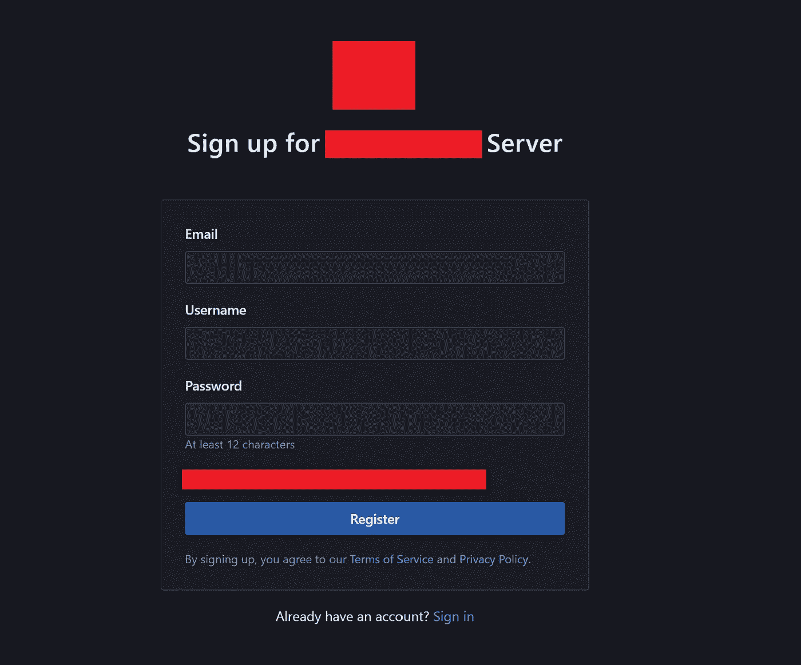
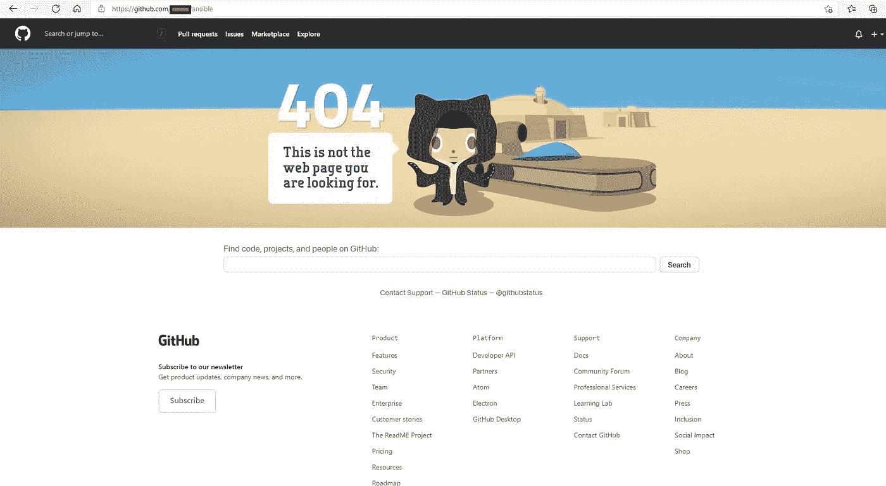
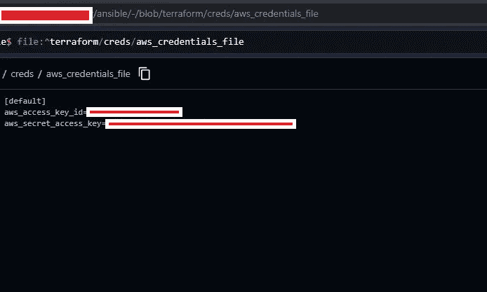
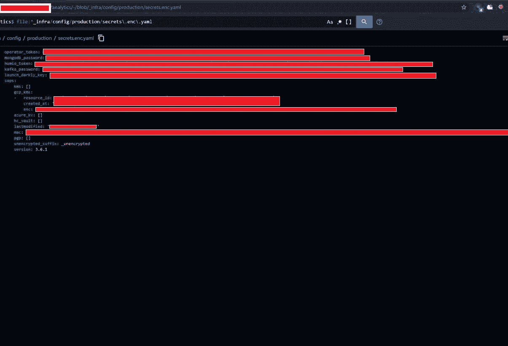

# 在子域上的未授权注册导致价值 2000 美元的组织接管

> 原文：<https://infosecwriteups.com/unauthorized-sign-up-on-subdomain-of-subdomain-leading-to-organization-takeover-worth-2000-a7199952d80b?source=collection_archive---------1----------------------->

大家好，我在这里分享另一篇四位数的文章，这是我非常老的发现之一。如果你还没有读过我之前写的关于我如何能够绕过所有端点上的强速率限制机制的文章，那么下面是它的链接:

 [## 价值 1800 美元的独特限速旁路

### 用 OOS 速率限制旁路证明组织声明是错误的。

medium.com](https://medium.com/@manavbankatwala29/unique-rate-limit-bypass-worth-1800-6e2947c7d972) 

# **从初始阶段开始。**

当我最初发布这个 bug 的时候，很多人对标题感到困惑。这是我使用的完整的文章和方法。在我发现这个 bug 的时候，我刚刚开始了我的 bug 赏金之旅，之前我阅读了很多电子书和文章。

我决定随机选择一个目标，我知道只有提到的域和子域在范围内。所有其他子域被认为超出了范围。他们还在政策中提到 ***.target.com** 不在范围内，但 target.com 在范围内。这是因为该公司实际上为他们的客户提供了某种服务，允许他们定制子域，如 **client1.target.com，client2.target.com.** 由于这一点，他们限制在任何子域上进行测试。那么，当这种类型的目标穿过我们的大脑时，该怎么办呢？我想到的第一个想法是，也许我应该试着找到他们子域上的任何关键漏洞，因为由于他们的政策，没有多少研究人员检查过。

我做的第一件事是找到子域，但不是用我们通常的方法。相反，我使用子域枚举词表，其中包含像应用程序，开发，开发，服务，应用程序开发等词。

用这种方法提取了非常有限的子域，其中有一个子域像**services.target.com。在访问这个子域时，它显示了一个 DNS 错误，但我仍然不知道这是如何在子域枚举阶段被检测到的。接下来，我试着使用 google dork，即**网站:*.services.target.com** ，在那里我找到了一些来自**public.services.target.com**等域名的搜索结果。**

您一定已经注意到该子域包含单词“services ”,这可能表明在该子域上还有更多的服务在运行。接下来，我提取了域“services.target.com”的子域。有趣的是，我发现了一个子域“**sserver.services.target.com**”。

# **该子域上有哪些内容？**

这个页面包含一个普通的登录页面，通过观察 UI，我猜测它是用来管理源代码和其他东西的，方法是直接访问 github 帐户。

因此，这个登录门户可能是为员工准备的，只有员工才有权进一步访问。现在，我只是想知道下一步该做什么，搜索 JS 文件，使用 github 呆子为凭证泄漏等。但是没有什么有趣的事情发生，因为这个领域在任何地方都没有被提及。

# 有趣的部分来了！

我观察到的网址是“/登录？returnTo=%2F。并试图将“登录”更改为其他网址，如“注册”、“开始”和简单的**“注册”**向我显示了一个注册页面，要求输入电子邮件、用户名和密码。

我仍然怀疑，在点击注册后，它可能会显示错误，注册是不可能的，就像 JIRA。但是你猜怎么着？它允许我注册使用我的电子邮件，我成功地登录到帐户。

下一个任务是看看我们有什么权限，我们能看到什么敏感信息。我简直不敢相信自己的眼睛，他们使用这个服务器门户来管理他们所有的 github 代码。甚至是私人仓库。任何新用户都可以直接访问该门户上共享的所有代码。

如果直接通过 github 访问，通常它是一个私有的存储库

现在，当我试图从门户访问同一个回购时，它很容易被访问，我能够看到所有的凭据以及任何秘密文件。

包含一些秘密令牌的秘密文件

他们所有私有存储库都是可访问的，他们所有的秘密 API 密钥和管理员帐户凭证都是可见的。这是一次彻底的组织接管。当他们向许多客户提供服务时，他们所有的客户数据也可以通过这些公开的凭证进行访问。

我立即创建了一个报告，团队在 40 分钟内对该报告进行了分类和修复，使得公众无法访问该门户。他们还轮换任何暴露的凭证。他们给了我最高的奖金，即 2000 美元

**提示:即使有些事情不在范围之内，也要试一试。不要尝试激进的测试，但仍然要寻找任何关键的漏洞。**

**甚至寻找子域的子域，如果你觉得任何可疑的子域运行。**

**查找任何可能包含“服务”、“内部”等词语的端点。并寻找任何可用的开放服务。**

就是这样，伙计们，我希望你喜欢它，如果你觉得它有帮助，请分享。

# 关注我以获取最新更新:

[https://www.linkedin.com/in/manavbankatwala/](https://www.linkedin.com/in/manavbankatwala/)

[https://www.instagram.com/manav.bug/](https://www.instagram.com/manav.bug/)

[https://twitter.com/manavbankatwala](https://twitter.com/manavbankatwala)

## 来自 Infosec 的报道:Infosec 每天都有很多内容，很难跟上。[加入我们的每周简讯](https://weekly.infosecwriteups.com/)以 5 篇文章、4 条线索、3 个视频、2 个 GitHub Repos 和工具以及 1 个工作提醒的形式免费获取所有最新的 Infosec 趋势！