# 红队村来自 CTF Xi 的未被捕获的挑战

> 原文：<https://infosecwriteups.com/uncaptured-challenges-from-c0c0n-xi-ctf-by-redteamvillage-b45b53a65c79?source=collection_archive---------1----------------------->

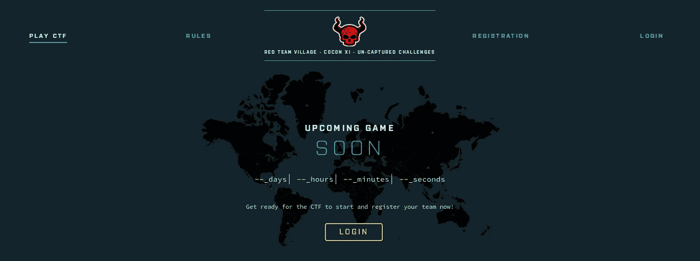

这是由 RedTeamVillage 组织的 c0c0n XI CTF 挑战赛的演练。

不会有太多的截图，因为我忘记拍了，请道歉

# **挑战 1 阿根廷**

在这个挑战中，我们只需要发布我们团队的照片，发推文，并通过电报将链接发送给管理员，以方便大家

愚蠢的权利

# 挑战 2 刚果

这是在根类别中，我们只有一个网站节点。victimcorp.xyz

**枚举**

开始进行 nmap 扫描，显示 mongodb 正在运行，mongoexpress 是一种基于 web 的管理工具，因此是时候将其连接到 robomongo 或 robo3t，并通过集合成功登录搜索，我注意到一个条目。让我们试试宋承宪和…

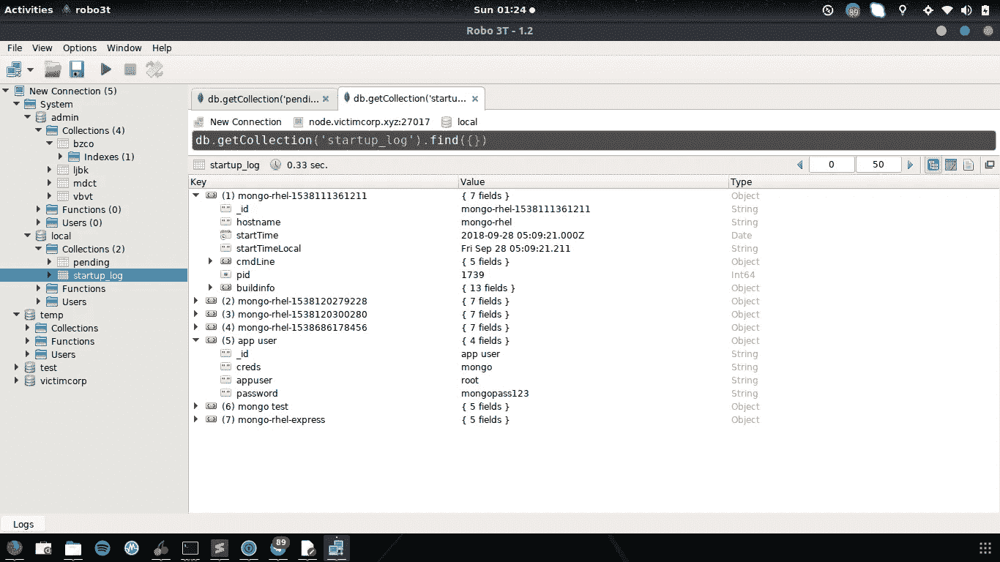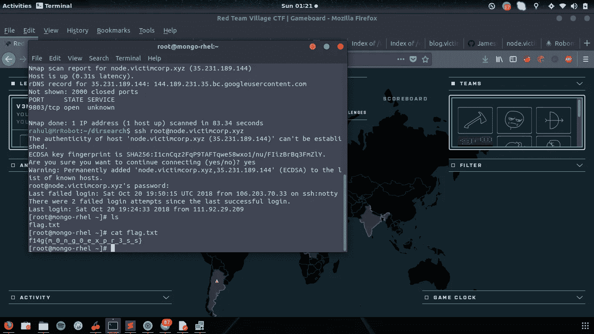

那是旗子

# **挑战三加拿大**

挑战型网站

在这个挑战中，我们有一个运行 HTTP 和 SSH 的 url blog.victimcorp.xyz 服务

访问 blog.victimcorp.xyz 时，我们看到了 apache 的默认索引页面

使用 dirsearch 进一步枚举 wordpress 目录，发现了 phpmyadmin，但是没有太多信息，比如备份文件或易受攻击的插件等，所以接下来的事情是强行登录

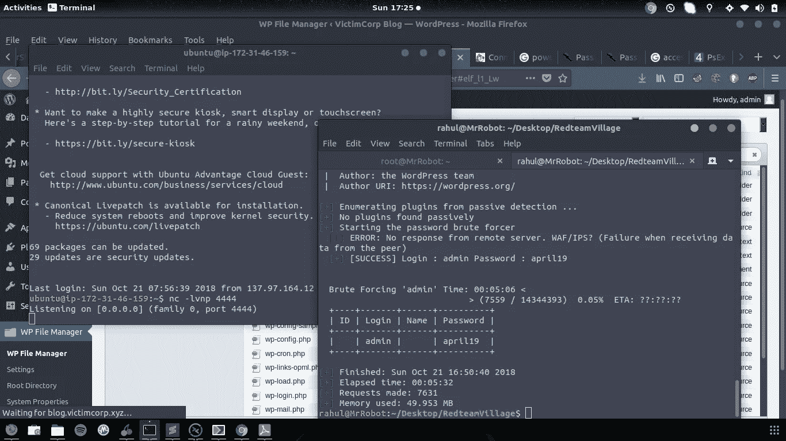

我们有一个登录，所以获得一个反向外壳很容易只是编辑一个模板或插件，我们有一个外壳作为 www-data 检查 **passwd** 文件有一个用户约翰，但约翰没有一个奇怪的主目录，但我们可以从 www-data 改变到约翰，但我们需要一个密码 wp-config.php 有一个密码尝试，让我们访问约翰，因为约翰是在 sudoers 列表中找到的，所以我们可以使用 **sudo -i** 切换到 root 并读取标志

# **挑战 4 印度**

这是一个相当困难但有趣的挑战类别 **RedTeamIt**

我们有一个网站 websrv1.victimcorp.xyz，通过访问它，我们会看到默认的 IIS 页面。

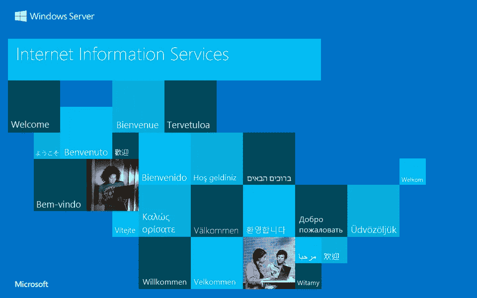

通过运行 Nmap，它显示只有 3 个服务正在运行

HTTP、TELNET 和 RDP

连接到 Telnet，我们看到一个微软的登录，显然需要用户名和密码…我在哪里可以得到没有别的尝试运行 DIRB 对 HTTP 和一无所获

嗯，我遗漏了一些东西，我检查了源代码，映像名称是 IIS 8–5.jpg，这是 IIS 8.5，这是 Windows Server 2012，这引发了一些问题“我在哪里见过这个..哦，黑客盒子”的 IIS 代字号漏洞，我不知道它是否是脆弱的地狱，我会尝试它

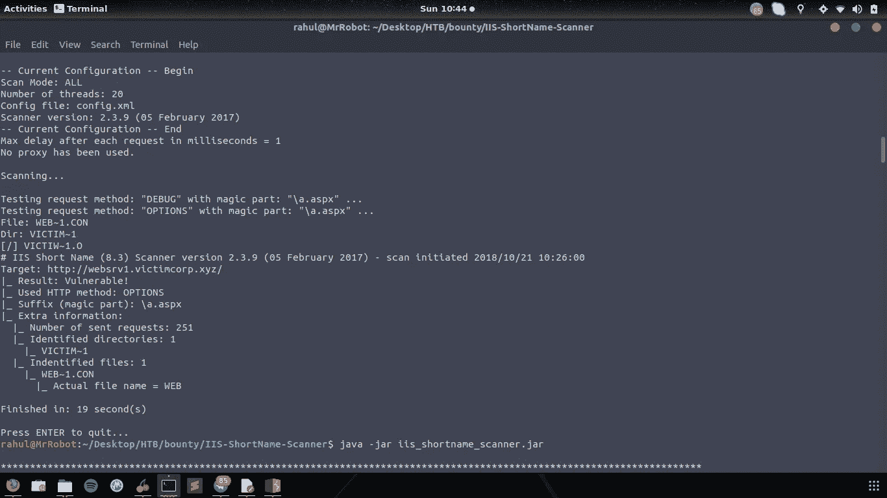

然而需要一些猜测工作

所以我又有了一个主目录，它返回了 4 个目录资产、配置和图像

我对 websrv1.victimcorp.xyz/victimcorp/config 运行了相同的 IIS 短名称扫描程序，它发现了一个文件 WEBCON~1。BAK

哦，一个备份文件读取 [**这个**](https://support.detectify.com/customer/portal/articles/1711520-microsoft-iis-tilde-vulnerability) 会得到一些信息，所以我寻找 web.config.bak，有一个文件并下载它打开它，我有用户名和密码

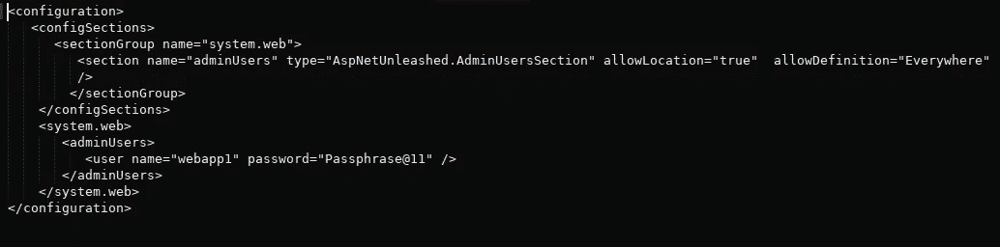

这允许我连接到 telnet 并获得一个系统外壳

所以我访问了文档目录，其中有一个 web.admin.rdp 文件

里面有一些与 RDP 有关的证书

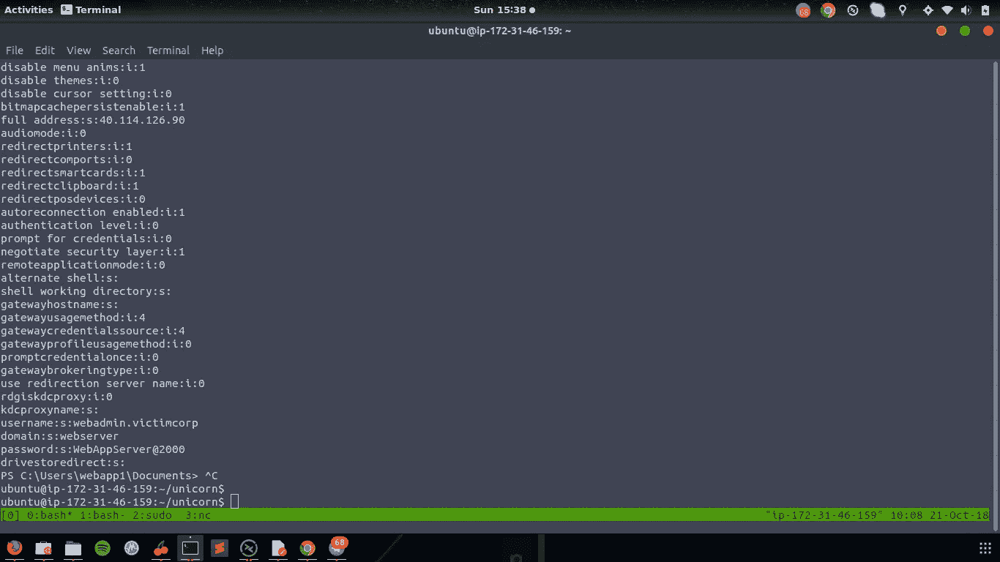

酷，我现在在里面，有一个 keepass 文件，现在我需要找到主密码，首先我试图强行破解，但失败了，然后我试图用 RDP 的密码来对付它，嘣，我真傻

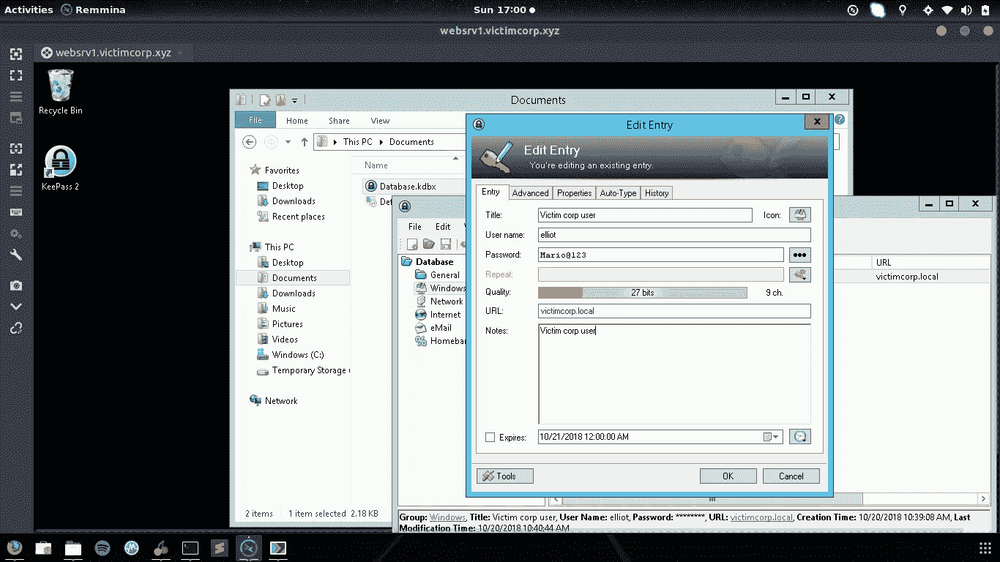

现在，在这一点上，我不知道下一步该做什么，我迷路了，但组织者激励我列举更多，所以我开始进一步列举，但我错过了一些可以帮助我解决这个问题的东西，那就是 arp 表:(

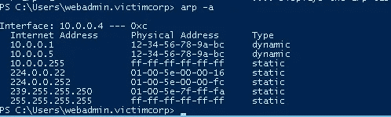

这时候另一队已经进入了 RDP，解决了这个问题

那么，如何解决这个问题呢？10.0.0.5 上的枚举服务具有 elliot 的文件系统共享，它们使用密码连接到文件系统，该文件系统在组策略中有一个配置文件，其中包含 cpassword 和用户名。

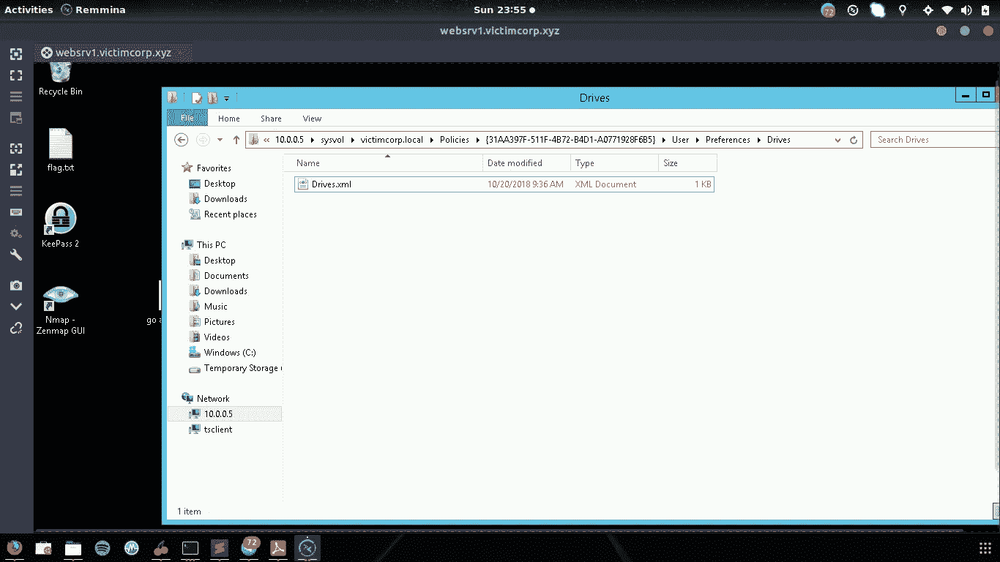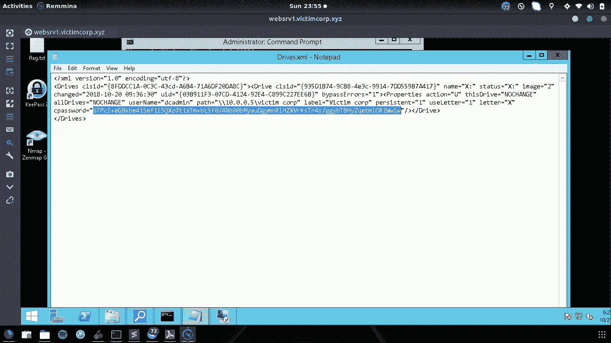

该密钥可以在微软发布解密密钥时被解密

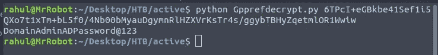

我们有了用户名和密码，RDP 在那台机器上是开放的，我们需要做的就是连接并获取标志

随着比赛的结束，从新手的角度来看，我们获得了第二名，这是一件大事

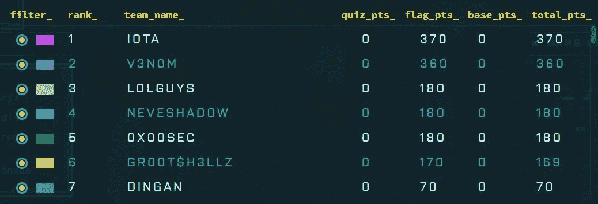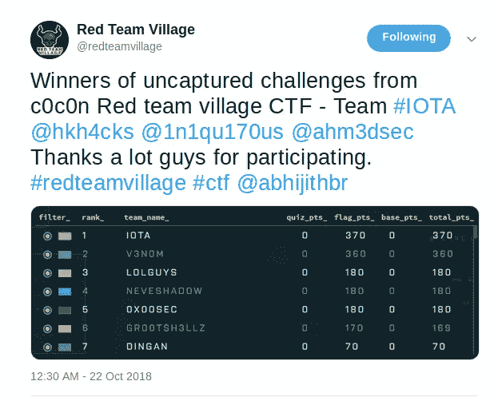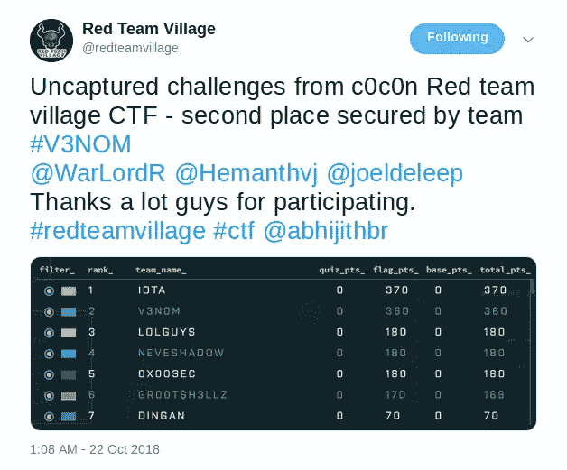

感谢团队 IOTA，感谢 RedTeamVillage 和 [Abhijith](https://twitter.com/abhijithbr) 组织这次活动，感谢我的队友 [Hemanth Joseph](https://twitter.com/Hemanthvj) 、 [Joel Deleep](https://twitter.com/joeldeleep)