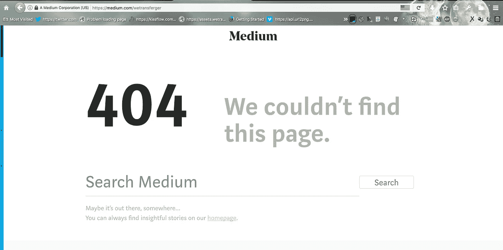
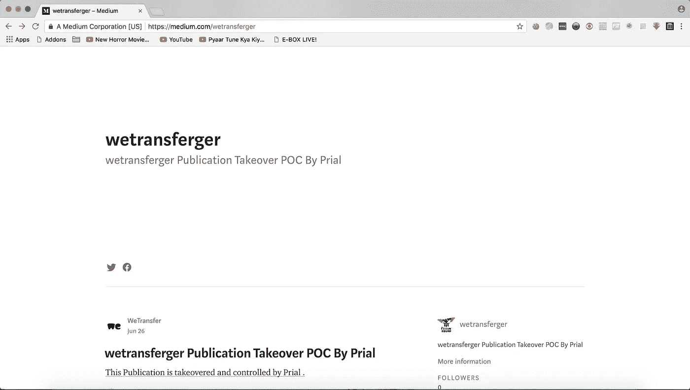
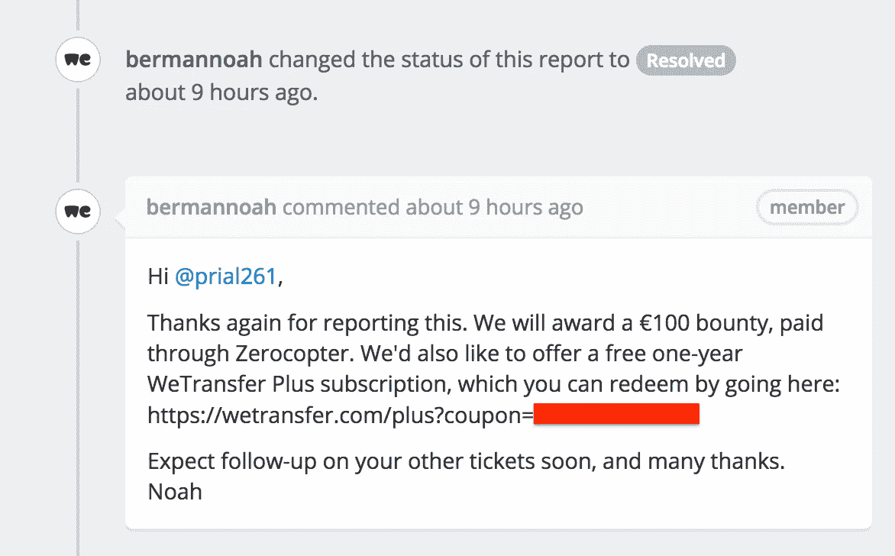

# WeTransfer 中无人认领的媒体出版物接管

> 原文：<https://infosecwriteups.com/unclaimed-medium-publication-takeover-in-wetransfer-c268cdb51e2f?source=collection_archive---------0----------------------->

嗨，读者们，

我是来自孟加拉国的网络安全研究员。我再次在这里分享我在 **WeTransfer** 上发现的一个安全问题。我们 Transfer 在 **Zerocopter** 下有一个付费 bugbounty 项目。所以我开始测试他们的网站。当我用 DIRB 的脚本粗暴地对待 wetransfer.com 的时候，我得到了一些将用户重定向到媒体发布链接的目录。这些目录看起来像:-

*   [https://wetransfer.com/blogger](https://wetransfer.com/blogger)(代码:301 |尺寸:0)
    (地点:[https://medium.com/wetransferger'](https://medium.com/wetransferger'))
*   [https://wetransfer.com/bloggers](https://wetransfer.com/bloggers)(代码:301 |尺寸:0)
    (地点:[https://medium.com/wetransfergers'](https://medium.com/wetransfergers'))
*   [https://wetransfer.com/blogindex](https://wetransfer.com/blogindex)(代码:301 |尺寸:0)
    (地点:[https://medium.com/wetransferindex'](https://medium.com/wetransferindex'))
*   [https://wetransfer.com/blogs](https://wetransfer.com/blogs)(代码:301 |尺寸:0)
    (地点:[https://medium.com/wetransfers'](https://medium.com/wetransfers'))
*   [https://wetransfer.com/blogspot](https://wetransfer.com/blogspot)(代码:301 |尺寸:0)
    (位置:[https://medium.com/wetransferspot'](https://medium.com/wetransferspot'))
*   [https://wetransfer.com/blog_ajax](https://wetransfer.com/blog_ajax)(代码:301 |尺寸:0)
    (位置:[https://medium.com/wetransfer_ajax'](https://medium.com/wetransfer_ajax'))
*   [https://wetransfer.com/blog_inlinemod](https://wetransfer.com/blog_inlinemod)(代码:301 |尺寸:0)
    (位置:[https://medium.com/wetransfer_inlinemod'](https://medium.com/wetransfer_inlinemod'))
*   [https://wetransfer.com/blog_report](https://wetransfer.com/blog_report)(代码:301 |尺寸:0)
    (位置:[https://medium.com/wetransfer_report'](https://medium.com/wetransfer_report'))
*   [https://wetransfer.com/blog_search](https://wetransfer.com/blog_search)(代码:301 |大小:0)
    (地点:[https://medium.com/wetransfer_search'](https://medium.com/wetransfer_search'))
*   [https://wetransfer.com/blog_usercp](https://wetransfer.com/blog_usercp)(代码:301 |尺寸:0)
    (位置:[https://medium.com/wetransfer_usercp'](https://medium.com/wetransfer_usercp'))

现在，当我访问位置链接[https://medium.com/wetransferger](https://medium.com/wetransferger)时，我得到如下截图所示的错误

看起来这个链接有问题😾

现在我去了 https://medium.com/me/publications[创建了一个新的出版物，使用了相同的名字 **wetransferger** ，我得到了我控制下的出版物链接，并且可以在出版物上放置任何东西，如下图所示](https://medium.com/me/publications)

出版物被接管；)

现在，无论用户何时访问 https://wetransfer.com/blogger，它都会将用户带到我的媒体出版物。我可以认领 5 本无人认领的出版物。所有其他的都是不可利用的，因为他们在媒体链接中使用了 **_(下划线)**，并且在媒体 **_(下划线)**中不允许作为发布链接。

我向**we transfer****Bug Bounty**项目报告了这个问题，他们奖励我 **100 欧元+1 年 WeTransfer Plus** 账户。

赏金时间:P

安全意识:- 如果你正在使用你的网站的媒体出版物链接，确保它是有效的，并由你声明。

感谢阅读。原谅所有的错误，:D

**在脸书找我:-**[https://web.facebook.com/prial261?_rdc=1&_ rdr](https://web.facebook.com/prial261?_rdc=1&_rdr)