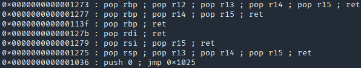
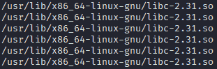
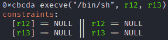
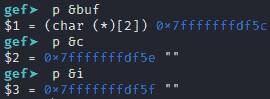
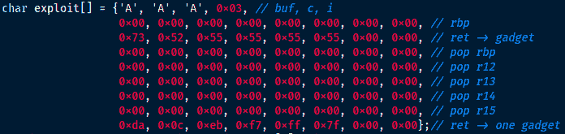
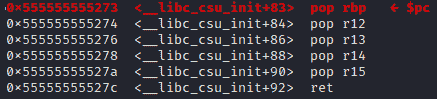
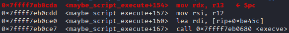
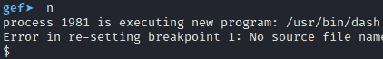
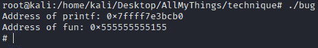

# 从零开始了解强大的 ROP 攻击！

> 原文：<https://infosecwriteups.com/understand-the-powerful-rop-attack-from-zero-f68631af0c6d?source=collection_archive---------1----------------------->


# 1.内容

*   [什么是 ROP？](https://pwnbykenny.com/en/2021/01/29/understand-the-powerful-rop-attack-from-zero/#what-is-rop)
*   [实施真正的 ROP 攻击！](https://pwnbykenny.com/en/2021/01/29/understand-the-powerful-rop-attack-from-zero/#implement)
*   [环境](https://pwnbykenny.com/en/2021/01/29/understand-the-powerful-rop-attack-from-zero/#environment)
*   [生成外壳的步骤](https://pwnbykenny.com/en/2021/01/29/understand-the-powerful-rop-attack-from-zero/#steps)
*   [总结](https://pwnbykenny.com/en/2021/01/29/understand-the-powerful-rop-attack-from-zero/#summary)

# 2.ROP 是什么？

小工具是以跳转指令结尾的汇编代码序列，例如，“pop raxret。跳转指令包括“ret”、“jmp”、“call”等。如果使用每个小工具的最后一个跳转指令来逐个执行多个小工具，那就是面向返回的编程(ROP):gadget 1-(jump)> gadget 2-(jump)> gadget 3-(jump)>…小工具广泛存在于易受攻击的二进制可执行文件中。您需要扫描二进制可执行文件，找到它的小工具，利用漏洞执行一些有用的小工具，并最终完成您的攻击。

# 3.实现真正的 ROP 攻击！

# 3.1 环境

从[下载必要的文件。bug 是易受攻击的二进制可执行文件。exploit_gen.c 生成一个名为“exploit”的二进制数据文件。数据文件是 bug 的输入。exploit_gen.c 可能无法利用您机器上的漏洞。遵循下一节中的步骤。做你的实验，修改 exploit_gen.c。](https://drive.google.com/drive/folders/11yJKHWwEG2pJ0A2ofU_IFwA_ILwGTd7f?usp=sharing)

以下是 bug 的源代码:

```
include <stdio.h>
int fun(FILE* f) {
	char buf[2];
	char i = 0;
	char c;
	while (1) {
		c = fgetc(f);
		if (c != EOF) buf[i] = c;
		else break;
		i++;
	}
	return 0;
}
int main(int argc, char* argv[]) {
	FILE* f =  fopen("exploit", "rb");
	printf("Address of printf: %p\n", printf);
	printf("Address of fun: %p\n", fun);
	fun(f);
	fclose(f);
	return 0;
}
```

在 fun 函数中，我们将文件 f 中的任何内容写入缓冲区 buf，直到文件结束。这绝对是堆栈溢出 bug。

下面是我们如何利用 bug:首先，我们在 bug 中搜索小工具。其次，我们在它使用的 libc 文件中搜索 [one gadgets](https://pwnbykenny.com/en/2020/12/31/one-gadget-easy-powerful-tool-example/) 。第三，我们用 bug 来覆盖 fun 的回邮地址。程序将被重定向以执行小工具。小工具将准备内存并满足一个小工具的约束。最后，最后一个小工具将指导程序执行一个小工具。我们会有一个壳。上面的利用过程可以用这个工作流来概括:bug -(overwrite) >返回地址-(跳转)>小工具-(跳转)>一个小工具。

# 3.2 生成壳的步骤

*   **通过运行“ROPgadget 二进制 bug”找到 bug** 内的小工具。ROPgadget 是一个在二进制可执行文件中发现小工具的工具。从互联网安装。下图显示了部分输出。每一行都是一个小工具。它们都以跳转指令结束。



*   **找到 bug 程序使用的 libc 文件名。**使用以下命令，你会发现它使用的 libc 文件名:1)“gdb bug”。2)“r”。这个命令应该在 gdb 中运行。3)“ctrl+c”。同时按下键盘上的两个键。4)“vmmap”。要使用这个命令，您需要安装一个插件，比如 gef to gdb。您将从该命令的输出中找到 libc 名称:



*   **在 libc 文件中找到一个小工具。**打开你的终端，运行“one _ gadget/usr/lib/x86 _ 64-Linux-GNU/libc-2.31 . so”。记住用您的文件名替换 libc 文件名。您将得到如下所示的输出。这是一个小玩意。其偏移量为 0xcbcda。



*   **选择满足一个小工具约束的小工具。**很明显，上面一个小工具要求 r12 和 r13 为 0。所以你需要在调用一个小工具之前选择一些小工具来设置它们的值。看看我们现在都有什么小玩意。你会发现第一个小工具设置 r12 和 r13 很完美:pop rbppop r12pop r13pop r14pop r15ret。它在 bug 程序中的偏移量是 0x1273。
*   **检查堆栈。在 gdb 内部运行 bug。在 fun 函数处放一个断点。观察堆栈:**


fun 函数有 3 个变量。他们的地址如下。



从上面两张图中，你可以清楚地看出堆栈的结构:

```
0x7fffffffdf5c   buf[0]
0x7fffffffdf5e   c
0x7fffffffdf5f   i
0x7fffffffdf60   rbp
0x7fffffffdf68   return address
```

*   **准备堆栈。**我们要覆盖返回地址，并跳转执行所选的小工具，最终跳转执行所选的一个小工具。这就是我们覆盖堆栈的方式:



漏洞阵列中的数据结构与我们观察到的堆栈结构相同。我们会用 buf 覆盖 c，I，rbp，返回地址等等。在数组的第一行，我们使用三个字符来覆盖 buf 和 c。这些字符是什么并不重要，因为我们不会在利用中使用它们。它们只是占位符。接下来我们用 0x03 覆盖 I，这个很关键。我们使用 I 来访问 buf，并逐字节覆盖堆栈。所以我们不想改变 I，当我们用 buf 覆盖 I 时，I 正好是 0x03。在第二行，数据将覆盖地址 0x7fffffffdf60 的 8 个字节。我们不关心数据是什么，因为我们在开发中不使用它。

第三行覆盖了返回地址，这样程序将跳转到执行我们选择的小工具。我们需要计算这个小装置的地址。它等于“bug 的代码段基址+小工具偏移量”。基址等于“乐趣的地址—乐趣的偏移量”。让我们看看我们是如何得到这些值的。如果你看 bug 的源代码，你会看到 fun 的地址是程序给的。对我来说是 0x555555555155。我们已经获得了所选小工具的偏移量。是 0x1273。fun 是 bug 中的一个函数符号。它的偏移量记录在 bug 的符号表中。运行“objdump -t bug | grep fun”你会在输出中找到 fun 的偏移量:0x1155。所以小工具的地址= fun 的地址— fun 的偏移量+小工具的偏移量= 0x 55555555155–0x 1155+0x 1273 = 0x 55555555273。这正是我们的第三条线。

函数 fun 中的 ret 指令会返回 0x555555555273，执行我们的小工具:pop rbppop r12pop r13pop r14pop r15ret。这个小工具从堆栈中获取数据。所以我们需要相应地准备堆栈。从漏洞数组的第四行开始，每一行都为小工具中的一条指令提供一个值。您会看到这些值将 r12 和 r13 设置为 0。它满足了我们一个小玩意的要求。最后，我们使用小工具中的最后一个 ret 指令来跳转执行我们的小工具。所以我们需要给 ret 指令一个小工具的地址。

一个小工具的地址= libc 基址+一个小工具的偏移量= printf 的地址-printf 的偏移量+一个小工具的偏移量。printf 的地址是 bug 程序给的:0x7ffff7e3bcb0。one gadget 的偏移量是在上面的步骤中获得的:0xcbcda。printf 是 libc 符号表中存在的函数符号。用这个命令观察 libc 的符号表:objdump-T/usr/lib/x86 _ 64-Linux-GNU/libc-2.31 . so | grep " printf "，你会发现 printf 的偏移量是 0x56cb0。记住用您的路径替换 libc 的路径。所以 one gadget 的地址= 0x 7 ffff 7 E3 BCB 0–0x 56 CB 0+0x CBC da = 0x 7 ffff 7 EB 0 CDA。这个值正好是漏洞数组的最后一行。小工具中的最后一个 ret 指令将使用这个值并返回来执行我们的小工具。

*   **观察剥削。**在 exploit_gen.c 中正确设置 exploit 数组后，编译运行。将生成一个名为“exploit”的数据文件。在 gdb 中运行 bug。在第 14 行放一个断点(fun 的返回指令)。运行程序。现在堆栈变成这样:

```
0x7fffffffdf5c    0x41    buf[0]
0x7fffffffdf5e    0xff    c
0x7fffffffdf5f    0x40    i
0x7fffffffdf60    0x00    rbp
0x7fffffffdf68    0x555555555273    ret -> gadget
0x7fffffffdf70    0x00    pop rbp
0x7fffffffdf78    0x00    pop r12
0x7fffffffdf80    0x00    pop r13
0x7fffffffdf88    0x00    pop r14
0x7fffffffdf90    0x00    pop r15
0x7fffffffdf98    0x7ffff7eb0cda    ret -> one gadget
```

第一列是地址。第二个是地址的值。第三个是使用该值的变量或指令。现在，如果我们使用命令“n”一行一行地运行程序，我们将看到指令和值是如何引导我们到 shell 的。fun 的 ret 指令执行后，程序转到地址 0x555555555273 执行:



这是我们的小玩意！这个小工具从堆栈中获取数据，并将它们放入寄存器中。如果我们执行到最后一条 ret 指令，我们会看到从 rbp 到 r15 都变成 0。在我们执行 ret 指令之后，程序开始执行我们的小工具:



r12 和 r13 是 execve 的自变量。现在它们被正确地设置为 0。运行 4 指令，我们将得到一个 shell:



*   **生一个没有 gdb 的壳。**我们的漏洞无法绕过 ASLR。所以你需要关闭 ASLR。首先，使用“su”进入 root 模式。第二，用“echo 0>/proc/sys/kernel/randomize _ va _ space”关闭 ASLR。现在，如果您执行 bug，您将看到一个 shell 被生成:



# 4.摘要

这篇文章使用了一个具体的例子来展示如何实现 ROP 攻击。实现一个 ROP 攻击，就是把分散在目标程序代码空间里的小工具一个一个执行。从一个小工具到另一个小工具的执行由每个小工具的最后一个跳转指令连接。跳转指令包括 jmp、ret、call 等。亲爱的读者，如果你觉得这篇文章有帮助，请帮我分享到你的社交媒体上。非常感谢！