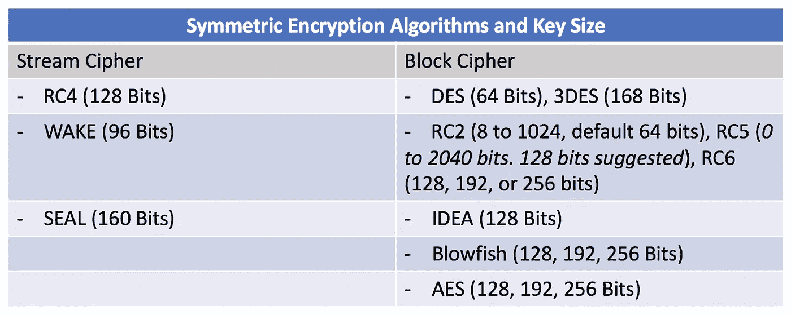
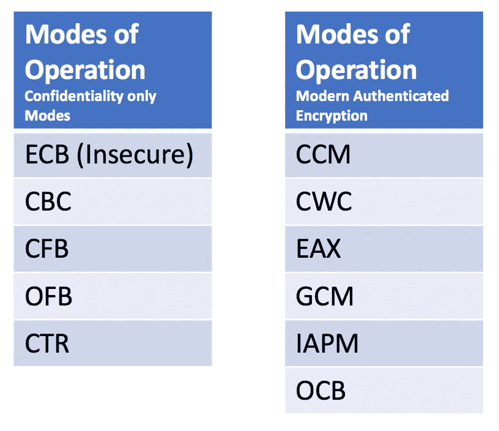
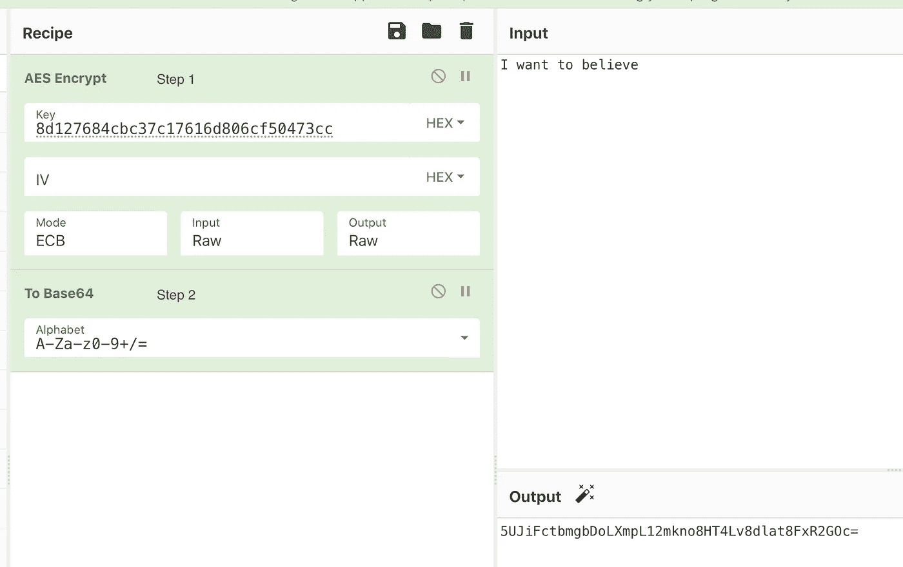
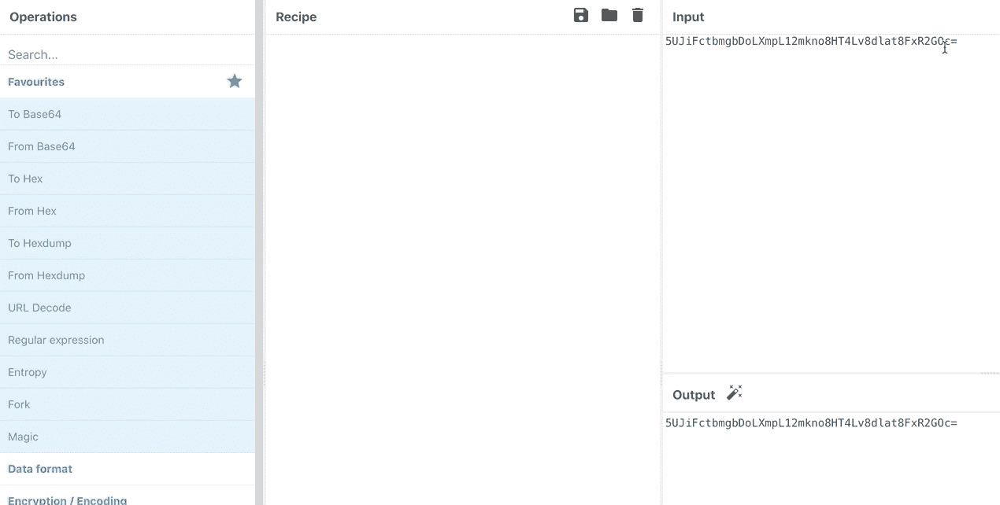

# 理解和解密对称加密

> 原文：<https://infosecwriteups.com/understanding-and-breaking-symmetric-encryption-e83efacd5619?source=collection_archive---------1----------------------->

> 简而言之，对称密钥加密是一种单一的共享密钥，用于执行加密和解密过程。

[https://www . 101 computing . net/symmetric-vs-asymmetric-encryption/](https://www.101computing.net/symmetric-vs-asymmetric-encryption/)

# 执行对称加密的步骤

要使用对称加密算法加密明文，简单的步骤包括:

1.  **选择对称加密算法和密钥大小。密钥越大，解密就越困难。**

**2。选择操作模式**

*某些操作模式需要生成* [*IV*](https://en.wikipedia.org/wiki/Initialization_vector) *(或*[*nonce*](https://en.wikipedia.org/wiki/Cryptographic_nonce)*)作为 steam 和分组密码中的附加安全层。模式类型有:*

*   传统的保密模式。
*   **现代认证加密模式** - 确保加密提供机密性、真实性和完整性解决方案。

**3。生成密钥。**

以下站点可用于生成密钥。

[**allkeysgenerator.com**](https://www.allkeysgenerator.com/Random/Security-Encryption-Key-Generator.aspx)—这个站点随机生成一个密钥。

[**asecuritysite.com**](https://asecuritysite.com/encryption/keygen)—该站点需要密码来生成密钥。

## 使用网络密码加密对称算法

下面的例子显示了一个不安全的对称加密过程，以及如何解密它。

一旦生成了密钥，就可以用它来加密消息，如下所示。我使用秘密密钥加密字符串，然后用 base64 编码。

# 解密 AES-ECB 加密算法

要解密一个加密的算法，需要知道以下几点:(1。)加密值(2。)算法名(3。)密码模式(4。)的密匙。

接下来，您可以使用 [CyberChef 在线工具](https://gchq.github.io/CyberChef/)使用这些信息来解密加密值。

*下面的例子摘自一个基于 Android 的挑战，名为不可破解 1 级。*

> 对称算法/密码模式/位填充为: **AES/ECB/PKCS7**
> 
> 加密的秘密(base64 编码值):**5 ujifctbmgbdolxmpl 12 mkno 8 ht 4 LV 8 dlat 8 fxr 2 goc =**
> 
> 密码/密钥为:**8d 127684 CBC 37c 17616d 806 cf 50473 cc**

**在 Cyber Chef 中，**进入收藏夹或数据格式，双击“来自 Base64 ”,在输入框中输入 Base64 编码的密码。现在点击加密/编码> AES 解密。在该字段中输入**密钥**，将加密模式更改为 **ECB** ，并将**输入参数**更改为 **Raw** 。您现在可以在**输出**部分看到**解密结果**。

*那都是乡亲们！:-)*