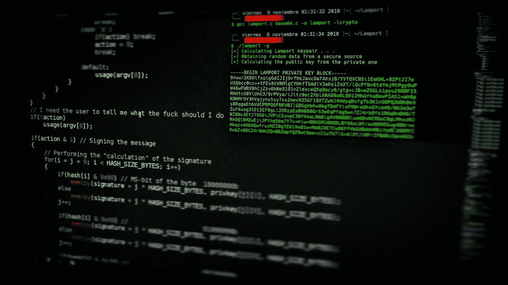
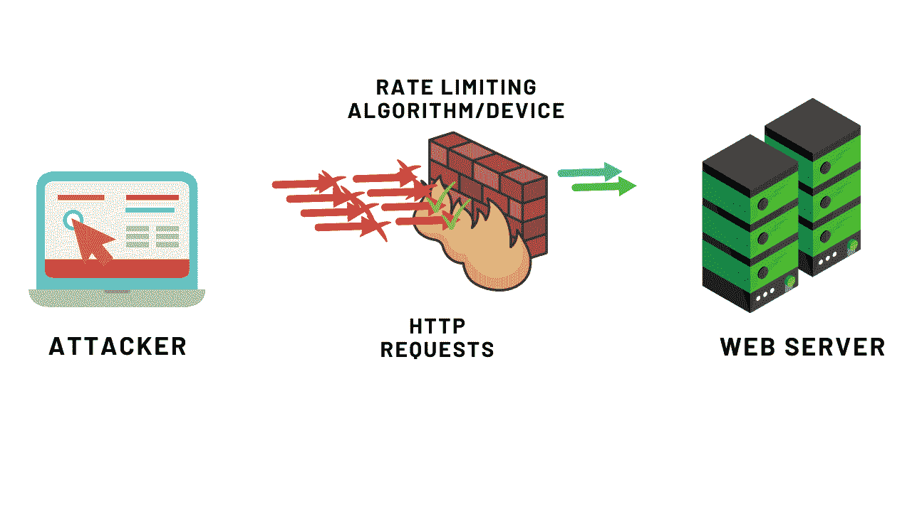

# 理解和绕过速率限制

> 原文：<https://infosecwriteups.com/understanding-and-bypassing-rate-limitings-7c99a1252635?source=collection_archive---------2----------------------->

**照片由** [**目标**](https://unsplash.com/@arget?utm_source=unsplash&utm_medium=referral&utm_content=creditCopyText) **上** [**下**](https://unsplash.com/s/photos/hacking?utm_source=unsplash&utm_medium=referral&utm_content=creditCopyText)

# 介绍

当您查看网站并在短时间内提交多次重复请求时，网站可能会要求您填写验证码或要求额外验证。如果发生这种情况，您需要遵从请求。这种做法被称为“速率限制”这意味着一旦网站检测到请求可能来自计算机机器人或任何其他自动化工具，网站将开始限制您或您的浏览器发出请求的速度。出于各种原因，可以这样做，包括保护应用程序资源，为用户提供良好的网站响应时间，以及偶尔保护用户帐户或用户免受暴力攻击。因为这些查询可能会被用来浏览或抓取整个网站，或者滥用用户登录，所以应该避免使用它们。

# 什么是速率限制？

[**来源**](https://snapsec.co/blog/Attacking-Rate-limit/)

如果来自工具或用户的重复请求被发送到特定的端点，“速率限制”是一种有助于限制服务器发出的连续请求数量的方法。这种方法被称为“速率限制”这通常是为了保护网站或应用程序免受 DOS 攻击；然而，它也可能有许多其他问题，包括用户名和密码的暴力破解，以及有时防止一次性密码或其他参数的暴力破解。

有许多不同的终端或功能需要实施速率限制功能，例如登录、注册、忘记密码、双因素身份验证以及任何其他可能需要的情况，包括应用优惠券代码等。

以下面的场景为例:应用程序根据发送给用户的 OTP 执行身份验证。如果在特定的端点上没有速率限制，攻击者可以很容易地破坏 OTP 并登录受害者的帐户。OTP 由四个数字组成。

## **限速的用途:**

1.  减少服务器上的负载，从而提高性能和资源利用率。
2.  消除暴力攻击不同端点的可能性，例如登录、OTP 验证以及忘记密码。
3.  降低 DOS 攻击的概率。

# 它们为什么会发生？

登录功能是每个应用程序的标准功能。登录帐户时，用户有多种选择，例如输入密码或一次性密码(OTP)。由于最近发生的大量违规事件，大量用户名和密码已经公开。如果特定端点上没有速率限制，攻击者可能会使用通过漏洞获取的用户名和密码来测试和查找网站上的帐户。因此，可以利用它来控制用户帐户。因此，即使用户使用 OTP 登录到他们的帐户，攻击者也有可能强行使用 OTP 登录到用户帐户。即使用户正在使用 OTP，这种情况也是可能的。

# 绕过限速保护？

如果在网站上应用了速率限制，那么如果没有正确实施速率限制，可以通过使用特定的标题或 IP 轮换来轻松绕过该限制。可以通过各种不同的方法绕过网站上的限速保护。让我们谈谈那些

## 通过在请求中使用标头

如果使用的话，有几个报头可以绕过速率限制。由于有可能在后端欺骗 IP，用户也可能绕过一些内部验证，所以这些头主要是那些头。如果使用这些报头，可以绕过速率限制。

## x 转发主机

以便确定哪个主机名被用来连接或发送请求到 API 或 web 服务器。在反向代理或云架构的情况下，许多网站托管在一台物理服务器上，主机名会有所不同。在这两种情况下，主机名都不会相同。该报头有助于保护用户的隐私，这是它提供的另一个重要功能。因此，如果提供了大量虚构的主机名，您就有可能绕过服务器上设置的速率限制。

> *X-Forwarded-For:*[T3【www.test.com】](http://www.test.com)

## x-转发-用于

这个头是用来计算最初发出请求的计算机的 IP 地址的。这通常包含在服务器端，以便在发送请求时捕获用户的 IP 地址。这可用于确定通过 HTTP 代理或负载平衡器连接到 web 服务器的用户的互联网协议地址(IP 地址)。如果你发送这个头，然后操纵这个头的值中的 IP 地址，网站就会认为有大量不同的 IP 地址在尝试连接服务器。如果他们阻止了其中一个 IP 地址，那么您可以添加另一个 IP 地址，这意味着您可以强制 IP 地址的八位字节来欺骗请求。正因为如此，它会绕过速率限制。该标题可以以这种格式使用。

> *X-forward-For:127 . 0 . 0 . 1*

您可以使用入侵者来改变 IP 地址的最后一个八位字节，或者您可以收集一个 IP 地址列表，并在这个报头中作为有效载荷发送它们。

# **其他绕行方式**

如果攻击者希望避开登录面板提供的限速保护。他可以通过在用户名的末尾添加字符“空格”来做到这一点。这将导致空间在后端被截断，之后用户名将被处理；因此，绕过速率限制是可能的。

以防攻击者希望规避登录提供的限速保护。他可以在两个用户名的末尾添加“空字节”。

# 使用打嗝分机的 IP 旋转

我们可以在扩展中添加一项功能，该功能仅在 Burp 的企业版中提供。因此，为了轮换 IP 地址，我们提供了称为 IP 轮换的功能。这个插件利用 AWS API 网关，每个请求都通过适当区域中的 API 网关端点进行路由，每个目标请求的源 IP 都被更改。如果速率限制功能是基于攻击者的 IP 地址实现的，攻击者将利用此功能来绕过这些功能。

# 补救

## **密码长度**

更长、更难的密码应该是防止暴力攻击的第一步。目前使用的大多数网站和在线平台都要求其用户生成长度在 8 到 16 个字符之间的密码，并且包含字母字符、数字字符和特殊字符的组合。

## **限制登录尝试**

限制任何身份验证端点上的登录尝试次数的操作很简单，但会产生重大影响。一旦达到限制，总是建议冻结用户帐户并阻止违规用户的 IP 地址。

# 结论

如果我们实现了速率限制，它不仅可以保护应用程序免受 DOS 和其他形式的攻击，还可以保护它免受暴力攻击。因为它可能会给应用程序的工作方式带来问题。因此，必须确保速率限制始终适用于应用程序。如果没有正确应用速率限制，则有可能危及用户帐户的安全，并可能导致用户帐户上的大量垃圾邮件。