# 理解和利用 HTTP 获取 bug 赏金

> 原文：<https://infosecwriteups.com/understanding-and-exploiting-http-for-bug-bounty-46286fcdd870?source=collection_archive---------3----------------------->

[](https://www.wikibit.it/h/cosa-significa-http-1719/)

wikibit.it

每当我们打开浏览器在网上搜索某样东西时，我们都会发出 HTTP 请求。

但是到底什么是 HTTP 请求，我们如何使用它来获得奖金呢？

如果你是一个 bug 猎人，或者你有一些网络经验，你可能知道它是什么和它是如何工作的，但如果你刚刚开始你的旅程，不要担心，我会解释你需要知道的一切。

我们开始吧！

# **1) HTTP 概述**

这是 HTTP 的定义，你可以在维基百科上找到。

> [**超文本传输协议** ( **HTTP** )是分布式、协作式、超媒体信息系统的应用层协议。[1] HTTP 是万维网数据通信的基础，在万维网中，超文本文档包括与其他资源的超级链接，用户可以很容易地访问这些资源，例如通过点击鼠标或在网络浏览器中点击屏幕。](https://en.wikipedia.org/wiki/Hypertext_Transfer_Protocol)

你现在可能有点困惑，但是不要担心，让我们用一种非常简单的方式来解释它。

> 安德里亚:我们打开 YouTube 吧，我想看一些小猫的视频。
> 
> 浏览器:嘿 HTTP Andrea 想看些视频，你能让 YouTube 给我吗？
> 
> HTTP:当然可以！嘿，YouTube，请给我这些视频。
> 
> YouTube:给你。
> 
> 安德里亚:终于到了*😻*

所以简单地说，HTTP 是你和拥有你想要的东西的人之间的中介。

现在让我们用更专业的方式解释一下。

[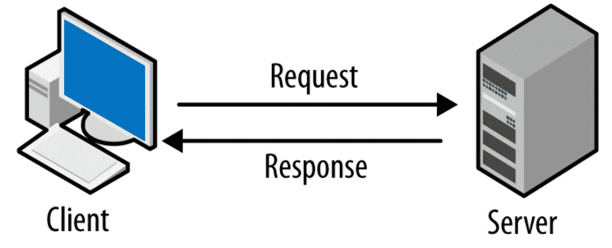](https://madooei.github.io/cs421_sp20_homepage/api/)

madooei.github.io

有客户端和服务器。

IT 中的客户端是可以访问服务器托管的服务的软件或硬件。

当你试图访问一个服务器上的资源时，你总是发出一个 HTTP 请求。

这是它的样子。

```
GET HTTP/1.1 200 OK
Server: nginx/1.19.0
Date: Wed, 05 May 2021 12:53:39 GMT
Content-Type: text/html; charset=UTF-8
Transfer-Encoding: chunked
Connection: keep-alive
X-Powered-By: PHP/5.6.40-38+ubuntu20.04.1+deb.sury.org+1
Content-Encoding: gzip
```

[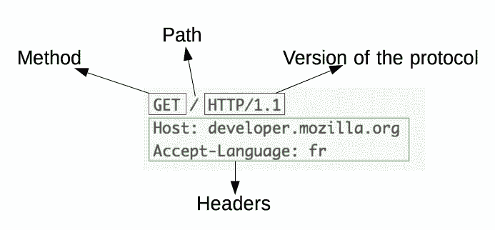](https://developer.mozilla.org/en-US/docs/Web/HTTP/Overview?retiredLocale=it)

HTTP 请求结构

为了这个故事的目的，我们不打算解释所有事实上我们想要的，它只是在第一行。

然而，如果你想对 HTTP 请求有更深的理解，我建议你阅读 developer.mozilla.org 的《web 开发的圣经》。

# **2) HTTP 方法**

每当我们想要提出请求时，根据您想要做的事情，有几种方法可以实现。

这是清单。

*   得到
*   头
*   邮政
*   放
*   删除
*   连接
*   选择
*   找到；查出
*   修补

在上面的例子中，我使用了 GET。

```
GET HTTP/1.1 200 OK
```

> 注意:HTTP/1.1 是请求中使用的 HTTP 版本，200 响应意味着一切正常。

现在我们来解释一下所有的方法。

## 1)获取

可能是用的最多的方法。

GET 几乎用于所有事情(通常除了登录)

例如，当你在网上搜索某样东西时，你 99%的可能都在使用 GET。

## 2)发布

正如我们上面提到的，GET 不用于登录，因为每当我们使用 GET 时，参数都在搜索栏中传递。

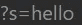

使用 GET 在站点中进行简单搜索

但是，当你登录到你的银行账户或你的电子邮件中的敏感信息，如用户名，密码不能在搜索栏中传递。

所以 post 和 GET 是一样的，只是没有显示所有的 URL 参数。

## 3)头部

当您希望在 HTTP 请求中显示标头时，可以使用此方法。

这些是简单的 HTTP 头。

```
Server: nginx/1.19.0
Date: Wed, 05 May 2021 12:53:39 GMT
Content-Type: text/html; charset=UTF-8
Transfer-Encoding: chunked
Connection: keep-alive
X-Powered-By: PHP/5.6.40-38+ubuntu20.04.1+deb.sury.org+1
Content-Encoding: gzip
```

## 4)放

可能是最危险的 HTTP 方法。

当您想要在服务器上上传文件时，可以使用 PUT。

应该禁用此方法。

> 注意:如果文件上传成功，服务器将响应 201 成功(文件上传)

## 5)删除

另一种危险的方法。

当您想要删除服务器上的文件时，可以使用此选项。

注意:如果文件被成功删除，服务器将返回 202 成功(已接受)

## 6)连接

当您想要在您和服务器之间创建隧道时，使用 Connect。

```
CONNECT server.example.com:80 HTTP/1.1
```

## 7)跟踪

这种方法过去用于调试目的。

当您使用 TRACE 时，服务器将使用您提出的确切请求进行响应，并提示您下载包含已保存请求的文件。

如果启用，此方法可用于利用 XST ( [跨站点跟踪](https://en.wikipedia.org/wiki/Cross-site_tracing))。

然而，出于安全原因，TRACE 不能在现代浏览器中使用(除了 Internet Explorer)。

## 8)选项

当您想知道服务器上哪些 HTTP 方法是活动的时，可以使用 OPTIONS。

## 9)补丁

当您想要修改服务器中的某些内容时，可以使用补丁。

例如文件的内容。

# 3)如何查看服务器上的活动 HTTP 方法

有许多方法可以让你看到服务器中的活动方法。

## 1)使用选项方法(如果激活)

你可以用 curl 来做到这一点。

```
curl -v -X OPTIONS <YOUR_TARGET>
```

> 注意:-X 指定方法，-v 用于详细说明。

## 2)使用 nmap http-methods 脚本

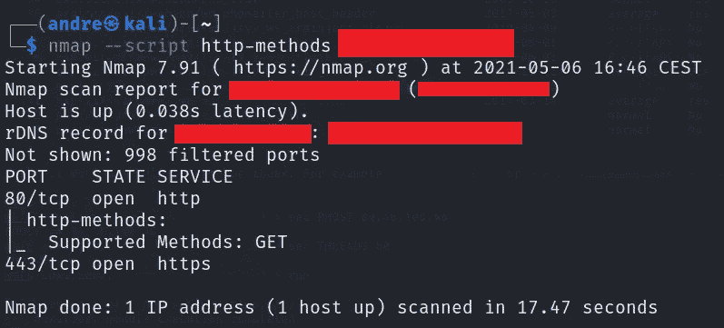

nmap

```
nmap --script http-methods <YOUR_TARGET>
```

## 3)使用 metasploit

遵循这些步骤。

```
1) use scanner/http/options
2) set RHOST <YOUR_TARGET>
3) run
```

注意:我多次尝试使用 metasploit，但是结果不是很准确，所以要小心。

# 4)拦截 HTTP 请求

现在是时候看看我们如何拦截 HTTP 请求了。

我们将使用一种叫做**的神奇工具。**

> 注:如果你想让读者了解这个工具，这是一篇令人惊异的文章。

在我们开始之前，我们必须做一件事。

Burpsuite 是一个拦截代理工具，它站在你和你的浏览器之间，拦截所有的请求。

火狐会阻止打嗝，因为他认为那是试图窃取你信息的恶意软件。

那么我们能做什么呢？

我们将添加一个证书来提醒 Firefox 这是一个好软件。

跟随我的脚步。

开始打嗝。

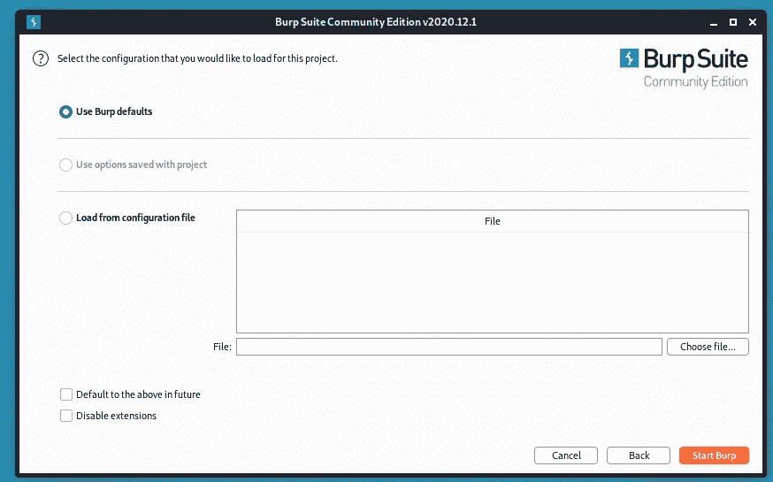

进入 Firefox，点击设置。

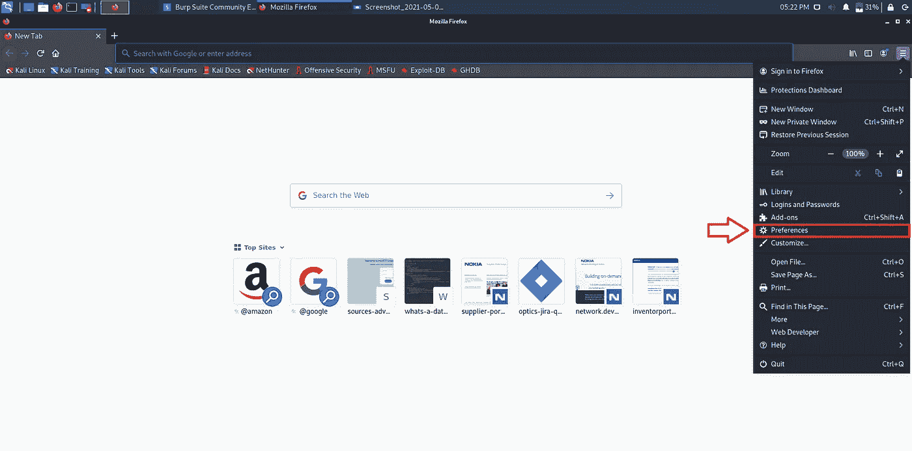

搜索代理。

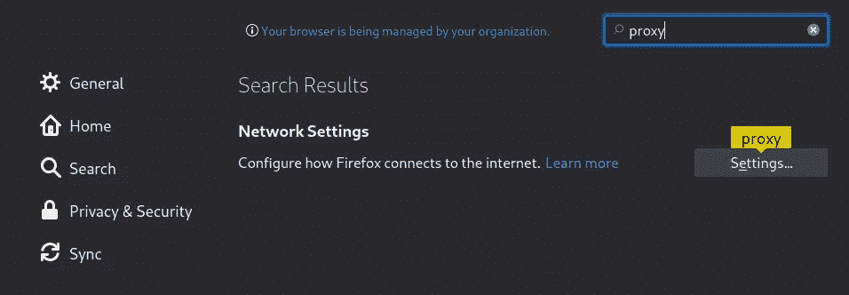

选择手动代理配置，并设置照片中的设置。

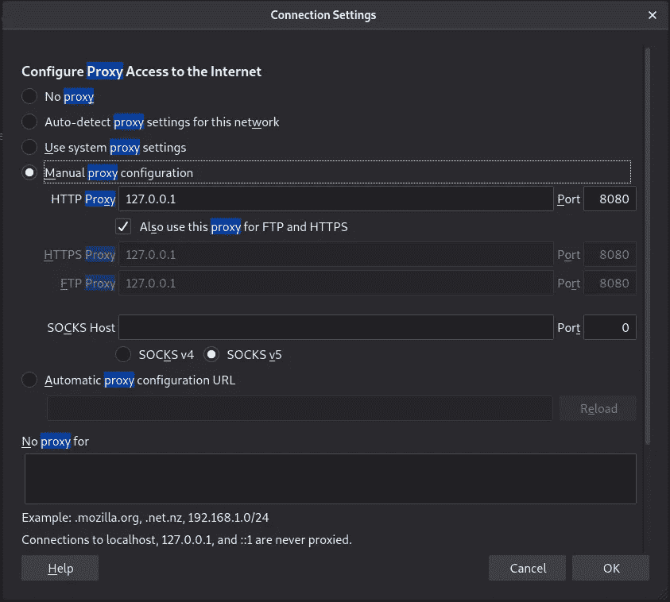

现在在搜索栏中输入 http://burp。


并下载 CA 证书。


下载证书后，我们需要导入它。

在火狐的设置中搜索证书。

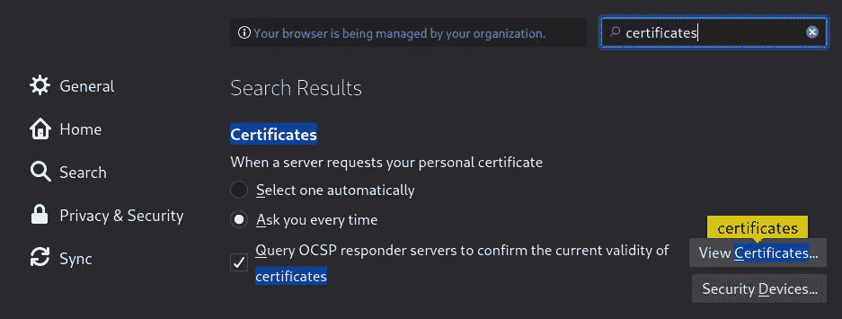

单击查看证书。

然后单击导入。

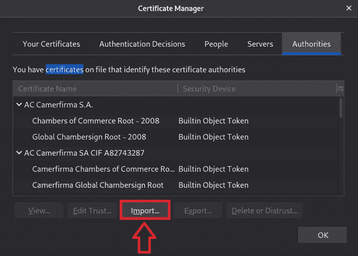

选择证书。


现在你应该可以拦截所有的流量了。

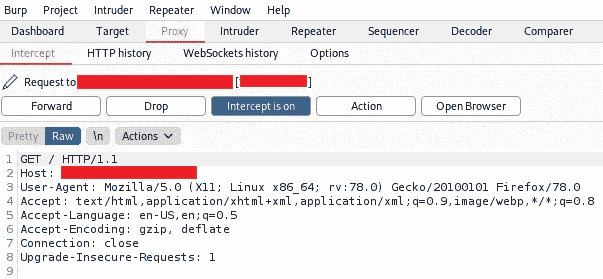

> 注意:每当打嗝将拦截一些东西，你会看到浏览器似乎无休止地加载，但不要担心，这是正常的，只要用上面的按钮转发请求，或者你可以关闭拦截器。

现在我们将请求发送到中继器，这样我们就可以用一种更舒适的方式来处理请求。

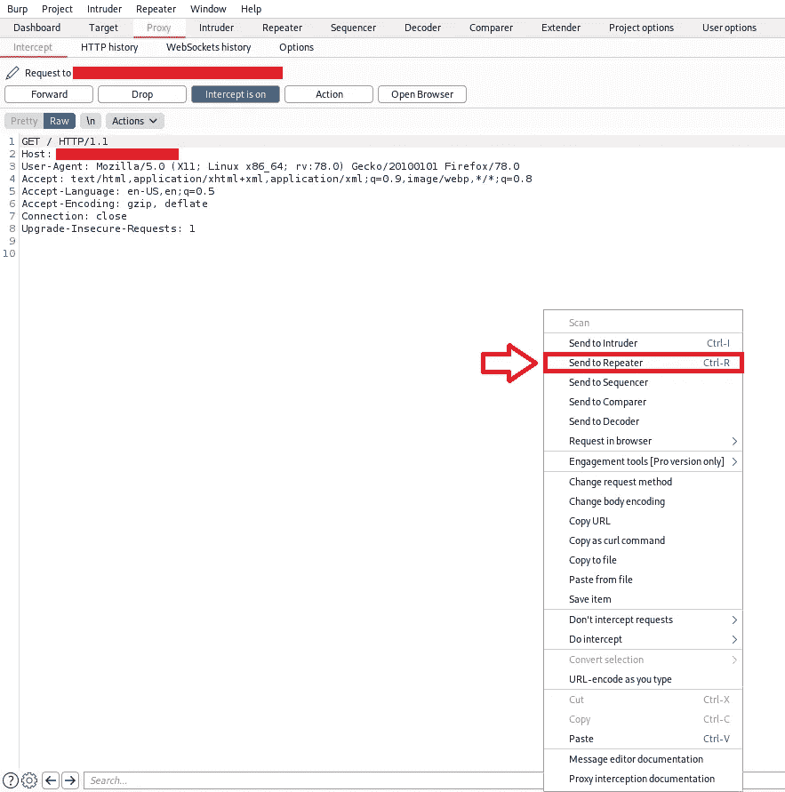

> 注意:中继器允许你修改 HTTP 请求。
> 
> 注意:关闭 Burpsuite 后，返回代理设置，并设置**无代理。**

# 5)修改和利用 HTTP 请求

在您确定了服务器上的活动方法之后，就该修改请求了，看看您是否能利用一些东西。

在这种情况下，我用 PUT 修改了前面的请求。

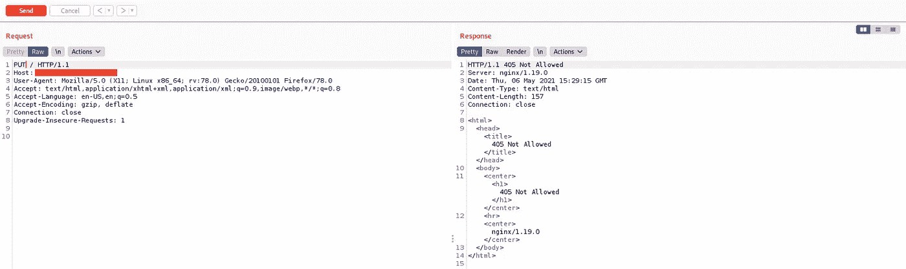

很遗憾，此服务器上不允许使用 PUT 方法。

> 注意:在测试 HTTP 方法时，另一个常见 HTTP 状态是 403(禁止的),因为有时 PUT、DELETE 等在服务器上可能是活动的，但是出于安全原因，防火墙可能会阻止您的请求。

如果需要，您可以更改上传或删除文件的路径。

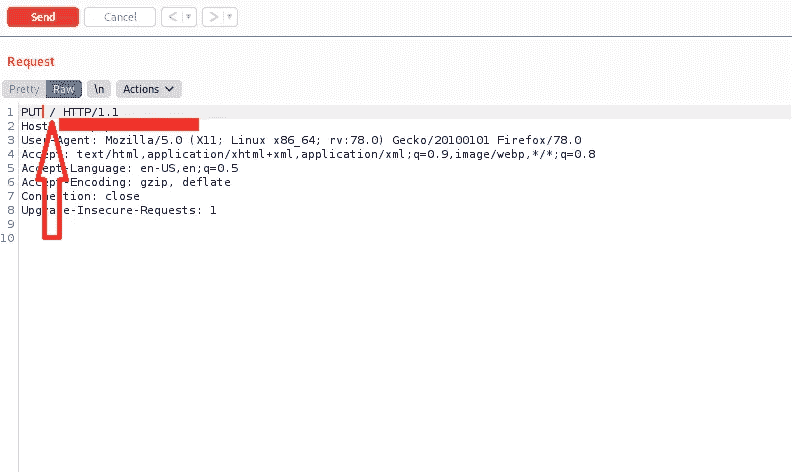

> 注意:我建议你不要处理 302 回复(重定向),因为有时我发现我不能利用它们，而是使用 200 个回复。

修改请求后，单击发送。

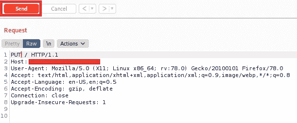

# 结论

当您试图利用 HTTP 请求时，应该遵循以下步骤。

1.  找到一个目标(子域更好)
2.  使用上面的方法来识别什么是活动的方法，尝试手动和自动的方法。
3.  如果某个有趣的方法处于活动状态，请尝试通过修改 Burpsuite 中的请求来利用它。

我建议你报告上传和删除，但如果你愿意，你也可以报告跟踪，但每次我都报告了，我从来没有得到赏金。

我希望你喜欢，你今天学到了一些新东西。如果你有任何建议或任何问题，请留下你的回复，谢谢。

下次见。

再见。