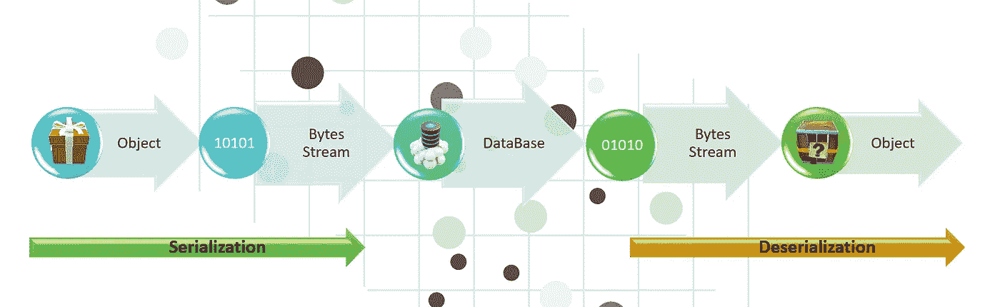
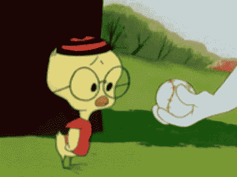

# 理解和识别不安全的反序列化漏洞

> 原文：<https://infosecwriteups.com/understanding-identifying-insecure-deserialization-vulnerabilities-f7fac5414bb3?source=collection_archive---------0----------------------->

这篇文章解释了不安全的反序列化漏洞的本质。我们将涵盖基本的理解和识别。，不安全的反序列化——漏洞位于 OWASP 十大漏洞——2017 中的第 8 位。据说是 OWASP Top 10 中最难理解的漏洞。

不安全的反序列化也是我在采访 InfoSec 概要文件时经常遇到的问题。这个漏洞肯定有炒作的成分&如果你要参加 InfoSec 的面试，请把它放在你必须知道的列表中。那么，现在让我们开始吧。

## 漏洞背后的根本原因是什么？

> 简单来说:应用程序**在没有充分验证**结果数据是否有效的情况下反序列化不受信任的数据。

当开发人员对“小工具链”或一系列可以在反序列化过程中自动执行的实例和方法调用(即，在对象返回给调用者之前)没有任何限制时，攻击者有时可能利用它们来执行未经授权的操作，比如生成 shell。

## 什么是序列化？

序列化是将一些对象转换成可以在以后恢复的数据格式的过程。人们经常序列化对象，以便将它们保存到存储器中或作为通信的一部分发送。

序列化-反序列化过程

## 什么是反序列化？

反序列化是该过程的**逆过程，获取某种格式的结构化数据，并将其重建为一个对象**。序列化数据最流行的数据格式是 JSON 和 XML。

**序列化可以用在**
1 的应用中。远程和进程间通信(RPC/IPC)2。有线协议、web 服务、消息代理
3。缓存/持久化
4。数据库、缓存服务器、文件系统
5。HTTP cookies、HTML 表单参数、API 认证令牌

# 识别-您的应用程序易受攻击吗？

如果应用程序和 API 对攻击者提供的恶意或被篡改的对象进行反序列化，它们将容易受到攻击**。这可能导致两种主要类型的攻击:**

1.  **与对象和数据结构相关的攻击**攻击者修改应用程序逻辑或实现任意远程代码执行，前提是应用程序中存在可在反序列化期间或之后改变行为的类。
2.  典型的数据篡改攻击，如**访问控制相关攻击**，其中使用现有的数据结构，但内容被改变。

识别不安全的反序列化有时需要进行白盒测试和黑盒测试。

## 示例:

1.  让我们以一个与**访问控制相关的攻击为例，** & 为了更深入的理解，我们将它分解为:

比如说，一个 PHP 论坛使用 **PHP 对象序列化**保存一个“**超级**”cookie，包含用户的用户 ID、角色、密码 hash 等状态:

**普通用户 Cookie:**
`a:4:{i:0;i:132;i:1;s:7:”Mallory”;i:2;s:4:”user”;
i:3;s:32:”b6a8b3bea87fe0e05022f8f3c88bc960";}`

攻击者更改序列化的对象以赋予自己管理权限:

**管理员的超级 Cookie:**
`a:4:{i:0;i:1;i:1;s:5:”Alice”;i:2;s:5:”admin”;
i:3;s:32:”b6a8b3bea87fe0e05022f8f3c88bc960";}`

如果上面修改的对象被应用程序反序列化，攻击者可以提升为“admin”。因此，由于易受攻击的 **PHP 对象序列化**，绕过了访问控制。

# 识别已知受影响编程语言中的不安全 De **序列化**:

## PHP，Python，Java，。Net:白盒和黑盒测试:

1.  **对于 PHP:**

检查 [unserialize()](https://www.php.net/manual/en/function.unserialize.php) 函数的使用，并检查外部参数是如何被接受的。

**2。对于 Python:**

Python 中的以下 API 将容易受到序列化攻击。搜索以下模式的代码。

1.  `pickle/c_pickle/_pickle`与`load/loads`的用途:

`import pickle
data = “”” cos.system(S’dir’)tR. “””
pickle.loads(data)`

2.`PyYAML`与`load`的用途:

`import yaml
document = “!!python/object/apply:os.system [‘ipconfig’]”
print(yaml.load(document))`

3.使用`jsonpickle`和`encode`或`store`方法。

**在黑盒评论-**

如果流量数据在末尾包含符号点`.`，很可能数据是以序列化方式发送的。

**3。对于 Java:**

请注意以下 Java API 使用的潜在序列化漏洞。

1.`XMLdecoder`带有外部用户自定义参数

2.`XStream`使用`fromXML`方法(XStream 版本< = v1.46 易受序列化问题影响)

3.`ObjectInputStream`同`readObject`

4.`readObject`、`readObjectNodData`、`readResolve`或`readExternal`的用途

5.`ObjectInputStream.readUnshared`

6.`Serializable`

**在黑盒评论-**

如果捕获的流量数据包括以下模式，则可能表明数据是在 Java 序列化流中发送的

*   `AC ED 00 05`十六进制
*   `rO0`在 Base64
*   `Content-type`设置为`application/x-java-serialized-object`的 HTTP 响应的报头

**4。因为。Net CSharp**

在源代码**中搜索以下术语:**

1.  `TypeNameHandling`
2.  `JavaScriptTypeResolver`

查找类型由用户控制的变量设置的任何序列化程序。

**在黑盒测试中-**

搜索以下以下列内容开头的 base64 编码内容:

`AAEAAAD/////`

使用以下文本搜索内容:

1.  `TypeObject`
2.  `$type:`

## 检测工具:

Burp Suite 扩展，可以简化反序列化漏洞的识别: [JavaSerialKiller](https://github.com/NetSPI/JavaSerialKiller) ， [Java 反序列化扫描器](https://github.com/federicodotta/Java-Deserialization-Scanner)，[Burp-y serial](https://github.com/summitt/burp-ysoserial)， [SuperSerial](https://github.com/DirectDefense/SuperSerial) ， [SuperSerial-Active](https://github.com/DirectDefense/SuperSerial-Active) 。

## 缓解措施:仅反序列化签名数据

如果应用程序在反序列化之前知道需要处理哪些消息，它们可以在序列化过程中对这些消息进行签名。然后，应用程序可以选择不反序列化任何没有经过验证的签名的消息。

**练习剥削:**

 [## 不安全的反序列化|网络安全学院

### 在这一节中，我们将讨论什么是不安全的反序列化，并描述它如何潜在地将网站暴露给…

portswigger.net](https://portswigger.net/web-security/deserialization) 

**参考:**

 [## 反序列化— OWASP 备忘单系列

### 本文旨在为安全地反序列化您的系统中不可信的数据提供清晰、可行的指导

cheatsheetseries.owasp.org](https://cheatsheetseries.owasp.org/cheatsheets/Deserialization_Cheat_Sheet.html)