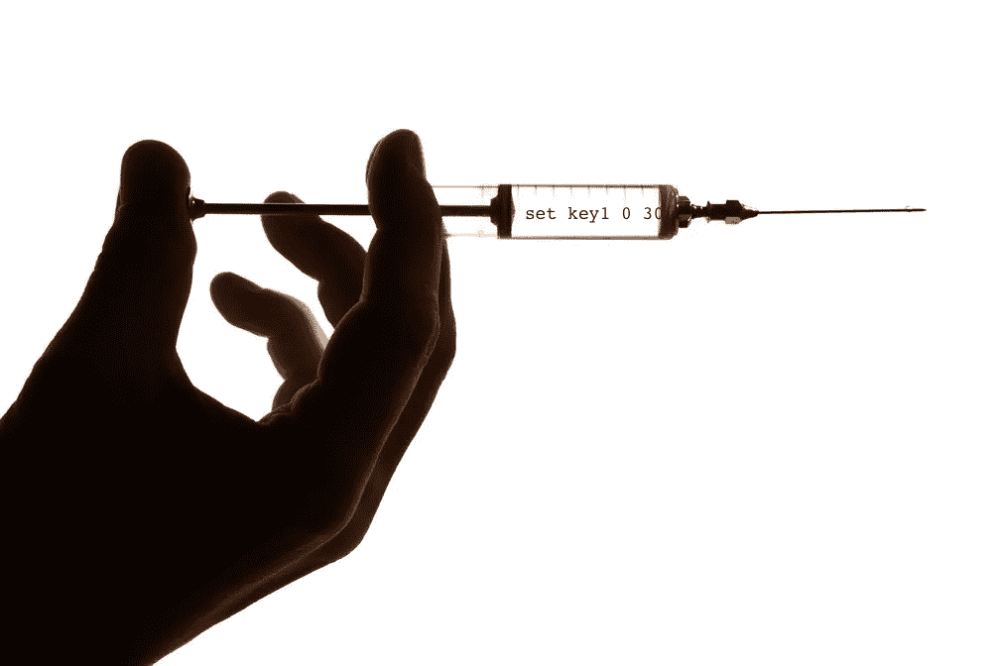

# 了解 Memcache 注入

> 原文：<https://infosecwriteups.com/understanding-memcache-injection-d4d8f57595f0?source=collection_archive---------6----------------------->



工程

在本文中，我将讨论 memcached 注入。Memcache 注入是一种针对 Memcache 分布式内存缓存系统的注入攻击。Memcache 是一个流行的系统，用于在分布式缓存中存储和检索数据，以提高 web 应用程序的速度。

在 Memcache 注入攻击中，攻击者可以向使用 Memcache 的 web 应用程序发送恶意数据，然后将这些数据存储在缓存中。恶意数据可以是 web 应用程序从缓存中检索数据时执行的命令或查询的形式。这使得攻击者能够未经授权访问敏感信息，修改或删除数据，或者执行其他恶意操作。

为了防止 Memcache 注入攻击，在将用户提供的输入存储到缓存中之前，对其进行适当的净化是非常重要的。这可以通过使用`mysql_real_escape_string`或`addslashes`等函数来转义在 Memcache 上下文中有特殊含义的特殊字符来实现。

使用准备好的语句和参数化的查询将数据从查询中分离出来，并使用强密钥哈希函数来确保密钥是唯一的并且不容易被攻击者猜到，这也是一个好主意。

此外，您应该使 Memcache 服务器和任何其他依赖项保持最新，以确保您免受已知漏洞的攻击。

总之，Memcache 注入是一种针对 Memcache 系统的注入攻击。为了防止这种类型的攻击，正确地净化用户提供的输入、使用准备好的语句和参数化的查询，以及保持 Memcache 服务器和依赖项最新是很重要的。

下面是 PHP 中 Memcache 注入攻击的一个例子:

```
$key = $_POST['key'];
$value = $_POST['value'];

// The attacker can send a key that includes a command or query
// For example: "key; delete users; key"

$memcache = new Memcache();
$memcache->connect('localhost', 11211);
$memcache->set($key, $value);

// The malicious command or query will be stored in the cache and may be executed later
```

为了防止这种类型的攻击，您可以通过转义在 Memcache 上下文中有特殊含义的特殊字符来净化用户提供的输入。例如:

```
$safe_key = addslashes($_POST['key']);
$safe_value = addslashes($_POST['value']);

$memcache = new Memcache();
$memcache->connect('localhost', 11211);
$memcache->set($safe_key, $safe_value);
```

值得注意的是，从 PHP 7.4 开始，`mysql_real_escape_string`和`addslashes`都被弃用，不应再使用。相反，您应该使用准备好的语句和参数化的查询，它们更安全、更易于使用。预处理语句允许您将数据从查询中分离出来，数据库引擎会自动处理数据的正确转义。

要在 Memcache 中使用预处理语句和参数化查询，可以使用带有`MEMCACHE_COMPRESSED`标志的`memcache_set`函数。

例如:

```
$memcache = new Memcache();
$memcache->connect('localhost', 11211);

$stmt = $memcache->prepare("set key:? 0 600 9");
$stmt->bind_param("s", $key);
$stmt->send_long_data(0, $value);
$stmt->execute();
```

总之，正确清理用户提供的输入以防止 Memcache 注入攻击是很重要的。您可以使用预处理语句和参数化查询将数据从查询中分离出来，并确保数据被正确转义。


运河加

在这篇文章中，我谈到了 memcached 注射，在我的下一篇文章中再见，照顾好自己。

## 来自 Infosec 的报道:Infosec 每天都有很多内容，很难跟上。[加入我们的每周简讯](https://weekly.infosecwriteups.com/)以 5 篇文章、4 条线索、3 个视频、2 个 GitHub Repos 和工具以及 1 个工作提醒的形式免费获取所有最新的 Infosec 趋势！