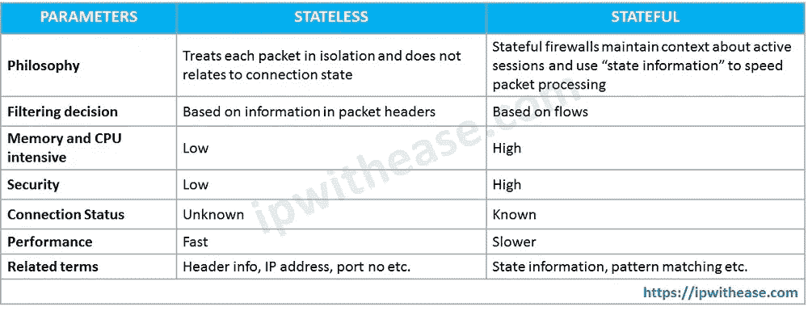

# 理解 NMAP 方法—第二部分

> 原文：<https://infosecwriteups.com/understanding-the-nmap-methodology-part-2-3d0442f1c482?source=collection_archive---------2----------------------->

从初级到高级理解 NMAP 方法论

## 描述:

在今天的文章中，我们将学习 Nmap 的一些高级网络映射技术。如果你没有读过第一部分，那么我建议你在阅读这篇文章之前浏览一遍。


在你开始之前，**你可以加入我们的 discord 服务器，与志同道合的人交流，分享你能与人分享的一切，帮助他们，让他们回答你的问题。**

[](https://discord.gg/VKJSmqDN5P) [## 加入赛博空间不和谐服务器！

### 查看 Discord 上的 CyberVerse 社区——与 106 名其他成员一起玩，享受免费语音和文本聊天。

不和谐. gg](https://discord.gg/VKJSmqDN5P) 

正如我们已经在第一部分看到了一些网络映射的基础知识，了解一些扫描和映射网络的高级和基本技术是值得的。

# 1.TCP 空扫描

顾名思义，TCP 空扫描在向特定端口或服务发送数据包时不设置任何标志。没有设置标志的 TCP 数据包在到达开放端口时不会触发任何响应。这表示端口是打开的。

```
nmap -sN <ip>-sN: TCP null scan flag
1) NULL TCP Packet -->
   (If no response, port is open/filtered)
2) NULL TCP Packet -->
   RST/ACK         <--
   (Port closed/filtered)
```

如果我们收到一个带有 RST(复位)/ACK(确认)的数据包，表明端口被关闭或过滤。

# 2.TCP 手指扫描

TCP FIN 扫描是与 TCP NULL 扫描相同类型的扫描。它们之间的主要区别是 TCP FIN 扫描。发送的数据包带有 FIN(完成)标志。现在明白了，它是如何工作的？

```
nmap -sF <ip>-sF: TCP FIN scan flag
```

如果我告诉你，“我很好。谢谢大家。”你也没问我"你好吗？"。很奇怪。同样的事情也发生在这里。FIN 标志表示通信完成。如果我们没有发起任何通信，那么我们如何能够完成它，这就是为什么如果端口是开放的，它会响应我们的数据包，并指示端口是开放的。

# 3.TCP 圣诞节扫描

TCP XMAS 扫描与以前的扫描相同。不是设置单个标志，而是在数据包中设置 FIN(完成)、PSH(推送)和 URG(紧急)标志。与 FIN 扫描一样，如果端口打开，它会响应我们的数据包。

```
nmap -sX <ip>-sX : TCP XMAS scan flag
```

> 当目标位于无状态防火墙后时，这三种类型的扫描都很有效。

无状态防火墙将检查传入的数据包是否设置了 SYN 标志，以检测连接尝试。使用与 SYN 数据包不匹配的标志组合有可能欺骗防火墙并到达防火墙后面的系统。



抄袭自[https://ipwithease.com/](https://ipwithease.com/)

# 4.TCP 确认扫描

在 TCP ACK 扫描中，它将仅设置 ACK 标志。不管端口的状态如何，目标都将使用 RST 进行响应。但是如果目标前面有防火墙，这种扫描会很有帮助。我们可以找出哪些端口没有被防火墙阻止。发现防火墙规则和配置非常有用。

```
nmap -sA <ip>-sA : Sets TCP ACK flagHow does it work?
1) ACK Packet  -->
   RST Packet  <--
```

# 5.TCP 窗口扫描

TCP 窗口扫描在某种程度上与 TCP 窗口扫描相同。在这种类型的扫描中，将检查 RST 数据包的窗口字段以获取有关端口的信息。在某些类型的系统上，它显示端口是打开的。

```
nmap -sW <ip># -sW : Sets TCP window flag
```

# 6.TCP 自定义扫描

在 TCP 自定义扫描中，我们可以自己设置标志。如果我们想用不同的旗帜组合来测试目标，这对我们很有帮助。但是，如果我们设置任何类型的标志组合，那么我们应该知道目标在不同条件下会如何响应。

```
nmap --scanflags RSTACK <ip># --scanflags : Set your custom flags.
```

这就是今天的文章。如果你觉得它有趣且有启发性，那就和你的朋友分享吧。谢谢你读到这里。让我知道你的问题或者你想在回复部分阅读的文章的主题。尽管如此，网络地图的另一部分还没有发布。关注我并订阅，直接在您的电子邮件中获取有趣的文章。

> 第三部分:[https://medium . com/@ sudo 0x 18/understanding-the-nmap-methodology-part-3-bb 377 b 7767 e 0](https://medium.com/@sudo0x18/understanding-the-nmap-methodology-part-3-bb377b7767e0)

你可以在这里的社交媒体上关注: [LinkedIn](https://www.linkedin.com/in/jay-vadhaiya-3b74531b1/) ， [Instagram](https://www.instagram.com/mr.jv_2407/) ， [Twitter](https://twitter.com/sudo0x18)

## 来自 Infosec 的报道:Infosec 每天都有很多内容，很难跟上。[加入我们的每周简讯](https://weekly.infosecwriteups.com/)以 5 篇文章、4 个线程、3 个视频、2 个 GitHub Repos 和工具以及 1 个工作提醒的形式免费获取所有最新的 Infosec 趋势！