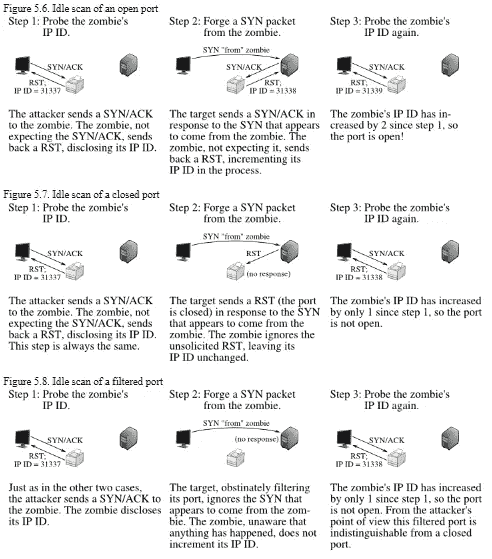

# 理解 NMAP 方法—第 3 部分

> 原文：<https://infosecwriteups.com/understanding-the-nmap-methodology-part-3-bb377b7767e0?source=collection_archive---------5----------------------->

从初级到高级理解 NMAP 方法论

## 描述:

在今天的文章中，我们将了解 Nmap 更高级的网络映射技术。如果你没有看过[第一部](/network-mapping-part-1-112116ce6555)和[第二部](/understanding-the-nmap-methodology-part-2-3d0442f1c482)，建议你通读一下这篇文章。这将是本系列 Nmap 的最后一部分。


来源:https://unsplash.com/

在您开始之前，**您可以加入我们的 discord 服务器，与志同道合的人交流，分享您可以与他人分享的一切，以帮助他们，并让人们回答您的问题。**

[](https://discord.gg/VKJSmqDN5P) [## 加入赛博空间不和谐服务器！

### 查看 Discord 上的 CyberVerse 社区——与 106 名其他成员一起玩，享受免费语音和文本聊天。

不和谐. gg](https://discord.gg/VKJSmqDN5P) 

正如我们已经在第一部分和第二部分看到了一些关于网络映射的基础知识和高级知识，了解一些更高级的技术来扫描和映射网络是值得的。

# 1.诱饵扫描

当您想要测试您的 IDS 和 IPS 设备来扫描您的扫描流量时，诱饵扫描非常重要。使用此功能可以避免被 Nmap 检测到。你可能不想被抓到执行网络扫描。在诱饵扫描中，我们提供一些诱饵来扫描网络。因此，他们的 IDS 可能会报告来自唯一 IP 地址的 5-10 个端口扫描，但他们不会知道哪个 IP 正在扫描他们，哪个是无辜的诱饵。

```
nmap -D <ip>
-D : Decoys
```

虽然可以通过路由器路径跟踪、响应丢弃和其他主动机制来挫败这种攻击，但这通常是隐藏 IP 地址的有效技术。

# 2.僵尸/空闲扫描

在僵尸扫描中，我们不需要向网络发送任何单个数据包来扫描 IP 地址。这种技术比目前讨论的其他技术更复杂。确定 TCP 端口是否打开的一种方法是向端口发送一个 SYN(同步)数据包。如果端口打开，目标机器将以 SYN/ACK 数据包响应，如果端口关闭，则以 RST(重置)响应。这是之前在[第 1 部分](/network-mapping-part-1-112116ce6555)中讨论的 SYN 扫描的基础。

```
nmap -sI <zombie-machine-ip> <ip>-sI : Zombie machine IP address
```

收到未经请求的 SYN/ACK 数据包的机器将会用 RST 进行响应。未经请求的 RST 将被忽略。互联网上的每个 IP 数据包都有一个片段标识号(IP ID)。由于许多操作系统对于发送的每个数据包都会增加这个数字，因此探测 IPID 可以告诉攻击者自上次探测以来已经发送了多少个数据包。结合这些特征使得在伪造身份的同时扫描目标网络成为可能，这样看起来就像是无辜的僵尸机器进行了扫描。



来源:https://nmap.org/book/idlescan.html

# 3.有关 Nmap 标志的更多信息

Nmap 提供了许多其他选项，在扫描网络或机器时非常有用。让我们一个一个地看，以便对它们有一个清楚的了解。

## a.服务版本检测

此选项启用 Nmap 上的服务版本检测。使用该选项，可以发现哪个开放端口运行在哪个服务版本上。为了检测服务版本，Nmap 需要像 TCP 连接扫描一样完全连接到机器。

```
nmap -sV <ip>-sV : Service version detection
```

## b.操作系统版本检测和冗长扫描

使用 Nmap 的这些选项，可以找到目标的操作系统版本，并以详细的方式给出输出。

```
nmap -O -v <ip>-O : OS version detection
-v : Verbose output (You can increase v up to 3 time to get more verbose output eg. -vv or -vvv)
```

## c.侵略性扫描

使用此选项，您可以进行服务版本检测+操作系统版本检测+扫描+跟踪路由等..一起。

```
nmap -A <ip>-A : Aggressive scan
```

## d.Nmap 脚本引擎

默认情况下，Nmap 提供对自动化脚本的支持，这些脚本对于枚举和获取目标系统上的已知漏洞信息非常有用。有这么多的默认脚本支持，你可以访问 nmap 的官方手册了解更多关于它的[这里](https://nmap.org/book/man-nse.html)。

```
nmap ---script <ip>-script : Default script run
```

使用— script 命令，您可以通过 Nmap 启用默认脚本执行。

# 4.扫描时间

扫描时间也是扫描的一个重要部分，可以被安全机制避免。默认情况下，Nmap 中有 6 种类型的扫描计时可用。

*   -T0:偏执(最慢)
*   -T1:鬼鬼祟祟
*   -T2:礼貌
*   -T3:正常
*   -T4:咄咄逼人
*   -T5:疯狂

-T0 每分钟扫描一次端口。这是一种非常慢的方法，但是扫描检测是非常不可能的。要避免 IDS 检测，请使用-T0 或-T1。如果在扫描时没有指定任何其他值，则默认值为-T3。其中-T1 更多地用于实际战斗中，在这些战斗中，隐身更为重要。

# 5.更多可定制选项

或者，您可以选择使用“最小速率<num>和“最大速率<num>”来控制数据包速率</num></num>

例如:- ` —最小速率 10 '和`—最大速率 10 '确保每秒发送的数据包不超过 10 个。`—最小并行度<num>`确保并行执行的探测数量。</num>

## 主机超时

有时目标系统在那个时间没有响应，我们可以设置受害系统是否在特定时间没有响应，然后切换到下一点。

ex :- —主机超时 500 毫秒

## 扫描延迟

如果在目标系统中有 IDS/IPS 可用于检测连续请求，而我们想通过发送数据包→等待→发送数据包…绕过它。

ex :- ` —扫描延迟 1s<ip>` 1 秒</ip>

这就是今天的文章。如果你觉得它有趣且有启发性，那就和你的朋友分享吧。谢谢你读到这里。让我知道你的问题或者你想在回复部分阅读的文章的主题。关注我并订阅，直接在您的电子邮件中获取有趣的文章。

你可以在这里的社交媒体上关注: [LinkedIn](https://www.linkedin.com/in/jay-vadhaiya-3b74531b1/) ， [Instagram](https://www.instagram.com/mr.jv_2407/) ， [Twitter](https://twitter.com/sudo0x18)

## 来自 Infosec 的报道:Infosec 每天都有很多内容，很难跟上。[加入我们的每周简讯](https://weekly.infosecwriteups.com/)以 5 篇文章、4 个线程、3 个视频、2 个 GitHub Repos 和工具以及 1 个工作提醒的形式免费获取所有最新的 Infosec 趋势！