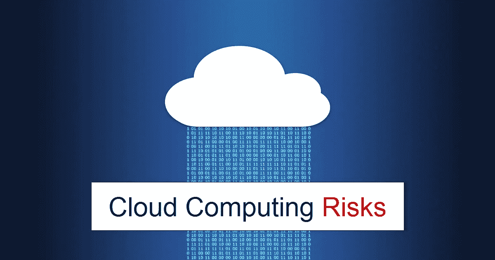

# 了解云计算的风险—第 1 部分

> 原文：<https://infosecwriteups.com/understanding-the-risks-of-cloud-computing-pt-1-d21804df4db8?source=collection_archive---------0----------------------->

在我们之前的文章中，我们已经了解了云计算的基础知识、架构、部署模型和服务模型。基于我们的需求来决定和实现模型和服务看起来很容易，但是理解与之相关的风险也同样重要。

根据 NIST 800–145，云计算有 3 种服务模式和 4 种部署模式。每一个都有一定的相关风险，需要进行分析、审查、评估和补救。让我们更详细地挖掘一下...

**云服务模式的风险**:

*   **基础设施即服务**:

在选择 IAAS 之前，我们需要考虑和补救某些风险。以下是我们需要注意的一些风险。

1.  数据中心的物理安全在数据安全中起着重要的作用。应全天候部署训练有素的安全人员，并要求提供受监控的背景资料。
2.  DC 系统由不同地理位置的外部供应商维护，存在自然灾害的安全风险。应该建立更好的灾难恢复管理
3.  DC 维护多个客户的数据，他们的风险也各不相同。因此，关键数据总是容易受到勒索软件、后门、DDOS 攻击等威胁。
4.  应定期审计和审查供应商与 DC 供应商的关系。

*   **平台即服务**:

使用 PAAS 服务模型为业务需求部署不同的平台并管理它们存在一定的风险。

以下是我们需要注意的一些风险:

1.  部署的平台和底层基础设施应在操作上兼容，并应定期更新，以避免可用性问题或应用程序故障
2.  在这种模式下，应用程序线程风险略高，因为平台和操作系统由不同的人管理。
3.  共享基础架构服务提供商的数据泄露风险很高，因为底层虚拟化按照服务模型将资源共享给多个平台

*   **软件即服务**:

SAAS 的使用每天都在增加，与之相关的风险也在增加。

以下是我们需要注意的一些风险:

1.  SAAS 部署面临应用程序中托管的数据格式的风险。应用程序的移动对客户来说是一种风险，因为它可能会导致应用程序崩溃。
2.  某些应用程序拥有用于在云应用程序中托管数据和应用程序处理的专有设置/格式(供应商锁定)。
3.  虚拟化风险将存在于 SAAS 模式中，因为资源由多个平台、具有相同底层操作系统和基础架构的应用程序共享
4.  在 SAAS 模型中，Web 应用程序很有可能受到攻击，因为应用程序暴露于多种攻击媒介，如注入、身份验证失败等

在这些模型中，我们知道其中存在虚拟化风险。让我们在第 2 部分详细了解一下，以及部署模型。

请随时从以下链接了解虚拟化和云计算，了解更多信息。

感谢您的阅读，如果您有任何问题需要讨论，请随时点赞、分享和评论，并关注# adithyainfosec 以获取更多内容😊😊

 [## 回归基础:云计算

### 新时代的应用程序如何受益

adithyathatipalli.medium.com](https://adithyathatipalli.medium.com/what-is-cloud-computing-5f392947de90)