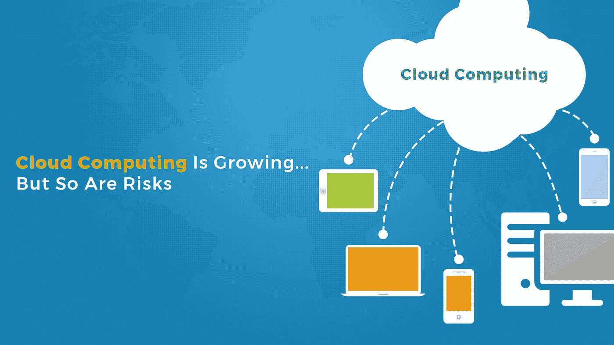

# 了解云计算的风险—第二部分

> 原文：<https://infosecwriteups.com/understanding-the-risks-of-cloud-computing-pt-2-67a3db75fa34?source=collection_archive---------3----------------------->

在我们之前的文章中，我们已经讨论了云服务模型所具有的风险。作为继续，让我们了解云部署模型背后的风险以及作为设计云架构一部分的其他风险。

我们在服务模型中观察到的一个常见风险与虚拟化带来的风险有关。我在之前的[文章](https://adithyathatipalli.medium.com/basics-of-virtualization-908843b137f2)中已经介绍了虚拟化的基础知识。

虚拟化风险:

1.  第 1 类虚拟机管理程序有丢失来宾操作系统的风险，这可能会导致应用程序/平台的可用性问题。
2.  类型 2 虚拟机管理程序具有丢失主机操作系统的风险，这导致提供虚拟化兼容性的基础操作系统的可用性问题。
3.  虚拟化环境中的任何错误配置都可能导致信息泄露

云部署模式和风险:

下面是不同类型的云部署模型。

1.  公共
2.  私人的
3.  社区
4.  混合物

让我们了解每种部署模型的风险发生情况。

1.  公共云:

公共云由大量中小型个人或组织共享，以利用成本支出的优势。但是使用公共云也有一些风险。以下是我们需要注意的一些风险:

*   供应商锁定风险是指客户由于所有权、技术问题、基础设施兼容性问题、缺乏可移植性而无法从云中转移数据
*   供应商锁定风险是指当共享资源涉及任何诉讼时，客户将自己锁定在环境中。
*   使用公共云也有很大的数据泄漏、加密方法、共享硬件问题的风险。

2.私有云:

个人/组织选择私有云是因为他们需要完全控制托管的关键数据。尽管这是一个私有云，但是这种模式也存在一些风险。以下是我们需要注意的一些相关风险:

*   社会工程学的艺术可以应用于维护 DC 的人，也可以应用于任何类型的网络钓鱼、恶意软件攻击等潜在风险。
*   C2C、DDOS 攻击等外部攻击会中断云服务，使应用不可用。
*   自然灾害会给应用程序可用性和服务中断带来风险。

3.社区云:

这个模型是由具有不同需求的多个个人/组织共享的。以下是需要注意的一些风险:

*   社区云拥有分散的管理，这导致了由于与其他用户一起成为云的一部分而成为目标的风险。
*   由于不同的云客户，共享管理和访问控制具有可配置性和兼容性。
*   由于多个组织托管不同类型的数据，存在配置管理风险。

风险评估和补救在数据安全和隐私方面发挥着重要作用，这是标准所不能包含和遵循的。

在为云基础架构选择任何模式和服务之前，风险分析也应包括在流程中，以获得更安全的环境。

感谢您阅读本文，请随时联系我提供您的反馈。你可以在下面的平台联系我。