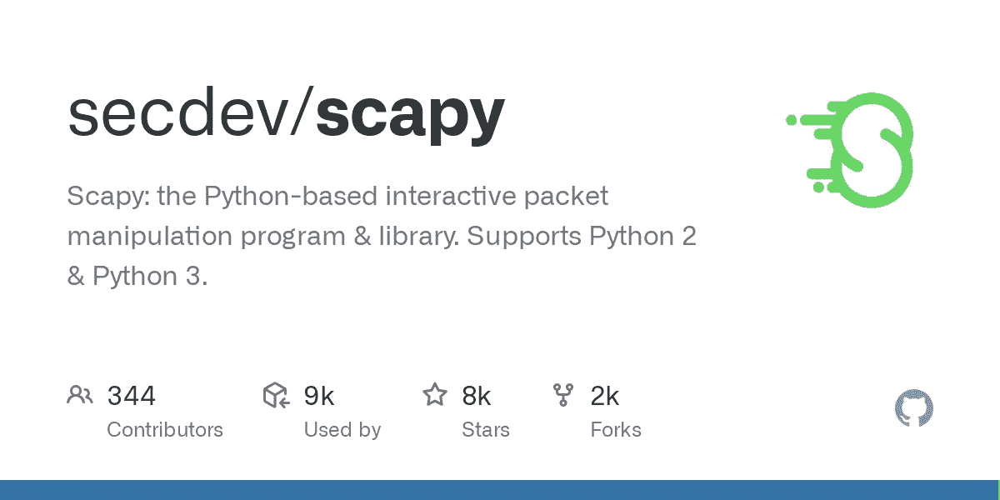

# 理解 Scapy 模块:它在网络安全中的应用

> 原文：<https://infosecwriteups.com/understanding-the-scapy-module-its-use-in-cyber-security-434ff8b38dbf?source=collection_archive---------1----------------------->



在本文中，我将讨论 Scapy 模块。模块是一个强大的 Python 库，用于处理网络数据包。它允许您制作和发送自定义数据包，捕获和分析网络流量，并执行许多其他网络相关的任务。`scapy`是一款多功能工具，可用于网络扫描、网络发现、数据包处理和网络攻击等任务。它被网络管理员和安全专业人员广泛使用。

`scapy`模块可以在网络安全领域以多种方式使用。这里有几个例子:

1.  **网络扫描:** `scapy`可用于扫描网络漏洞或收集网络上主机的信息。这些信息可用于识别潜在的安全风险并采取适当的措施。
2.  **数据包分析:** `scapy`可用于实时捕获和分析网络流量。这对于检测网络上的恶意流量或异常行为非常有用。
3.  **网络取证:** `scapy`可用于分析已经捕获并保存到文件中的网络数据包。这对于调查网络安全事件和识别攻击来源非常有用。
4.  **渗透测试:** `scapy`可用于执行各种类型的攻击，如拒绝服务(DoS)攻击或中间人(MITM)攻击。这对于测试网络的安全性和识别需要解决的漏洞非常有用。

总的来说，`scapy`模块对于任何在网络安全领域工作的人来说都是一个有价值的工具，因为它提供了处理网络数据包的广泛功能。

以下是如何使用`scapy`模块的几个例子:

1.  **网络扫描:**您可以使用`scapy`扫描网络中的主机，并收集有关它们的信息，例如它们的 IP 地址、MAC 地址和主机名。

```
from scapy.all import *

# Set the network range to scan
network = "192.168.1.0/24"

# Scan the network and print the results
ans, unans = srp(Ether(dst="ff:ff:ff:ff:ff:ff")/ARP(pdst=network), timeout=2, verbose=0)
for snd, rcv in ans:
    print(rcv.sprintf(r"%Ether.src% - %ARP.psrc%"))
```

2.**数据包捕获和分析:**您可以使用`scapy`来实时捕获和分析网络流量。这对于排除网络故障或检测网络流量异常非常有用。

```
from scapy.all import *

# Capture packets and print their source and destination IP addresses
def packet_capture(pkt):
    if pkt.haslayer(IP):
        print(pkt[IP].src, "->", pkt[IP].dst)

# Sniff packets on the network and apply the packet_capture function to each packet
sniff(prn=packet_capture, filter="ip", store=0)
```

3.**网络攻击:**您可以使用`scapy`来执行网络攻击，例如拒绝服务(DoS)攻击。但是，请注意，执行此类攻击是非法的，可能会产生严重后果。此示例仅用于教育目的。

```
from scapy.all import *

# Set the target IP and port
target_ip = "192.168.1.100"
target_port = 80

# Craft and send a SYN packet to the target
pkt = IP(dst=target_ip)/TCP(dport=target_port, flags="S")
send(pkt, verbose=0)
```

这些只是您可以用`scapy`模块做什么的几个例子。要了解更多，你可以在线查看`scapy`文档和例子。


门饰

在本文中，我一直在谈论 Scapy 模块。保重，在我的下一篇文章中再见。

## 来自 Infosec 的报道:Infosec 每天都有很多内容，很难跟上。[加入我们的每周简讯](https://weekly.infosecwriteups.com/)以 5 篇文章、4 个线程、3 个视频、2 个 GitHub Repos 和工具以及 1 个工作提醒的形式免费获取所有最新的 Infosec 趋势！