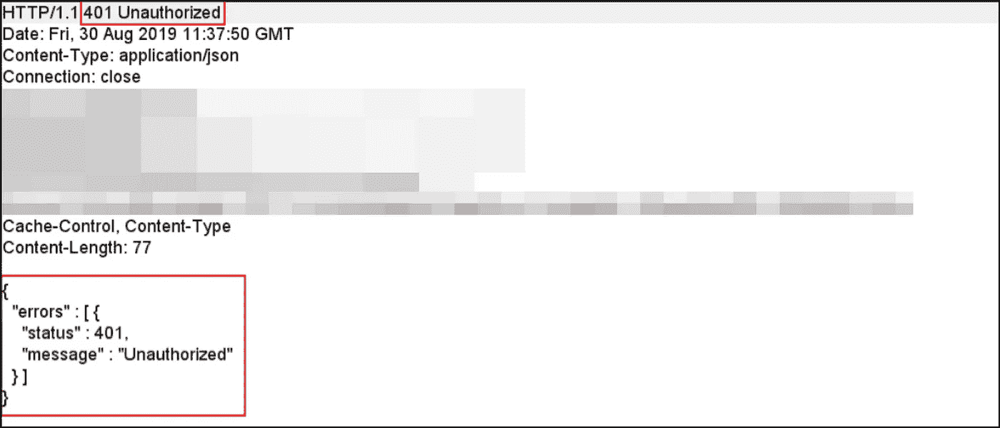
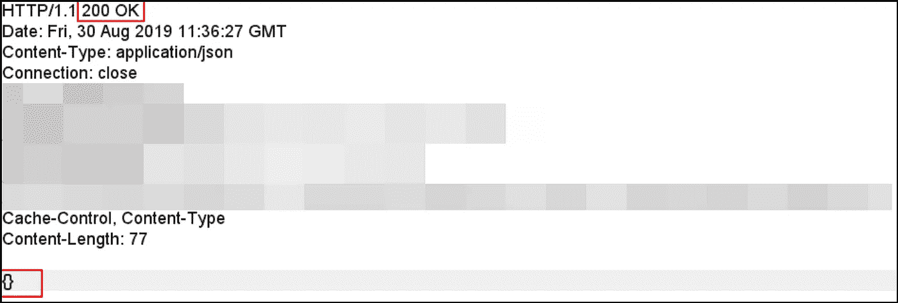

# 取消隐藏

> 原文：<https://infosecwriteups.com/unhiding-the-hidden-2ef44192c10b?source=collection_archive---------1----------------------->

## 第一次虫子奖励体验——530 美元

本博客旨在帮助开发人员了解攻击者如何利用安全错误配置来获得对受限功能的未授权访问。一个非常简单的弱点(如果我现在想起来的话)，但我的大部分时间和精力都花在了寻找正确的兴趣点上。作为一名未经认证的用户，我可以访问只有内部管理员才能使用的某些功能，其中包括创建具有管理权限的新用户、修改系统条目和配置、查看和更新日志、重新生成访问令牌等。

**第一步:侦察**

假设我的目标是“*domain.com*”。一个开源的子目录枚举工具给我指出了一个有趣的子域，比如“*iambroot.domain.com*”。我在子域上运行了一个快速网络扫描来检查有趣的开放端口——只有端口 443 和 80 是开放的。

**第二步:黑盒**

端口 443 上的子域“*iambroot.domain.com*”加载了一个没有其他表单域功能的基本登录页面——没有注册过程、密码重置或联系表单。只是一个简单的旧登录页面，允许用户使用有效的用户名/密码组合登录，如果用户在登录过程中遇到问题，可以通过消息联系管理员。我尝试了一些基本的身份验证绕过测试案例，并决定转移到另一个目标，假设我到达了一个死胡同。但在此之前，我花了一些时间检查了发送到/来自子域的流量(打嗝日志)。

在浏览 Burp 日志时，一个应用程序响应引起了我的注意！

**步骤 3:对管理员模块的未授权访问**

当“*iambroot.domain.com*”域名被访问时，从服务器发回的一个响应显示了几个非常“可疑”的参数；类似这样的。

> " admin":"false "，" allowDeploy":"false "，" allowManage":"false "

我很快刷新了站点，在 Burp 中捕获了相同的请求，并在响应中修改了上述参数的值，如下所示。

> " admin":"true "，" allowDeploy":"true "，" allowManage":"true "

嘣！

一个“隐藏的”管理员模块出现在屏幕上。该模块开放了 25 个以上的管理员功能，但问题是每当访问 25 个以上的功能时，该网站都会将我重定向回登录页面。

**步骤 4:未经授权访问管理员功能**

其中一个管理员功能是创建一个新用户，但当我尝试访问该功能时，应用程序将我重定向到登录页面。由于响应修改工作过一次，我认为它会再次工作，因此拦截了相同的请求来检查服务器发送的响应。

请求的响应看起来像下面的截图。当访问任何管理员功能时，应用服务器发送回“401 未授权”状态代码，从而触发对登录页面的请求。

我截取了相同的请求，并对响应做了一些小的修改，如下面的截图所示。嘣！

我现在可以查看管理员功能，而无需应用程序将我重定向到登录页面。

使用同样的方法，我可以访问管理员模块中所有可用的功能。但是不出所料，当我尝试提交表单时，应用程序再次将我重定向到登录页面。通过修改响应，我只能绕过客户端验证；应用程序的服务器端验证阻止我成功创建新用户。

所以这是个死胡同。我所能做的就是对管理员模块和其中的单个功能进行只读访问。我不能在应用程序中提交表单或执行未经授权的操作。

影响，你可能会问。没什么！但是积极的一面是，我可以在服务器验证请求之前查看表单提交请求，从而发回一条“401 未授权”的错误消息。

**步骤 5:跨站点请求伪造(CSRF)**

我在应用程序请求中观察到的另一件事是缺少请求验证令牌，这可能导致 CSRF 攻击。现在我知道了管理员表单提交请求的样子，我制作了一个示例 CSRF 有效负载，当“真正的”管理员被诱骗执行有效负载时，它将创建一个新用户。

**第六步:责任披露**

作为漏洞披露计划的一部分，我通过电子邮件向公司的安全团队发送了我的观察结果。他们通过以下方式解决问题—

1.  对所有请求应用服务器端验证，从而防止未经身份验证的用户查看管理员模块及其功能。
2.  在请求头中添加请求验证令牌。
3.  移除对整个子域的公共访问，因为它看起来像“【iambroot.domain.com】T4”子域，仅供内部使用。

从字面上什么也没有，但登录页面，我可以访问管理员的功能，并与 CSRF 链，以显示一些损害。

如果你问我——检查日志。一直都是。检查。日志。

## 非常感谢博客上的反馈和见解。欢迎随时发表评论或在 [Twitter](https://twitter.com/prabhu_ved) 联系我。