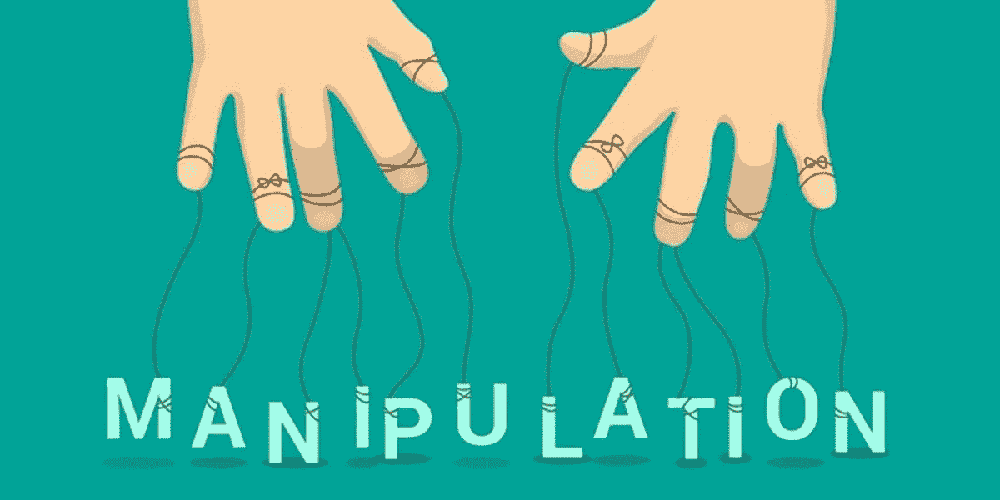
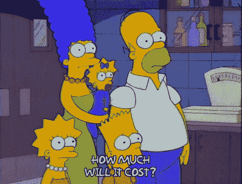
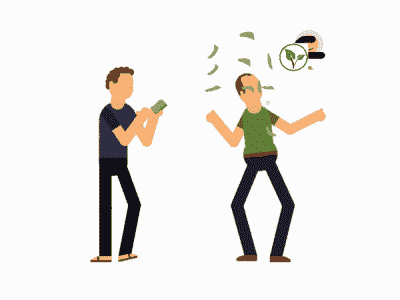

# 操纵价格的独特案例| BugBounty | VAPT

> 原文：<https://infosecwriteups.com/unique-case-for-price-manipulation-bugbounty-vapt-df57637769cd?source=collection_archive---------3----------------------->

价格操纵是价格操纵的一个测试案例。一般来说，渗透测试人员会从 rs 中更改产品(如鞋子、t 恤、机票等)的金额。XXXX(或$XXXX)对 Rs1(或$1)的价格篡改。有时，渗透测试人员会将货币格式从美元改为印度卢比或其他货币。

所以，我不会在这里谈论上述案例。我发现了一个操纵价格的独特案例。我不会在这里粘贴任何概念证明、请求和响应。如果你有疑问，请在推特上联系我，或者在 T2 的 Linkedin 上联系我。

我测试了一个电子商务网络应用程序。我尝试了所有操纵价格的案例，但没有成功，比如我试图将产品的原始金额值更改为 1，但它给了我错误，我试图将美元等货币格式更改为印度卢比，但没有成功。

然后，我拿着我的咖啡，享受它。突然，我有了一个想法，并尝试了那个应用程序。

一个产品有一些价格，它的 3 位数价值，如 999 美元。当请求来自 burp suite 时，我将它的值更改为$100。然后，请求被转发到支付网关，支付网关显示我必须支付 100 美元。但是没有成功，然后我用我的卡支付了 100 美元，得到了一张 OTP。然后我意识到这是一次成功的尝试。但我没有支付 100 美元，因为如果存在价格操纵漏洞，这就太多了。

现在，我再次尝试，但这一次，我把值 999 改为 001，然后支付网关显示 1 美元，我用我的卡支付，然后我得到了支付 1 美元的 OTP。

同样，我以 1 美元的价格购买了 4 位数美元的产品。怎么会？现在很容易了。

我将金额值从 9999 更改为 0001。

因此，场景是在服务器端进行验证，它验证金额的位数，而不是金额值。

如果你喜欢它，请鼓掌并分享它。

谢谢各位。霍普，你喜欢它。

你可以在[推特](https://www.twitter.com/sengarharshit1)、 [Linkedin](https://linkedin.com/in/sengarharshit1) 上关注我。