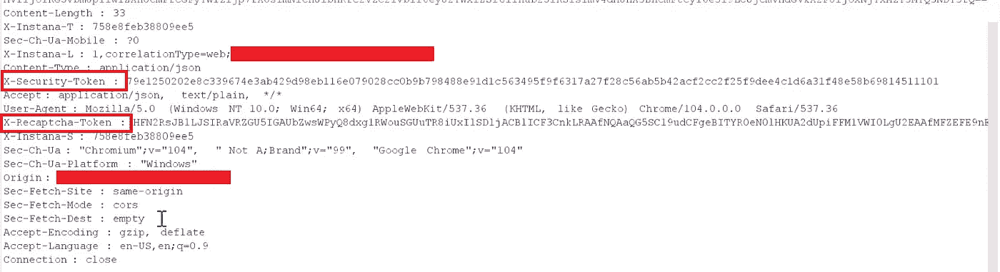
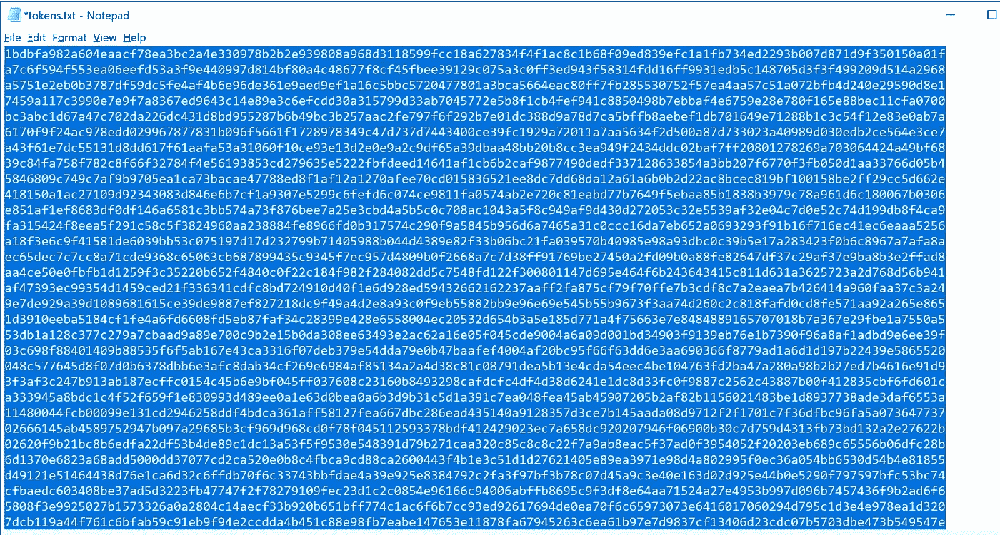
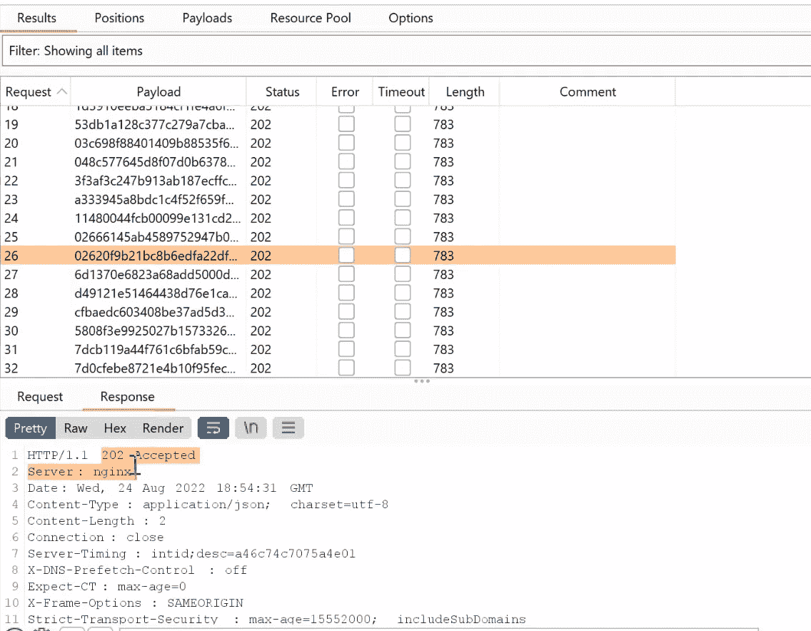

# 价值 1800 美元的独特限速旁路

> 原文：<https://infosecwriteups.com/unique-rate-limit-bypass-worth-1800-6e2947c7d972?source=collection_archive---------0----------------------->

大家好，

虽然这是我第一次写我的发现之一，绕过率限制，我被授予 1800 美元。保持简单明了，开始吧。

几个月以来，我一直在努力关注速率限制及其安全机制。我已经阅读了很多关于绕过速率限制的文章，并在我的清单中收集了所有的方法。

因此，有一天我得到了这个目标，它指出速率限制超出了范围，并注意到它们完全不受任何终端上任何类型的速率限制的影响。我决定尝试绕过它，即使它超出了范围，只是为了证明公司声明是错误的。

# **他们是如何实施限速安全机制的？**

在他们的任何端点上，有两件事负责防止速率限制攻击。

1.  x-Recaptcha-令牌头
2.  x-安全-令牌头

因此，这个 X-Recaptcha-Token 报头由**验证码令牌**组成，而 X-Security-Token 由一个长值组成，每次发出新的请求时，这两个参数的值都会改变。所以很可能，我们甚至不能发送相同的请求超过 1 次。因此，如果我删除“X-Recaptcha-Token”，它会显示一个错误“验证码令牌无效或未找到”。这就是他们如何实现强大的速率限制安全机制。

# **我是如何绕过它的？**

看了一些回复，发现有一个头“X-Disbaled-Recaptcha: 0”。我立即从请求中删除了前面的头，并添加了这个值为“1”的“X-Disabled-Recaptcha”头。在发送此请求时，没有得到“Recaptcha 令牌无效或未找到”的错误，而是显示了一个不同的错误，说明“安全令牌无效或已被使用”是的，你猜对了。我们能够绕过 recaptcha 令牌机制，但**安全令牌**仍然在阻止，我尝试了所有方法来绕过安全令牌检查，但都不起作用。所以我认为它并不脆弱，没有办法绕过这个机制。

几天后，我再次打开那个打嗝文件，开始观察所有的终点。令我惊讶是，我发现了一个负责生成“安全令牌”的端点，且没有仅针对该特定端点的速率限制机制。现在，安全令牌的正常行为应该是，一旦新令牌生成，旧令牌就应该立即过期，即使旧令牌未被使用。令我惊讶的是，我手动复制了 10 个安全令牌，并发送了标题为“X-Disabled-Recaptcha: 1”的请求。所有的请求都成功了。是啊！！就是这样。我们绕过了这个机制。

# 我是如何利用它的？

我创建了一个简单的脚本，使用之前找到的端点创建 1000 个唯一的安全令牌。

将此令牌导入入侵者。添加了标题“X-Disabled-Recaptcha: 0”并开始攻击。

我们在每个终点都绕过了它。

最后，我告诉他们，我能够在他们的所有端点上绕过他们的机制，使他们的大胆声明**错误**，他们奖励了我 1800 美元，即使这超出了范围。

就这样吧，伙计们，我一定会写下我的一些独特的发现。

分享吧伙计们，很快会分享一些惊人的东西。

# **跟我来:**

【https://www.linkedin.com/in/manavbankatwala/ 