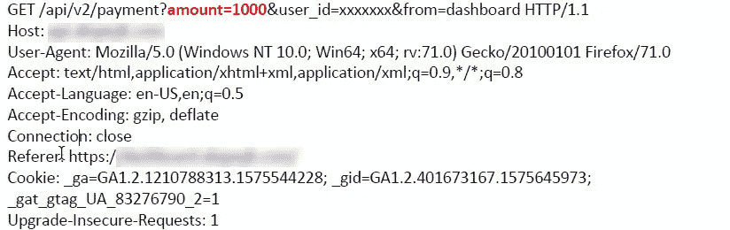
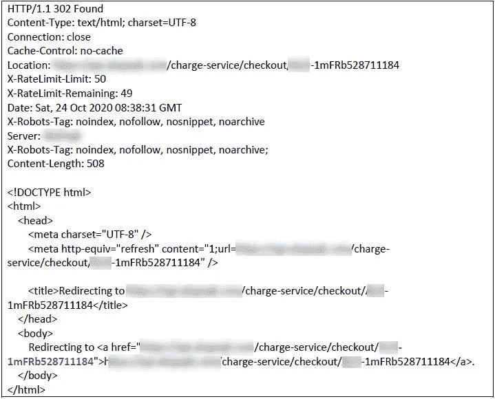
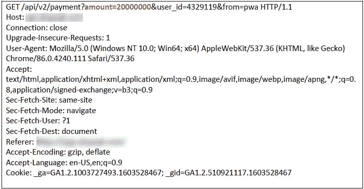
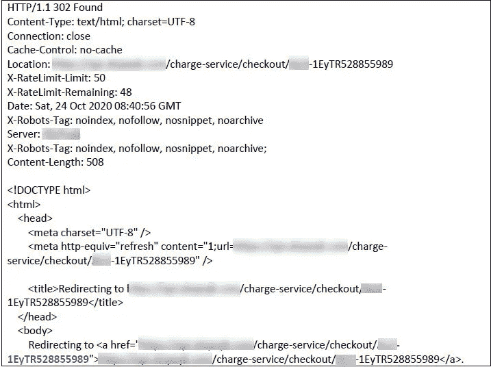
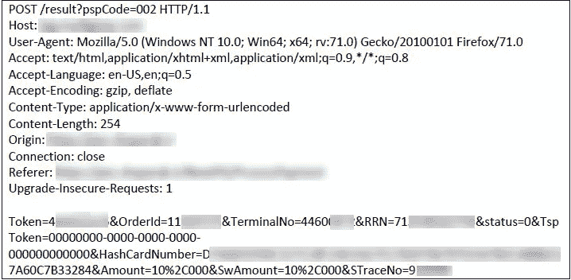
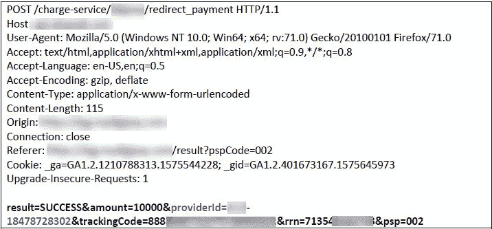

# 在线运输应用程序帐户中的无限余额

> 原文：<https://infosecwriteups.com/unlimited-balance-in-an-online-transportation-application-account-1dd042f678a9?source=collection_archive---------3----------------------->

我在一个著名的在线交通应用程序和它的 PWA 服务上冲浪。过了一会儿，我注意到支付网关模块中有一个严重的漏洞。让我来解释一下这个场景。

第一步，你应该输入你的手机号码，然后它会发送一个动态口令来验证你的手机。接下来，我试图增加我的帐户余额，我选择 10，000 的金额，然后单击支付按钮。第一个请求如下:

答案是:

我尝试更改 BurpSuite 中的金额，将其从 10，000 增加到 20，000，000。要求是:

回应是:

好的。我记住了第二次响应的" **1EyTR528855989"** 值，并继续第一次请求和 10，000 金额的支付流程。然后它重定向我到支付网关页面，我支付金额。要求是:

现在，请求返回到应用程序，以检查并确定支付的金额是为了增加我的余额。要求是:

真好。我将 providerId 参数值更改为 **1EyTR528855989。**该值是我在响应中将金额从 10，000 更改为 20，000，000 时获得的值。然后我将请求转发给服务器。非常好。10，000 英镑支付成功，我的帐户余额增加到 20，000，000 英镑。

**这个漏洞的原因是什么？**

增加帐户余额的业务逻辑是，用户被重定向到 IPG，其中包含支付的信息和金额，并执行交易。然后将它返回给应用程序，其中包含确认操作身份的信息，应用程序将从用户处接收到的操作身份发送给后台的 IPG，并检查操作的状态，最后将交易金额添加到用户帐户中。
当应用程序从支付网关收到交易状态时，支付金额、交易号、参考号、状态、支付时间等信息。都收到了。该应用基于支付网关接收的信息增加账户余额。在某些情况下，网站在交易中依赖用户返回的信息，如金额。在这种情况下，攻击者可以拦截请求并更改金额，然后将其转发到网站，最后金额被应用到他的帐户。
在某些情况下，应用程序存储交易 ID、金额等信息。以确定从支付网关返回到网站的交易的状态。当在数据库中创建该记录时，其状态未知，并被设置为初始。当交易从支付网关返回时，它会将其状态更改为失败或成功。
这个问题的安全问题是攻击者创建了两个请求。一个请求是一笔金额为 20，000，000 的交易，然后丢弃它。复制该记录的交易 ID。然后创建另一笔金额为 10，000 的交易，该交易被发送到 IPG 并被支付。当这个请求从 IPG 返回到应用程序时，这个请求的事务 ID 被被丢弃的请求的事务 ID 替换。

由于没有在交易的后台检查金额值，所以它被认为是成功的，并且攻击者可以通过支付 10，000 以 20，000，000 的金额向他的帐户收费。

**注意:该漏洞已被修补，本文仅供研究和学习之用。**