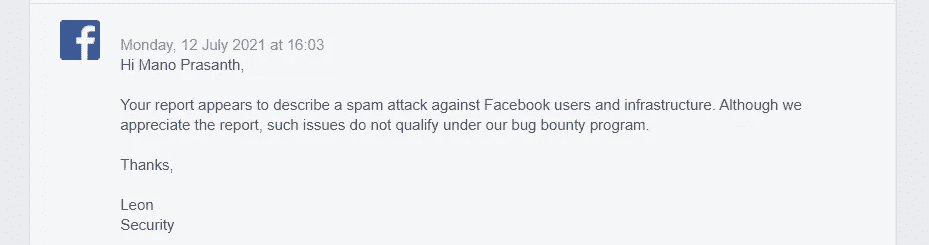

# Instagram(脸书)的无限报告用户导致滥用风险。

> 原文：<https://infosecwriteups.com/unlimited-report-user-in-instagram-facebook-leads-to-abuse-risk-efcca325aada?source=collection_archive---------1----------------------->

你好，我是马诺·普拉桑特，

亚历山大·沙托夫在 [Unsplash](https://unsplash.com?utm_source=medium&utm_medium=referral) 上拍摄的照片

这篇文章是关于我在 Instagram 上发现的一个简单的限速错误。

这是我在 Instagram 上的第一个 bug 报告。作为一个 noob bug 猎人，我尝试了各种方法在脸书找到一个 bug。首先，我从身份验证开始，并进一步发展到其他类型。但是据我所知，似乎一切都是安全的(无论如何没有什么是完全安全的)。

在这份报告之前，我在 Bugcrowd 中搜索，但不幸的是，我以前的报告是重复的。然后我开始猎取私人程序，得到了一些有效的 bug。然后想到在 GAFAM 中寻找 bug，决定猎取脸书的收购。

这不是一个严重的错误，而是一个低级错误，有可能在 Instagram Lol 中除掉你的敌人。

这个漏洞允许 Instagram 上的任何人无限次数地报告用户(滥用风险)。如果你试图手动完成，你可能会感到沮丧或者浪费一天的时间。一般来说，大多数科技巨头通过在他们的帖子请求中限制速率或使用 WAF、Captcha 等来限制这些类型的错误。但 Instagram 还没有在报告用户功能中实施任何速率限制。为了开始攻击，我使用 Burpsuite 来操纵请求-响应循环。在提交报告之前，我在 Instagram 中拦截了那个特定的帖子请求，并将其转发给入侵者，以使其更容易。然后，我选择了有效载荷的位置。选择有效负载的位置不会对响应产生任何影响。我在 Header - Accept-Language 中选择了一个位置:en-US，en；q=0。$5$.然后我用 100 个有效载荷开始攻击。我得到了 HTTP 200 OK 状态代码&所有提交的报告都像“文本”一样在响应中:“谢谢你，我们收到了你的报告”。一般来说，在四到五次 POST 请求后，您会得到超过速率限制的响应。但是……

下面是我提交给脸书的攻击的影响。

影响:
用户账户报表功能似乎没有速率限制，导致报表提交量很大。它会堆积在您的报告中，给使用报告功能带来不便。你可能不知道报告是否真实，除非你逐个检查，这可能会导致垃圾邮件与此功能。

我知道与速率限制相关的 bug 通常没有资格获得奖金。但是我试着用四个 Instagram 模拟账户举报我的密友，每个账户有 100 份报告，一切都很完美。我没有完成这些攻击，并立即终止了攻击，向脸书报告了这个问题。因此，这肯定会引起脸书的注意。这里有两个机会。他们可以过滤来自相同帐户的报告，也可以不检查每份报告，只查看计数。如果后者是真的，那么有一些机会，你的帐户可能会被考虑删除。除非你是脸书公司管理这份报告的员工，否则你不会知道。脸书承认，他们不会调查每一份报告，但如果一个帐户达到足够多的报告，那么我们将检查一些报告，并采取行动。尽管脸书在删除用户之前有内部协议要处理，但这个漏洞可能允许任何人向 Instagram 用户和脸书的内部基础设施发送垃圾邮件。

来自脸书的致谢

虽然限速错误不会让我得到奖金，但这对垃圾邮件朋友来说很有趣。我曾经在 Glance 登录页面的错误配置的速率限制的帮助下，在 5 分钟内发送了 179 条邀请消息(比短信炸弹更好)。

感谢阅读:)

狩猎愉快！！

领英:[https://www.linkedin.com/in/mano-prasanth-m-908b061b8/](https://www.linkedin.com/in/mano-prasanth-m-908b061b8/)