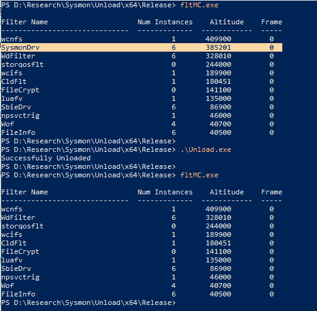
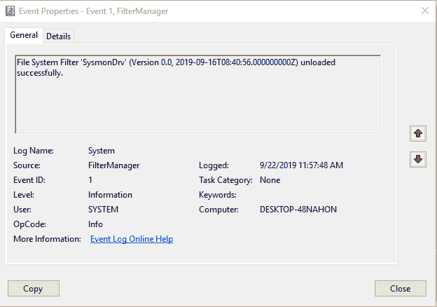

# 卸载 Sysmon 微筛选器驱动程序

> 原文：<https://infosecwriteups.com/unloading-the-sysmon-minifilter-driver-86f4541fa55a?source=collection_archive---------0----------------------->

二进制 fltMC.exe 用于管理微筛选器驱动程序。您可以使用这个二进制文件轻松地加载和卸载微过滤器。要卸载 Sysmon 驱动程序，您可以使用:

```
fltMC unload SysmonDrv
```

如果标记了此二进制文件，我们可以通过调用“FilterUnload”来卸载微筛选器驱动程序，它是 Win32 中“FltUnloadFilter”的等效项。它将调用微过滤器的“FilterUnloadCallback”(PFLT _ FILTER _ UNLOAD _ CALLBACK)例程。这与使用 fltMC 相同，FLT MC 是一个*非强制卸载*。
调用这个 API *需要 SeLoadDriverPrivilege* 。要获得此特权，需要管理权限。

这是我写的一个简单的 C 代码，用来调用‘filter unload’API。



请注意，当通过 FilterManager 卸载微筛选器驱动程序时，它将被记录在系统日志下。



参考资料:
[https://www . osr . com/nt-insider/2017-issue 2/introduction-standard-isolation-minifilters/](https://www.osr.com/nt-insider/2017-issue2/introduction-standard-isolation-minifilters/)

*关注* [*Infosec 报道*](https://medium.com/bugbountywriteup) *获取更多此类精彩报道。*

[](https://medium.com/bugbountywriteup) [## 信息安全报道

### 收集了世界上最好的黑客的文章，主题从 bug 奖金和 CTF 到 vulnhub…

medium.com](https://medium.com/bugbountywriteup)