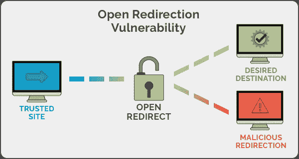

# 未经验证的重定向和转发

> 原文：<https://infosecwriteups.com/unvalidated-redirects-and-forwards-4cad5eb66b64?source=collection_archive---------3----------------------->

杰佛森·桑多斯在 [Unsplash](https://unsplash.com/@jefflssantos?utm_source=unsplash&utm_medium=referral&utm_content=creditCopyText) 上拍摄的照片

**简介**

未经验证的重定向和转发可能不再像 2013 年和 2017 年那样在 OWASP 十大最常见漏洞中占据一席之地，但它会损害您的声誉。为了知道它是什么以及它如何影响你的声誉，让我们来理解重定向和转发。您可能想了解 302 响应状态代码，它指的是临时重定向。

**什么是重定向和转发？**

[来源](https://i.stack.imgur.com/a3pCn.png)

为了这个论点，让我们考虑鲍勃，网站 bob.com 的管理员。他想暂时修复他的站点，但同时又不想让用户因为停机而遭受损失。他突然想到一个主意。他想把他的流量重定向到他的朋友爱丽丝的网站，名为**alice.com。**

因此，他所做的是，打开他的管理面板，并设置一个 302 重定向到**alice.com**的任何传入请求到 bob.com。

这将做的是，如果我，作为一个用户，在我的网络浏览器中输入**bob.com**，它将把我带到 bob.com，但鲍勃的服务器，而不是返回我的网页，将返回我一个 302 状态代码，和一个位置头**alice.com**。这将指示我的浏览器访问 alice.com。简而言之，这被称为重定向。

另一方面，forward 可以指两种情况。第一个是 bob 在主页上制作了一个到**/登录**页面的链接。当用户点击它时，他会被带到**bob.com/login**。在这种情况下，用户将被转到或带到同一网站的某个页面。在第二个场景中，鲍勃制作了一个指向[www.google.com](http://www.google.com/)的外部链接。当用户点击它时，他会被带到 google.com。

在第二个场景中，Bob 也可以根据自己的喜好使用 302 重定向。

差别很小，许多人甚至不认为重定向和转发有什么不同，而是经常互换使用。

什么是未验证的重定向和转发？

未验证的重定向和转发，也称为 URL 重定向，是一种 web 应用程序漏洞，当应用程序没有验证或验证它是否应该将用户重定向到提供的域时，这就像输入验证漏洞，其中网站信任网站提供的输入，并直接将用户重定向到提供的网站。与其他漏洞不同，这不会以任何方式影响您的网站。但是，它可以被黑客用来危害他的帐户，将恶意软件下载到他的计算机上，并用于网络钓鱼目的。

让我们考虑一下鲍勃的网站**bob.com**。它有一个重定向参数，将用户重定向/转发到用户成功登录后提供的 URL。

https://www.bob.com/login?redirect=bob.com/dashboard

正如您所知，在用户成功登录后，他将被带到 bob.com/dashboard.

从开发人员的角度来看，这是安全的，并且应该如预期的那样工作。但是克里斯是一名安全研究员。他知道重定向参数是易受攻击的。所以，他所做的就是试图把 bob.com/dashboard 改成 chiristhehaceker.com 的 T4。结果是

**他登录后，发现自己被重定向到了**christthehacker.com。****

****他们是如何被剥削的？****

****

**[来源](https://1tskcg39n5iu1jl9xp2ze2ma-wpengine.netdna-ssl.com/wp-content/uploads/2019/03/open-redirection-vulnerability.png)**

**从攻击者的角度来看，他中了大奖。他可以用 URL 重定向实现不可想象的事情。**

**他不再需要引诱你点击 christhehacker.com。他可以利用你对 bob.com 的信任，通过简单的社会工程技术，你将被重定向到他的恶意网站。由于受信任的网站会将您重定向到 christhehacker.com，因此您很容易相信第二个网站是受信任的，并且您可能会提供敏感信息，如信用卡、登录凭据等。**

**他可以把网站做得和 Bob 的差不多，卖给你假新闻，下载恶意软件，甚至泄露敏感信息。**

**不久前看起来无害的 URL 重定向可能会被黑客利用来实现难以想象的事情。**

**URL 重定向也可用于绕过 CSP。什么是 CSP？CSP 代表内容安全策略，可以认为是一种帮助浏览器决定从哪个源获取资源并执行它们的策略。这是防止 XSS 袭击的好方法。如果 CSP 中列出的某个域存在 URL 重定向问题，攻击者就可以利用它来绕过 CSP。**

**OAuth 中的开放重定向同样可以被利用，但在这里它会导致帐户被接管。你可以在这里查看我们在 OAuth 上的博客(提供链接)。**

****补救****

**既然我们已经讨论了一些利用方法、URL 重定向及其影响，那么让我们来看看可以采取哪些步骤或措施来防止它们。**

1.  **如果可能，尽量避免转发和重定向。它可能看起来像功能，但对黑客来说却充满了机会。**
2.  **如果出于某种原因，你可以放开它，白名单的网址，网站可以重定向。**
3.  **您可以存储映射到每个 URL 并存储在数据库中的令牌 ID。如果令牌 ID 与 URL 不匹配，您可以停止 URL 重定向。**
4.  **如果 URL 列表非常大，然后将它们存储在数据库中，然后一次检查一个会增加延迟，那么你可以做的就是根本不存储它们。相反，您可以做的是，每当用户被重定向到与您的域名不匹配的域时，向他显示一条消息。**

## **来自 Infosec 的报道:Infosec 每天都有很多内容，很难跟上。[加入我们的每周简讯](https://weekly.infosecwriteups.com/)以 5 篇文章、4 个线程、3 个视频、2 个 GitHub Repos 和工具以及 1 个工作提醒的形式免费获取所有最新的 Infosec 趋势！**