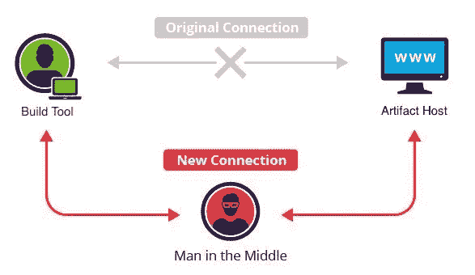

# 更新:想接管 Java 生态系统？你需要的只是一个 MITM！

> 原文：<https://infosecwriteups.com/update-want-to-take-over-the-java-ecosystem-all-you-need-is-a-mitm-d069d253fe23?source=collection_archive---------0----------------------->

## 2020 年 1 月 13 日至 15 日，将打破行业 Java 构建基础设施的 21%。自从我的第一篇文章披露这个行业范围的漏洞以来，六个月过去了，我们现在在哪里，未来会怎样？

2019 年 6 月 10 日，我在一篇题为“[想接管 Java 生态系统吗？”的文章中公开披露了一个影响 Java 生态系统的行业漏洞？你需要的只是一个 MITM！在那篇文章中，我详细介绍了有多少最流行的基于 JVM 的库通过 HTTP 而不是 HTTPS 的构建工具来解决它们的依赖关系。](https://medium.com/bugbountywriteup/want-to-take-over-the-java-ecosystem-all-you-need-is-a-mitm-1fc329d898fb?source=friends_link&sk=3c99970c55a899ad9ef41f126efcde0e)

作为这项研究的一部分，我联系了 Java 生态系统中几个最常用的工件服务器的安全团队，在 2020 年 1 月 15 日，许多工件服务器将放弃对 HTTP 的支持，只支持 HTTPS。重要的是要记住，截至 2019 年 6 月，25%的 Maven Central 下载仍在使用 HTTP。截至 2019 年 12 月 12 日，21%的 Sonatype Maven Central 下载仍在使用 HTTP。

> 21%的 Sonatype Maven Central 下载仍在使用 HTTP

需要强调的是，这种破坏将迫使 Java 生态系统供应链的安全性发生非常健康和重要的转变。

# 工件服务器主机公告

下面列出了我联系过的工件服务器以及它们当前的反应。

## Maven Central — Sonatype

Maven Central 将于 2020 年 1 月 15 日停止对 HTTP 的支持。
你可以在这里阅读他们的[完整公告。](https://central.sonatype.org/articles/2019/Apr/30/http-access-to-repo1mavenorg-and-repomavenapacheorg-is-being-deprecated/)

## JCenter — JFrog

JCenter 将于 2020 年 1 月 13 日停止对 HTTP 的支持。
你可以在这里阅读他们的[完整公告。](https://jfrog.com/blog/secure-jcenter-with-https/)

## 纸盒— JFrog

JFrog 通知我，他们不会让 dl.bintray.com 的 HTTP 退役，因为它用于解析其他生态系统的工件。我恳求他们重新考虑这个决定，但是现在他们不愿意做出这个重大的改变。

## Gradle 插件门户— Gradle

Gradle 插件门户将于 2020 年 1 月 15 日停止对 HTTP 的支持。
你可以在这里阅读他们的[完整公告。](https://blog.gradle.org/decommissioning-http)

## 弹簧—枢轴

Spring 工件库将在 2020 年 1 月 15 日停止对 HTTP 的支持。
你可以在这里阅读他们的[完整公告。](https://spring.io/blog/2019/09/16/goodbye-http-repo-spring-use-https)

## Eclipse——Eclipse 基金会

虽然我已经联系了 Eclipse 基金会[这里](https://bugs.eclipse.org/bugs/show_bug.cgi?id=550999)，他们最初是接受的，但是目前他们还没有做出承诺。

## JetBrains

JetBrains 不愿意在这一点上为他们用来托管工件的存储库承诺一个时间表。

## 美国红帽子的公司出品的计算机操作系统

我在多个场合与 RedHat 安全团队就该计划进行了接触，他们不愿意在此时承诺支持该计划的时间表。他们担心这样的改变会使他们的付费客户破产，因此不愿意在此时进行这种改变。

## 推特

同样，Twitter 安全团队也不愿意致力于这项计划。

# 来自构建工具的警告

从 Gradle 6.0 和 Scala Build Tool (SBT) 1.3.x 开始，两者都将开始警告用户，他们正在使用 HTTP 而不是 HTTPS 来解决依赖性，并且能够在每个存储库的基础上禁用警告。
此外，谷歌的 Bazel build 将要求用户为任何通过 HTTP 下载的资源指定一个 SHA-256 散列。

不幸的是，目前还没有在 Apache Maven 中实现同样的警告。

 [## 不赞成 HTTP 下载和上传

### 此吉拉已启用 LDAP，如果您是 ASF 提交者，请使用您的 LDAP 凭据登录。任何问题…

issues.apache.org](https://issues.apache.org/jira/browse/MNG-6673) 

# 在开源中消除这一漏洞

有了 GitHub 的 Semmle QL，我们可以为整个 OSS 生态系统做到这一点

## GitHub 安全实验室:CodeQL

GitHub 最近收购了 Semmle 和他们的查询语言 QL。QL 使安全研究人员能够针对给定的漏洞编写抽象查询，并在整个开源软件(oss)中找到该漏洞的所有变体。此外，GitHub 最近宣布了一项新的开源 Bug 奖励计划，奖励提交查询的研究人员。Semmle 的 QL 查询语言是针对 GitHub 上每个新的开源项目进行评估的。这意味着研究人员现在可以创建查询来消除整个 oss 生态系统中的各类漏洞。

我最近提交了这个简单的 QL 查询，作为新的 [GitHub 安全实验室漏洞奖励计划](https://securitylab.github.com/)的一部分。臭虫奖励计划的提交可以在[这里](https://github.com/github/security-lab/issues/21)找到。

这个相当简单的查询将检测并标记所有使用 HTTP 或 FTP 的 POM.xml 文件。一旦该查询被合并和部署，它将开始在 GitHub 的所有未来开源贡献中检测该漏洞。

我强烈建议所有还没有应用 LGTM GitHub 集成的 GitHub 库应该这么做[这里](https://github.com/marketplace/lgtm)！

## 赏金！

对于上面的问题， [GitHub 安全实验室](https://securitylab.github.com/)团队好心地奖励了我 2300 美元，作为“人人为我，我为人人”计划的一部分。

更多信息请点击这里: [GitHub 安全实验室 Bug 赏金计划](https://securitylab.github.com/bounties)。

# 我要做什么呢？

作为软件开发人员、安全工程师或运营工程师，请主动检查您的 Maven、Gradle、SBT、巴泽尔、巴克、JFrog Artifactory 和/或 Sonatype Nexus 配置，以确保您的公司或项目在 2020 年 1 月 13 日至 15 日不会受到这一变化的影响。

*关注* [*Infosec 报道*](https://medium.com/bugbountywriteup) *获取更多此类精彩报道。*

 [## 信息安全报道

### 收集了世界上最好的黑客的文章，主题从 bug 奖金和 CTF 到 vulnhub…

medium.com](https://medium.com/bugbountywriteup)