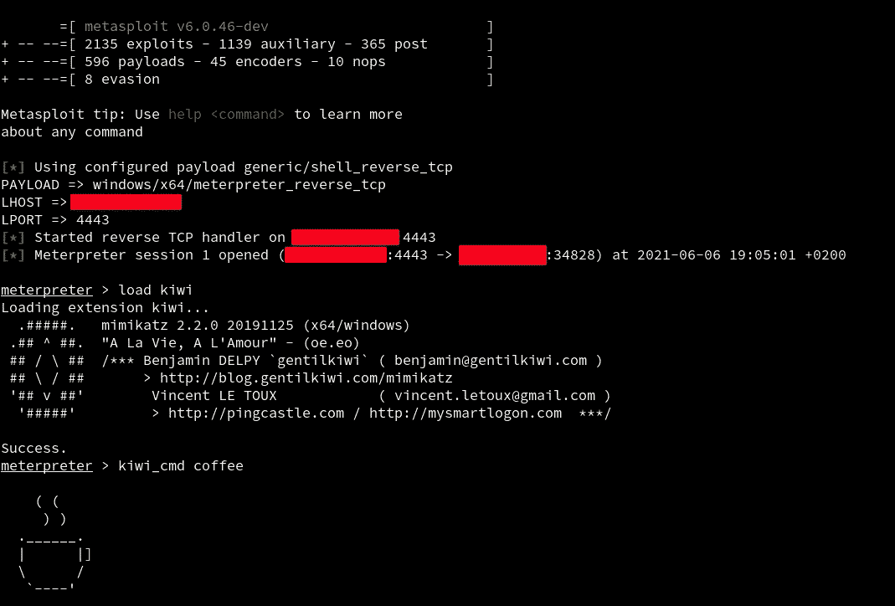
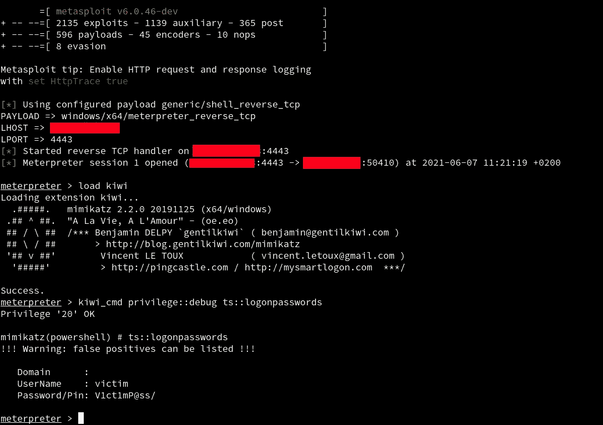

# 在 Metasploit 中更新 Mimikatz

> 原文：<https://infosecwriteups.com/updating-mimikatz-in-metasploit-1ce505e811e1?source=collection_archive---------2----------------------->

> 当前 Metasploit 框架中集成的 Mimikatz 有点过时。如果您想使用最近的特性(比如明文 RDP 凭证转储)，Mimikatz 扩展(称为 Kiwi)应该手动更新并编译到当前框架中。下面是怎么做的。

# 猕猴桃扩展

Metasploit 框架著名的 Meterpreter shell 有效负载允许攻击者加载扩展。扩展加载是通过内存中的 DLL 注入实现的，不会产生新的进程。如果 Meterpreter 外壳绕过了 AV/EDR 解决方案，那么扩展也很有可能保持隐蔽性。

由 [Gentilkiwi](https://twitter.com/gentilkiwi/) 开发的伟大的 [Mimikatz](https://github.com/gentilkiwi/mimikatz/) 后期开发工具是一个名为 kiwi 的 Meterpreter 扩展。一旦我们有了一个 Meterpreter 会话(已经绕过了 AV/EDR 解决方案)，加载 Kiwi 扩展并在后期开发任务中启动各种 Mimikatz 模块就非常容易了。



在 Meterpreter 会话中使用 Mimikatz(作为 Kiwi 扩展)

唯一的问题是集成在当前 Metasploit 框架中的 Mimikatz 模块(在撰写本文时是 v6.0.46)有点过时。在这个 Meterpreter 版本中使用的 Mimikatz fork 来自 2019 年末，它缺少一些令人敬畏的当前功能(我最喜欢的是最新的 [RDP 明文凭据转储](https://twitter.com/gentilkiwi/status/1397263983221039105))。

获得最新特性的解决方案是通过使用当前的 Mimikatz 主分支重新编译来更新 Kiwi 扩展。

# 准备源树

Kiwi 扩展可以与 rapid 7 metasploit-payloads github[存储库](https://github.com/rapid7/metasploit-payloads)中托管的 C Windows Meterpreter shell 一起编译。

首先，在 Windows 机器上(使用 Visual Studio，最好是 VS2019)克隆 repo:

```
git clone https://github.com/rapid7/metasploit-payloads
cd metasploit-payloads 
```

有关 Visual Studio 依赖项，请参见 Windows C meter preter Building[自述文件](https://github.com/rapid7/metasploit-payloads/tree/master/c/meterpreter)的“Building—Windows on Windows”[部分](https://github.com/rapid7/metasploit-payloads/tree/master/c/meterpreter#building---windows-on-windows)。

接下来，不遵循自述文件，而是将最初引用 rapid 7 Mimi Katz fork([https://github.com/rapid7/mimikatz](https://github.com/rapid7/mimikatz))的`c\meterpreter\source\extensions\kiwi\mimikatz`子模块替换为 Benjamin Delpy(gentili kiwi)的官方 mimikatz repo 的主分支([https://github.com/gentilkiwi/mimikatz/](https://github.com/gentilkiwi/mimikatz/))。

在 kiwi 扩展文件夹中设置 mimikatz 子模块的新 url:

```
git submodule set-url c\meterpreter\source\extensions\kiwi\mimikatz [https://github.com/gentilkiwi/mimikatz](https://github.com/gentilkiwi/mimikatz)
```

如果不支持子模块 set-url(在旧的 git 版本中)，请编辑。直接 gitmodules 并将 c/meter preter/source/extensions/kiwi/Mimi Katz 子模块部分中的 rapid7 mimikatz github URL 更改为 gentilkiwi:

```
url = [https://github.com/gentilkiwi/mimikatz](https://github.com/gentilkiwi/mimikatz)
```

下一步是初始化和更新(获取)子模块:

```
git submodule init
git submodule update
```

现在 gentilkiwi mimikatz 分支在项目中，但是它不在最近的提交中。查看最新更新:

```
git submodule update --remote
```

源代码树几乎准备好了，但是在编译之前，应该为更新的 mimikatz 组件修改适当的`c\meterpreter\workspace\ext_server_kiwi\ext_server_kiwi.vcxproj` Visual C++项目文件。

# 修补 Visual C++项目文件

实际上，需要合并新 mimikatz 中存在的、旧 mimikatz 版本中缺少的新头文件和源文件位置。

检查(在 Linux 上:)哪些源文件应该作为`ClCompile` `Include`属性添加到`c\meterpreter\workspace\ext_server_kiwi\ext_server_kiwi.vcxproj`中:

```
diff <(cat c/meterpreter/workspace/ext_server_kiwi/ext_server_kiwi.vcxproj | grep '<ClCompile Include' | sort) <(cat c/meterpreter/source/extensions/kiwi/mimikatz/mimikatz/mimikatz.vcxproj | grep '<ClCompile Include' | sed -e 's/Include="/Include="..\\..\\source\\extensions\\kiwi\\mimikatz\\mimikatz\\/' -e 's/\\mimikatz\\\.\.//' | sort) | grep '^>' | sed -e 's/^> //'
```

结果是(由 sqlite3 . c preforcessordefinitions 补充):

这几行要加到`c\meterpreter\workspace\ext_server_kiwi\ext_server_kiwi.vcxproj`。注意，`sqlite3_omit.c`(在它的`<ClCompile></ClCompile>`标签中有完整的元素列表)应该被移除(因为在最近的 mimikatz 中它被替换为`sqlite3.c`)。

头文件也是如此:

```
diff <(cat c/meterpreter/workspace/ext_server_kiwi/ext_server_kiwi.vcxproj | grep '<ClInclude Include' | sort) <(cat c/meterpreter/source/extensions/kiwi/mimikatz/mimikatz/mimikatz.vcxproj | grep '<ClInclude Include' | sed -e 's/Include="/Include="..\\..\\source\\extensions\\kiwi\\mimikatz\\mimikatz\\/' -e 's/\\mimikatz\\\.\.//' | sort) | grep '^>' | sed -e 's/^> //'
```

结果是:

这些行应该添加到`c\meterpreter\workspace\ext_server_kiwi\ext_server_kiwi.vcxproj`中。还要注意的是，`sqlite3_omit.h`应该被删除(因为在最近的 mimikatz 中它被`sqlite3.h`取代)。

现在需要将更多的编译选项从 mimikatz 分支合并到 meterpreter 工作区项目中。

首先，确保编译器警告不会因错误而中止，因此将所有出现的 TreatWarningAsError 元素从`<TreatWarningAsError>true</TreatWarningAsError>`替换为`<TreatWarningAsError>false</TreatWarningAsError>`。

其次，添加新的链接器依赖项。要在不逐个手动比较依赖项的情况下查看更改(在 Linux 上):

```
diff <(cat c/meterpreter/source/extensions/kiwi/mimikatz/mimikatz/mimikatz.vcxproj | grep AdditionalDependencies | cut -d\> -f2 | cut -d\< -f1 | tr ';' '\n' | sort) <(cat c/meterpreter/workspace/ext_server_kiwi/ext_server_kiwi.vcxproj | grep AdditionalDependencies | head -1 | cut -d\> -f2 | cut -d\< -f1 | tr ';' '\n' | sort)
```

这显示了新的链接库:bcrypt.lib、delayimp.lib、odbc32.lib、wbemuuid.lib。将这些作为 AdditionalDependencies 添加到工作区 vcxproj 文件中(在所有 AdditionalDependencies 出现后添加，以确保将其添加到所有目标):

```
<AdditionalDependencies>bcrypt.lib;delayimp.lib;odbc32.lib;wbemuuid.lib;%(AdditionalDependencies)</AdditionalDependencies>
```

现在源代码树已经可以构建了。

# 建筑和安装

构建项目(包括带有更新的 mimikatz 的 kiwi 扩展)很简单:只需启动一个“VS 2019 的开发人员命令提示符”(或其他 Visual Studio 版本，请参见 Windows C Meterpreter 的[自述文件](https://github.com/rapid7/metasploit-payloads/tree/master/c/meterpreter))，导航到 metasploit-payloads 树内的`c\meterpreter`文件夹并发出 make:

```
cd c\meterpreter
make
```

这也为 Windows x86 和 x64 架构构建了完整的 meterpreter 项目(不要担心不仅要构建 kiwi 扩展，还要构建整个 meterpreter，构建速度非常快)。

编译后的 kiwi 扩展(作为反射 dll)应该在输出文件夹中:

```
output\ext_server_kiwi.x64.dll
output\ext_server_kiwi.x86.dll
```

对于安装，只需替换您的 Metasploit 设置中现有的`ext_server_kiwi.x??.dll`文件即可(根 metasploit-framework 文件夹可能与/usr/share 位于不同的位置，具体取决于您的设置):

```
/usr/share/metasploit-framework/vendor/bundle/ruby/2.7.0/gems/metasploit-payloads-2.0.45/data/meterpreter/ext_server_kiwi.x64.dll
/usr/share/metasploit-framework/vendor/bundle/ruby/2.7.0/gems/metasploit-payloads-2.0.45/data/meterpreter/ext_server_kiwi.x86.dll
```

对于测试，在正式的 Metasploit 设置中备份原始的`ext_server_kiwi.x??.dll`文件可能是有用的。

# 尝试最新的 Mimikatz

在触发了一个 Meterpreter shell 并加载了 Kiwi 扩展之后，Meterpreter 中的前沿函数(比如 RDP 明文凭证转储)应该可以使用了。:)



在 Metasploit 中将最新的 Mimikatz 作为集成的 Kiwi 扩展运行

这个项目的动机是测试 EDR 规避技术(通过反射 DLL 注入),这在这篇短文中没有涉及。