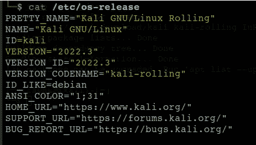
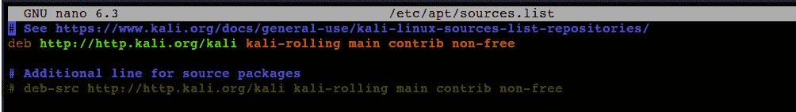
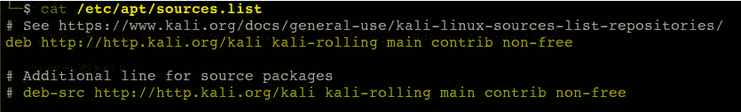
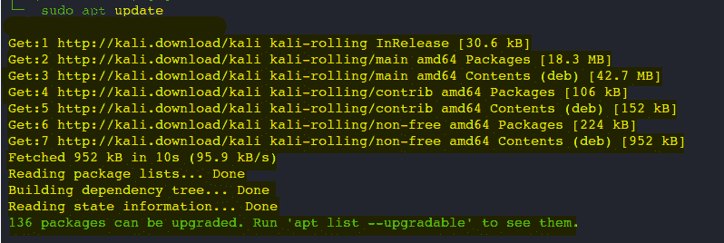
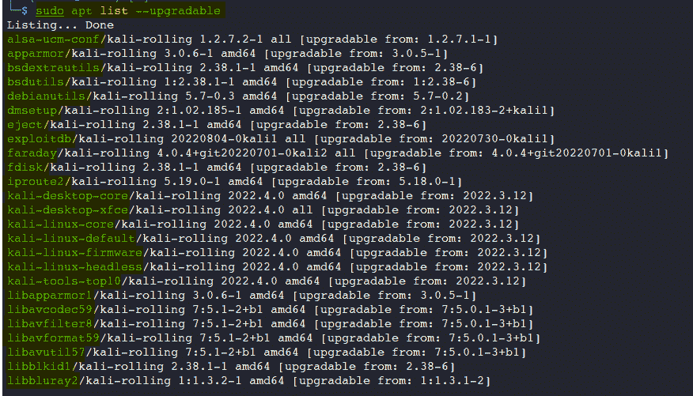
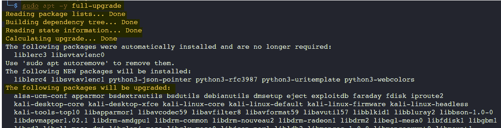
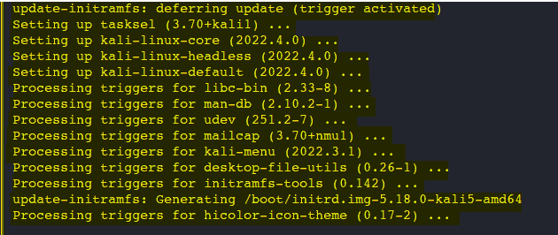

# 将 Kali Linux 升级至最新版本

> 原文：<https://infosecwriteups.com/upgrade-update-kali-linux-c72dee1d1f4c?source=collection_archive---------3----------------------->


欢迎未来的网络安全专家来我的第一篇文章，这次我们将学习如何更新 Kali Linux。

要更新 Kali Linux 依赖项和工具，您需要在终端中运行以下命令:

下一个命令帮助我们知道在我们的计算机、虚拟机或安装它的其他实例中运行的是哪个版本的 Kali Linux。

```
$ cat /etc/os-release
```



下一步是添加正确的 Kali Linux 库，可以通过两种方式完成，第一种是通过 nano 编辑器，第二种是使用 cat 命令。

```
$ nano /etc/apt/sources.list
```



```
$ cat /etc/apt/sources.list
```



接下来，根据之前配置的存储库更新包。

```
$ sudo apt update
```



如果您想知道要在 Kali Linux 中更新的软件包列表，请在终端上运行下一个命令

```
$ sudo apt list --upgradable
```



下一步是通过运行以下命令来完全升级您的 Kali Linux

```
$ sudo apt -y full-upgrade
```



如果一切都更新正确，我们应该看到下一条消息



要做的最后一步是重启我们的 Kali Linux

```
$ sudo reboot -f
```


一旦你重启了 Kali Linux，最后要做的就是再次检查你已经安装的版本。


感谢您阅读和评论我的第一篇文章，如果这些内容对您有帮助，或者您知道有人可能会感兴趣，我将非常感谢您分享这些内容，以便任何对学习黑客、网络安全和我将在这个社区分享的更多内容感兴趣的人都可以看到这些内容。


## 来自 Infosec 的报道:Infosec 每天都有很多内容，很难跟上。[加入我们的每周简讯](https://weekly.infosecwriteups.com/)以 5 篇文章、4 条线索、3 个视频、2 个 GitHub Repos 和工具以及 1 个工作提醒的形式免费获取所有最新的 Infosec 趋势！