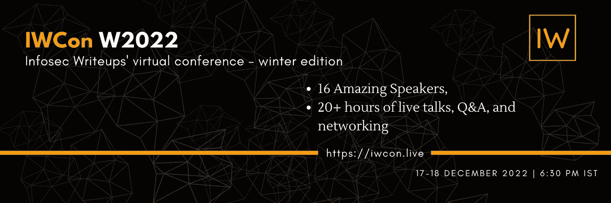
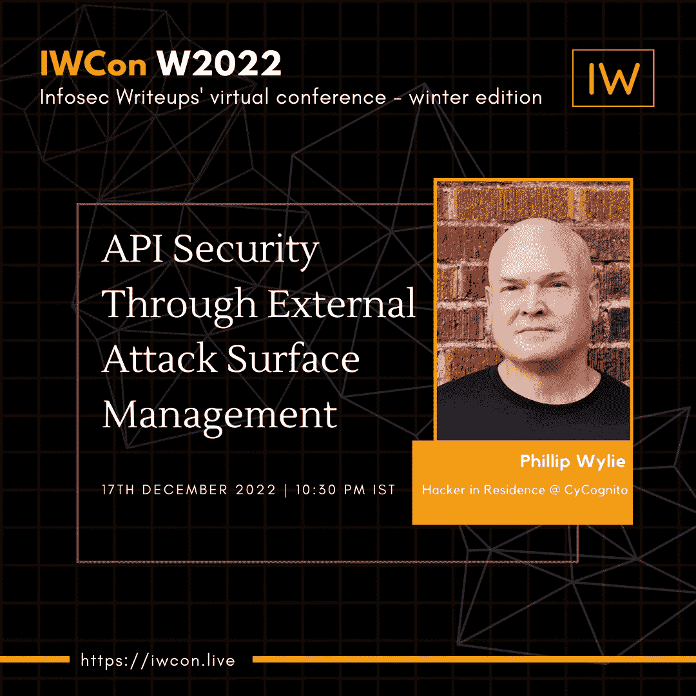
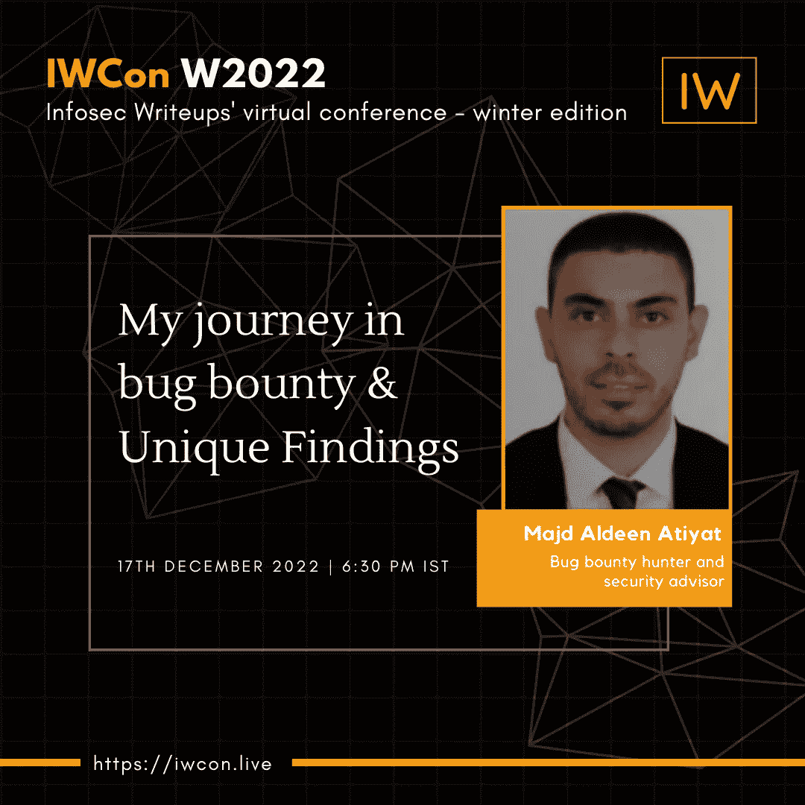

# 提升您的信息安全知识，向 IWCON 2022 的演讲者学习

> 原文：<https://infosecwriteups.com/upgrade-your-infosec-knowledge-and-learn-from-the-speakers-at-iwcon-2022-a74a2c1dafab?source=collection_archive---------3----------------------->

## 今天就注册成为最酷的网络安全会议的一部分，让 2022 年圆满结束！

你好黑客们！

我们在**的信息安全专栏正在组织**[**IWCon 2022**](https://iwcon.live/)——2022 年 12 月 17 日至 18 日的第二届国际网络安全会议和网络活动。****

****大会面向全球网络安全研究人员开放， [**入场券只要 10 美元**](https://razorpay.com/payment-button/pl_K8cxPtmUyBH2PC/view) 。****

****我们邀请了一些出色的演讲者来分享他们的个人故事以及他们如何在 Infosec 中立足的独特经历。****

****成为这一酷群中的一员，在此 预定您的位置 [**。**](https://razorpay.com/payment-button/pl_K8cxPtmUyBH2PC/view)****

# ****查看我们精彩的演讲环节****

## ****通过外部攻击面管理实现 API 安全性****

****演讲者: [Phillip Wylie](https://twitter.com/PhillipWylie) ，CyCognito
的常驻黑客，2022 年 12 月 17 日。IST 晚上 10 时 30 分****

********

## ****我访问管理面板的方法****

****演讲者:[阿赫桑汗](https://twitter.com/hunter0x7)，管理员 Pwner
2022 年 12 月 18 日，IST 晚上 10:30。****

********

## ****我的昆虫赏金之旅&独特的发现****

****马吉德·阿尔丁·阿提亚特又名 [Th3G3nt3lman](https://twitter.com/Th3G3nt3lman) ，臭虫赏金猎人兼全职安全顾问。2022 年 12 月 17 日，IST 时间下午 6 点 30 分。****

********

## ****更多的发言者将很快宣布。[观看本空间了解更多](https://iwcon.live/)。****

****所有会议之后将有 20 分钟的问答时间，以及有价值的网络会议，在那里你可以与来自世界各地的信息安全的酷人们进行交流。****

****你兴奋吗？****

****[***今天保住你的位子。***](https://razorpay.com/payment-button/pl_K8cxPtmUyBH2PC/view)****

# ****有什么问题吗？我们是来解决这些问题的。****

****如果您有任何问题、疑虑或阻碍您参加 IWCON 2022 的障碍，我们很乐意回答。****

****请回复此邮件(或在下方留下评论)，我们将尽快回复您。****

****期待在 IWCON 2022 上与您见面。****

****[***今天就预订座位*** 。](https://razorpay.com/payment-button/pl_K8cxPtmUyBH2PC/view)****

****最佳，
编辑团队
Infosec 报道。****