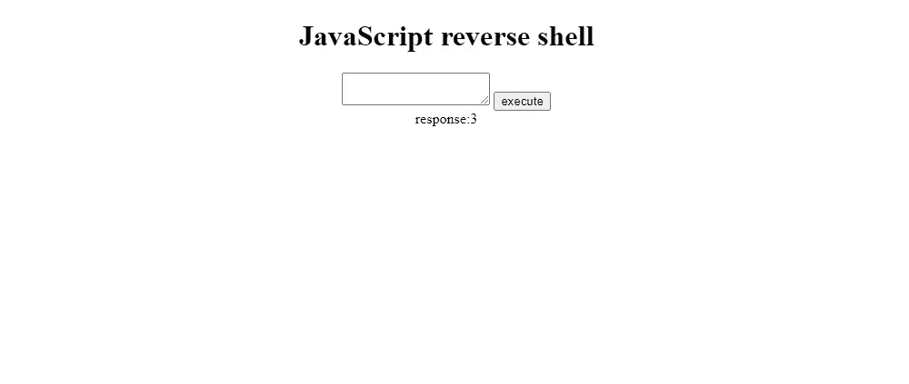
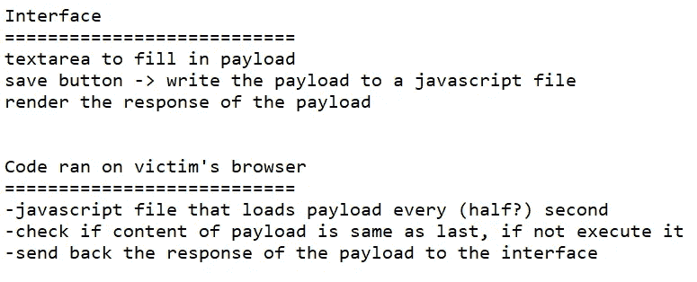
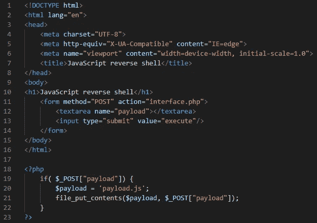
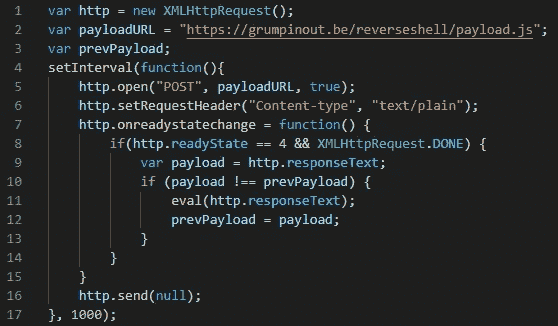
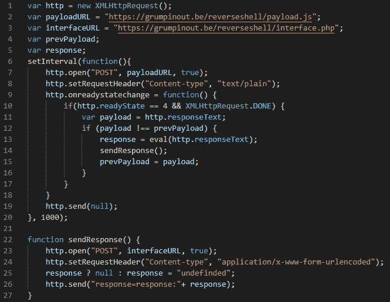
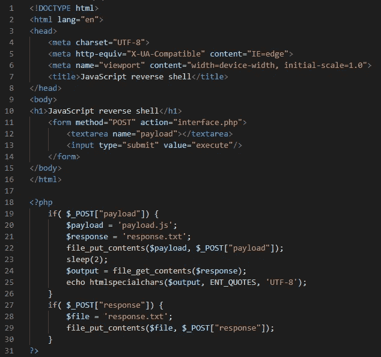
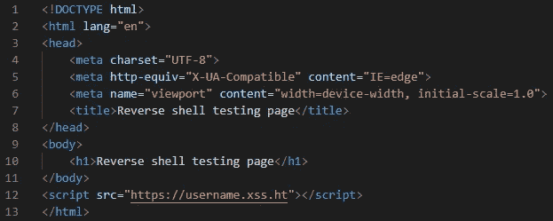

# 用基本的逆向 JavaScript shell 升级 XSS·亨特

> 原文：<https://infosecwriteups.com/upgrading-xss-hunter-with-a-basic-reverse-javascript-shell-db00172e32f9?source=collection_archive---------0----------------------->

反向外壳接口

*在您开始阅读本文之前，请记住这是一个非常基础的反向外壳，仍然需要大量的工作来充分利用它。一些限制是:*

*   *如果多个有效载荷在多个页面上处于活动状态，可能会出现错误。有效负载在所有激活的页面上执行，但是多个页面可能彼此不同，当它们都发送回响应时，接口只保存其中一个页面。*
*   *反向 shell 接口被放置在 web 服务器上，这意味着当您没有适当的授权时，每个人都可以找到它。这也意味着对手可以找到它并恶意利用它。*

最近，我发现了我的第一个盲人 XSS，我很快注意到，很难弄清楚你的盲人 XSS 有什么可能，以及它能产生什么影响。为了解决这个问题，我尝试了几种有效载荷，但是觉得需要实时执行有效载荷。正因为如此，我想出了做一个反向外壳的主意，当我收到 XSS·亨特的电子邮件通知我 XSS 已经被触发时，我就可以使用它。唯一的问题是，只有当受害者停留在易受攻击的页面上时，反向外壳才会工作。一旦他转到另一个页面或关闭该页面，连接就会丢失。

这种反向 shell 并不是最好的解决方案，但是对于初学者来说，尝试一下还是很有帮助的。对我来说，这是一个有趣的小项目。

为了开始这个项目，我打开记事本，开始写下我希望 shell 如何工作。

笔记

# 创建外壳

## 第 1 部分:没有响应的有限反向外壳

我首先创建了一些向受害者发送有效载荷的东西，但是还没有将响应发送回接口。代码非常简单，页面上有一个表单，在提交时，向自己发送一个 post 请求(index.php)。页面上的 PHP 会将 post 请求中的有效负载写入一个 JavaScript 文件。接口代码如下所示:

interface.php 第一部分

现在是时候编写将在受害者的浏览器中运行的 JavaScript 了。正如您在我的笔记中看到的，我不确定应该使用什么间隔来发出网络请求，但我认为 1 秒是一个不错的开始，但如果您希望它更快或更慢，请随意更改。反向外壳的代码是这样的。

reverse.js 第 1 部分

`payloadURL`变量应该被更改到您自己的有效负载脚本的位置。如果您复制了我的代码，payload.js 与您的 interface.php 位于同一个文件夹中。

## 第 2 部分:带有响应的反向外壳

在我的代码中，一旦服务器收到响应，它就将它写入文件。点击`execute`按钮 2 秒后，将从文件中读取响应，并反映在页面上。这可能不是最好的方法，但是如果你的受害者的网速不错，并且你的有效负载不需要很长时间来执行的话，这种方法也可以。如果你遇到问题，你可以随时调高 interface.php 的睡眠时间。

首先，我编辑了 reverse.js，这样它就可以在 POST 请求中向 interface.php 发送响应。Response.js 现在看起来像这样:

reverse.js 部分 2

再次将`interfaceURL`的值改为自己接口的 URL。我还添加了一个检查来设置响应为“undefined ”(如果没有定义的话),因为否则当执行没有响应的有效负载时，接口会一直显示旧的响应。

现在，应对措施应该在 interface.php 进行。如前所述，响应被写入文件，并在点击`execute`2 秒后反映出来。interface.php 的代码现在看起来像这样:

interface.php 第二部

作为一个好的实践，我使用 php 函数`htmlspecialchars()`来防止网页上反射 XSS。

# 与 XSS·亨特一起设置外壳

首先，你需要确保 interface.php 和 reverse.js 可以通过互联网访问。为此，我使用了托管服务，但你也可以自己托管并设置端口转发。

完成后，您需要将 reverse.js 链接到您的 XSS 猎人，这样一旦盲 XSS 被触发，它就会在受害者的浏览器中执行。为此，登录 XSS·亨特，进入`settings`，在额外的 JavaScript 有效负载 URI 下，将 URI 添加到 reverse.js 脚本中。最后，滚动到底部并点击`Update Settings`按钮。

信不信由你，但事实就是这样，一切都已经完成，你已经准备好测试它了。

# 测试外壳

1.  创建一个简单的 html 文件，其中包含您的 XSS 猎人有效负载的 URL(例如:`username.xss.ht`)。并打开该文件。

html 测试页面

2.在您的公共 web 服务器上打开您的 interface.php 文件。并输入`alert()`来查看它在您的 html 测试页面上触发。回应会是`undefined`。

3.输入`2+2`，注意响应将是`4`。

恭喜你。就这样，你得到了一个非常简单的 JavaScript 反向 shell:)。

请随意修改您的代码进行改进！