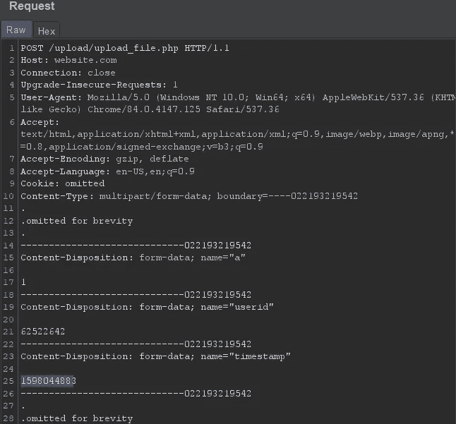

# 上传到未来

> 原文：<https://infosecwriteups.com/upload-to-the-future-1fd38fd502bd?source=collection_archive---------2----------------------->

有点奇怪的标题，嗯？不管怎样，这篇文章是关于我最近发现的一个非常奇怪的错误，它有可能覆盖用户/受害者的个人资料图片。但是，也有一个扭曲。

**初始侦察:**

当一个网站有任何类型的上传功能时，有几件事情需要立即查看，它甚至不是真正的黑客行为，它是在按预期使用网站的上传功能。

我倾向于寻找的第一件事是我是否可以选择上传任何文件(如果可以，我只是在上传预期类型的文件(通常是图像类型)时记下这一点)

上传预期的文件类型(通常是某种图像)后，接下来要寻找的是图像存储在哪里以及命名约定。如果映像存储在 aws 上，我会注意到这一点，并准备好 XXE 有效负载，如果是同一个域，我会注意到这一点，但如果是某个第三方主机，我会保留它(这没有考虑 img src 中的提取名称是否可以是 xss 有效负载)

在这种情况下，上传位置是域，这意味着是时候尝试各种技巧，看看我是否可以上传任何其他类型的文件，或者我是否可以以任何方式将上传的文件作为除常规图像之外的任何内容来执行。失败了。但是，命名约定和上传请求参数以及它们的值暗示了 idor 潜力。

注意 userid 参数，但也要注意时间戳

**它是如何工作的？**

在这种情况下，很明显，每个用户都将获得分配给他们自己的文件夹，他们的文件夹是他们上传的所有图像的存储位置。此外，所有上传的图像都被重命名为 userid _ random number _(small-medium-or-large)。png

经过进一步检查，randomnumber 原来不是随机的，而是一个 [unix epoch](https://www.epochconverter.com/) 时间戳。例如:1598044883 与 2020 年 8 月 21 日星期五 9:21:23 PM GMT 相同

**显而易见的方法:**

我采用了最简单的方法，我简单地把受害者的用户名改成了我的，并试图上传我的照片。而且，它成功了。原来它确实把我的图像上传到了受害者的文件夹里。但是，那有点无聊。如果我覆盖受害者的现有图像会怎样？

**另一个诡异的:**

为了了解如何打破一些东西，知道它的工作方式是一个好主意。经过反复试验，结果证明覆盖现有图像的方法是可行的。

时间戳是关键。为了覆盖受害者的图像，我需要该图像的时间戳，这很容易获得(查看源代码，并注意 img src 值)。

记住时间戳、用户 id 和图像后，我就万事俱备了。而且，它成功了。算是吧。

**这一切的排序:**

正如我前面提到的，上传的图片有三种保存大小。在这三种尺寸中，在修改时很容易发现的是小尺寸。为什么？因为它显示在用户/受害者的个人资料页面上。在发出上传请求时刷新他们的页面(显然是在不同的浏览器中)，我可以立即知道发生了什么。

我又试了一次，但这次准备写一份报告，这意味着我采用了故事模式:我假装自己是一名普通用户。我创建了一个个人资料，上传了我的图片，查看了它们(这是关键部分，我在之前的测试中没有做过)，并刷新了页面几次。确认一切正常。

然后，作为攻击者，我进行了前面提到的攻击。同时还在思考报告的内容，应该截取什么样的截图等等。，然后作为一个普通用户/受害者，我用我的手指悬停在打印屏幕键上方来刷新页面，只是为了同一个手指，而不是按下那个键，必须向我的头部移动，做很多挠头的动作。WTH？

**早先还管用，什么变了？**

我重复了这些步骤，但是省略了那些我发现不相关的步骤(在上传图片时像普通用户一样点击，等等)。)，而且奏效了。WTH？

**重做:**

当一个攻击成功了，然后又失败了，主要问题是:发生了什么变化？这就是我一直在经历的，因为我试图找出为什么第一次成功了，第二次失败了，第三次又成功了。发生了什么变化？

我跟踪了失败尝试的步骤，并将它们与下一次成功尝试的步骤进行了比较(因为第一次尝试的步骤要少得多)。而且，我证实，通过进一步的测试，如果攻击者想要覆盖的用户/受害者的图像在攻击之前已经被访问过，攻击就不会成功。一点也不。访问有问题的图片的链接基本上可以使它免受这种攻击。这意味着，即使是一个机器人爬来爬去得到图像，也不会使图像被覆盖。去想想。

**不管怎么做:**

不是不可能，但可能性极小。它需要的条件在自然的情况下是不容易得到的。这个想法是欺骗用户/受害者在你进行攻击的同时进行上传。为了做到这一点，时间戳参数必须跨多个值发出。其原因是因为纪元时间戳包括分钟和秒。也就是说，你无法知道用户 100%的准确时间。因此，为了能够设置多个值的时间戳，攻击必须涉及 burp 入侵者或类似的情况。真正困难的是，攻击必须与用户/受害者同时发生。

这表明，当您发现带有意外参数的上传请求时，它在打开攻击面的同时，也会使事情变得复杂。但是，它也表明，复杂的系统有缺陷，尽管是复杂的，但仍然存在。在你未来的旅途中要记住的事情。甚至可能重温一些过去的，你可能会错过一些东西:)