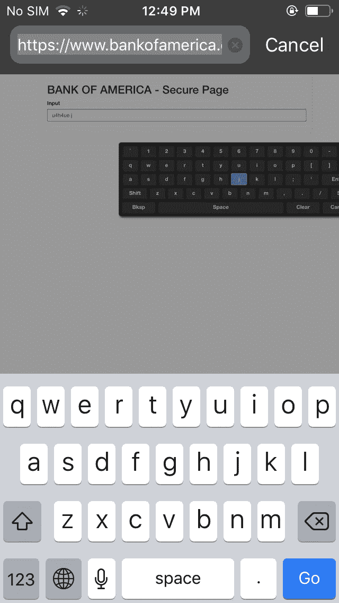
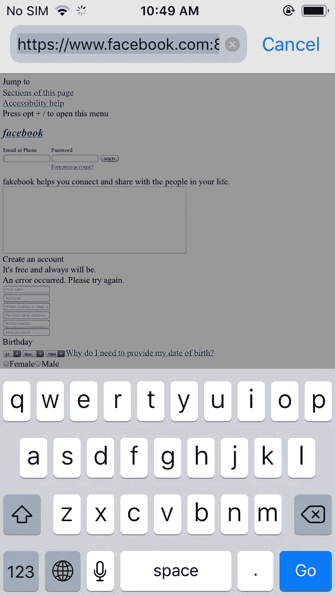

# iOS 12.3 和 iOS 13 Beta 版 Safari 中的地址栏欺骗漏洞| CVE-2019-8727

> 原文：<https://infosecwriteups.com/url-bar-spoofing-in-safari-for-ios-12-3-and-ios-13-beta-cve-2019-8727-d87490f8ee29?source=collection_archive---------0----------------------->

在处理基于浏览器的对地址栏的攻击时，我学到了一种在 safari 中仍然可以欺骗地址栏的方法。以前的攻击都不起作用，但当尝试类似的东西时，浏览器的行为有所不同。最初，我无法将页面保持足够长的时间让键盘出现，然后将鼠标悬停在页面上以获得虚拟键盘。
所以在研究了多个函数并在一个函数内部调用一个函数导致了加载页面的足够延迟之后。
在更新至 iOS 12.3 版本(最新版本)和 iOS 13 的 iPhone 5s 上的 Safari 上测试。
**为 CVE-2019-8727 的概念验证(POC)创建这个工作漏洞真的很有趣，也很有挑战性。**

# 总结:

iPhone 的 Safari 浏览器存在 URL 栏欺骗漏洞。URL 栏欺骗是一种可用于网络钓鱼攻击的漏洞。
由于不安全的设计原则，safari 未能处理 **setTimeout** 和 **setInterval 方法**，导致不存在的端口加载网页延迟。而 Safari 会保留页面一段时间，并通过自动对焦和虚拟键盘使用它，从而创建一个虚假页面，重定向到一个真正的域，从而触发 URL 栏欺骗。

**iOS 版 Safari 浏览器在全球的使用率约为 15%-20%。这个缺陷以及这个问题一直存在于 iOS 13 测试版中(在测试时)。**

# 影响:

因为在页面仍在加载时触发 URL 欺骗 iOS 的功能会导致浏览器继续加载 URL，但会从父选项卡加载不同的内容，然后在页面中创建屏幕键盘，这在金融机构中很常见。完全加载并完成所花费的时间足以让用户钓鱼。还可以通过在页面的 title 标签中设置链接，让用户下载假冒的应用。

它还可以被用作鱼叉式网络钓鱼，向一组用户发送多个类似的链接，然后检查哪个用户访问了哪种网站。

# 预期行为:

浏览器应该显示真实的 URL 位置，而不是伪造的。

# 复制步骤:

1.  创建一个欺骗地址栏的 HTML 代码。
2.  在网站上托管恶意页面。
3.  它显示了一个假的 facebook 页面，带有一个虚拟键盘和自动对焦功能的登录表单。

## 网址:[https://justmorpheus.000webhostapp.com/day2/boa.html](https://justmorpheus.000webhostapp.com/day2/boa.html)

网址栏欺骗的概念验证 iOS 13 测试版

美国银行的虚假欺骗页面

# 技术分析:

深入地址欺骗攻击的技术分析，它不仅可以用来欺骗 URL，而且在某些情况下还可以绕过 SOP。
在上述情况下，代码分为两部分。第一部分包含 Html 主体中的样式标记，该标记加载 CSS 代码以及 javascript，在 Html 表单中使用 autofocus= "true "加载屏幕键盘。加载相对/绝对 URL 是不可能的，因为它需要时间来加载样式表，因此由于时间较少，它会显示为链接断开或虚假页面，从而挫败我们的动机。

没有 CSS 和其他内容的假脸书页面

然后是代码的第二部分:

其中包含 setTimeout 方法，用于将 setInterval 延迟 100 毫秒，这足以加载假的屏幕键盘，并在加载 CSS 的同时自动对焦。然后用 SetInterval 方法调用 spoof 函数来加载 window.location.assign 中的 URL，并通过每 50000 毫秒重新加载一次来加载一个新文档。因此，它每隔 50 秒就为页面中不存在的端口加载 URL。因此，它提供了足够的时间来显示欺骗页面，从而愚弄 Safari 浏览器。

# 解决方案:

这种类型的错误可以通过重置文档对象模型来修复，例如显示一个白色页面，或者显示一个进度条，或者完全重定向到真正的页面。
苹果还表示，一个逻辑问题通过改进状态管理得到了解决。

# 修复:

强烈推荐用户安装苹果 iOS 13 最新更新。

# 时间线:

2019 年 5 月 24 日:发现并向苹果安全团队报告。
2019 年 5 月 31 日:需要更多信息。
2019 年 6 月 2 日:带有更新漏洞的新 POC。
2019 年 9 月 19 日:[苹果](https://support.apple.com/en-us/HT210606)与 CVE 和名人堂发布安全更新。

> 感谢苹果安全团队解决了这个问题。

# 参考:

保持警惕保持安全

[https://blog . avira . com/safari-address-bar-can-be-tricked-to-displaying-fake-URL/](https://blog.avira.com/safari-address-bar-can-be-tricked-into-displaying-fake-url/)
https://chromium . Google source . com/chromium/src/+/master/docs/security/URL _ display _ guidelines/URL _ display _ guidelines . MD
[https://www . rafaybaloch . com/2018/09/apple-safari-Microsoft-edge-browser . html](https://www.rafaybaloch.com/2018/09/apple-safari-microsoft-edge-browser.html)

*关注* [*Infosec 报道*](https://medium.com/bugbountywriteup) *获取更多此类精彩报道。*

 [## 信息安全报道

### 收集了世界上最好的黑客的文章，主题从 bug 奖金和 CTF 到 vulnhub…

medium.com](https://medium.com/bugbountywriteup)